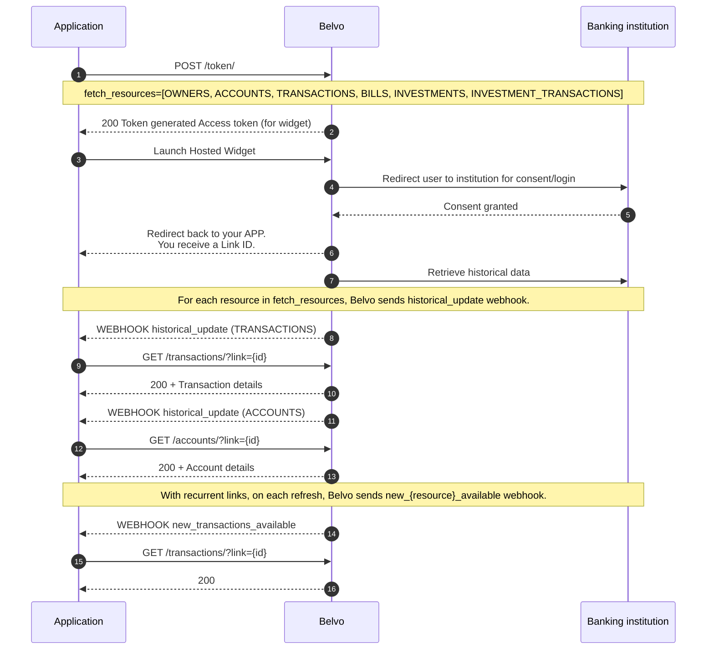
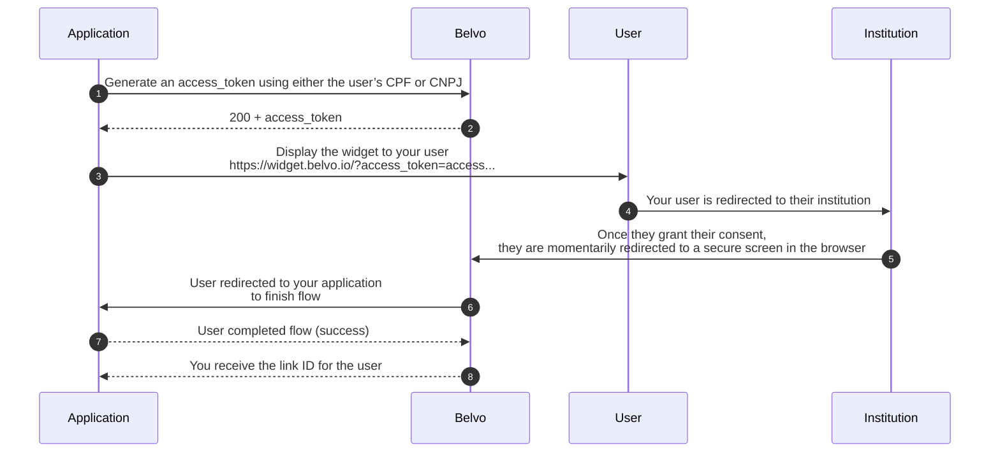
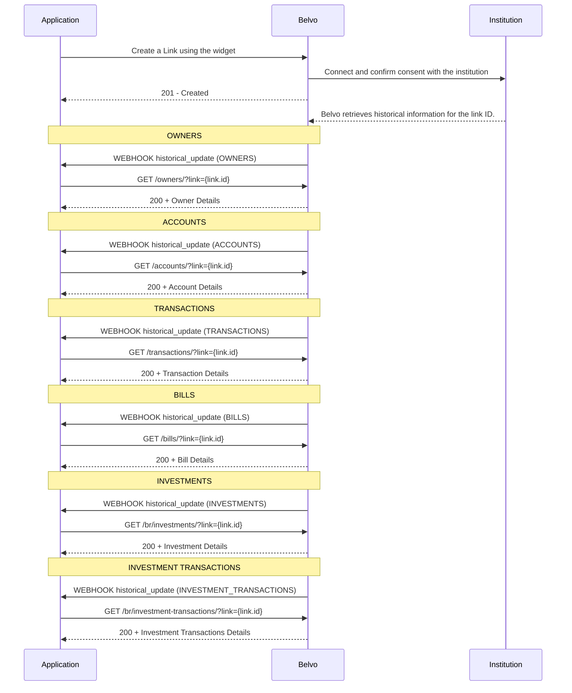
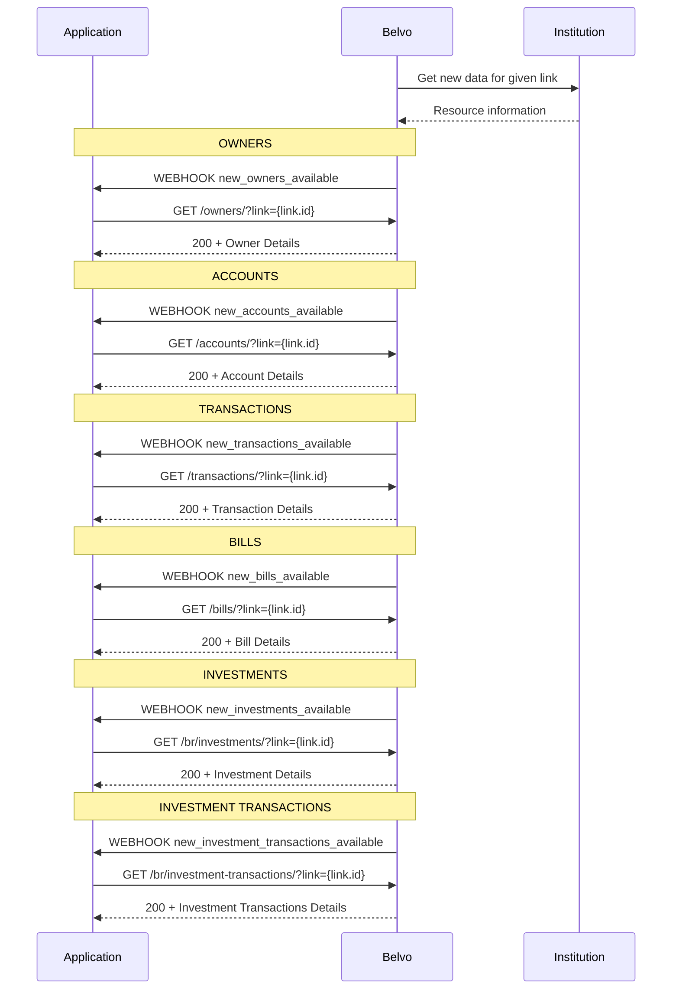
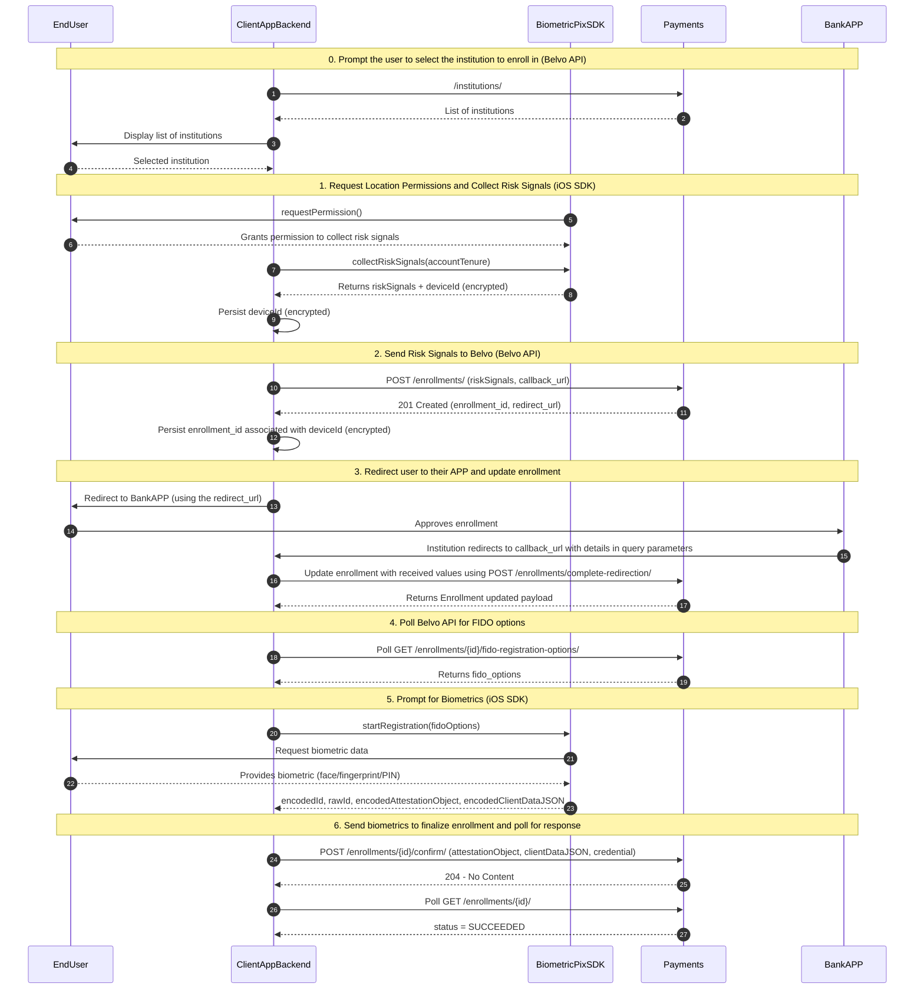
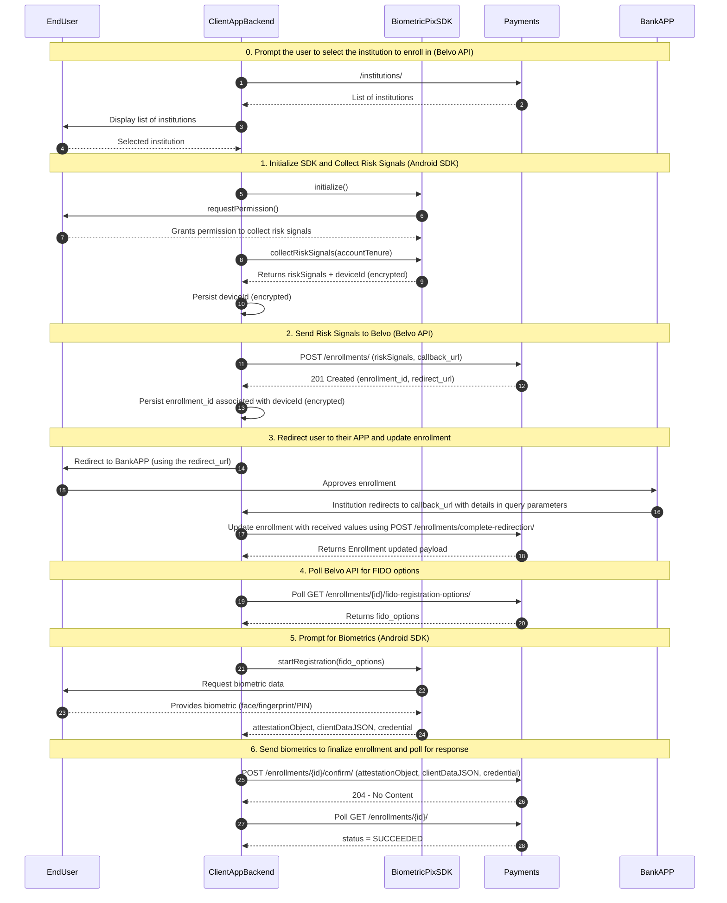
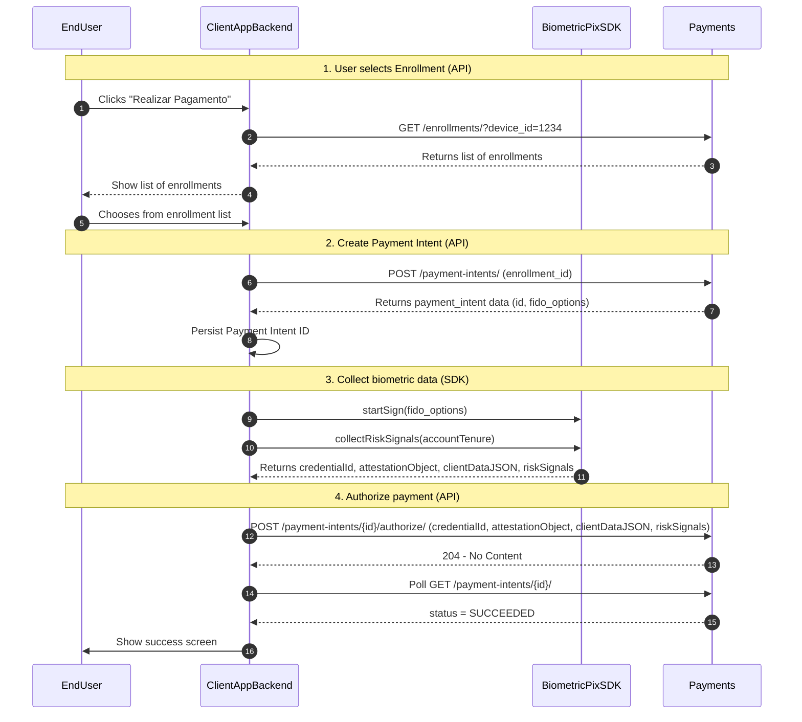

# Banking Aggregation Overview (Brazil)

## Introduction

Unlock standardized and improved financial data points from Brazil's open finance network with Belvo's Open Finance Data Aggregation product for Brazil, enabling richer insights and enhanced financial applications.

## Data You Can Access

Our Banking Aggregation (Brazil) product provides access to the following resources:

#### Owner

Information regarding the owner of the bank account, such as their name, contact information, identity documents, and more. For a detailed breakdown of all the fields that are available for this resource, check our API reference or data dictionaries.

#### Account

Information regarding the accounts the user has at a given institution, along with balance, overdraft, loan, and credit card information. For a detailed breakdown of all the fields that are available for this resource, check our API reference or data dictionaries.

#### Transaction

Transactional information, including the transaction date, value, description, and much more. For a detailed breakdown of all the fields that are available for this resource, check our API reference or data dictionaries.

#### Bill

For each credit card account that the user has, you can also extract the credit card bill information on a monthly basis. For a detailed breakdown of all the fields that are available for this resource, check our API reference or data dictionaries.

#### Balance

High-level balance details for an account, including the account identifier and a breakdown of available, blocked, and automatically invested amounts. For a detailed breakdown of all the fields that are available for this resource, check our API reference or data dictionaries.

#### Investment

Portfolio position information such as product type, ISIN, product name, balance, remuneration, issue price, as well as valuation and rate details. For a detailed breakdown of all the fields that are available for this resource, check our API reference or data dictionaries.

#### Investment Transaction

Details of investment buy/sell operations, including the related instrument, gross and net values, quantity, and broker note details. For a detailed breakdown of all the fields that are available for this resource, check our API reference or data dictionaries.

## Available Institutions

For a comprehensive list of all financial institutions available through Belvo's Open Finance Data Aggregation in Brazil, please see our dedicated Banking Aggregation (Brazil OFDA) Institutions page.

## Connecting Users (Consents and Links)

In OFDA, the concepts of consent and link are very important:

- A **consent** represents your user's agreement to share their Open Finance data from a given institution with your application. This term is standardized within Brazil's Open Finance Network. **Only users can manage their consents**, meaning they are the ones who can renew or revoke this permission.
- A **link** is Belvo's internal representation of a user. After a user provides their consent, Belvo creates a link, which you can use to access the user's data.


For each consent that is established, a corresponding link is created, resulting in a one-to-one relationship. While only the user can manage their consent (for example, to renew or revoke it), you have the ability to delete the link.

When you delete a link (and all the associated data from Belvo's system), Belvo automatically revokes the associated consent and permanently disconnects the link from the consent. This action is irreversible, meaning that the connection between the user's data and your application is permanently severed. For instance, if a user decides to stop using your application and you delete their link as part of the offboarding process, all data associated with that user will be removed from Belvo and their consent will be automatically revoked. However, the original consent remains intact and the user must revoke it themselves using the My Belvo Portal.

If your user decides to return to your application, they will need to grant their consent again, leading to the creation of a new link.

### How do users give consent?

To get consent from your user to access their data, they need to provide this in their institution. Belvo has created an Open-Finance compliant widget that you can easily add within your application that will guide your user in the consent-granting process.

In the diagram below, you can see a high-level flow of how Belvo should be used in your application:

1. **Inside your application, prompt your user to connect their bank account.**
Note: Your application will need to have received the user's CPF (or CNPJ) and full name for the consent granting purpose.
2. **Using their provided data, start the Belvo Hosted Widget inside your application.**
The Belvo Hosted Widget guides your user through all the steps to grant your application consent to access their data. This includes: choosing the institution they want to give you access to read data from, what information they will share with your application, redirecting to their institution to confirm the data sharing, and finally, redirecting back to the widget in your application.
3. **User grants consent within their institution.**
After the user grants their consent in their institution, they are redirected back to the Belvo Hosted Widget.
4. **User redirected to your application**
In the widget, the user clicks **Finalize** and are redirected to a given page within your application.


As soon as your user grants their consent and a link is created, Belvo *automatically* retrieves the last 12 months of Account, Owner, Transaction, and Credit Card Bill information for the user.

Dedicated Integration Guide
For details on how to set up the hosted widget within your application to get user consent to access their data, see our dedicated Extract Banking Data in Brazil (API with Hosted Widget) guide.

## Integration Options

To extract banking data in Brazil using the Open Finance Network, you can use the following integration options:

### Belvo Hosted Widget with My Belvo Portal

Retrieval Limits and Regulatory Requirements
**Retrieval Limits**

Integrating with Brazil's Open Finance network involves understanding the frequency at which you can retrieve user data due to network limitations, as well as the crucial aspect of managing user consents. For detailed information on these topics, please refer to our dedicated articles on Understanding Data Retrieval Limits in Brazil OFDA and Managing User Consents in Brazil OFDA.

**Regulatory Requirements**

According to Open Finance regulations, your users **must** have an easy-to-access way of managing their consents within your application or website. Belvo has created the My Belvo Portal (MBP) that allows users to manage their consents in a simple and straightforward way, meeting all the requirements of the regulations.

The MBP can be set up in three different ways:

- Public MBP
On Belvo's website, we host a universal instance of the MBP that any user can use to manage their consents. This instance consolidates all the consents they have granted using Belvo's OFDA product. You simply need to redirect your user to `https://meuportal.belvo.com/?mode=landing`, where they can input their details. Your user will be able to see **all** the consents they've granted using Belvo (including other applications using Belvo to extract data from Brazil's Open Finance Network).
- Customized MBP
You can customize the MBP to display only the consents that your user has granted your application, making it easier for them to manage the consents.
- Consent Renewal Mode
The MBP can also be used to renew an expired consent. Belvo will send you a webhook when one of your user's consent's has expired.


For mobile-native and web-based applications, we've created a hosted version of our widget that significantly simplifies your development and integration process. All it requires is for you to create a webview in your application and some knowledge of handling deeplink redirects.




---

# Available Institutions (OFDA)

Subscribe to our institutions status page
To be up to date regarding the status of any institution, make sure to subscribe to our Institutions Status page so you are automatically notified of any outages.

On this page, we provide you with an overview of the coverage support of our Belvo banking aggregation product in Brazil , per country and institution type. Please note:

## 🇧🇷 Brazil

OFDA institutions in BETA
Please note that some OFDA institutions are classified as being in BETA. This means that interactions with these institutions may result in:

- Failure to create consent.
- Incomplete data for all resources
- Data returned may be of reduced quality.


If you encounter any of these issues, please contact our support team.

| Name | Available Resources | In Beta | Historical Data | Supported Products |
|  --- | --- | --- | --- | --- |
| **Banco BMG**`ofbmg_br_retail`Retail | 🟢 Accounts🟢 Incomes🟢 Owners🟢 Recurring Expenses🟢 Risk Insights🟢 Transactions | Yes | 12 | 🟢 Checking🟢 Credit Card🟢 Loans🟢 Savings |
| **Banco BMG**`ofbmg_br_business`Business | 🟢 Accounts🟢 Incomes🟢 Owners🟢 Recurring Expenses🟢 Risk Insights🟢 Transactions | Yes | 12 | 🟢 Checking🟢 Credit Card🟢 Loans🟢 Savings |
| **Banco BV**`ofbvapp_br_retail`Retail App | 🟢 Accounts🟢 Incomes🟢 Owners🟢 Recurring Expenses🟢 Risk Insights🟢 Transactions | Yes | 12 | 🟢 Checking🟢 Credit Card🟢 Loans🟢 Savings |
| **Banco BV**`ofbvweb_br_retail`Retail Web | 🟢 Accounts🟢 Incomes🟢 Owners🟢 Recurring Expenses🟢 Risk Insights🟢 Transactions | Yes | 12 | 🟢 Checking🟢 Credit Card🟢 Loans🟢 Savings |
| **Banco BV**`ofbv_br_business`Business | 🟢 Accounts🟢 Incomes🟢 Owners🟢 Recurring Expenses🟢 Risk Insights🟢 Transactions | Yes | 12 | 🟢 Checking🟢 Credit Card🟢 Loans🟢 Savings |
| **Banco do Brasil**`ofbancodobrasil_br_retail`Retail | 🟢 Accounts🟢 Incomes🟢 Owners🟢 Recurring Expenses🟢 Risk Insights🟢 Transactions | No | 12 | 🟢 Checking🟢 Credit Card🟢 Loans🟢 Savings |
| **Banco do Brasil**`ofbancodobrasil_br_business`Business | 🟢 Accounts🟢 Incomes🟢 Owners🟢 Recurring Expenses🟢 Risk Insights🟢 Transactions | No | 12 | 🟢 Checking🟢 Credit Card🟢 Loans🟢 Savings |
| **Banco do Nordeste**`ofnordeste_br_retail`Retail | 🟢 Accounts🟢 Incomes🟢 Owners🟢 Recurring Expenses🟢 Risk Insights🟢 Transactions | Yes | 12 | 🟢 Checking🟢 Credit Card🟢 Loans🟢 Savings |
| **Banco do Nordeste**`ofnordeste_br_business`Business | 🟢 Accounts🟢 Incomes🟢 Owners🟢 Recurring Expenses🟢 Risk Insights🟢 Transactions | Yes | 12 | 🟢 Checking🟢 Credit Card🟢 Loans🟢 Savings |
| **Banco Pan**`ofbancopan_br_retail`Retail | 🟢 Accounts🟢 Incomes🟢 Owners🟢 Recurring Expenses🟢 Risk Insights🟢 Transactions | No | 12 | 🟢 Checking🟢 Credit Card🟢 Loans🟢 Savings |
| **Banrisul**`ofbanrisul_br_retail`Retail | 🟢 Accounts🟢 Incomes🟢 Owners🟢 Recurring Expenses🟢 Risk Insights🟢 Transactions | Yes | 12 | 🟢 Checking🟢 Credit Card🟢 Loans🟢 Savings |
| **Banrisul**`ofbanrisul_br_business`Business | 🟢 Accounts🟢 Incomes🟢 Owners🟢 Recurring Expenses🟢 Risk Insights🟢 Transactions | Yes | 12 | 🟢 Checking🟢 Credit Card🟢 Loans🟢 Savings |
| **Bradesco**`ofbradesco_br_retail`Retail | 🟢 Accounts🟢 Incomes🟢 Owners🟢 Recurring Expenses🟢 Risk Insights🟢 Transactions | No | 12 | 🟢 Checking🟢 Credit Card🟢 Loans🟢 Savings |
| **Bradesco**`ofbradesco_br_business`Business | 🟢 Accounts🟢 Incomes🟢 Owners🟢 Recurring Expenses🟢 Risk Insights🟢 Transactions | No | 12 | 🟢 Checking🟢 Credit Card🟢 Loans🟢 Savings |
| **Bradesco Card**`ofbradescard_br_retail`Retail | 🟢 Accounts🟢 Incomes🟢 Owners🟢 Recurring Expenses🟢 Risk Insights🟢 Transactions | Yes | 12 | 🟢 Checking🟢 Credit Card🟢 Loans🟢 Savings |
| **BS2**`ofbs2_br_business`Business | 🟢 Accounts🟢 Incomes🟢 Owners🟢 Recurring Expenses🟢 Risk Insights🟢 Transactions | Yes | 12 | 🟢 Checking🟢 Credit Card🟢 Loans🟢 Savings |
| **BTG**`ofbtg_br_retail`Retail | 🟢 Accounts🟢 Incomes🟢 Owners🟢 Recurring Expenses🟢 Risk Insights🟢 Transactions | No | 12 | 🟢 Checking🟢 Credit Card🟢 Loans🟢 Savings |
| **BTG**`ofbtg_br_business`Business | 🟢 Accounts🟢 Incomes🟢 Owners🟢 Recurring Expenses🟢 Risk Insights🟢 Transactions | No | 12 | 🟢 Checking🟢 Credit Card🟢 Loans🟢 Savings |
| **BTG Empresas**`ofbtgempresas_br_business`Business | 🟢 Accounts🟢 Incomes🟢 Owners🟢 Recurring Expenses🟢 Risk Insights🟢 Transactions | No | 12 | 🟢 Checking🟢 Credit Card🟢 Loans🟢 Savings |
| **Caixa**`ofcaixa_br_retail`Retail | 🟢 Accounts🟢 Incomes🟢 Owners🟢 Recurring Expenses🟢 Risk Insights🟢 Transactions | No | 12 | 🟢 Checking🟢 Credit Card🟢 Loans🟢 Savings |
| **Caixa**`ofcaixa_br_business`Business | 🟢 Accounts🟢 Incomes🟢 Owners🟢 Recurring Expenses🟢 Risk Insights🟢 Transactions | No | 12 | 🟢 Checking🟢 Credit Card🟢 Loans🟢 Savings |
| **Citi**`ofciti_br_business`Business | 🟢 Accounts🟢 Incomes🟢 Owners🟢 Recurring Expenses🟢 Risk Insights🟢 Transactions | Yes | 12 | 🟢 Checking🟢 Credit Card🟢 Loans🟢 Savings |
| **Citi**`ofcitibank_br_business`Business | 🟢 Accounts🟢 Incomes🟢 Owners🟢 Recurring Expenses🟢 Risk Insights🟢 Transactions | Yes | 12 | 🟢 Checking🟢 Credit Card🟢 Loans🟢 Savings |
| **Digio**`ofdigio_br_retail`Retail | 🟢 Accounts🟢 Incomes🟢 Owners🟢 Recurring Expenses🟢 Risk Insights🟢 Transactions | Yes | 12 | 🟢 Checking🟢 Credit Card🟢 Loans🟢 Savings |
| **Digio (Uber)**`ofuberdigio_br_retail`Retail | 🟢 Accounts🟢 Incomes🟢 Owners🟢 Recurring Expenses🟢 Risk Insights🟢 Transactions | Yes | 12 | 🟢 Checking🟢 Credit Card🟢 Loans🟢 Savings |
| **Itaú**`ofitau_br_business`Business | 🟢 Accounts🟢 Incomes🟢 Owners🟢 Recurring Expenses🟢 Risk Insights🟢 Transactions | No | 12 | 🟢 Checking🟢 Credit Card🟢 Loans🟢 Savings |
| **Itáu**`ofitau_br_retail`Retail | 🟢 Accounts🟢 Incomes🟢 Owners🟢 Recurring Expenses🟢 Risk Insights🟢 Transactions | No | 12 | 🟢 Checking🟢 Credit Card🟢 Loans🟢 Savings |
| **Itaucard**`ofitaucard_br_retail`Retail | 🟢 Accounts🟢 Incomes🟢 Owners🟢 Recurring Expenses🟢 Risk Insights🟢 Transactions | No | 12 | 🟢 Checking🟢 Credit Card🟢 Loans🟢 Savings |
| **Mercado Pago**`ofmercadopago_br_retail`Retail | 🟢 Accounts🟢 Incomes🟢 Owners🟢 Recurring Expenses🟢 Risk Insights🟢 Transactions | No | 12 | 🟢 Checking🟢 Credit Card🟢 Loans🟢 Savings |
| **Mercado Pago**`ofmercadopago_br_business`Business | 🟢 Accounts🟢 Incomes🟢 Owners🟢 Recurring Expenses🟢 Risk Insights🟢 Transactions | No | 12 | 🟢 Checking🟢 Credit Card🟢 Loans🟢 Savings |
| **Next**`ofnext_br_retail`Retail | 🟢 Accounts🟢 Incomes🟢 Owners🟢 Recurring Expenses🟢 Risk Insights🟢 Transactions | No | 12 | 🟢 Checking🟢 Credit Card🟢 Loans🟢 Savings |
| **Nubank**`ofnubank_br_retail`Retail | 🟢 Accounts🟢 Incomes🟢 Owners🟢 Recurring Expenses🟢 Risk Insights🟢 Transactions | No | 12 | 🟢 Checking🟢 Credit Card🟢 Loans🟢 Savings |
| **Nubank**`ofnubank_br_business`Business | 🟢 Accounts🟢 Incomes🟢 Owners🟢 Recurring Expenses🟢 Risk Insights🟢 Transactions | No | 12 | 🟢 Checking🟢 Credit Card🟢 Loans🟢 Savings |
| **PicPay**`ofpicpay_br_retail`Retail | 🟢 Accounts🟢 Incomes🟢 Owners🟢 Recurring Expenses🟢 Risk Insights🟢 Transactions | No | 12 | 🟢 Checking🟢 Credit Card🟢 Loans🟢 Savings |
| **Safra**`ofsafra_br_retail`Retail | 🟢 Accounts🟢 Incomes🟢 Owners🟢 Recurring Expenses🟢 Risk Insights🟢 Transactions | No | 12 | 🟢 Checking🟢 Credit Card🟢 Loans🟢 Savings |
| **Safra**`ofsafra_br_business`Business | 🟢 Accounts🟢 Incomes🟢 Owners🟢 Recurring Expenses🟢 Risk Insights🟢 Transactions | No | 12 | 🟢 Checking🟢 Credit Card🟢 Loans🟢 Savings |
| **Safrapay**`ofsafrapay_br_business`Business | 🟢 Accounts🟢 Incomes🟢 Owners🟢 Recurring Expenses🟢 Risk Insights🟢 Transactions | Yes | 12 | 🟢 Checking🟢 Credit Card🟢 Loans🟢 Savings |
| **Santander**`ofsantander_br_retail`Retail | 🟢 Accounts🟢 Incomes🟢 Owners🟢 Recurring Expenses🟢 Risk Insights🟢 Transactions | No | 12 | 🟢 Checking🟢 Credit Card🟢 Loans🟢 Savings |
| **Santander**`ofsantander_br_business`Business | 🟢 Accounts🟢 Incomes🟢 Owners🟢 Recurring Expenses🟢 Risk Insights🟢 Transactions | No | 12 | 🟢 Checking🟢 Credit Card🟢 Loans🟢 Savings |
| **Santander Card**`ofsantandercard_br_retail`Retail | 🟢 Accounts🟢 Incomes🟢 Owners🟢 Recurring Expenses🟢 Risk Insights🟢 Transactions | No | 12 | 🟢 Checking🟢 Credit Card🟢 Loans🟢 Savings |
| **Sicoob**`ofsicoob_br_retail`Retail | 🟢 Accounts🟢 Incomes🟢 Owners🟢 Recurring Expenses🟢 Risk Insights🟢 Transactions | No | 12 | 🟢 Checking🟢 Credit Card🟢 Loans🟢 Savings |
| **Sicoob**`ofsicoob_br_business`Business | 🟢 Accounts🟢 Incomes🟢 Owners🟢 Recurring Expenses🟢 Risk Insights🟢 Transactions | No | 12 | 🟢 Checking🟢 Credit Card🟢 Loans🟢 Savings |
| **Sicredi**`ofsicredi_br_retail`Retail | 🟢 Accounts🟢 Incomes🟢 Owners🟢 Recurring Expenses🟢 Risk Insights🟢 Transactions | No | 12 | 🟢 Checking🟢 Credit Card🟢 Loans🟢 Savings |
| **Sicredi**`ofsicredi_br_business`Business | 🟢 Accounts🟢 Incomes🟢 Owners🟢 Recurring Expenses🟢 Risk Insights🟢 Transactions | No | 12 | 🟢 Checking🟢 Credit Card🟢 Loans🟢 Savings |
| **Unicred**`ofunicred_br_retail`Retail | 🟢 Accounts🟢 Incomes🟢 Owners🟢 Recurring Expenses🟢 Risk Insights🟢 Transactions | Yes | 12 | 🟢 Checking🟢 Credit Card🟢 Loans🟢 Savings |
| **Unicred**`ofunicred_br_business`Business | 🟢 Accounts🟢 Incomes🟢 Owners🟢 Recurring Expenses🟢 Risk Insights🟢 Transactions | Yes | 12 | 🟢 Checking🟢 Credit Card🟢 Loans🟢 Savings |
| **XP**`ofxp_br_retail`Retail | 🟢 Accounts🟢 Incomes🟢 Owners🟢 Recurring Expenses🟢 Risk Insights🟢 Transactions | No | 12 | 🟢 Checking🟢 Credit Card🟢 Loans🟢 Savings |
| **XP**`ofxp_br_business`Business | 🟢 Accounts🟢 Incomes🟢 Owners🟢 Recurring Expenses🟢 Risk Insights🟢 Transactions | Yes | 12 | 🟢 Checking🟢 Credit Card🟢 Loans🟢 Savings |

---

# OFDA Brazil Data Retrieval Limits

## Introduction

Brazil's Open Finance Network sets monthly limits regarding how often you can retrieve data for a specific person or business. These operational limits are linked to a combination of:

- the user's CPF or CNPJ
- the API data you want to get (Owners, Accounts, Transactions, Bills, or Balances)
- the Open Finance network certificate


Once the monthly operational limit of API calls is reached, no more information can be retrieved for the CPF/CNPJ until the start of the next calendar month. However, Belvo has implemented optimizations to maximize the amount of data you can retrieve for your users according to your data needs.

The limits are outlined in the table below:

| Belvo API Resource (POST calls) | Open Finance Operation Limit |
|  --- | --- |
| Owners | 8 retrievals per CPF/CNPJ |
| Accounts | 8 retrievals per CPF/CNPJ- **Note**: Balance and overdraft limit information can be updated up to 420 times per CPF/CNPJ

 |
| Transactions | Depending on the time span requested:- Up to 365 days from the moment of the request: 8 retrievals per CPF/CNPJ
- Less than 6 days from the moment of the request: 240 retrievals per CPF/CNPJ

 |
| Balances | 420 retrievals per CPF/CNPJ |
| Bills | 30 retrievals per CPF/CNPJ |


### Asynchronous workflow (single links)

> **Data frequency needs:** Low
You only need to retrieve historical information once (or once a week). For example, credit lenders or ID verification.


When you create a single link using our asynchronous workflow (which uses our `fetch_resources` parameter), Belvo will asynchronously retrieve the historical information for your user (up to 365 days). After you receive the webhook notification that the historical data is available, you can retrieve it using GET calls.

For any subsequent POST calls you make after link creation, the information that you retrieve will depend on the API resource (see the table below).

| Belvo API Resource | Information updated on each POST call | Recommended frequency |
|  --- | --- | --- |
| Accounts | Balances, overdraft limits, and credit card limits | Daily or weekly |
| Owners | User personal details | Monthly |
| Transactions | Transactions within the last six days. | Weekly |


Avoid duplicate links
For each link that you create, a new consent is generated in Brazil's Open Finance network and Belvo retrieves historical data for that CPF/CNPJ, consuming the operational limits.

### Asynchronous workflow (recurrent links)

> **Data frequency needs:** High
You need balance, overdraft, and transaction information on a daily basis. For example, PFMs or ERPs.


When you create a recurrent link, Belvo will asynchronously retrieve the historical information for your user (up to 365 days). After you receive the webhook notification that the historical data is available, you can retrieve it using GET calls as usual. Depending on your refresh rate, you will receive webhooks indicating whether a new account, owner, or transaction has been retrieved from the institution, which you can also retrieve using GET calls.

Any individual POST call you make will retrieve the following information:

| Belvo API Resource | Information updated on each POST call | Recommended frequency |
|  --- | --- | --- |
| Accounts | Balances, overdraft limits, and credit card limits | Daily or weekly |
| Owners | User personal details | Monthly |
| Transactions | Transactions within the last six days. | Weekly |


### Single links

> **Data frequency needs:** Very low
You only need to retrieve historical information once. For example, one-off credit analysis.


When you create a single link without historical data, you will need to make individual POST calls to retrieve data for your user.

| Belvo API Resource | Information updated on the first POST call |
|  --- | --- |
| Accounts | Historical account information |
| Owners | Historical owner details |
| Transactions | Up to 365 days of transactional data |


Any subsequent individual POST call you make will retrieve the following information:

| Belvo API Resource | Information updated on each POST call | Recommended frequency |
|  --- | --- | --- |
| Accounts | Balances, overdraft limits, and credit card limits | Daily or weekly |
| Owners | User personal details | Monthly |
| Transactions | Transactions within the last six days. | Weekly |


#### Given the limits, is it possible that account and owner data for a recurrent link will not be updated for an entire month?

Yes, in the situation where the operational limit has been reached for a CPF/CNPJ, the recurrent link will not be updated (and new accounts or owners will not be identified). This can occur for three reasons:

1. The user has created a link four times within the month.
2. Clients not using asynchronous workflows have used up the operational limits for the CPF/CNPJ using POST calls.


Information regarding account balance and overdrafts limits have a higher limit (minimum of 420 API calls). As such, this information will be updated for existing accounts until the limit for those resource has been reached

#### Do I still receive transaction webhooks for daily or weekly refreshes?

Yes, as the limits for transactional information within the last six days are larger (240 requests), you will still receive webhooks for new transactions that occur.

#### What API error will I receive when the limit is reached?

When the limit is reached you will receive a `400` HTTP error (`operational_limits_reached`), indicating that Belvo could not retrieve information for the link due to the limits being reached.


```json  Operational Limits Reached Error Example
[
  {
    "code": "operational_limits_reached",
    "message": "The institution has reached its operational limits",
    "request_id": "3e7b283c6efa449c9c028a16b5c249fd"
  }
]
```

#### Will my user be aware that they have reached the limit when creating their link?

As the API calls occur **after** the user has created their link, they will not receive any error which indicates that the application they're granting consent to won't be able to retrieve data.

---

# Get started in 10(ish) minutes

So, want to get started using Belvo? We've got you covered.  Over the next few sections, we'll get you set up with API keys, a Postman collection, and run you through a simple flow with our API so you can see how easy it is to access a whole world of information!

## Prerequisites

In this getting started guide, we make use of two pieces of software that you should create free accounts for:

- Postman
- Pipedream


Once you create these accounts, you can go ahead with this guide!

## Create a Belvo account

To get started with Belvo, you need to create a Belvo account and generate your API keys.

1. Go to the Belvo signup page and fill in the required fields.


1. Check your inbox for an email from us and confirm your email address.
The subject line will be: **[Belvo] Please Confirm Your Email Address**


✳️  Awesome! Once you click on the link in the email, you'll be redirected to the Belvo dashboard! In the dashboard, you can set up your account, check your activity logs, and generate your Belvo API keys.

## Generate your API keys and fork Postman collection

Now that you have an account - let's generate some API keys to start working with Belvo.

> 📘 Belvo environments
Belvo offers two environments:
- **Sandbox**: a test environment with dummy data that you can use for unlimited development and testing.
- **Production**:a live environment used with real connections to institutions. If you would like access to our Production environment, you will need to contact our support team so that we can get you all set up.

**For each environment, you need separate API keys.**


To generate your API keys:

1. In the Sandbox environment, go to the Developer Tools - API Keys tab of the dashboard. We recommend that you use the sandbox environment to play around with our API.
2. Click on **Generate API Keys**, which will automatically generate your API keys.

3. In the pop-up, click the **Run in Postman** button. This will automatically fork our Postman Collection to your private workspace and populate the `secretId` and `secretPassword`.

> 🚧 For security reasons, we only show the secretPassword once in the dashboard after the generation. Make sure you store it securely to be able to retrieve it later. If you lose your secretPassword, you will need to reset your API keys.
4. You will be redirected to Postman will need to:
  1. Give a name to the fork, such as `My_First_Belvo_Fork`.
  2. Select in which workspace the collection should be saved to (by default, you should select **My Workspace**).
  3. Click **Fork collection**.


✳️  Done! Belvo's postman collection will be copied into your workspace and you will be able to easily make API calls to retrieve information!

> 👍 Postman Environments
When you fork the collection, Belvo automatically creates the Postman environment for you with the `baseUrl`, `secretId`, and `secretPassword`. Then, when you want to use our API, just look for an environment that starts with **Belvo - sandbox (xxx)**.


> 📘 Already got API keys and just want the collection?
If you already have your API keys and just want to fork our collection, simply click the Run in Postman button below! (Note the link below does not open in a separate tab. We recommend you use **Ctrl** / **Cmd** and click on the link to open in a new tab.)


### Test that it works!

Just to make sure you have set everything up correctly, let's make sure that you can list all the institutions in our Sandbox environment.

1. Make sure that you select your **Belvo - sandbox (xxx)** environment.
2. Go to **Belvo API Docs → Core Aggregation Resources → Institutions → Get List all institutions**.
3. Click **Send**.
4. If everything is correctly set up, you should see a whole host of institutions appear!


br
✳️ And you're done! Now, let's set up Pipedream!

## Add your Belvo API keys to Pipedream

To add your Belvo API keys to Pipedream:

1. Log in to your Pipedream account.
2. Go to Settings - Environment Variables.
3. Click **New Variable** and in the pop-up window
  1. For the **Key**, enter `secretIdSandbox`.
  2. For the **Value**, enter the Belvo *secretId* you generated in your dashboard.
  3. For the **Description**, enter `My Sandbox Belvo secretId`.
  4. Check the **Configure as secret** box.
  5. Click **Create**.
4. Click **New Variable** again and in the pop-up window
  1. For the **Key**, enter `secretPasswordSandbox`.
  2. For the **Value**, enter the Belvo *secretPassword* you generated in your dashboard.
  3. For the **Description**, enter `My Sandbox Belvo secretPassword`.
  4. Check the **Configure as secret** box.
  5. Click **Create**.


✅ **Done!** Now when we fork Belvo's Webhook Workflow, your API keys will automatically be added to any flow.

## Forking Belvo's Webhook Workflow

To fork Belvo's Webhook Workflow:

1. Click on this link to fork the workflow: Fork Belvo Webhook Worklow.
2. Provide a **Project Name**, such as `Belvo_Integration_Sandbox`, and click **Create project and continue**.
3. Provide a **Workflow Name**, such as `Belvo_Webhook_Workflow_Sandbox`, and click **Create Workflow**.


❇️ **Done!** You now have Belvo's Webhook Workflow in your Pipedream account. Now we just need to do generate the Webhook URL so that you can add it to your Belvo account!

## Generate the Webhook URL

To generate the Webhook URL for the Belvo Webhook Workflow:

1. In the workflow:
  1. Click on the **trigger** (first item in the workflow).
  2. In the right-hand pop-up, click **Save and continue**.

2. Copy the generated webhook URL and save it.
3. Click **Deploy**.


❇️ **Done!** You now have a webhook URL that you can add to your Belvo account!

## Adding the webhook URL to Belvo

So now that you've created a Webhook URL, let's add it to your Belvo account:

1. Sign in to your Belvo Dashboard.
2. Choose the Sandbox environment. For initial testing, and throughout this guide, we use the **Sandbox environment**.
3. Go to **Developers** -> **Webhooks**.
4. Click **+New webhook**.
5. Fill in the **New webhook** form with the required information.
  1. **URL**: the URL to receive the webhook notifications.
  2. **Authorization**: an optional bearer token to use if your URL is protected.
6. Click **Create webhook**.


✅ **Done**! You've now created a webhook and can start creating links and receiving events!

## Testing the flow

So now that we have everything set up, we can test the flow to make sure everything is running smoothly!

1. In Postman, make sure you select your **Belvo Sandbox** environment.
2. Go to **Belvo API Docs -> Core Aggregation Resources -> Links -> Register a new link.**
3. In the Body tab, copy and paste the following code:

```json
{
    "institution": "planet_mx_employment",
    "username": "BLPM951331IONVGR54",
    "external_id": "getting_started_link",
    "access_mode": "single",
    "fetch_resources": ["EMPLOYMENT_RECORDS"]
}
```
4. Click **Send**.


br
Now in Pipedream, go to the **Belvo_Webhook_Workflow_Sandbox** and see the magic happen! (Note, the first time you run this flow the webhook might take a minute or two to arrive as Belvo performs validation on the URL).

Once you see webhook events coming in, you can click on them and in the right-hand panel, scroll down to see your data!

✅ **And that's it!** You have just created a webhook flow and can retrieve data from Belvo asynchronously. That's fantastic! You can use this flow with any of our aggregation products:

- Banking
- Employment
- Fiscal

---

# Integration Checklist (OFDA)

To help you out during your OFDA integration process, we've created a checklist for you to follow 😉. Please make sure you address all the items before requesting access to the Production environment.

## Implement the widget

While you're integrating the widget, make sure that:

- [ ] Your users first register an account with your application before prompting them to connect their accounts with Belvo.
- [ ] You are using the `external_id` parameter to provide your own unique ID for a link (or group of links) in your system. **Note**: This parameter is searchable within Belvo's system as well.
- [ ] If using single links, you use the `fetch_resources` parameter to asynchronously receive historical data about your user.
- [ ] You can generate an `access_token` for both individuals and businesses.
- [ ] You have correctly implemented your callback URLs.
- [ ] You can handle Success, Exit, Error, and Warning events from the Hosted Widget.


## Error Handling

Make sure that your integration can handle and log the `request_id` of:

- [ ] 400 and 401 errors
- [ ] 500 Errors
- [ ] Timeout errors


We ask you to log the `request_id` just in case you need to reach out to our support team. With this ID, we can speed up the troubleshooting process and figure out a solution for you.

For more information on the retry logic you should implement, see our General error handling notes.

## Request Handling

Can your integration handle:

- [ ] 200, 201, and 202 Success responses
- [ ] 204 Success responses (when you delete some data)
- [ ] Pagination


Additionally, make sure that with successful responses, you store:

- [ ] The unique identifier for the object (for example, the `transaction.id`)
This will allow you to avoid having duplicated objects (such as transactions) in your database.


## Webhooks

Whether you are using single or recurrent links, make sure you:

- [ ] Set a webhook URL in the dashboard so that you can receive webhook events. **Please remember that you'll need to set different webhook URLs depending on the environment you're working in.**
- [ ] If using recurrent links, that you have set up your refresh rate according to your needs (daily, weekly, or monthly) (contact our sales team).
- [ ] Only send GET requests **after** you receive a webhook event.
- [ ] Respond within five seconds of receiving a webhook with a 200 OK.
- [ ] Whitelist the following IP addresses:


You can receive webhook events from the following IP addresses:

- `3.130.254.46`
- `18.220.61.186`
- `18.223.45.212`


We **highly recommend** you whitelist these IP addresses so that you can receive webhook events.

## Link creation and management

Does your integration:

- [ ] Have a mechanism to avoid duplicate links from being created?
- [ ] Monitor for `invalid` and `token_required` link statuses, and if needed, prompt your users to update their credentials?
- [ ] Familiarized yourself with the Open finance Brazil network limits.


## My Belvo Portal

Have you:

- [ ] Implemented a easy-to-access link to the My Belvo Portal?
- [ ] Implemented a mechanism to handle `consent_expired` Consent webhook events?


## Non-breaking changes

If we make the following non-breaking changes to our API, are you sure it won't affect your integration?

- [ ]  New fields or a different order in the response body.
- [ ]  Change the number of characters for a string.
- [ ]  Return `yyyy-MM-ddTHH:mm:ss.SSSZ` timestamps, where `S` are microseconds (from 3 to 6 digits) and `Z` is **either** `+00:00` or `Z`.
- [ ]  Add new endpoints.


## URL and API Keys

When you are switching to Production, make sure that:

- [ ]  You are calling the production version of the Belvo API ([https://api.belvo.com](https://api.belvo.com)).
- [ ]  You are using your Belvo Production API Keys.
- [ ]  You are storing your API keys securely.


## Subscribe to updates

Make sure you've subscribed to the following services to be up to date on the status of our API and institutions:

- [ ]  Belvo API status
- [ ]  Institution status (see our dedicated guide)


# Extract Banking Data in Brazil (Widget)

In this guide, we walk you through everything you need to extract banking data about your users from Brazil's Open Finance Network using our API. This includes:

- An overview of the data flow.
- Setting up Belvo's Hosted Widget to connect your users.
- Getting your users' data based on webhook events sent by Belvo.
- Providing your users with a way to manage their consents.


## Prerequisites

Before you proceed with your integration, make sure that you have gone through our getting started guide. In the getting started guide, you will create a Belvo account, generate some sandbox API keys, and set up a webhook URL. For testing purposes and developing your integration, we highly recommend using the Sandbox environment where possible.

Check out the guide here: Getting started (Prerequisites).

Additionally, for testing purposes and developing your integration, we highly recommend using the Sandbox environment along with the Mockbank institution. You can find example credentials to simulate different users for the Mockbank institution here.

## Data flow overview

Belvo uses an *asynchronous workflow* to improve data extraction and your integration flow. As you can see from the diagram below, once your user has connected their account using the Hosted Widget and the link is created, Belvo loads all the data asynchronously and then notifies you using webhooks that the data is available for you to retrieve.

```mermaid
sequenceDiagram
    participant Application
    participant Belvo
    participant Institution

    Application->>Belvo: Create a Link using the widget
    Belvo->>Institution: Connect and confirm consent with the institution
    Belvo-->>Application: 201 - Created
    Institution-->>Belvo: Belvo retrieves historical information for the link ID.

    Note over Application,Belvo: OWNERS

    Belvo->>Application: WEBHOOK historical_update (OWNERS)
    Application->>Belvo: GET /owners/?link={link.id}
    Belvo-->>Application: 200 + Owner Details

    Note over Application,Belvo: ACCOUNTS

    Belvo->>Application: WEBHOOK historical_update (ACCOUNTS)
    Application->>Belvo: GET /accounts/?link={link.id}
    Belvo-->>Application: 200 + Account Details

    Note over Application,Belvo: TRANSACTIONS

    Belvo->>Application: WEBHOOK historical_update (TRANSACTIONS)
    Application->>Belvo: GET /transactions/?link={link.id}
    Belvo-->>Application: 200 + Transaction Details

    Note over Application,Belvo: BILLS

    Belvo->>Application: WEBHOOK historical_update (BILLS)
    Application->>Belvo: GET /bills/?link={link.id}
    Belvo-->>Application: 200 + Bill Details

    Note over Application,Belvo: INVESTMENTS

    Belvo->>Application: WEBHOOK historical_update (INVESTMENTS)
    Application->>Belvo: GET /br/investments/?link={link.id}
    Belvo-->>Application: 200 + Investment Details

    Note over Application,Belvo: INVESTMENT TRANSACTIONS

    Belvo->>Application: WEBHOOK historical_update (INVESTMENT_TRANSACTIONS)
    Application->>Belvo: GET /br/investment-transactions/?link={link.id}
    Belvo-->>Application: 200 + Investment Transactions Details
```




## Setting up the Hosted Widget

Belvo's Hosted Widget is designed to simplify your development and integration process, comply with Open Finance regulations, and is constantly monitored by a team of specialists to improve the user experience.

Our Hosted Widget can be embedded in your application as a *webview* and will guide your user through all the steps to grant their consent for you to access their data. This includes redirecting the user to their institution to provide consent and then back to your application. You can view a simplified flow of what happens during the widget connection process in the diagram below:




Basically, whenever you want your user to connect their account from a financial institution in Brazil, you will need to:

### Generate a widget `access` token

To be able to start the widget, you will need to first generate an `access` token using the following payload:

Individual (CPF)

```shell Sandbox Request URL
curl -X POST \
  https://sandbox.belvo.com/api/token/ \
  -H 'Content-Type: application/json' \
  -d 'see example payload below'
```


```json Widget Access Token (Individual - OFDA)
{
  "id": "YOUR_SECRET_ID",
  "password": "YOUR_SECRET_PASSWORD",
  "scopes": "read_institutions,write_links,read_consents,write_consents,write_consent_callback,delete_consents",
  "stale_in": "300d",
  "fetch_resources": ["ACCOUNTS", "TRANSACTIONS", "OWNERS", "BILLS", "INVESTMENTS", "INVESTMENT_TRANSACTIONS"],
  "widget": {
    "purpose": "Soluções financeiras personalizadas oferecidas por meio de recomendações sob medida, visando melhores ofertas de produtos financeiros e de crédito.",
    "openfinance_feature": "consent_link_creation",
    "callback_urls": {
      "success": "your-url-here://success",
      "exit": "your-url-here://exit",
      "event": "your-url-here://error"
    },
    "consent": {
      "terms_and_conditions_url": "https://www.your_terms_and_conditions.com",
      "permissions": ["REGISTER", "ACCOUNTS", "CREDIT_CARDS", "CREDIT_OPERATIONS"],
      "identification_info": [
        {
          "type": "CPF",
          "number": "76109277673",
          "name": "Ralph Bragg"
        }
      ]
    },
    "branding": {
      "company_icon": "https://mysite.com/icon.svg",
      "company_logo": "https://mysite.com/logo.svg",
      "company_name": "ACME",
      "company_terms_url": "https://belvo.com/terms-service/",
      "overlay_background_color": "#F0F2F4",
      "social_proof": true
    },
    "theme": []
  }
}
```

Company (CNPJ)

```shell Sandbox Request URL
curl -X POST \
  https://sandbox.belvo.com/api/token/ \
  -H 'Content-Type: application/json' \
  -d 'see example payload below'
```


```json Widget Access Token (Company - OFDA)
{
  "id": "YOUR_SECRET_ID",
  "password": "YOUR_SECRET_PASSWORD",
  "scopes": "read_institutions,write_links,read_consents,write_consents,write_consent_callback,delete_consents",
  "stale_in": "300d",
  "fetch_resources": ["ACCOUNTS", "TRANSACTIONS", "OWNERS", "BILLS", "INVESTMENTS", "INVESTMENT_TRANSACTIONS"],
  "widget": {
    "purpose": "Soluções financeiras personalizadas oferecidas por meio de recomendações sob medida, visando melhores ofertas de produtos financeiros e de crédito.",
    "openfinance_feature": "consent_link_creation",
    "callback_urls": {
      "success": "your-url-here://success",
      "exit": "your-url-here://exit",
      "event": "your-url-here://error"
    },
    "consent": {
      "terms_and_conditions_url": "https://www.your_terms_and_conditions.com",
      "permissions": ["REGISTER", "ACCOUNTS", "CREDIT_CARDS", "CREDIT_OPERATIONS"],
      "identification_info": [
        {
          "type": "CPF",
          "number": "76109277673",
          "name": "Ralph Bragg"
        },
        {
          "type": "CNPJ",
          "number": "50685362006773",
          "name": "Bragg Mechanics"
        }
      ]
    },
    "branding": {
      "company_icon": "https://mysite.com/icon.svg",
      "company_logo": "https://mysite.com/logo.svg",
      "company_name": "ACME",
      "company_terms_url": "https://belvo.com/terms-service/",
      "overlay_background_color": "#F0F2F4",
      "social_proof": true
    },
    "theme": []
  }
}
```

| Parameter  | Required | Description |
|  --- | --- | --- |
| `id` | true | Replace `YOUR_SECRET_ID` with the secret ID you generated in the Belvo dashboard. |
| `password` | true | Replace `YOUR_SECRET_PASSWORD` with the secret password you generated in the Belvo dashboard. |
| `scopes` | true | The `scopes` parameter contains a list of permissions that allow you to create a link for the user. This is a required parameter and must be sent exactly as shown. |
| `stale_in` | false | The `stale_in` parameter allows you to control for how long Belvo stores user-derived data. For more information, check out the stale_in section of our Data retention controls article. |
| `fetch_resources` | true | In the `fetch_resources` parameter, you provide a list of resources that you want Belvo to asynchronously retrieve for the user. For OFDA, we recommend: `["ACCOUNTS", "TRANSACTIONS", "OWNERS", "BILLS", "INVESTMENTS", "INVESTMENT_TRANSACTIONS"]`. |
| `widget.purpose` | true | In the `purpose` parameter, you can customize the messaging that is displayed to your user regarding for what use case you are requesting their data. For more information, check out the purpose section in our Hosted Widget (OFDA) guide. |
| `widget.openfinance_feature` | true | The `openfinance_feature` parameter indicates that the end user will go through the OFDA flow. It must be set to `consent_link_creation`. |
| `widget.callback_urls`
 | true
 | In the `callback_urls` object, you **must** add links to where your user should be redirected to in the following cases:
- success (your user successfully connected their accounts)
- exit (your user exited the widget before they completed the process)
- event (an error occurred during the connection process).

For more information, check out the callback_urls section in our Hosted Widget (OFDA) guide. Belvo will send additional information based on the event. For more information, please make sure to check out the Handling callback events section of the Hosted Widget (OFDA) guide.
 |
| `widget.consent` | true | The `consent` object is unique to the OFDA widget and must be provided.- In the `terms_and_conditions_url` parameter, you **must** provide a link to your company's terms and conditions.
- In the `permissions` parameter, you must pass through the following array of permissions: `["REGISTER", "ACCOUNTS", "CREDIT_CARDS", "CREDIT_OPERATIONS"]`.
- In the `identification_info` array, you need to provide the identification information of the user that you want to retrieve information for. The information that you provide here must match the information that the regulated institution has for the user (for example, for businesses, the CPF and the name must be for a user with access to the business account). For individuals, you just need to provide the CPF and name. For businesses, you need to provide both the CPF and CNPJ information. For more information, check out the identification_info section of our Hosted Widget (OFDA) guide.

 |
| `widget.branding`
 | true
 | In the `branding` object, you **must** add your:
- company_icon
- company_logo
- company_name
- company_terms_url.

You can also optionally add a custom background color for when the widget opens, as well as disable Belvo's messaging regarding how many accounts have been connected.For more information about the branding and customization options of the widget, check out our dedicated guide.
 |
| `widget.theme` | false | You can optionally add your brand colors to the widget using the `theme` parameter.    For more information regarding where these colors will appear in the widget, check out the dedicated Add custom colors to the widget section of our Branding guide. |


Additionally, check out our Generating an access token section of our Hosted Widget (OFDA) guide.


```json Access Token Response Example
{
    "refresh": "eyJhbGciOiJIUzUxMiIsInR5cCI6IkpXVCJ9.eyJ0b2tlbl90eXBlIjoicmVmcmVzaCIsImV4cCI6MjMzNDY1MDY5MiwiaWF0IjoxNzEyNTcwNjkyLCJqdGkiOiIxMDAxMTg4NDU4Y2M0ZTlhOThmMDA4MmU3MDU...",
    "access": "eyJhbGciOiJIUzUxMiIsInR5cCI6IkpXVCJ9.eyJ0b2tlbl90eXBlIjoiYWNjZXNzIiwiZXhwIjoxNzEyNTcxODkyLCJpYXQiOjE3MTI1NzA2OTIsImp0aSI6ImFiNjRmYjkyZmY1ZjQ0MTU4N2IwM2Y2MDJhMzhh..." // [!code highlight]
}
```

### Start the widget inside a webview

Next, you will need to redirect your user to the widget in a webview inside your application:


```shell Hosted Widget URL
https://widget.belvo.io/
  ?access_token={access}
  &locale=pt
  &access_mode=single
  &external_id=HJLSI-897809
```

| Parameter  | Required | Description |
|  --- | --- | --- |
| `access_token` | true | Replace `access` with the access token you received. |
| `locale` | true | For the OFDA Hosted Widget to function correctly for your users, you must set the locale query parameter to `pt`. |
| `access_mode` | false | You can use the `access_mode` parameter to define which type of link you want to create (`single` or `recurrent`). By default, Belvo creates `recurrent` links.    For more information regarding the different link types, see the Links section of our Links and Institutions guide. |
| `external_id`
 | highly recommended
 | You can add an additional identifier to be associated with the link in the Belvo database. The `external_id` that you provide:
- Should be a unique ID for each user in your database.
- Must be at least three characters long.
- Can only be composed of letters, numbers, dashes (`-`), and underscores (`_`).
- Cannot contain any personally identifiable information about the user (email, name, phone number, credit card number, and so on).

For more details, see the Adding your own identifier section of our Link creation best practices guide.
 |


Additionally, check out our Starting the widget section of our Hosted Widget (OFDA) guide.

### Listen for the success event that will include the link `id`.

Once your user finishes the widget flow, we will send you a `success` event to the URL you provided when you generated the widget `access` token. This event will include the link `id` that you will need to associate with your `external_id` in your database.

This step requires some knowledge of handling redirects and their query parameters. For details regarding the events we send (and their format), see the Handling callback events section of our Hosted Widget (OFDA) guide.

To aid your development, we've created guides on how to set up deep links and listen for events for the following platforms:

- iOS (Swift)
- Android (Kotlin)
- React Native


### Wait for webhooks and retrieve data

As Belvo utilizes an asynchronous workflow, once the link is created we automatically retrieve the last 12 months of historical data for the user that just connected their account. We notify you via webhook events once the data is extracted and you can retrieve it. For more details, see the Getting Data section.

## Getting Data

Regardless of whether you use single or recurrent links, once your user completes the widget flow successfully, Belvo asynchronously retrieves the last 12 months of owner, account, transaction, bill, and investment data for the link (historical updates). Once we have extracted the data, we notify you using a webhook that the information is ready to be retrieved.

If you are using recurrent links, Belvo will retrieve the updated information for the link according to your refresh rate (recurrent updates). Just like historical updates, we notify you using a webhook that the new information is ready to be retrieved.

Link Creation and Data Limits
When generating consent and creating the link, Belvo already consumes one operational limit of Owners, Accounts, Transactions, Bills, and Investments (to retrieve the historical data for your user). However, Belvo has implemented certain internal mechanisms to optimize the data retrieval limits. For more information, please see our dedicated Open Finance Network Limits (Brazil) article.

Brazil's Open Finance Network sets monthly limits regarding how often you can retrieve data for a specific person or business. These operational limits are linked to a combination of:

- the user's CPF or CNPJ
- the API data you want to get (Owner, Account, Transaction, or Bill)
- the Open Finance Network certificate


Once the monthly operational limit of API calls is reached, no more information can be retrieved for the CPF/CNPJ until the start of the next calendar month. However, Belvo has implemented optimizations to maximize the amount of data you can retrieve for your users according to your data needs. For more information, please see our dedicated Open Finance Network Limits (Brazil) article.

### Historical updates

Below you can see the flow of data for both single and recurrent links once a link is created:




Each time that you receive a webhook for a given resource (owners, accounts, transactions, bills, investments, or investment transactions), you will need to make a GET call to that endpoint, using the link ID, to retrieve the information.

#### Get Owner information

Belvo will asynchronously retrieve the last 12 months **owner** data for your link and then send you a webhook once the information is ready to retrieve (see the webhook example below):


```json Owners Historical Update
{
  "webhook_id": "aadf41a1fc8e4f79a49f7f04027ac999",
  "webhook_type": "OWNERS", // [!code highlight]
  "process_type": "historical_update", // [!code highlight]
  "webhook_code": "historical_update",
  "link_id": "2f8ca7a1-c28f-46f2-bb41-21633099a280", // [!code warning]
  "request_id": "4363b08b-51eb-4350-9c74-5df5ac92a7f6",
  "external_id": "your_external_id",
  "data": {
    "total_owners": 2 // Total number of owners
  }
}
```

Once you receive the webhook, you just need to make the following GET Owners request to retrieve the data for the given link:


```curl GET Owner Information
curl --request GET 'https://api.belvo.com/api/owners/?link={id}' \
-u SECRET_ID:SECRET_PASSWORD
```

| Parameter | Type | Required | Description | Example |
|  --- | --- | --- | --- | --- |
| `id` | string | true | The `link_id` you receive in your `historical_update` notification. | `2f8ca7a1-c28f-46f2-bb41-21633099a280` |


#### Get Account information

Belvo will asynchronously retrieve the last 12 months of **account** data for your link and then send you a webhook once the information is ready to retrieve (see the webhook example below):


```json Accounts Historical Update
{
  "webhook_id": "aadf41a1fc8e4f79a49f7f04027ac999",
  "webhook_type": "ACCOUNTS", // [!code highlight]
  "process_type": "historical_update", // [!code highlight]
  "webhook_code": "historical_update",
  "link_id": "2f8ca7a1-c28f-46f2-bb41-21633099a280", // [!code warning]
  "request_id": "4363b08b-51eb-4350-9c74-5df5ac92a7f6",
  "external_id": "your_external_id",
  "data": {
    "total_accounts": 5 // Total number of accounts found.
  }
}
```

Once you receive the webhook, you just need to make the following GET Accounts request to retrieve the data for the given link:


```curl GET Account Information
curl --request GET 'https://api.belvo.com/api/accounts/?link={id}' \
-u SECRET_ID:SECRET_PASSWORD
```

| Parameter | Type | Required | Description | Example |
|  --- | --- | --- | --- | --- |
| `id` | string | true | The `link_id` you receive in your `historical_update` notification. | `2f8ca7a1-c28f-46f2-bb41-21633099a280` |


#### Get Transaction information

Belvo will asynchronously retrieve the last 12 months of **transaction** data for your link and then send you a webhook once the information is ready to retrieve (see the webhook example below):


```json Transactions Historical Update
{
  "webhook_id": "aadf41a1fc8e4f79a49f7f04027ac999",
  "webhook_type": "TRANSACTIONS", // [!code highlight]
  "process_type": "historical_update", // [!code highlight]
  "webhook_code": "historical_update",
  "link_id": "2f8ca7a1-c28f-46f2-bb41-21633099a280", // [!code warning]
  "request_id": "4363b08b-51eb-4350-9c74-5df5ac92a7f6",
  "external_id": "your_external_id",
  "data": {
    "total_transactions": 19, // Total number of transactions found
    "total_inflow_transactions": 10, // Total number of inflow transactions
    "total_outflow_transactions": 9, // Total number of outflow transactions
    "first_transaction_date": "2017-01-03", // First transaction date
    "last_transaction_date": "2020-03-25" // Last transaction date
  }
}
```

Once you receive the webhook, you just need to make the following GET Transactions request to retrieve the data for the given link:


```curl GET Transaction Information
curl --request GET 'https://api.belvo.com/api/transactions/?link={id}' \
-u SECRET_ID:SECRET_PASSWORD
```

| Parameter | Type | Required | Description | Example |
|  --- | --- | --- | --- | --- |
| `id` | string | true | The `link_id` you receive in your `historical_update` notification. | `2f8ca7a1-c28f-46f2-bb41-21633099a280` |


#### Get Bill information

Belvo will asynchronously retrieve the last 12 months **bill** data for your link and then send you a webhook once the information is ready to retrieve (see the webhook example below):


```json Bill Historical Update
{
  "webhook_id": "aadf41a1fc8e4f79a49f7f04027ac999",
  "webhook_type": "BILLS", // [!code highlight]
  "process_type": "historical_update", // [!code highlight]
  "webhook_code": "historical_update",
  "link_id": "16f68516-bcbc-4cf7-b815-c500d4204e28", // [!code warning]
  "request_id": "4363b08b-51eb-4350-9c74-5df5ac92a7f6",
  "external_id": "your_external_id",
  "data": {
    "total_bills": 2 // Total number of bills
  }
}
```

Once you receive the webhook, you just need to make the following GET Bills request to retrieve the data for the given link:


```curl GET Bill Information
curl --request GET 'https://api.belvo.com/api/bills/?link={id}' \
-u SECRET_ID:SECRET_PASSWORD
```

| Parameter | Type | Required | Description | Example |
|  --- | --- | --- | --- | --- |
| `id` | string | true | The `link_id` you receive in your `historical_update` notification. | `2f8ca7a1-c28f-46f2-bb41-21633099a280` |


### Recurrent updates

If you are using recurrent links, you will receive webhook events according to the Link update frequency you established with Belvo (daily, weekly, monthly, and so on). Belvo sends the following webhook events for updates:

- `new_owners_available`
You will receive a `new_owners_available` webhook whenever we detect that there has been a change in account owners details.
- `new_accounts_available`
You will receive a `new_accounts_available` webhook whenever we detect that there has been a change in the accounts that the link has.
- `new_transactions_available`
You will receive a `new_transactions_available` webhook whenever we detect that new transactions have occurred for any account the link has.
- `new_bills_available`
You will receive a `new_bills_available` webhook whenever a new credit card bill statements have been generated for a billing period.
- `new_investments_available`
You will receive a `new_investments_available` webhook whenever we detect that there has been a change in the investments that the link has.
- `new_investment_transactions_available`
You will receive a `new_investment_transactions_available` webhook whenever we detect that there has been a new transactions for an investment.




As soon as you receive a webhook about newly updated information, you just need to make the same GET call as you did for the historical update to receive the updated information.


```shell
# Retrieve owner data
curl --request GET 'https://api.belvo.com/api/owners/?link={id}'

# Retrieve account data
curl --request GET 'https://api.belvo.com/api/accounts/?link={id}'

# Retrieve transaction data
curl --request GET 'https://api.belvo.com/api/transactions/?link={id}'

# Retrieve bill data
curl --request GET 'https://api.belvo.com/api/bills/?link={id}'

# Retrieve investment data
curl --request GET 'https://api.belvo.com/api/investments/?link={id}'

# Retrieve investment transaction data
curl --request GET 'https://api.belvo.com/api/investment-transactions/?link={id}'
```

### Other webhook events

Belvo also notifies you when there are changes to your link's consent. You may receive the following webhooks relating to consents:

- `openfinance_consent_expired`
- `openfinance_consent_with_unrecoverable_resources`
- `openfinance_consent_with_temporarily_unavailable_resources`
- `openfinance_consent_expiration_changed`


For the  `openfinance_consent_expired` events, you can prompt your user to renew their consent using the My Belvo Portal. For more information, please see our dedicated Consent webhook article.

## Adding a link to My Belvo Portal

Regulatory Requirement
According to Open Finance regulations, your users must have an easy-to-access way of managing their consents within your application or website.

Belvo has created the My Belvo Portal (MBP) that allows users to manage their consents in a simple and straightforward way, meeting all the requirements of the regulations.

In your application, you must include a clearly visible link to the MBP for your users to manage their consents.

The MBP can be set up in three different ways:

- Public MBP
On Belvo's website, we host a universal instance of the MBP that any user can use to manage their consents. This instance consolidates all the consents they have granted using Belvo's OFDA product. You simply need to redirect your user to `https://meuportal.belvo.com/?mode=landing`, where they can input their details. Your user will be able to see **all** the consents they’ve granted using Belvo (including other applications using Belvo to extract data from Brazil's Open Finance Network).
- Customized MBP
You can customize the MBP to display only the consents that your user has granted your application, making it easier for them to manage the consents.
- Consent Renewal Mode
The MBP can also be used to renew an expired consent. Belvo will send you a webhook when one of your user's consent's has expired.


Dedicated My Belvo Portal Guide
For details on how to set up the My Belvo Portal in your application,
see our dedicated My Belvo Portal (OFDA) guide.

## Additional resources

### Integration checklist

We have created a dedicated checklist of all the things you should take into consideration when developing your OFDA integration. Check it out here: OFDA Integration Checklist.

### Open Finance Network Errors

During the consent creation process, institutions in the Open Finance Network perform checks to ensure that the connection is stable and secure. If the institution determines that the connection is not stable or secure, it will redirect the user to a custom error page with the following content:

*Ocorreu um error. Por favor, verifique o seu CPF or CNPJ para ter certeza de que está correto, feche o aplicativo e reinicie o processo para conectar sua conta.*

And in the redirect URL, you will see a URL fragment with the following details:


```
api.belvo.com/api/consents/callback/#error_description=risk_analysis_denied...
```

This error can occur for the following reasons:

- Your user has an active VPN connection on their device. We recommend turning the VPN off and trying again.
- Your user is accessing their institution via their app on their mobile device, however, it is not the latest version of the app. Some institutions require that the app version is the latest possible version to allow for consent authorization. We recommend updating the institution app to the latest available version and trying again.
- [**Itaú** **only**] Your user is accessing their institution on their desktop computer, however, they do not have Itaú's  Guardião 30 horas app installed on their computer. Itaú requires that users have this app installed on their desktop computer in order to perform the consent process.

---

# My Belvo Portal

MBP for Data and Payments
The My Belvo Portal (MBP) is a unified portal where users manage both data and payment consents. This article focuses on the **data consent** management features—including customization options and consent renewal workflows. For information about how users view their payment consents and transaction history, see our article on the My Belvo Portal for Payments.

The My Belvo Portal (MBP) allows users to manage the consents they have previously given to applications (using Belvo's OFDA product) to access their data in the Open Finance Network.

Consent management compliance
As part of the regulations for Brazil's Open Finance Network, all individuals and companies must be able to:

- Manage the consents they have granted to applications accessing their personal data.
- Manage the consents they have granted to applications accessing their payment data.
- View the transactions they have made using the payment consent.


Consequently, your application **must** offer straightforward and easily accessible options for users to access the My Belvo Portal. This can be achieved by linking directly to Belvo's instance or integrating your own custom instance.

## Confirm Identity

Before users can access their consent information, they will need to confirm their identity by authenticating with a banking institution with which they have an account.

### Sign In

In the **Sign In** screen, the user needs to provide their CPF (Individuals) or CNPJ and CPF combination (Businesses). 

### Institution Selection

In the **Institution Selection** screen, the user selects which institution they want to use to authenticate with.

### Review Authentication Consent Request

In the authentication **Consent** screen, the user can review what data will be used to authenticate (**Conferir resumo do consentimento**) as well as for how long the consent will be valid (**Prazo de compartilhamento**). By default this is set to one day and cannot be changed by the user.

### Redirection and Confirmation

The user is then redirected to their institution and once they grant their consent in the institution, they are redirected back to the widget. They can now access the My Belvo Portal by clicking **Acessar Meu Portal Belvo**.

## Checking Consents

Once in the MBP, the user can check their Open Finance consents by clicking **Meus compartilhamentos**, selecting the consent, and then view the details of the consent.

## MBP Hosting Options

In your application, you can direct your users to manage their consents by either:

- Using Belvo's universal MBP instance. (**Recommended**)
- Initiating an instance of the MBP that will only display the consents your users have given your application.


### MBP on Belvo's Website

On Belvo's website, we host a universal instance of the MBP that any user can use to manage their consents. This instance consolidates all the consents they have granted using Belvo's OFDA product.

In your application, you can direct your users to Belvo's universal MBP instance using this URL: `https://meuportal.belvo.com/`.

If you would like your users to only see the consents they have granted your application, see MBP customized consent view.

### MBP customized consent view

You can customize the MBP to display only consents that your user has granted your application, making it easier for them to manage their consents.

To create a customized MBP that only displays consents granted to your application:

1. Create an `access_token` (For individuals, you will need to provide their CPF details. For businesses, both the CPF and CNPJ details are required).


Individual

```curl cURL Request
curl -X POST \
  https://sandbox.belvo.com/api/token/ \
  -H 'Content-Type: application/json' \
  -H 'Host: sandbox.belvo.com' \
  -d 'See payload example below'
```


```json JSON Payload for Individual Users
{
  "id": "{{secretId}}",
  "password": "{{secretPassword}}",
  "scopes": "read_consents,write_consents,write_consent_callback",
  "widget": {
    "openfinance_feature": "consent_management",
    "consent": {
      "terms_and_conditions_url": "url_to_your_terms_and_conditions",
      "permissions": ["REGISTER", "ACCOUNTS", "CREDIT_CARDS", "CREDIT_OPERATIONS"],
      "identification_info": [
        {
          "type": "CPF",
          "number": "individual_cpf",
          "name": "individual_full_name"
        }
      ] 
    }
  }
}
```

Business

```curl cURL Request
curl -X POST \
  https://sandbox.belvo.com/api/token/ \
  -H 'Content-Type: application/json' \
  -H 'Host: sandbox.belvo.com' \
  -d 'See payload example below'
```


```json JSON Payload for Business Users
{
  "id": "{{secretId}}",
  "password": "{{secretPassword}}",
  "scopes": "read_consents,write_consents,write_consent_callback",
  "widget": {
    "openfinance_feature": "consent_management",
    "consent": {
      "terms_and_conditions_url": "url_to_your_terms_and_conditions",
      "permissions": ["REGISTER", "ACCOUNTS", "CREDIT_CARDS", "CREDIT_OPERATIONS"],
      "identification_info": [
        {
          "type": "CPF",
          "number": "individual_cpf",
          "name": "individual_full_name"
        },
        {
          "type": "CNPJ",
          "number": "business_cnpj",
          "name": "business_name"
        }
      ]
    }
  }
}
```

1. Add the `access_token` to the MBP URL: ` https://meuportal.belvo.com/?access_token={accessToken}`.
2. Provide your user with the generated URL.


❇️ Done! Once your user logs in to the MBP, they will be able to manage the consents they have granted your application.

## Consent renewal with the MBP

The MBP can also be used to renew an expired consent. Belvo will send you a webhook when one of your user's consents has expired. An example webhook payload is as follows:


```json Consent Webhook Example
{
  "webhook_id": "e6f08793f967445fb74ce16beae665bc",
  "webhook_type": "CONSENT",
  "webhook_code": "consent_expired",
  "link_id": "3d3364b7-0175-483d-a58b-b471f251e533",
  "external_id": null,
  "data": {
    "consent_id": "29a54e55-21f0-4d02-8e34-797ab7d43940",
    "action": "renew",
    "institution": "ofmockbank_br_retail",
    "institution_display_name": "OF Mockbank",
    "institution_icon_logo": "https://logo.com"
  }
}
```

| Field | Description |
|  --- | --- |
| `link_id` | The link ID associated with the consent. |
| `consent_id` | The consent ID. |
| `action` | An indication of what action you need to take. For `consent_expired` webhooks, this is always set to `renew`. |
| `institution` | The institution that the user provided their consent for. |
| `institution_display_name` | The display name of the institution. |
| `institution_icon_logo` | The URL to the institution's logo. |


After receiving the webhook, you can set the MBP to ‘renew consent’ mode by creating a URL with the following information:


```text Sample URL
https://meuportal.belvo.com/
 ?access_token={accessToken}
 &link_id={webhook_link_id}
 &consent_id={webhook_consent_id}
 &institution={webhook_institution}
 &institution_display_name={the_display_name_url_encoded}
 &institution_icon_logo={url_to_icon}
 &action=renew
```

| Query Field  | Description | Example |
|  --- | --- | --- |
| `access_token` | A newly generated `access_token` for the MBP. For instructions on how to create an `access_token` for the MBP, see the MBP customized consent view section. | N/A |
| `link_id` | The `link_id` you received in the `consent_expired`webhook event. | `link_id=6b94a043-9a96-4dd3-b889-30f4dcbd9608` |
| `consent_id` | The `consent_id` you received in the `consent_expired`webhook event (located in the `data` object). | `consent_id=2c63f6a0-22ea-4edf-a15c-9c1c2f92a20d` |
| `institution` | The `institution` you received in the `consent_expired`webhook event (located in the `data` object). | `institution=ofc_mockbank_br` |
| `institution_display_name` | The `institution_display_name` (URL encoded) you received in the `consent_expired`webhook event (located in the `data` object). | `institution_display_name=OF%20Mockbank` |
| `institution_icon_logo` | The `institution_icon_logo` URL you received in the `consent_expired`webhook event (located in the `data` object). | `institution_icon_logo=https://logo.com` |
| `action` | The `action` in the `consent_expired`webhook event (located in the `data` object). For `consent_expired`webhooks, this action will always be `renew`. | `action=renew` |


Directing your users to this URL will automatically guide them through the consent renewal process.

---

# Hosted Widget Overview (OFDA)

## Introduction

For mobile-native and web-based applications, we've created a hosted version of our widget that significantly simplifies your development and integration process. All it requires is for you to create a webview in your application and some knowledge of handling deeplink redirects.

This page provides reference documentation on what information to pass when starting your hosted widget as well as the possible events you can receive from the widget.

This guide walks you through:

1. Generating an access token
2. Starting the hosted widget
3. Handling callback events
4. Retrieving data


For mobile-first applications, we've developed a specialized App2App flow that improves the user experience when they are connecting their account within your application. For more details, check out our Hosted Widget App2App Flow for OFDA.

## Generate an access token

To display the widget to your end users, generate an `access` token on your server and send it to Belvo. Once we receive the request, you'll receive an object with two keys: `access` and `refresh`. Pass the value of the `access` key when starting the hosted widget.

The returned values are valid for 10 minutes and we invalidate the token as soon as a user successfully connects their account.

To generate an `access` token, simply make a call from your server-side to Belvo:


```shell
curl -X POST \
  https://sandbox.belvo.com/api/token/ \
  -H 'Content-Type: application/json' \
  -H 'Host: sandbox.belvo.com' \
  -d 'see example payloads below'
```

Individual (OFDA)

```json
{
  "id": "YOUR_SECRET_ID",
  "password": "YOUR_SECRET_PASSWORD",
  "scopes": "read_institutions,write_links,read_consents,write_consents,write_consent_callback,delete_consents",
  "stale_in": "300d",
  "fetch_resources": ["ACCOUNTS", "TRANSACTIONS", "OWNERS"],
  "widget": {
    "purpose": "Soluções financeiras personalizadas oferecidas por meio de recomendações sob medida, visando melhores ofertas de produtos financeiros e de crédito.",
    "openfinance_feature": "consent_link_creation",
    "callback_urls": {
      "success": "your_deeplink_here://success",
      "exit": "your_deeplink_here://exit",
      "event": "your_deeplink_here://event"
    },
    "consent": {
      "terms_and_conditions_url": "https://www.your_terms_and_conditions.com",
      "permissions": ["REGISTER", "ACCOUNTS", "CREDIT_CARDS", "CREDIT_OPERATIONS"],
      "identification_info": [
        {
          "type": "CPF",
          "number": "76109277673",
          "name": "Ralph Bragg"
        }
      ]
    }
  }
}
```

Business (OFDA)

```json
{
  "id": "YOUR_SECRET_ID",
  "password": "YOUR_SECRET_PASSWORD",
  "scopes": "read_institutions,write_links,read_consents,write_consents,write_consent_callback,delete_consents",
  "stale_in": "300d",
  "fetch_resources": ["ACCOUNTS", "TRANSACTIONS", "OWNERS"],
  "widget": {
    "purpose": "Soluções financeiras personalizadas oferecidas por meio de recomendações sob medida, visando melhores ofertas de produtos financeiros e de crédito.",
    "openfinance_feature": "consent_link_creation",
    "callback_urls": {
      "success": "your_deeplink_here://success",
      "exit": "your_deeplink_here://exit",
      "event": "your_deeplink_here://event"
    },
    "consent": {
      "terms_and_conditions_url": "https://www.belvo.com",
      "permissions": ["REGISTER", "ACCOUNTS", "CREDIT_CARDS", "CREDIT_OPERATIONS"],
      "identification_info": [
        {
          "type": "CPF",
          "number": "76109277673",
          "name": "Ralph Bragg"
        },
        {
          "type": "CNPJ",
          "number": "50685362006773",
          "name": "Belvo OF test"
        }
      ]
    }
  }
}
```


```json Access Token Response Example
{
    "refresh": "eyJhbGciOiJIUzUxMiIsInR5cCI6IkpXVCJ9.eyJ0b2tlbl90eXBlIjoicmVmcmVzaCIsImV4cCI6MjMzNDY1MDY5MiwiaWF0IjoxNzEyNTcwNjkyLCJqdGkiOiIxMDAxMTg4NDU4Y2M0ZTlhOThmMDA4MmU3MDU...",
    "access": "eyJhbGciOiJIUzUxMiIsInR5cCI6IkpXVCJ9.eyJ0b2tlbl90eXBlIjoiYWNjZXNzIiwiZXhwIjoxNzEyNTcxODkyLCJpYXQiOjE3MTI1NzA2OTIsImp0aSI6ImFiNjRmYjkyZmY1ZjQ0MTU4N2IwM2Y2MDJhMzhh..." // [!code highlight]
}
```

### Configurable parameters

In addition to the configurable parameters below, you can also add additional branding and customization to your widget when generating your `access` token. For more information, see our dedicated Branding and customization (OFDA) guide.

#### stale_in

You can indicate how long any data should be stored in Belvo's database for the link (both single and recurrent). For example, if you send through `90d`, Belvo will remove any data from its database relating to the user after 90 days (that is, 90 days after the last time the information was retrieved for the user). By default Belvo stores user data for 365 days, unless the link is deleted.

#### fetch_resources

To use `fetch_resources` for single or recurrent links, you must have enabled a webhook URL in the dashboard.

For single and recurrent links, you can set which resources Belvo will asynchronously retrieve historical information for using the `fetch_resources` parameter. For more information, see our Asynchronous historical data workflow (single links) documentation.

| Resource | Institution Type |
|  --- | --- |
| `ACCOUNTS` | Banking Brazil |
| `OWNERS` | Banking Brazil |
| `TRANSACTIONS` | Banking Brazil |
| `BILLS` | Banking Brazil |
| `INVESTMENTS` | Banking Brazil |
| `INVESTMENT_TRANSACTIONS` | Banking Brazil |


#### purpose

In the `consent` object, you can customize the messaging that is displayed to your user regarding what use case you are requesting their data for in the `purpose` field. By default, the widget displays the following message: _Soluções financeiras personalizadas oferecidas por meio de recomendações sob medida, visando melhores ofertas de produtos financeiros e de crédito. _.

To change the content, just add your text (maximum 600 characters) to the `purpose` field:


```json Consent Purpose
{
  "widget": {
    "consent": {
       "purpose": "Your custom text here. Max 600 characters",
       ...
    }
  }   
}
```

#### callback_urls

In the `widget` object, you need to add the `callback_urls` object with the following information:

- `success` is the deeplink URL your user is redirected to when the flow is successful.
- `exit` is the deeplink URL your user is redirected to when they exit the widget before completing the flow.
- `event` is the deeplink URL your user is redirected to when an error occurs.


#### terms_and_conditions_url

In the `consent` object, you need to add a link to the terms and conditions of your company using the `terms_and_conditions_url` parameter.

#### permissions

In the `consent` object, we send through a default list of resources to retrieve for the user using the `permissions` parameter. The value of the `permissions` must always be the following array of items: `["REGISTER", "ACCOUNTS", "CREDIT_CARDS", "CREDIT_OPERATIONS"]`.

> 🚧 Changing Consent Permissions
If you need to change the default consent permissions, please make sure to reach out to our [support team](https://support.belvo.com/hc/en-us/requests/new).


#### identification_info

In the `consent` object, you need to provide the identification information of the user that you want to retrieve information for in the `identification_info` parameter. The information that you provide here must match the information that the regulated institution has for the user (for example, for businesses, the CPF and name must be for a user with access to the business account). For example:

Individual (OFDA)

```json Individual (OFDA) Identification Info
{
  "consent": {
    "identification_info": [
      {
        "type": "CPF",
        "number": "76109277673",
        "name": "Ralph Bragg"
      }
    ]
  }
}
```

Business (OFDA)

```json Business (OFDA) Identification Info
{
  "consent": {
    "identification_info": [
      {
        "type": "CPF",
        "number": "76109277673",
        "name": "Ralph Bragg"
      },
      {
        "type": "CNPJ",
        "number": "50685362006773",
        "name": "Belvo OF test"
      }
    ]
  }
}
```

OK! Now that you can generate an `access` token, you can start the widget!

## Start the Widget

When you initiate your hosted widget, in the URL string you need to pass your:

- generated `access` token
- set `locale` to `pt`


For example:


```curl Hosted Widget URL Example
https://widget.belvo.io/?access_token={access_code}&locale=pt
```

You can also pass additional configuration parameters, such as what kind of link you want to create (`access_mode`), or what institutions to display based on the resources you can extract from them (`resources`), in the URL.  For a full list of parameters (along with implementation details), please see our widget Startup Configuration (OFDA) article. For example:


```text Example Startup Query String
https://widget.belvo.io/
	?access_token={access_code}
	&locale=pt
	&integration_type=openfinance
	&institution_types=retail
	&institutions=ofbradesco_br_retail
	&country_codes=BR
	&access_mode=recurrent
	&external_id=HJLSI-897809
	&resources=OWNERS,ACCOUNTS
```

## Handling callback events

The hosted widget makes use of deep link redirects to pass information about what happens in the widget. You'll need to be able to handle **success**, **exit**, and **error** events. The structure of the deep link is:

### Platform guides

To aid your development, we've created guides on how to set up deep links and listen for events for the following platforms:

- iOS (Swift)
- Android (Kotlin)
- React Native


### Success event

You'll receive a `success` event when your user has successfully connected their account to their institution using the widget. Being able to handle the `success` event is critical as it contains the link `id` of the user (required to later retrieve data from the Belvo API).

| Parameter | Description |
|  --- | --- |
| `link` | The link ID for the user. You'll need this ID to be able to make further requests for the user. |
| `institution` | The institution that the link was created with. |


```curl Success Event
your-url-here://success
	?link=cb65f82c-dc93-4d3e-8270-9a27528397f5
	&institution=erebor_br_retail
```

### Exit event

You'll receive an `exit` event when your end user exits the widget:

- before connecting their account.
- after they have selected an institution.
- due to an error.


br
#### last_encountered_error

The `last_encountered_error` query string is only sent if an error occurred. See the table below for a full list of possible error codes and their messages.

| Error code | Error message |
|  --- | --- |
| `institution_down` | The financial institution is down, try again later |
| `login_error` | The possible error messages for a login_error are:    - Invalid credentials provided to login to the institution  The user account is locked, user needs to contact the institution to unlock it  The user account access was forbidden by the institution  Impossible to login, something unexpected happened while logging into the institution. Try again later. |
| `too_many_sessions` | Impossible to login, a session is already opened with the institution for these credentials |
| `unexpected_error` | Belvo is unable to process the request due to an internal system issue or to an unsupported response from an institution |


#### meta_data

The `meta_data` query string is sent whenever a user exits the widget. See the table below for a list of possible values.

| Parameter | Description |
|  --- | --- |
| `step` | Sent when the user exits the widget at the initial screen. The value of the parameter is always `abandon-survey`. |
| `institution_name` | Sent when the user exits the widget after selecting an institution. The value will be Belvo's institution code, for example `banamex_mx_retail`. |


```text Exit Event Example
your-url-here://exit
	?last_encountered_error_code=login_error
	&last_encountered_error_message=Invalid%20credentials%20provided%20to%20login%20to%20the%20institution
	&meta_data_institution_name=amex_mx_retail
	&meta_data_step=abandon-survey
```

### Error event

You'll receive an `error` event whenever an error occurs during the use of the widget.

See the table below for a list of possible error codes and their messages.

| Error code | Error message |
|  --- | --- |
| `ACCESS_TOKEN_NOT_VALID` | The access token was not provided or is not valid |


```text Error Event Example
your-url-here://error
	?error=ACCESS_TOKEN_NOT_VALID
	&error_message=The%20access%20token%20was%20not%20provided%20or%20is%20not%20valid
```

br
### Warning event

You'll receive a `warning` event whenever a non-terminating event occurs during the use of the widget.

See the table below for a list of possible warning codes and their messages.

| Warning code | Warning message |
|  --- | --- |
| `institution_disabled` | The institution is temporarily unavailable. |


```text Warning Event Example
your-url-here://warning
	?warning=institution_disabled
	&warning_message=The%20institution%20is%20temporarily%20unavailable.
```

br
Now that you can handle deep links and retrieve the link `id` from the `success` event, you can start retrieving data about your user.

## Retrieving data

Once your user successfully connects their bank account, you'll receive the `link_id` in the success event. Belvo will then send you webhooks informing you when information is ready for the link. For more information, see:

- Asynchronous Workflows (Single Links)
- Asynchronous Workflows (Recurrent Links)

---

# Hosted Widget Startup Configuration (OFDA)

With Belvo's Hosted Connect Widget (OFDA), you can configure what links to create and the information you want to show in the widget. This includes:

- type of links to create (`access_mode`)
- additional identifier for the link (`external_id`)
- which countries to display (`country_codes`)
- institutions to display (`institutions`)
- institution types to display (`institution_types`)
- language of the widget (`locale`)
- disabling the exit dialog (`show_close_dialog`)
- disabling the exit survey (`show_abandon_survey`)


## Define the type of link created

You can define the type of link you want the widget to create. You can choose to create either `recurrent` or `single` links. By default, the `access_mode` is set to `recurrent`.

**Instructions**

To set which link type to create, just add either `single` or `recurrent` to the `access_mode` key.


```curl Access Mode
https://widget.belvo.io/
    ?access_token={access_code}
    &access_mode=single
```

Read more about our different types of links here: difference between single and recurrent link.

## Add an additional identifier for the link

You can add an additional identifier to be associated with the link in the Belvo database. For more information, see our Link creation article.

The `external_id` that you provide:

- should be a unique ID for each user in your database.
- must be at least three characters long.
- can only be composed of letters, numbers, dashes (`-`), and underscores (`_`).
- cannot contain any personally identifiable information about the user (email, name, phone number, credit card number, and so on).


Personally identifiable information with `external_id`
If you use any personally identifiable information in your `external_id`, Belvo will set the `external_id` to `null`. As such, you will not be able to filter your links by that `external_id`.

**Instructions**

To set which link type to create, just add a unique ID to the `external_id` key.


```text External ID
https://widget.belvo.io/
	?access_token={access_code}
    &external_id=HJLSI-897809
```

## Define which countries to display

You can define which countries users can select institutions from. By default, the widget displays all supported countries. Supported countries are:

- `BR` for 🇧🇷 Brazil


**Instructions**
To set which country to display, just add  `BR`  (uppercase letters **only**) to the `country_codes` key.


```curl Country Code
https://widget.belvo.io/
    ?access_token={access_code}
    &country_codes=BR
```

## Select one or more institutions to display

You can choose to start up the widget already at the log in page for a specific institution or to display only select institutions. By default, the widget displays all the supported institutions.

**Instructions**
To set one or more institutions to display in the widget,  just add it to the `institutions` key.


```curl Institution Display
## To display just one institution:
https://widget.belvo.io/
    ?access_token={access_code}
    &institutions=ofbancodobrasil_br_retail

## To display more than one institution:
https://widget.belvo.io/
    ?access_token={access_code}
    &institutions=ofbancodobrasil_br_retail,ofitau_br_retail
```

If the combination of `institutions`, `institution_types`, and `locale` only results in one institution being available for the user, then the widget directly displays the log in page for that institution

## Define what institution types to display

You can choose what institution types to show in the widget. By default, the widget displays all the supported institution types.

Choose one or more of the following institution types:

- `business` for business banks (such as Bradesco Business)
- `retail` for retail banks (such as Santander Retail)


**Instructions**
To set which institutions to display in the widget, just add one or more to the `institution_types` key.


```curl Institution Types
https://widget.belvo.io/
    ?access_token={access_code}
    &institution_types=retail,business
```

## Define which institutions to display based on Belvo resources

You can choose which institutions to display in the widget based on which Belvo API resources the institution supports.

For example, if you want to only display institutions that support the Investment portfolios resource, you need to use this parameter. By default, the widget displays all institutions (except for `employment` institutions such as IMSS).

The widget evaluates the resources you provide as an `AND` expression. For example, if you add `ACCOUNTS` and `OWNERS` to the `resources` parameter, then the widget will only display institutions that support both `ACCOUNTS` **and** `OWNERS`

**Instructions**
To set which institutions to display in the widget based on the supported resources, just add one or more resources to the `resources` key.


```curl Resources
https://widget.belvo.io/
    ?access_token={access_code}
    &resources=ACCOUNTS,OWNERS
```

## Define the language for the widget

You can choose what language the widget should display. By default, the widget is shown in Spanish (ES).

Choose one of the following languages for the widget:

- `pt` for 🇧🇷Brazilian Portuguese


**Instructions**
To set the language of the widget, just add `pt` (lowercase letters **only**) to the `locale` key.


```curl Locale
https://widget.belvo.io/
    ?access_token={access_code}
    &locale=pt
```

## Disable the exit dialog

By default, when the user tries to exit the widget, Belvo displays a "are you sure you want to exit the process" message. You can, however, disable this message.

**Instructions**
To disable the exit message, just add `false` to the `show_close_dialog` key:


```curl Close Dialog
https://widget.belvo.io/
    ?access_token={access_code}
    &show_close_dialog=false
```

## Disable the exit survey

By default, when the user exits the widget, Belvo displays a survey asking why the user decided not to continue with connecting their account.  You can, however, disable this survey.

**Instructions**
To disable the exit survey, just add `false` to the `show_abandon_survey` key:


```curl Exit Survey
https://widget.belvo.io/
    ?access_token={access_code}
    &show_abandon_survey=false
```


# Hosted Widget Branding and Customization (OFDA)

With Belvo's Connect Widget, you can optionally add the following branding and customization:

- Your company logo
- Your company icon
- Your company name
- Link to your privacy policy
- Show Belvo middle logo in initial screen
- Custom messaging for consent purpose
- Default consent duration
- Add a custom overlay color
- Hide messaging in the institution select screen
- Enable dark mode
- Add custom colors to the widget


Add branding when generating access_token
To add branding to your widget, it must be done in the same backend call as your request to generate an `access_token`. For a full example of how this looks like, see the code example below.

## Add a company icon

You can add your company icon to the widget to make it more aligned with your brand. When you add your company icon, it appears on the following screen:

- initial start of the widget


Make sure that your icon has square dimensions, in SVG format, has a transparent background, and contains no surrounding whitespace. If your icon does not follow these specifications, the Belvo widget will display the following icon:

**Instructions**
To add a custom company icon, just add the URL to your SVG image to the `company_icon` key.


```curl
{
  "widget": {
    "branding": {
      ...
      "company_icon": "https://mysite.com/icon.svg",
      ...
        }
     }
}
```

## Add a company logo

You can add your company logo to the widget to make it more aligned with your brand. When you add your company logo, it appears on the following screens:

- while the account is being linked
- once an account is successfully linked
- when a user chooses to cancel the linking process


Make sure that your logo is in SVG format, has a transparent background, and contains no surrounding whitespace. For the best visibility and scaling, we suggest that you use a horizontal logo (see the top-left example in the image below).

**Instructions**
To add a custom company logo, just add the URL to your SVG image to the `company_logo` key.


```json Company Logo
{
  "widget": {
    "branding": {
      ...
      "company_logo": "https://mysite.com/logo.svg",
      ...
        }
     }
}
```

## Add your company name

You can add your company name to be displayed when the widget first starts. By default, it'll just display "Link your account". When you add your company name, the message will follow the format "[company_name] uses Belvo to connect your account".

Please note, only the company name is customizable in the introductory sentence

**Instructions**

To add your company name, just add it to the `company_name` key.


```json Company Name
{
  "widget": {
    "branding": {
      ...
      "company_name": "ACME",
      ...
        }
     }
}
```

## Add a link to your privacy policy

You can add a link to your privacy policy (or terms and conditions) on the initial screen of the widget that, when clicked, will redirect your users to the linked webpage. This helps your users better understand what your use case is regarding the data you are requesting. By default the widget will include the URL to Belvo's privacy policy (`<https://belvo.com/terms-service/`>).

**Instructions**
To add a link to your privacy policy in the initial connect screen, just add the URL to your policy to the `company_terms_url` key.


```curl Company Terms URL
{
  "widget": {
    "branding": {
      ...
      "company_terms_url": "https://belvo.com/terms-service/",
      ...
        }
     }
}
```

## Show Belvo middle logo

You can choose to display the Belvo logo between your company logo and the institution logo on the initial connect screen. This helps reinforce that Belvo is facilitating the secure connection. By default, this option is set to `false`, and only your company logo and the institution logo are displayed.

When enabled, the logo layout changes to: **[Your Company Logo]** → **[Belvo Logo]** → **[Institution Logo]**

**Instructions**

To display the Belvo logo in the middle of the initial connect screen, set the `show_belvo_middle_logo` parameter to `true`.


```json Show Belvo Middle Logo
{
  "widget": {
    "branding": {
      ...
      "show_belvo_middle_logo": true,
      ...
    }
  }
}
```

## Custom messaging for consent purpose

You can modify the text describing the purpose for requesting your user's data (*Propósito do compartilhamento*) to better describe your use case.

By default, the displayed text is: _Soluções financeiras personalizadas oferecidas por meio de recomendações sob medida, visando melhores ofertas de produtos financeiros e de crédito. _

**Instructions**

To customize the text describing the purpose for requesting access to your user's data, just add your text (maximum 600 characters) to the `purpose` key.


```json Consent Purpose
{
  "widget": {
    "consent": {
       "purpose": "Your custom text here. Max 600 characters",
       ...
    }
  }   
}
```

## Set default consent duration

You can specify the default consent duration (in days) that will be preselected in the consent screen dropdown. This helps streamline the user experience by presenting your preferred consent period as the default option.

The backend supports the following consent duration values:

| Label | Value (days) |
|  --- | --- |
| Indeterminado (Indefinite) | `null` |
| 12 meses (12 months) | `366` |
| 9 meses (9 months) | `275` |
| 6 meses (6 months) | `183` |
| 3 meses (3 months) | `92` |


**How it works:**

- If you provide one of the valid values (`366`, `275`, `183`, or `92`), that option will be preselected in the consent duration dropdown.
- If you don't provide a value or provide a different value, "Indeterminado" (indefinite) will be the preselected option.
- The dropdown list order remains unchanged; only the preselected option changes.
- The widget accepts any positive integer, but only the values listed above correspond to the available consent duration options.


**Instructions**

To set the default consent duration, add the number of days to the `default_consent_duration_days` key within the `consent` object.


```json Default Consent Duration
{
  "widget": {
    "consent": {
       "default_consent_duration_days": 183
    }
  }
}
```

Optional and Independent
The `default_consent_duration_days` parameter is optional and independent of the `purpose` parameter. You can use them together or separately based on your needs.

Supported Values
For the consent duration to be properly preselected, use one of these values: `366` (12 months), `275` (9 months), `183` (6 months), or `92` (3 months). Any other value will result in "Indeterminado" being preselected.

## Add a custom overlay color

You can add a custom overlay color for when the widget loads in your desktop application. We recommend choosing a neutral color related to your brand to keep environmental context. By default, this overlay is set to grey.

Overlay opacity
No matter what color you upload, Belvo will automatically set the opacity to 90%. This is due to the following UX best practices:

- With lower opacities (less than 70%), the user can experience difficulties focusing on the flow as they will have “visual noise" in the background.
- Block colors (opacity set at 100%) may cause a drastic change, resulting in a disjointed or unnatural experience.


**Instructions**

To set the overlay color, just add the full HEX code (## followed by six characters) to the `overlay_background_color` key.


```json Overlay Background
{
  "widget": {
    "branding": {
      ...
      "overlay_background_color": "#F0F2F4",
      ...
        }
     }
}
```

## Hide messaging in the institution select screen

You can choose to hide the "*Mais de 5 milhões de usuários já conectaram com segurança suas contas.*" message that appears when your user selects their institution in the widget. By default, this message is visible in the widget (`true`).

**Instructions**

To hide the message in the institution select screen, just set the `social_proof` parameter to `false`.


```json Social Proof
{
  "widget": {
    "branding": {
      ...
      "social_proof": false,
      ...
        }
     }
}
```

## Enable dark mode

The Connect Widget supports a dark mode theme. To enable it, you need to pass the `DARK` value in the `color_scheme` parameter inside the `widget` object.


```json
{
  "widget": {
    "color_scheme": "DARK",
  }
}
```

When dark mode is enabled, you can also customize the colors. To apply a custom style specifically for dark mode, simply append `-dark` to any of the CSS variables listed in the sections below. For example, to change the primary color in dark mode, you would use `"--color-primary-base-dark"`.

OFDA Dark Mode
## Add custom colors to the widget

You can further customize the widget by adding your own brand’s colors to several parts of the widget:

- The primary color for buttons, checkboxes, and the progress bar
- The color of the navigation icons and text


The possible modifications are listed in the table below:

| CSS Variable | Default (Light) | Default (Dark) | Description |
|  --- | --- | --- | --- |
| `--color-primary-base` | `#0663F9` | `#0663F9` | Sets the primary color for buttons, checkboxes, and the progress bar. |
| `--nav-bar-title-color` | `#161A1D` | `#011432` | Sets the color of the navigation bar title. |
| `--nav-bar-icon-color` | `#161A1D` | `#011432` | Sets the color of navigation bar icons. |


**Instructions**

To set your brand’s colors:

1. Add the `theme` array to the `widget` object.
2. For each item you want to modify, add an object that has the keys `css_key` and `value` (see the code sample below). The color values can be either in HEX, RGB, or RGBA format.


Light

```json Light Mode Example
{
  "widget": {
    "color_scheme": "LIGHT",
    "branding": {}, // Your customized branding
    "theme": [
      {
        "css_key": "--color-primary-base",
        "value": "#0663F9"
      },
      {
        "css_key": "--nav-bar-title-color",
        "value": "#161A1D"
      },
      {
        "css_key": "--nav-bar-icon-color",
        "value": "#161A1D"
      }
    ],
  }
}
```

Dark

```json Dark Mode Example
{
  "widget": {
    "color_scheme": "DARK",
    "branding": {}, // Your customized branding
    "theme": [
      {
        "css_key": "--color-primary-base-dark",
        "value": "#0663F9"
      },
      {
        "css_key": "--nav-bar-title-color-dark",
        "value": "#011432"
      },
      {
        "css_key": "--nav-bar-icon-color-dark",
        "value": "#011432"
      }
    ],
  }
}
```

You do not have to include all the possible `css_keys`. You can just set the keys (and values) that you want to modify

## Modify the widget navigation bar

You can customize the widget's navigation bar by modifying the colors to suit your brand's needs:

The possible modifications are listed in the table below:

| CSS Variable | Default (Light) | Default (Dark) | Description |
|  --- | --- | --- | --- |
| `--nav-bar-title-color` | `#161a1d` | `#011432` | Sets the color of the navigation bar title. |
| `--nav-bar-title-align` | `center` | `center` | Specifies the alignment of the navigation bar title. Possible positions are: `center`, `start`, and `end`. |
| `--nav-bar-icon-color` | `#161a1d` | `#011432` | Sets the color of navigation bar icons. |
| `--nav-bar-icon-size` | `24px` | `24px` | Sets the icon size for navigation bar icons (for example, `40px`). |
| `--nav-bar-background-color` | `#ffffff` | `#011432` | Defines the background color of the navigation bar. |
| `--nav-bar-box-shadow` | `none` | `none` | Adds a shadow effect to the navigation bar. |
| `--nav-bar-border-color` | `#f0f2f4` | `#2B3D54` | Specifies the border color of the navigation bar. |


Theme-specific icon assets
Use `--nav-bar-left-icon-dark` and `--nav-bar-right-icon-dark` when you want different icon assets for dark mode. If you only need different icon colors per theme, use `--nav-bar-icon-color-dark`.

To modify the widget's navigation bar:

1. Add the `theme` array to the `widget` object.
2. For each item you want to modify, add an object that has the keys `css_key` and `value` (see the code sample below). The color values can be either in HEX, RGB, or RGBA format.


Light

```json Light Mode Example
{
  "widget": {
    "color_scheme": "LIGHT",
    "branding": {}, // Your customized branding
    "theme": [
      {
        "css_key": "--nav-bar-title-color",
        "value": "#161a1d"
      },
      {
        "css_key": "--nav-bar-title-align",
        "value": "center"
      },
      {
        "css_key": "--nav-bar-icon-color",
        "value": "#161a1d"
      },
      {
        "css_key": "--nav-bar-left-icon",
        "value": "arrow_left"
      },
      {
        "css_key": "--nav-bar-right-icon",
        "value": "help_outlined"
      },
      {
        "css_key": "--nav-bar-icon-size",
        "value": "24px"
      },
      {
        "css_key": "--nav-bar-background-color",
        "value": "#ffffff"
      },
      {
        "css_key": "--nav-bar-box-shadow",
        "value": "none"
      },
      {
        "css_key": "--nav-bar-border-color",
        "value": "#f0f2f4"
      }, // Add additional theming options here
    ]
  }
}
```

Dark

```json Dark Mode Example
{
  "widget": {
    "color_scheme": "DARK",
    "branding": {}, // Your customized branding
    "theme": [
      {
        "css_key": "--nav-bar-title-color-dark",
        "value": "#011432"
      },
      {
        "css_key": "--nav-bar-title-align",
        "value": "center"
      },
      {
        "css_key": "--nav-bar-icon-color-dark",
        "value": "#011432"
      },
      {
        "css_key": "--nav-bar-left-icon-dark",
        "value": "arrow_left_dark"
      },
      {
        "css_key": "--nav-bar-right-icon-dark",
        "value": "help_outlined_dark"
      },
      {
        "css_key": "--nav-bar-icon-size",
        "value": "24px"
      },
      {
        "css_key": "--nav-bar-background-color-dark",
        "value": "#011432"
      },
      {
        "css_key": "--nav-bar-box-shadow",
        "value": "none"
      },
      {
        "css_key": "--nav-bar-border-color-dark",
        "value": "#2B3D54"
      }, // Add additional theming options here
    ]
  }
}
```

## Modify the widget buttons

You can customize the widget's buttons by modifying the colors and border radiuses to suit your brand's needs:

These modifications apply to all buttons in the widget

The possible modifications are listed in the table below:

| CSS Variable | Default (Light) | Default (Dark) | Description |
|  --- | --- | --- | --- |
| `--button-font-color` | `#ffffff` | `#EEF3F8` | Sets the font color for buttons. |
| `--button-font-color-disabled` | `#ffffff` | `#EEF3F8` | Defines the font color for disabled buttons. |
| `--button-border-radius` | `8px` | `8px` | Specifies the border radius of buttons. |
| `--button-background-color-disabled` | `#009EE3` | `#0663F9` | Defines the background color for disabled buttons. |
| `--button-opacity-disabled` | `0.2` | `0.2` | Specifies the opacity for disabled buttons. |


To make modifications to the widget's buttons:

1. Add the `theme` array to the `widget` object.
2. For each item you want to modify, add an object that has the keys `css_key` and `value` (see the code sample below). The color values can be either in HEX, RGB, or RGBA format.


Light

```json Light Mode Example
{
  "widget": {
    "color_scheme": "LIGHT",
    "branding": {}, // Your customized branding
    "theme": [
      {
        "css_key": "--button-font-color",
        "value": "#ffffff"
      },
      {
        "css_key": "--button-font-color-disabled",
        "value": "#ffffff"
      },
      {
        "css_key": "--button-border-radius",
        "value": "8px"
      },
      {
        "css_key": "--button-background-color-disabled",
        "value": "#009EE3"
      },
      {
        "css_key": "--button-opacity-disabled",
        "value": "0.2"
      },
      {
        "css_key": "--button-border-color-disabled",
        "value": "#09EE354"
      }, // Add additional theming options here
    ]
  }
}
```

Dark

```json Dark Mode Example
{
  "widget": {
    "color_scheme": "DARK",
    "branding": {}, // Your customized branding
    "theme": [
      {
        "css_key": "--button-font-color-dark",
        "value": "#EEF3F8"
      },
      {
        "css_key": "--button-font-color-disabled-dark",
        "value": "#EEF3F8"
      },
      {
        "css_key": "--button-border-radius",
        "value": "8px"
      },
      {
        "css_key": "--button-background-color-disabled-dark",
        "value": "#0663F9"
      },
      {
        "css_key": "--button-opacity-disabled",
        "value": "0.2"
      },
      {
        "css_key": "--button-border-color-disabled",
        "value": "#09EE354"
      }, // Add additional theming options here
    ]
  }
}
```

## Modify the widget banners (callouts)

You can customize the widget's banners to suit your brand's needs:

The possible modifications are listed in the table below:

| CSS Variable | Default (Light) | Default (Dark) | Description |
|  --- | --- | --- | --- |
| `--banner-border-radius` | `8px` | `8px` | Specifies the border radius of banners. |
| `--banner-background-color` | `#ffffff` | `#011432` | Sets the background color of banners. |
| `--banner-background-color-error` | `#FFFFFF` | `#011432` | Sets the background color for error banners. |
| `--banner-background-color-info` | `#FFFFFF` | `#011432` | Sets the background color for info banners. |
| `--banner-background-color-success` | `#FFFFFF` | `#011432` | Sets the background color for success banners. |
| `--banner-background-color-warning` | `#FFFFFF` | `#011432` | Sets the background color for warning banners. |
| `--banner-border-left-width` | `4px` | `4px` | Controls the left border thickness for banner variants. Set to `0` (for example, `0px`) to remove the left border and rely only on background color. |
| `--banner-border-color` | `#e2e6e9` | `#2B3D54` | Specifies the border color of banners. |
| `--banner-border-color-left-error` | `#f90e06` | `#E04A39` | Left border color for error banners. |
| `--banner-border-color-left-success` | `#59c837` | `#59C837` | Left border color for success banners. |
| `--banner-border-color-left-info` | `#0663F9` | `#0663F9` | Left border color for info banners. |
| `--banner-border-color-left-warning` | `#f9c806` | `#F9C806` | Left border color for warning banners. |
| `--banner-icon-color-error` | `#f90e06` | `#E04A39` | Icon color for error banners. |
| `--banner-icon-color-success` | `#59c837` | `#59C837` | Icon color for success banners. |
| `--banner-icon-color-info` | `#0663F9` | `#0663F9` | Icon color for info banners. |
| `--banner-icon-color-warning` | `#f9c806` | `#F9C806` | Icon color for warning banners. |
| `--banner-title-color` | `#161a1d` | `#EEF3F8` | Sets the color of banner titles. |
| `--banner-body-color` | `#414d58` | `#C2CFD9` | Specifies the color of banner body text. |
| `--banner-title-font-weight` | `600` | `600` | Defines the font weight of banner titles. |
| `--banner-body-font-weight` | `600` | `600` | Specifies the font weight of banner body text. |
| `--banner-box-shadow` | `0 2px 4px 0 rgba(0, 0, 0, 0.05)` | `0 2px 4px 0 rgba(0, 0, 0, 0.05)` | Adds a shadow effect to banners. |


Banner variants and left border
The banner supports variant-specific backgrounds (`error`, `info`, `success`, and `warning`) for both light and dark themes. You can also remove the left border by setting `--banner-border-left-width` to `0`.

To make modifications to the widget's banners:

1. Add the `theme` array to the `widget` object.
2. For each item you want to modify, add an object that has the keys `css_key` and `value` (see the code sample below). The color values can be either in HEX, RGB, or RGBA format.


Light

```json Light Mode Example
{
  "widget": {
    "color_scheme": "LIGHT",
    "branding": {}, // Your customized branding
    "theme": [
      {
        "css_key": "--banner-border-radius",
        "value": "8px"
      },
      {
        "css_key": "--banner-background-color",
        "value": "#ffffff"
      },
      {
        "css_key": "--banner-background-color-error",
        "value": "#FFE5E9"
      },
      {
        "css_key": "--banner-background-color-info",
        "value": "#E9F1FF"
      },
      {
        "css_key": "--banner-background-color-success",
        "value": "#DEFADE"
      },
      {
        "css_key": "--banner-background-color-warning",
        "value": "#FFEDC7"
      },
      {
        "css_key": "--banner-border-color",
        "value": "#e2e6e9"
      },
      {
        "css_key": "--banner-border-left-width",
        "value": "0px"
      },
      {
        "css_key": "--banner-border-color-left-error",
        "value": "#f90e06"
      },
      {
        "css_key": "--banner-border-color-left-success",
        "value": "#59c837"
      },
      {
        "css_key": "--banner-border-color-left-info",
        "value": "#0663F9"
      },
      {
        "css_key": "--banner-border-color-left-warning",
        "value": "#f9c806"
      },
      {
        "css_key": "--banner-icon-color-error",
        "value": "#f90e06"
      },
      {
        "css_key": "--banner-icon-color-success",
        "value": "#59c837"
      },
      {
        "css_key": "--banner-icon-color-info",
        "value": "#0663F9"
      },
      {
        "css_key": "--banner-icon-color-warning",
        "value": "#f9c806"
      },
      {
        "css_key": "--banner-title-color",
        "value": "#161a1d"
      },
      {
        "css_key": "--banner-body-color",
        "value": "#414d58"
      },
      {
        "css_key": "--banner-title-font-weight",
        "value": "600"
      },
      {
        "css_key": "--banner-body-font-weight",
        "value": "600"
      },
      {
        "css_key": "--banner-box-shadow",
        "value": "0 2px 4px 0 rgba(0, 0, 0, 0.05)"
      }, // Add additional theming options here
    ]
  }
}
```

Dark

```json Dark Mode Example
{
  "widget": {
    "color_scheme": "DARK",
    "branding": {}, // Your customized branding
    "theme": [
      {
        "css_key": "--banner-border-radius",
        "value": "8px"
      },
      {
        "css_key": "--banner-background-color-dark",
        "value": "#011432"
      },
      {
        "css_key": "--banner-background-color-error-dark",
        "value": "#2B171D"
      },
      {
        "css_key": "--banner-background-color-info-dark",
        "value": "#1E1F34"
      },
      {
        "css_key": "--banner-background-color-success-dark",
        "value": "#17211B"
      },
      {
        "css_key": "--banner-background-color-warning-dark",
        "value": "#281A15"
      },
      {
        "css_key": "--banner-border-color-dark",
        "value": "#2B3D54"
      },
      {
        "css_key": "--banner-border-left-width",
        "value": "0px"
      },
      {
        "css_key": "--banner-border-color-left-error-dark",
        "value": "#E04A39"
      },
      {
        "css_key": "--banner-border-color-left-success-dark",
        "value": "#59C837"
      },
      {
        "css_key": "--banner-border-color-left-info-dark",
        "value": "#0663F9"
      },
      {
        "css_key": "--banner-border-color-left-warning-dark",
        "value": "#F9C806"
      },
      {
        "css_key": "--banner-icon-color-error-dark",
        "value": "#E04A39"
      },
      {
        "css_key": "--banner-icon-color-success-dark",
        "value": "#59C837"
      },
      {
        "css_key": "--banner-icon-color-info-dark",
        "value": "#0663F9"
      },
      {
        "css_key": "--banner-icon-color-warning-dark",
        "value": "#F9C806"
      },
      {
        "css_key": "--banner-title-color-dark",
        "value": "#EEF3F8"
      },
      {
        "css_key": "--banner-body-color-dark",
        "value": "#C2CFD9"
      },
      {
        "css_key": "--banner-title-font-weight",
        "value": "600"
      },
      {
        "css_key": "--banner-body-font-weight",
        "value": "600"
      },
      {
        "css_key": "--banner-box-shadow",
        "value": "0 2px 4px 0 rgba(0, 0, 0, 0.05)"
      }, // Add additional theming options here
    ]
  }
}
```

## Modify the widget input fields

You can customize the widget's input fields to suit your brand's needs:

The possible modifications are listed in the table below:

| CSS Variable | Default (Light) | Default (Dark) | Description |
|  --- | --- | --- | --- |
| `--input-text-border-radius` | `8px` | `8px` | Defines the border radius for input fields. |
| `--input-text-border-color` | `#161a1d` | `#2B3D54` | Specifies the border color for input fields. |
| `--input-text-outline-border-color` | `#c4cdd4` | `#3A4D64` | Defines the outline border color for input fields. (like hover effect) |
| `--input-text-placeholder-color` | `#c4cdd4` | `#2B3D54` | Defines the color for placeholder text. |
| `--input-text-label-color` | `#414d58` | `#EEF3F8` | Sets the label color for input fields. |
| `--input-text-label-color-error` | `#f90e06` | `#E04A39` | Specifies the label color for input fields in error state. |
| `--input-text-label-variation` | `outlined` | `outlined` | Specifies label variation position. Possible options are: `outlined` and `top`. |
| `--input-text-icon-color` | `#000000` | `#E04A39` | Sets the color of input icons. |


To modify the widget's input fields:

1. Add the `theme` array to the `widget` object.
2. For each item you want to modify, add an object that has the keys `css_key` and `value` (see the code sample below). The color values can be either in HEX, RGB, or RGBA format.


Light

```json Light Mode Example
{
  "widget": {
    "color_scheme": "LIGHT",
    "branding": {}, // Your customized branding
    "theme": [
      {
        "css_key": "--input-text-border-radius",
        "value": "8px"
      },
      {
        "css_key": "--input-text-border-color",
        "value": "#161a1d"
      },
      {
        "css_key": "--input-text-outline-border-color",
        "value": "#c4cdd4"
      },
      {
        "css_key": "--input-text-placeholder-color",
        "value": "#c4cdd4"
      },
      {
        "css_key": "--input-text-label-color",
        "value": "#414d58"
      },
      {
        "css_key": "--input-text-label-color-error",
        "value": "#f90e06"
      },
      {
        "css_key": "--input-text-label-variation",
        "value": "outlined"
      },
      {
        "css_key": "--input-text-icon-color",
        "value": "#000000"
      }, // Add additional theming options here
    ]
  }
}
```

Dark

```json
{
  "widget": {
    "color_scheme": "DARK",
    "branding": {}, // Your customized branding
    "theme": [
      {
        "css_key": "--input-text-border-radius",
        "value": "8px"
      },
      {
        "css_key": "--input-text-border-color-dark",
        "value": "#2B3D54"
      },
      {
        "css_key": "--input-text-outline-border-color-dark",
        "value": "#3A4D64"
      },
      {
        "css_key": "--input-text-placeholder-color-dark",
        "value": "#2B3D54"
      },
      {
        "css_key": "--input-text-label-color-dark",
        "value": "#EEF3F8"
      },
      {
        "css_key": "--input-text-label-color-error-dark",
        "value": "#E04A39"
      },
      {
        "css_key": "--input-text-label-variation",
        "value": "outlined"
      },
      {
        "css_key": "--input-text-icon-color-dark",
        "value": "#E04A39"
      }, // Add additional theming options here
    ]
  }
}
```

## Modify widget Tab Components

You can customize the widget's tabs to suit your brand's needs:

The possible modifications are listed in the table below:

| CSS Variable | Default (Light) | Default (Dark) | Description |
|  --- | --- | --- | --- |
| `--tab-text-color` | `#0663f9` | `#0663f9` | Defines the text color for the tabs. |
| `--tab-border-color` | `#0663f9` | `#0663f9` | Specifies the border color for the bottom of the tabs. |


To modify the widget's tabs:

1. Add the `theme` array to the `widget` object.
2. For each item you want to modify, add an object that has the keys `css_key` and `value` (see the code sample below). The color values can be either in HEX, RGB, or RGBA format.


Light

```json Light Mode Example
{
  "widget": {
    "color_scheme": "LIGHT",
    "branding": {}, // Your customized branding
    "theme": [
      {
        "css_key": "--tab-text-color",
        "value": "#0663f9"
      },
      {
        "css_key": "--tab-border-color",
        "value": "#0663f9"
      }, // Add additional theming options here
    ]
  }
}
```

Dark

```json Dark Mode Example
{
  "widget": {
    "color_scheme": "DARK",
    "branding": {}, // Your customized branding
    "theme": [
      {
        "css_key": "--tab-text-color",
        "value": "#0663f9"
      },
      {
        "css_key": "--tab-border-color",
        "value": "#0663f9"
      }, // Add additional theming options here
    ]
  }
}
```


# React Native

## Prerequisites

In order to be able to use the hosted widget in your React Native app, make sure that you:

- Can create `access` tokens in your server-side.
- Know how to implement webviews for your platform. For more information, see the webview articles from React Native's github page.


## Handle events in your webview

In the code sample below you can see an example of how to listen and handle for events within your webview.


```javascript Webview Handling Example
import React, {useState, useEffect} from 'react';
import {WebView} from 'react-native-webview';
import {URL} from 'react-native-url-polyfill';

export default function BelvoWidget({token, payload}) {
  const [belvoURI, setBelvoURI] = useState('');

  let belvoWidgetURL = `https://widget.belvo.io/?access_token=${token}`;

  useEffect(() => {
    setBelvoURI(`${belvoWidgetURL}&${buildPayload(payload)}`);
  }, [belvoWidgetURL, payload]);

  const buildPayload = rawPayload => {
    return Object.keys(rawPayload)
      .map(key => key + '=' + rawPayload[key])
      .join('&');
  };

  const handleBelvoEvent = event => {
    console.log({event});
    const webviewEvent = new URL(event.url);

    if (webviewEvent.protocol === 'your-url-here:') {
      const parseParams = Object.fromEntries(webviewEvent.searchParams);

      switch (webviewEvent.hostname) {
        case 'success':
          const {link, institution} = parseParams;
          // Do something with the link and institution.
          return false;
        case 'exit':
          // If the redirect starts with "exit",
          // Do something with the data.
          return false;
        case 'error':
          const {error, error_message} = parseParams;
          // If the redirect starts with "error",
          // Do something with the error data.
          return false;
      }
      return false;
    }
    return true;
  };
  
  // Insert code to listen to additional events here

  return (
    <WebView
      source={{
        uri: belvoURI,
      }}
      originWhitelist={['your-url-here://*']}
      onShouldStartLoadWithRequest={handleBelvoEvent}
    />
  );
```

## Listening to additional events

Our widget for webviews also sends additional data regarding events the user encounters throughout the widget. For example, when the user goes from the institution selection screen to the credentials login screen, our widget will send an event.

The events are sent through as JSON payloads with the following schema:

Page Load Event

```json PAGE_LOAD Event
{
    "eventName": "PAGE_LOAD",
    "metadata":{
        "page": "/institutions", // Page that the user is directed to
        "from": "/consent", // Page where the user was previously
        "institution_name": "", // Note: This field only appears AFTER they've selected an institution
    }
}
```

Error Event

```json ERROR Event
{
  "eventName": "ERROR",
  "request_id": "UUID",
  "meta_data": {
    "error_code": "login_error",
    "error_message": "Invalid credentials provided to login to the institution",
    "institution_name": "bancoazteca_mx_retail",
    "timestamp": "2020-04-27T19:09:23.918Z"
  }
}
```

To listen to these events, just add the following code to your application:


```js
<WebView
      source={{
        uri: // ...
      }}
      onMessage={(event) => {
        // do something with event.nativeEvent.data
      }}
/>
```

Done! You can now listen to additional events in your webview!


# Belvo API Docs

# Introduction

Reach new audiences and convert more users by easily and safely connecting to their financial data, understanding their behavior and enabling instant payments with open finance. Through our API, you can access:

## Available Information and Payment Methods

Belvo is an open banking API for Latin America that allows companies to access banking and fiscal information in a secure as well as agile way.

Through our API, you can access:

- Banking Information in Brazil
- Employment Information in Brazil
- Employment Information in Mexico
- Fiscal Information in Mexico
- Fiscal Information in Chile

You can also use our API to make payments in:

- Brazil
- Mexico

## Data Dictionaries

If you woud like the response documentation in Excel or CSV form, please download them from our public GitHub Reposiitory: <a href="https://github.com/belvo-finance-opensource/documentation" target="_blank">Belvo Open Finance Data Dictionaries</a>. 

Our EXCEL and CSV files are additionally localized into Spanish and Portuguese (Brazil).


## Environments

We currently offer two environments: sandbox and production.

### Sandbox

Available for:

- 🟢 Aggregation and Enrichment
- ⚪️ Payment Initiation

Use our Sandbox environment to build your integration. We offer dummy data that mimics that of real-world use cases, which means you can test out all the endpoints, use the widget, and implement webhooks - just as you would with real-world data!

All you need to get started with the Sandbox environment is to get your API keys. We really recommend that you start creating your integration in this environment.


### Production

Available for:

- 🟢 Aggregation and Enrichment
- 🟢 Payment Initiation

After you have tested your integration in the Sandbox environment and are ready to go live, you'll need to request access to our Production environment. After you request access, our Sales Team will get in contact with you to schedule a meeting just to ensure your needs are met, and then you'll just need to go through a certification process with one of our engineers to make sure that your integration is running optimally. To prepare for the certification meeting, just follow our Integration checklist.

Once your integration is certified, all you'll need to do is:

 - [ ] Request Production API keys (and change your Sandbox API keys in the code to these new ones).
 - [ ] Change the base URL that you make requests to from `sandbox.belvo.com` to `api.belvo.com`.
 - [ ] If you're using webhooks, make sure to set a Production URL for your webhooks.


## Response codes


We use the following HTTP status code in the response depending on the
success or failure:


| Status Code | Description |
|-----------|-------|
| `200` | ✅ **Success** - The content is available in the response body. |
| `201` | ✅ **Success** - The content was created successfully on Belvo. |
| `204` | ✅ **Success** - No content to return. |
| `400` | ❌ **Bad Request Error** - Request returned an error, detail in the content.|
| `401` | ❌ **Unauthorized** - The Belvo credentials provided are not valid.|
| `404` | ❌ **Not Found** - The resource you try to access cannot be found.|
| `405` | ❌ **Method Not Allowed** - The HTTP method you are using is not accepted for this resource.|
| `408` | ❌ **Request Timeout** - The request timed out and was terminated by the server.|
| `428` | ❌ **MFA Token Required** - MFA token was required by the institution to connect. |
| `500` | ❌ **Internal Server Error** - The detail of the error is available in the response body.|


## Error handling

Belvo API errors are returned in JSON format. For example, an error might look like this:


```json
[
    {
      "request_id": "a6e1c493d7a29d91aed4338e6fcf077d",
      "message": "This field is required.",
      "code": "required",
      "field": "link"
    }
]
```


Typically, an error response will have the following parameters:

- `request_id`: a unique ID for the request, you should share it with the Belvo support team for investigations.
- `message`: human-readable description of the error.
- `code`: a unique code for the error. Check the table below to see how to handle each error code.
- `field` *(optional)*: The specific field in the request body that has an issue.


### Request identifier

When you need help with a specific error, include the request identifier (`request_id`) in your message to the Belvo support team. This will speed up investigations and get you back up and running in no time at all.

### Error codes and troubleshooting

For a full list of errors and how to troubleshoot them, please see our dedicated Error Handling article.

### Retry policy

#### 50x errors

Implement an automated exponential backoff of up to five retries. We recommend using a base interval of three seconds with a factor of two. For example, the first retry should be after three seconds, the second retry after six seconds (2 * 3), the third retry after 12 seconds (2 * 6), the fourth retry after 24 seconds (2 * 12), and the fifth retry after 48 seconds (2 * 24).

#### 40x errors

You should not retry making requests if you receive a 40x response, as this is a client error.

The only exception is the “Too Many Sessions” error, as it means that your end-user is accessing the account from another browser at the same time. In this case, please implement the same retry policy as with 50x errors.

## Deprecated fields

In our schema, you may see that a field has been marked as `deprecated`. This means that this field is no longer maintained by the Belvo team. You may still receive data for this field depending on the institution, however, you should **not** rely on this field.

## OpenAPI: required and nullable fields

In our API specification, you'll see that some response parameters will have a **required** annotation. According to the OpenAPI specification, when a response parameter is marked as **required**, this means that the response key must be returned. However, the value of that response parameter can be `null`.

> 📘 Info
> 
> In short, any response parameter marked as required will be returned by our API, but the value can be set to null.

Version: 1.223.0

## Servers

Sandbox
```
https://sandbox.belvo.com
```

## Security

### basicAuth

Belvo employs **basic authentication** using your secret keys (You can find your API secret keys in your Belvo Dashboard, under the **Developers** section).


To authenticate, you need to use your API `secretId` as the `username` and your API `secretPassword` as the `password`. These credentials need to be **Base64 encoded** and included in the `Authorization` header of your HTTP requests. For example:


```shell
curl -X GET https://sandbox.belvo.com/api/ \
  -H "Authorization: Basic $(echo -n 'YOUR_SECRET_ID:YOUR_SECRET_PASSWORD' | base64)"
```

Replace `YOUR_SECRET_ID` and `YOUR_SECRET_PASSWORD` with your actual credentials. **Never expose your credentials in client-side code or public repositories**.

Type: http
Scheme: basic

## Download OpenAPI description

[Belvo API Docs](https://developers.belvo.com/_bundle/apis/BelvoOpenApiSpec.yaml)

## Institutions

An **institution** is an entity that Belvo can access information from. It can be a:

- bank institution, such as Nubank Brazil.
- fiscal institution, such as the *Servicio de Administración Tributaria (SAT)* in Mexico.
- employment institutions, such as *Instituto Mexicano del Seguro Social (IMSS)* in Mexico or *Instituto Nacional do Seguro Social (INSS)* in Brazil.

### List institutions

 - [GET /api/institutions/](https://developers.belvo.com/apis/belvoopenapispec/institutions/listinstitutions.md): ## ▶️ Usage

With the List Institutions method, you can:

1. List all institutions Belvo has available.

## 📖 Pagination

This method returns a paginated response (default: 100 items per page). You can use the page_size query parameter to increase the number of items returned to a maximum of 1000 items. You can use the page query parameter to navigate through the results. For more details on how to navigate Belvo's paginated responses, see our Pagination Tips article.

## 🔦 Filtering Responses

Please see the query list below for a list of fields that you can filter your responses by. For more information on how to use filters, see our Filtering responses article.

### Get an institution's details

 - [GET /api/institutions/{id}/](https://developers.belvo.com/apis/belvoopenapispec/institutions/detailinstitution.md): Get the details of a specific institution.

## Links

A **Link** is a set of credentials associated to an end-user's access to an **institution**. You will need to register a **Link** before accessing information from that specific end-user, such as account or transaction details.

We recommend using the Belvo Hosted Widget to manage the connection process.

### List links

 - [GET /api/links/](https://developers.belvo.com/apis/belvoopenapispec/links/listlinks.md): ## ▶️ Usage

With the List Links method, you can:

1. List all links elated to your Belvo account (without using any query parameters).
2. Get the details of a specific link.id (using the id query parameter).

## 📖 Pagination

This method returns a paginated response (default: 100 items per page). You can use the page_size query parameter to increase the number of items returned to a maximum of 1000 items. You can use the page query parameter to navigate through the results. For more details on how to navigate Belvo's paginated responses, see our Pagination Tips article.

## 🔦 Filtering Responses

Please see the query list below for a list of fields that you can filter your responses by. For more information on how to use filters, see our Filtering responses article.

### Register a new link

 - [POST /api/links/](https://developers.belvo.com/apis/belvoopenapispec/links/registerlink.md): ## ▶️ Usage

Register a new link (a connection between your user and their institution) using the Belvo API.

> 👍 We really recommend using our Connect Widget to handle link creation and link status updates.

To make things easier, we've included custom examples for the links you can create for each of our products. Just click on the type of link you want to create in the Body Params section below.

### Complete a links request

 - [PATCH /api/links/](https://developers.belvo.com/apis/belvoopenapispec/links/patchlinks.md): Used to resume a Link register session that was paused because an MFA token
was required by the institution.

### Get a link's details

 - [GET /api/links/{id}/](https://developers.belvo.com/apis/belvoopenapispec/links/detaillink.md): Get the details of a specific link.

### Modify a link's data retrieval

 - [PATCH /api/links/{id}/](https://developers.belvo.com/apis/belvoopenapispec/links/modifylinkdataretrieval.md): Modify the data retrieval settings for a specific link. At present you can:

  - Change a link's access mode from single to recurrent or from recurrent to single.
  - Modify they stale_in period for the link.
  - Modify the historical resources you want to retrieve for the link (fetch_resources).

## Changing a link's access_mode
  
When you change a link from single to recurrent, the next day a historical update of the core resources for the link is triggered (resulting in you receiving historical_update webhooks for the link). You are billed for these historical updates.

## Modifying stale_in

If you only modify the stale_in period for a link, this will not trigger a historical update. In order to trigger a historical update for the link, you must change the access_mode.

## Modifying fetch_resources
  
If you only modify the fetch_resources for a link, this will not trigger a historical update. In order to trigger a historical update for the link, you must change the access_mode.

### Update a link's credentials

 - [PUT /api/links/{id}/](https://developers.belvo.com/apis/belvoopenapispec/links/updatelink.md): Update the credentials of a specific link. If the successfully updated link is a recurrent one, we automatically trigger an update of the link. If we find fresh data, you'll receive historical update webhooks.

> 👍 Use our Connect Widget
>
>  We recommend using our Connect Widget to handle updating invalid or token_required links.

### Delete a link

 - [DELETE /api/links/{id}/](https://developers.belvo.com/apis/belvoopenapispec/links/destroylink.md): Delete a specific link and all the associated data (for example: transactions, accounts, invoices, tax returns, employments, and so on) for that link from your Belvo account. This action is irreversible, and you will not be able to recover the deleted data.


  We highly recommend setting the X-Belvo-Request-Mode header to async to enable asynchronous deletion. This way, you will avoid the rate limit of 5 deletions per minute. When set, the endpoint will respond with a 202 Accepted status and provide a request ID for tracking the deletion process. Once the process is complete, you will receive a link_deleted webhook notification.
  
  If you do not set this header, the endpoint will respond with a 204 No Content status, but you will be subject to the rate limit of 5 deletions per minute. If you exceed this limit, you will receive a 429 Too Many Requests error.


### Trigger a historical update for a link

 - [POST /api/links/{id}/refresh/](https://developers.belvo.com/apis/belvoopenapispec/links/refreshhistoricaldataforlink.md): 
  To prevent duplicate requests, this endpoint has a 10-minute cooldown period per link. If you attempt to refresh the same link within 10 minutes of a previous request, you will receive a 409 Conflict error with the message "The link has already been refreshed. Please wait X minutes before trying again.".


Use this method to trigger a historical update for a specific link (single or recurrent). Use the fetch_resources parameter to specify which resources you want to update. If you do not specify this parameter, the historical update will be performed for all resources supported by the institution that the link is associated with.

On a successful request, our API will respond with a 202 status code and a request_id that you can later use to associate a given historical_update webhook to this request.


  This endpoint does not update the link definition itself, only the historical data for the specified resources. If you want to change the link's fetch_resources permanently, you should use the Modify a link's data retrieval method instead.


## Widget Access Token

### Generate a widget access token

 - [POST /api/token/](https://developers.belvo.com/apis/belvoopenapispec/widget-access-token/generatewidgetaccesstoken.md): Generate a widget access token for our Hosted Widget.

## Consents

A consent is a permission given by the end user to access their financial data in the Open Finance Network in Brazil.

### List consents

 - [GET /api/consents/](https://developers.belvo.com/apis/belvoopenapispec/consents/listconsents.md): ## ▶️ Usage

With the Consents method, you can:

1. List all consents related to your Belvo account (without using any query parameters).

## 📖 Pagination

This method returns a paginated response (default: 100 items per page). You can use the page_size query parameter to increase the number of items returned to a maximum of 1000 items. You can use the page query parameter to navigate through the results. For more details on how to navigate Belvo's paginated responses, see our Pagination Tips article.

## 🔦 Filtering Responses

Please see the query list below for a list of fields that you can filter your responses by. For more information on how to use filters, see our Filtering responses article.

### Get a consent's details

 - [GET /api/consents/{id}/](https://developers.belvo.com/apis/belvoopenapispec/consents/detailconsent.md): Get the details of a specific consent.

## Owners

An **owner** represents the person who has access to a Link and is the owner of all the accounts inside the Link.

You can use this endpoint in order to get useful information about your client, such as:

- their full name
- key contact information
- information about the ID document they used when opening the account

### List owners

 - [GET /api/owners/](https://developers.belvo.com/apis/belvoopenapispec/owners/listowners.md): ## ▶️ Usage

With the List Owners method, you can:

1. List owners related to a specific link.id (using the link query parameter).
2. Get the details of a specific owners.id (using the id query parameter).
3. [Not Recommended] List all owners related to your Belvo account (without using any query parameters).

## 📖 Pagination

This method returns a paginated response (default: 100 items per page). You can use the page_size query parameter to increase the number of items returned to a maximum of 1000 items. You can use the page query parameter to navigate through the results. For more details on how to navigate Belvo's paginated responses, see our Pagination Tips article.

## 🔦 Filtering Responses

Please see the query list below for a list of fields that you can filter your responses by. For more information on how to use filters, see our Filtering responses article.

## 🚨 Deprecated Fields

This resource may return deprecated fields. In the response documentation you may see that a field has been marked as deprecated. This means that this field is no longer maintained by the Belvo team. You may still receive data for this field depending on the institution, however, you should not rely on this field.

### Retrieve owners for a link

 - [POST /api/owners/](https://developers.belvo.com/apis/belvoopenapispec/owners/retrieveowners.md): Retrieve owner information from a specific link.


  This resource may return deprecated fields. Please check the response documentation for more information.


### Complete an owners request

 - [PATCH /api/owners/](https://developers.belvo.com/apis/belvoopenapispec/owners/patchowners.md): Used to resume an Owner retrieve session that was paused because an MFA
token was required by the institution.


  This resource may return deprecated fields. Please check the response documentation for more information.


### Get an owner's details

 - [GET /api/owners/{id}/](https://developers.belvo.com/apis/belvoopenapispec/owners/detailowner.md): Get the details of a specific owner.


  This resource may return deprecated fields. Please check the response documentation for more information.


### Delete an owner

 - [DELETE /api/owners/{id}/](https://developers.belvo.com/apis/belvoopenapispec/owners/destroyowner.md): Delete a specific owner from your Belvo account.

## Accounts

An **account** is the representation of a bank account inside a financial institution. A user can have one or more accounts in an institution. 

For example, one user (or link) can have a checking account, several credit cards, and a loan account.

Querying for a user's account information is useful as you can get information regarding:

- what types of accounts the user has.
- the balance for each account (savings, checking, credit card, loan, and so on).
- detailed information regarding their credit card spending.
- the current situation of any loans they may have.

### List accounts

 - [GET /api/accounts/](https://developers.belvo.com/apis/belvoopenapispec/accounts/listaccounts.md): ## ▶️ Usage

With the List Accounts method, you can:
  
  1. List accounts related to a specific link.id (using the link query parameter).
  2. Get the details of a specific account.id (using the id query parameter).
  3. [Not Recommended] List all accounts related to your Belvo account (without using any query parameters).

## 🔦 Filtering Responses

Please see the query list below for a list of fields that you can filter your responses by. For more information on how to use filters, see our Filtering responses article.

## 📖 Pagination

This method returns a paginated response (default: 100 items per page). You can use the page_size query parameter to increase the number of items returned to a maximum of 1000 items. You can use the page query parameter to navigate through the results. For more details on how to navigate Belvo's paginated responses, see our Pagination Tips article.
    
## 🚨 Deprecated Fields

This resource may return deprecated fields. In the response documentation you may see that a field has been marked as deprecated. This means that this field is no longer maintained by the Belvo team. You may still receive data for this field depending on the institution, however, you should not rely on this field.

### Retrieve accounts for a link

 - [POST /api/accounts/](https://developers.belvo.com/apis/belvoopenapispec/accounts/retrieveaccounts.md): Retrieve accounts from an existing link.


  This resource may return deprecated fields. Please check the response documentation for more information.


### Complete an accounts request

 - [PATCH /api/accounts/](https://developers.belvo.com/apis/belvoopenapispec/accounts/patchaccounts.md): Used to resume an Account retrieve session that was paused because an MFA
token was required by the institution.


  This resource may return deprecated fields. Please check the response documentation for more information.


### Get an account's details

 - [GET /api/accounts/{id}/](https://developers.belvo.com/apis/belvoopenapispec/accounts/detailaccount.md): Get the details of a specific account.



  This resource may return deprecated fields. Please check the response documentation for more information.


### Delete an account

 - [DELETE /api/accounts/{id}/](https://developers.belvo.com/apis/belvoopenapispec/accounts/destroyaccount.md): Delete a specific account from your Belvo account.


  This endpoint is rate limited. You can only delete 5 items per minute. If you exceed this limit, you will receive a 429 status code.



  When you delete an account, all the associated transactions and owner information for that account are also removed.


## Balances

A balance is the amount of money available in a given bank account (checking or savings) at a given time.

### List balances

 - [GET /api/br/balances/](https://developers.belvo.com/apis/belvoopenapispec/balances/listbalances.md): ## ▶️ Usage

With the List Balances method, you can:
  
  1. [Required] List balances related to a specific link.id (using the link query parameter).
  2. [Highly Recommended] List balances related to a specific link.id and account.id (using the link and account query parameters).
  2. Get the details of a specific balance.id (using the id query parameter).

## 🔦 Filtering Responses

Please see the query list below for a list of fields that you can filter your responses by. For more information on how to use filters, see our Filtering responses article.

## 📖 Pagination

This method returns a paginated response (default: 100 items per page). You can use the page_size query parameter to increase the number of items returned to a maximum of 1000 items. You can use the page query parameter to navigate through the results. For more details on how to navigate Belvo's paginated responses, see our Pagination Tips article.
    
## 🚨 Deprecated Fields

This resource may return deprecated fields. In the response documentation you may see that a field has been marked as deprecated. This means that this field is no longer maintained by the Belvo team. You may still receive data for this field depending on the institution, however, you should not rely on this field.

### Retrieve the current balance for a link

 - [POST /api/br/balances/](https://developers.belvo.com/apis/belvoopenapispec/balances/retrievebalances.md): Retrieve the current account balance for all checking and savings  accounts for an existing link. We recommend also sending the account.id so that you receive balances for a specific account.

### Get a balances's details

 - [GET /api/br/balances/{id}/](https://developers.belvo.com/apis/belvoopenapispec/balances/detailbalance.md): Get the details of a specific balance.

## Exchanges

An exchange is a currency exchange operation in the Brazilian Open Finance Network. The resource contains details of foreign exchange operations, including exchange rates, amounts in local and foreign currencies, and settlement information. Each exchange operation can have associated history events that record any modifications to the original contract.

### List exchanges

 - [GET /api/br/exchanges/](https://developers.belvo.com/apis/belvoopenapispec/exchanges/listexchanges.md): 
  This endpoint is currently undergoing development. As such, minor changes or bugs may occur. If you encounter any issues, please contact your Belvo representative.


## ▶️ Usage

With the List Exchanges method, you can:
  
  1. [Required] List exchanges related to a specific link.id (using the link query parameter).
  2. Get the details of a specific exchange.id (using the id query parameter).

## 🔦 Filtering Responses

Please see the query list below for a list of fields that you can filter your responses by. For more information on how to use filters, see our Filtering responses article.

## 📖 Pagination

This method returns a paginated response (default: 100 items per page). You can use the page_size query parameter to increase the number of items returned to a maximum of 1000 items. You can use the page query parameter to navigate through the results. For more details on how to navigate Belvo's paginated responses, see our Pagination Tips article.

### Retrieve exchanges for a link

 - [POST /api/br/exchanges/](https://developers.belvo.com/apis/belvoopenapispec/exchanges/retrieveexchanges.md): 
  This endpoint is currently undergoing development. As such, minor changes or bugs may occur. If you encounter any issues, please contact your Belvo representative.


Retrieve exchange operations for an existing link. By default, we retrieve exchange data for the last 365 days.

> Note: When you retrieve exchanges, we automatically retrieve the exchange history for each exchange operation found.

### Get an exchange's details

 - [GET /api/br/exchanges/{id}/](https://developers.belvo.com/apis/belvoopenapispec/exchanges/detailexchange.md): 
  This endpoint is currently undergoing development. As such, minor changes or bugs may occur. If you encounter any issues, please contact your Belvo representative.


Get the details of a specific exchange.

> Note: When you delete an exchange, all associated exchange history records are also deleted.

### Delete an exchange

 - [DELETE /api/br/exchanges/{id}/](https://developers.belvo.com/apis/belvoopenapispec/exchanges/deleteexchange.md): 
  This endpoint is currently undergoing development. As such, minor changes or bugs may occur. If you encounter any issues, please contact your Belvo representative.


Delete a specific exchange from your Belvo account.

> Note: When you delete an exchange, all associated exchange history records are also deleted.

### List exchange history for a specific exchange

 - [GET /api/br/exchanges/{id}/history/](https://developers.belvo.com/apis/belvoopenapispec/exchanges/listexchangehistory.md): 
  This endpoint is currently undergoing development. As such, minor changes or bugs may occur. If you encounter any issues, please contact your Belvo representative.


Get the modification history (audit trail) for a specific exchange operation.

## 📖 Pagination

This method returns a paginated response (default: 100 items per page). You can use the page_size query parameter to increase the number of items returned to a maximum of 1000 items. You can use the page query parameter to navigate through the results. For more details on how to navigate Belvo's paginated responses, see our Pagination Tips article.

## Transactions

A **transaction** contains the detailed information of each movement inside an account. For example, a purchase at a store or a restaurant.

### List transactions

 - [GET /api/transactions/](https://developers.belvo.com/apis/belvoopenapispec/transactions/listtransactions.md): ## ▶️ Usage

With the List Transactions method, you can:

1. [Required] List transactions related to a specific link.id (using the link query parameter).
2. Filter the returned transactions using query parameters (see the Filtering responses section below).
3. Get the details of a specific transaction.id (using the id query parameter along with the link query parameter).

## 📖 Pagination

This method returns a paginated response (default: 100 items per page). You can use the page_size query parameter to increase the number of items returned to a maximum of 1000 items. You can use the page query parameter to navigate through the results. For more details on how to navigate Belvo's paginated responses, see our Pagination Tips article.

## 🔦 Filtering Responses

Please see the query list below for a list of fields that you can filter your responses by. For more information on how to use filters, see our Filtering responses article.

### Retrieve transactions for a link

 - [POST /api/transactions/](https://developers.belvo.com/apis/belvoopenapispec/transactions/retrievetransactions.md): Retrieve transactions for one or more accounts from a specific link.

> 📘 Transaction Periods and Retrieval
>
> When retrieving transactions, it is important to understand that the available transaction data ranges depend on each institution.  If you try to access older information than what we can access, we will return all the data we can read within that date range. For example, if you request transactions for the last year and we can only access the last six months, we will return the information corresponding to these six months of data.

### Complete a transactions request

 - [PATCH /api/transactions/](https://developers.belvo.com/apis/belvoopenapispec/transactions/patchtransactions.md): Used to resume a Transaction retrieve session that was paused because an MFA
token was required by the institution.

### Get a transaction's details

 - [GET /api/transactions/{id}/](https://developers.belvo.com/apis/belvoopenapispec/transactions/detailtransaction.md): Get the details of a specific transaction.

### Delete a transaction

 - [DELETE /api/transactions/{id}/](https://developers.belvo.com/apis/belvoopenapispec/transactions/destroytransaction.md): Delete a specific transaction from your Belvo account.

> ❗️ Rate limited
>
> This endpoint is rate limited. You can only delete 5 items per minute. If you exceed this limit, you will receive a 429 status code.

## Bills

A **bill** refers to the credit card bill a user receives for a given account.

### List bills

 - [GET /api/bills/](https://developers.belvo.com/apis/belvoopenapispec/bills/listbills.md): ## ▶️ Usage

With the List Bills method, you can:

1. [Required] List bills related to a specific link.id (using the link query parameter).
2. Filter the returned bills using query parameters (see the Filtering responses section below).
3. Get the details of a specific bill.id (using the id query parameter).

## 📖 Pagination

This method returns a paginated response (default: 100 items per page). You can use the page_size query parameter to increase the number of items returned to a maximum of 1000 items. You can use the page query parameter to navigate through the results. For more details on how to navigate Belvo's paginated responses, see our Pagination Tips article.

## 🔦 Filtering Responses

Please see the query list below for a list of fields that you can filter your responses by. For more information on how to use filters, see our Filtering responses article.

### Retrieve bills for a link

 - [POST /api/bills/](https://developers.belvo.com/apis/belvoopenapispec/bills/retrievebills.md): Retrieve bills from one or more accounts for a specific link within a
specified date range.

### Get a bill's details

 - [GET /api/bills/{id}/](https://developers.belvo.com/apis/belvoopenapispec/bills/detailbills.md): Get the details of a specific bill.

### Delete a bill

 - [DELETE /api/bills/{id}/](https://developers.belvo.com/apis/belvoopenapispec/bills/destroybills.md): Delete a specific bill from your Belvo account.

## Investments Brazil

### List investments

 - [GET /api/br/investments/](https://developers.belvo.com/apis/belvoopenapispec/investments-brazil/listinvestmentsbrazil.md): ## ▶️ Usage

With the List Investments method, you can:

1. [Required] List investments related to a specific link.id (using the link query parameter).
2. Get the details of a specific investment.id (using the id query parameter).

## 📖 Pagination

This method returns a paginated response (default: 100 items per page). You can use the page_size query parameter to increase the number of items returned to a maximum of 1000 items. You can use the page query parameter to navigate through the results. For more details on how to navigate Belvo's paginated responses, see our Pagination Tips article.

## 🔦 Filtering Responses

Please see the query list below for a list of fields that you can filter your responses by. For more information on how to use filters, see our Filtering responses article.

### Retrieve investments for a link

 - [POST /api/br/investments/](https://developers.belvo.com/apis/belvoopenapispec/investments-brazil/retrieveinvestmentsbrazil.md): Retrieve investments for an existing link.

### Get an investment's details

 - [GET /api/br/investments/{id}/](https://developers.belvo.com/apis/belvoopenapispec/investments-brazil/detailinvestmentbrazil.md): Get the details of a specific investment.

### Delete an investment

 - [DELETE /api/br/investments/{id}/](https://developers.belvo.com/apis/belvoopenapispec/investments-brazil/destroyinvestmentbrazil.md): Delete a specific investment from your Belvo account.

## Investment Transactions Brazil

### List investment transactions

 - [GET /api/br/investment-transactions/](https://developers.belvo.com/apis/belvoopenapispec/investment-transactions-brazil/listinvestmenttransactionsbrazil.md): ## ▶️ Usage

With the List Investment Transactions method, you can:

1. [Required] List investment transactions related to a specific link.id (using the link query parameter).
2. Get the details of a specific investment-transaction.id (using the id query parameter).

## 📖 Pagination

This method returns a paginated response (default: 100 items per page). You can use the page_size query parameter to increase the number of items returned to a maximum of 1000 items. You can use the page query parameter to navigate through the results. For more details on how to navigate Belvo's paginated responses, see our Pagination Tips article.

## 🔦 Filtering Responses

Please see the query list below for a list of fields that you can filter your responses by. For more information on how to use filters, see our Filtering responses article.

### Retrieve investments for a link

 - [POST /api/br/investment-transactions/](https://developers.belvo.com/apis/belvoopenapispec/investment-transactions-brazil/retrieveinvestmenttransactionsbrazil.md): Retrieve investments for an existing link.

### Get an investment transaction's details

 - [GET /api/br/investment-transactions/{id}/](https://developers.belvo.com/apis/belvoopenapispec/investment-transactions-brazil/detailinvestmenttransactionbrazil.md): Get the details of a specific investment transaction.

### Delete an investment transaction

 - [DELETE /api/br/investment-transactions/{id}/](https://developers.belvo.com/apis/belvoopenapispec/investment-transactions-brazil/destroyinvestmenttransactionbrazil.md): Delete a specific investment transaction from your Belvo account.

## Employments Brazil

Our employments resource for Brazil lets you get a comprehensive view of your user's current employment history and salary information.

For each user, we return the:

- work history (including occupations and employer data)
- historical and current salary information (per employer)

At the moment, the employments resource is available for:

- 🇧🇷 Brazil (INSS)

### List employments

 - [GET /api/br/employments/](https://developers.belvo.com/apis/belvoopenapispec/employments-brazil/listemploymentsbrazil.md): ## ▶️ Usage

With the List Employments method, you can:

1. [Required] List employments related to a specific link.id (using the link query parameter).
2. Get the details of a specific employment.id (using the id query parameter).

## 📖 Pagination

This method returns a paginated response (default: 100 items per page). You can use the page_size query parameter to increase the number of items returned to a maximum of 1000 items. You can use the page query parameter to navigate through the results. For more details on how to navigate Belvo's paginated responses, see our Pagination Tips article.

## 🔦 Filtering Responses

Please see the query list below for a list of fields that you can filter your responses by. For more information on how to use filters, see our Filtering responses article.

### Retrieve employments for a link

 - [POST /api/br/employments/](https://developers.belvo.com/apis/belvoopenapispec/employments-brazil/retrieveemploymentsbrazil.md): Retrieve employments from an existing link.

### Get an employment's details

 - [GET /api/br/employments/{id}/](https://developers.belvo.com/apis/belvoopenapispec/employments-brazil/detailemploymentbrazil.md): Get the details of a specific employment.

### Delete an employment

 - [DELETE /api/br/employments/{id}/](https://developers.belvo.com/apis/belvoopenapispec/employments-brazil/destroyemploymentbrazil.md): Delete a specific employment from your Belvo account.

## Employment Records Mexico

Our employment records resource for Mexico lets you get a comprehensive view of your user’s current social security contributions and employment history.

With Belvo's employment records resource for Mexico, you can access information about your user's current social security contributions and employment history. For the each user, we return the:

- personal data
- work history
- historical and current daily base salary
- and more!

At the moment, the employment records resource is available for:

- 🇲🇽 Mexico (IMSS)
- 🇲🇽 Mexico (ISSSTE)

### List employment records

 - [GET /api/employment-records/](https://developers.belvo.com/apis/belvoopenapispec/employment-records-mexico/listemploymentrecords.md): ## ▶️ Usage

With the List Employment Records method, you can:

1. List employment records related to a specific link.id (using the link query parameter).
2. Get the details of a specific employment-record.id (using the id query parameter).
3. [Not Recommended] List all employment records related to your Belvo account (without using any query parameters).

## 📖 Pagination

This method returns a paginated response (default: 100 items per page). You can use the page_size query parameter to increase the number of items returned to a maximum of 1000 items. You can use the page query parameter to navigate through the results. For more details on how to navigate Belvo's paginated responses, see our Pagination Tips article.

## 🔦 Filtering Responses

Please see the query list below for a list of fields that you can filter your responses by. For more information on how to use filters, see our Filtering responses article.

### Retrieve employment record details

 - [POST /api/employment-records/](https://developers.belvo.com/apis/belvoopenapispec/employment-records-mexico/retrieveemploymentrecorddetails.md): Retrieve employment record details for an individual.

### Get an employment record's details

 - [GET /api/employment-records/{id}/](https://developers.belvo.com/apis/belvoopenapispec/employment-records-mexico/detailemploymentrecord.md): Get the details of a specific employment record.

### Delete an employment record

 - [DELETE /api/employment-records/{id}/](https://developers.belvo.com/apis/belvoopenapispec/employment-records-mexico/destroyemploymentrecord.md): Delete a specific employment record from your Belvo account.

> ❗️ Rate limited
>
> This endpoint is rate limited. You can only delete 5 items per minute. If you exceed this limit, you will receive a 429 status code.

## Current Employments Mexico

The Current Employments resource provides real-time access to the current employment status of individuals in Mexico. This resource offers detailed information about whether an individual is currently employed or unemployed, along with their active employment records.

## Key Features

- **Real-time Employment Status**: Get up-to-date information about an individual's current employment situation
- **Current vs Historical**: Unlike Employment Records, this resource focuses specifically on current employment status rather than historical employment data
- **Comprehensive Employment Details**: When employed, receive detailed information including employer details, salary information, and employment duration
- **Unemployment Status**: Clear indication when an individual is currently unemployed

When an individual is **employed**, you will receive:
- Personal identification data (name, birth date, NSS, CURP)
- Current employment status
- Employer information (name, RFC, ID)
- Employment location (state)
- Duration of employment (days employed)
- Salary information (base and monthly salary)


### List current employments

 - [GET /api/mx/current-employments/](https://developers.belvo.com/apis/belvoopenapispec/current-employments-mexico/listcurrentemployments.md): ## ▶️ Usage

With the List Current Employments method, you can:

1. List current employments related to a specific link.id (using the link query parameter).
2. Get the details of a specific current-employment.id (using the id query parameter).
3. [Not Recommended] List all current employments related to your Belvo account (without using any query parameters).

## 📖 Pagination

This method returns a paginated response (default: 100 items per page). You can use the page_size query parameter to increase the number of items returned to a maximum of 1000 items. You can use the page query parameter to navigate through the results. For more details on how to navigate Belvo's paginated responses, see our Pagination Tips article.

## 🔦 Filtering Responses

Please see the query list below for a list of fields that you can filter your responses by. For more information on how to use filters, see our Filtering responses article.

### Retrieve current employments

 - [POST /api/mx/current-employments/](https://developers.belvo.com/apis/belvoopenapispec/current-employments-mexico/retrievecurrentemployments.md): Retrieve current employment information for a specific link.id.

### Get current employment details

 - [GET /api/mx/current-employments/{id}/](https://developers.belvo.com/apis/belvoopenapispec/current-employments-mexico/getcurrentemploymentdetails.md): Get the details of a specific current employment record.

### Delete current employment

 - [DELETE /api/mx/current-employments/{id}/](https://developers.belvo.com/apis/belvoopenapispec/current-employments-mexico/deletecurrentemployment.md): Delete a specific current employment record from your Belvo account.

## Invoices

### List invoices

 - [GET /api/invoices/](https://developers.belvo.com/apis/belvoopenapispec/invoices/listinvoices.md): ## ▶️ Usage

With the List Invoices method, you can:

1. List invoices related to a specific link.id (using the link query parameter).
2. Get the details of a specific invoice.id (using the id query parameter).
3. [Not Recommended] List all invoices related to your Belvo account (without using any query parameters).

## 📖 Pagination

This method returns a paginated response (default: 100 items per page). You can use the page_size query parameter to increase the number of items returned to a maximum of 1000 items. You can use the page query parameter to navigate through the results. For more details on how to navigate Belvo's paginated responses, see our Pagination Tips article.

## 🔦 Filtering Responses

Please see the query list below for a list of fields that you can filter your responses by. For more information on how to use filters, see our Filtering responses article.

## 🚨 Deprecated Fields

This resource may return deprecated fields. In the response documentation you may see that a field has been marked as deprecated. This means that this field is no longer maintained by the Belvo team. You may still receive data for this field depending on the institution, however, you should not rely on this field.

### Retrieve invoices for a link

 - [POST /api/invoices/](https://developers.belvo.com/apis/belvoopenapispec/invoices/retrieveinvoices.md): Retrieve invoice information from a specific fiscal link.

> 📘 Info
>
> You can ask for up to one year (365 days) of invoices per request. If you need invoices for more than one year, just make another request.

> 🚧 Warning
>
> This resource may return deprecated fields. Please check the response documentation for more information.

### Complete an invoices request

 - [PATCH /api/invoices/](https://developers.belvo.com/apis/belvoopenapispec/invoices/patchinvoices.md): Used to resume an Invoice retrieve session that was paused because an MFA
token was required by the institution.


  This resource may return deprecated fields. Please check the response documentation for more information.


### Get an invoice's details

 - [GET /api/invoices/{id}/](https://developers.belvo.com/apis/belvoopenapispec/invoices/detailinvoice.md): Get the details of a specific invoice.


  This resource may return deprecated fields. Please check the response documentation for more information.


### Delete an invoice

 - [DELETE /api/invoices/{id}/](https://developers.belvo.com/apis/belvoopenapispec/invoices/destroyinvoice.md): Delete a specific invoice from your Belvo account.

## Tax compliance status

### List tax compliance statuses

 - [GET /api/tax-compliance-status/](https://developers.belvo.com/apis/belvoopenapispec/tax-compliance-status/listtaxcompliancestatus.md): ## ▶️ Usage

With the List Tax Compliance Statuses method, you can:

1. List tax compliance statuses related to a specific link.id (using the link query parameter).
2. Get the details of a specific tax-compliance-status.id (using the id query parameter).
3. [Not Recommended] List all tax compliance statuses related to your Belvo account (without using any query parameters).

## 📖 Pagination

This method returns a paginated response (default: 100 items per page). You can use the page_size query parameter to increase the number of items returned to a maximum of 1000 items. You can use the page query parameter to navigate through the results. For more details on how to navigate Belvo's paginated responses, see our Pagination Tips article.

## 🔦 Filtering Responses

Please see the query list below for a list of fields that you can filter your responses by. For more information on how to use filters, see our Filtering responses article.

### Retrieve tax compliance statuses for a link

 - [POST /api/tax-compliance-status/](https://developers.belvo.com/apis/belvoopenapispec/tax-compliance-status/retrievetaxcompliancestatus.md): Retrieve the Tax compliance status information for a specific fiscal link.

### Get a tax compliance status's details

 - [GET /api/tax-compliance-status/{id}/](https://developers.belvo.com/apis/belvoopenapispec/tax-compliance-status/detailtaxcompliancestatus.md): Get the details of a specific Tax compliance status.

### Delete a tax compliance status

 - [DELETE /api/tax-compliance-status/{id}/](https://developers.belvo.com/apis/belvoopenapispec/tax-compliance-status/destroytaxcompliancestatus.md): Delete a specific Tax compliance status from your Belvo account.

## Tax returns

### List tax returns

 - [GET /api/tax-returns/](https://developers.belvo.com/apis/belvoopenapispec/tax-returns/listtaxreturns.md): ## ▶️ Usage

 With the List Tax Returns method, you can:

  1. List tax returns related to a specific link.id (using the link query parameter).
  2. Get the details of a specific tax-return.id (using the id query parameter).
  3. [Not Recommended] List all tax returns related to your Belvo account (without using any query parameters).

  ## 📖 Pagination
  
  This method returns a paginated response (default: 100 items per page). You can use the page_size query parameter to increase the number of items returned to a maximum of 1000 items. You can use the page query parameter to navigate through the results. For more details on how to navigate Belvo's paginated responses, see our Pagination Tips article.
  
  ## 🔦 Filtering Responses
  
  Please see the query list below for a list of fields that you can filter your responses by. For more information on how to use filters, see our Filtering responses article.

  ## 🔔 Multiple Schemas

  As a link can have both yearly and monthly tax returns, the response will include a mix of these two types of tax returns (and thus difference schemas).

### Retrieve tax returns for a link

 - [POST /api/tax-returns/](https://developers.belvo.com/apis/belvoopenapispec/tax-returns/retrievetaxreturns.md): Retrieve tax return information for a specific fiscal link.

### Get a tax return's details

 - [GET /api/tax-returns/{id}/](https://developers.belvo.com/apis/belvoopenapispec/tax-returns/detailtaxreturn.md): Get the details of a specific tax return.

### Delete a tax return

 - [DELETE /api/tax-returns/{id}/](https://developers.belvo.com/apis/belvoopenapispec/tax-returns/destroytaxreturn.md): Delete a specific tax return from your Belvo account.

## Tax retentions

### List tax retentions

 - [GET /api/tax-retentions/](https://developers.belvo.com/apis/belvoopenapispec/tax-retentions/listtaxretentions.md): ## ▶️ Usage

 With the List Tax Retentions method, you can:

  1. List tax retentions related to a specific link.id (using the link query parameter).
  2. Get the details of a specific tax-retention.id (using the id query parameter).
  3. [Not Recommended] List all tax retentions related to your Belvo account (without using any query parameters).

  ## 📖 Pagination
  
  This method returns a paginated response (default: 100 items per page). You can use the page_size query parameter to increase the number of items returned to a maximum of 1000 items. You can use the page query parameter to navigate through the results. For more details on how to navigate Belvo's paginated responses, see our Pagination Tips article.
  
  ## 🔦 Filtering Responses
  
  Please see the query list below for a list of fields that you can filter your responses by. For more information on how to use filters, see our Filtering responses article.

### Retrieve tax retentions for a link

 - [POST /api/tax-retentions/](https://developers.belvo.com/apis/belvoopenapispec/tax-retentions/retrievetaxretentions.md): Retrieve tax retention information from a specific link. The maximum number of tax retentions that can be returned for a period is 500.

### Get a tax retention's details

 - [GET /api/tax-retentions/{id}/](https://developers.belvo.com/apis/belvoopenapispec/tax-retentions/detailtaxretentions.md): Get the details of a specific tax retention.

### Delete a tax retention

 - [DELETE /api/tax-retentions/{id}/](https://developers.belvo.com/apis/belvoopenapispec/tax-retentions/destroytaxretention.md): Delete a specific tax retention from your Belvo account.

## Tax status

### List tax statuses

 - [GET /api/tax-status/](https://developers.belvo.com/apis/belvoopenapispec/tax-status/listtaxstatus.md): ## ▶️ Usage

With the List Tax Statuses method, you can:

1. List tax statuses related to a specific link.id (using the link query parameter).
2. Get the details of a specific tax-status.id (using the id query parameter).
3. [Not Recommended] List all tax statuses related to your Belvo account (without using any query parameters).

## 📖 Pagination

This method returns a paginated response (default: 100 items per page). You can use the page_size query parameter to increase the number of items returned to a maximum of 1000 items. You can use the page query parameter to navigate through the results. For more details on how to navigate Belvo's paginated responses, see our Pagination Tips article.

## 🔦 Filtering Responses

Please see the query list below for a list of fields that you can filter your responses by. For more information on how to use filters, see our Filtering responses article.

### Retrieve tax statuses for a link

 - [POST /api/tax-status/](https://developers.belvo.com/apis/belvoopenapispec/tax-status/retrievetaxstatus.md): Retrieve tax status information for a specific fiscal link.

### Get a tax status's details

 - [GET /api/tax-status/{id}/](https://developers.belvo.com/apis/belvoopenapispec/tax-status/detailtaxstatus.md): Get the details of a specific tax status.

### Delete a tax status

 - [DELETE /api/tax-status/{id}/](https://developers.belvo.com/apis/belvoopenapispec/tax-status/destroytaxstatus.md): Delete a specific tax status from your Belvo account.

## Financial Statements

### List Financial Statements

 - [GET /api/financial-statements/](https://developers.belvo.com/apis/belvoopenapispec/financial-statements/listfinancialstatements.md): ## ▶️ Usage

With the List Financial Statements method, you can:

1. List financial statements related to a specific link.id (using the link query parameter).
2. Get the details of a specific financial-statement.id (using the id query parameter).
3. [Not Recommended] List all financial statements related to your Belvo account (without using any query parameters).

## 📖 Pagination

This method returns a paginated response (default: 100 items per page). You can use the page_size query parameter to increase the number of items returned to a maximum of 1000 items. You can use the page query parameter to navigate through the results. For more details on how to navigate Belvo's paginated responses, see our Pagination Tips article.

## 🔦 Filtering Responses

Please see the query list below for a list of fields that you can filter your responses by. For more information on how to use filters, see our Filtering responses article.

### Retrieve Financial Statements for a link

 - [POST /api/financial-statements/](https://developers.belvo.com/apis/belvoopenapispec/financial-statements/retrievefinancialstatements.md): Retrieve the Financial Statements information for a specific fiscal link.

### Get a Financial Statement's details

 - [GET /api/financial-statements/{id}/](https://developers.belvo.com/apis/belvoopenapispec/financial-statements/detailfinancialstatement.md): Get the details of a specific Financial Statement.

### Delete a Financial Statement

 - [DELETE /api/financial-statements/{id}/](https://developers.belvo.com/apis/belvoopenapispec/financial-statements/destroyfinancialstatement.md): Delete a specific Financial Statement from your Belvo account.

## Invoices Chile

### List invoices

 - [GET /api/cl/invoices/](https://developers.belvo.com/apis/belvoopenapispec/invoices-chile/listinvoiceschile.md): ## ▶️ Usage

With the List Invoices method, you can:

1. List invoices related to a specific link.id (using the link query parameter).
2. Get the details of a specific invoice.id (using the id query parameter).
3. [Not Recommended] List all invoices related to your Belvo account (without using any query parameters).

## 📖 Pagination

This method returns a paginated response (default: 100 items per page). You can use the page_size query parameter to increase the number of items returned to a maximum of 1000 items. You can use the page query parameter to navigate through the results. For more details on how to navigate Belvo's paginated responses, see our Pagination Tips article.

## 🔦 Filtering Responses

Please see the query list below for a list of fields that you can filter your responses by. For more information on how to use filters, see our Filtering responses article.

### Retrieve invoices for a link

 - [POST /api/cl/invoices/](https://developers.belvo.com/apis/belvoopenapispec/invoices-chile/retrieveinvoiceschile.md): Retrieve invoice information from a specific Chilean fiscal link.
You can ask for up to one year (365 days) of invoices per request. If you need invoices for more than one year, just make another request.
> 📘 Highly Recommended > > We strongly recommend that you use Belvo's X-Belvo-Request-Mode header parameter and implement an asynchronous workflow. This will ensure that you do not receive any timeout errors while retrieving invoice data.

### Get an invoice's details

 - [GET /api/cl/invoices/{id}/](https://developers.belvo.com/apis/belvoopenapispec/invoices-chile/detailinvoicechile.md): Get the details of a specific invoice.

### Delete an invoice

 - [DELETE /api/cl/invoices/{id}/](https://developers.belvo.com/apis/belvoopenapispec/invoices-chile/destroyinvoicechile.md): Delete a specific invoice from your Belvo account.

## Tax Status Chile

### List tax statuses

 - [GET /api/cl/tax-status/](https://developers.belvo.com/apis/belvoopenapispec/tax-status-chile/listtaxstatuschile.md): ## ▶️ Usage

With the Tax Status method, you can:

1. List tax statuses related to a specific link.id (using the link query parameter).
2. Get the details of a specific tax-status.id (using the id query parameter).
3. [Not Recommended] List all tax statuses related to your Belvo account (without using any query parameters).

## 📖 Pagination

This method returns a paginated response (default: 100 items per page). You can use the page_size query parameter to increase the number of items returned to a maximum of 1000 items. You can use the page query parameter to navigate through the results. For more details on how to navigate Belvo's paginated responses, see our Pagination Tips article.

## 🔦 Filtering Responses

Please see the query list below for a list of fields that you can filter your responses by. For more information on how to use filters, see our Filtering responses article.

### Retrieve tax statuses for a link

 - [POST /api/cl/tax-status/](https://developers.belvo.com/apis/belvoopenapispec/tax-status-chile/retrievetaxstatuschile.md): Retrieve tax status information for a specific fiscal link.

### Get a tax status's details

 - [GET /api/cl/tax-status/{id}/](https://developers.belvo.com/apis/belvoopenapispec/tax-status-chile/detailtaxstatuschile.md): Get the details of a specific tax status.

### Delete a tax status

 - [DELETE /api/cl/tax-status/{id}/](https://developers.belvo.com/apis/belvoopenapispec/tax-status-chile/destroytaxstatuschile.md): Delete a specific tax status from your Belvo account.

## Debt Reports Chile

### List debts reports

 - [GET /api/cl/debt-reports/](https://developers.belvo.com/apis/belvoopenapispec/debt-reports-chile/listdebtreportchile.md): ## ▶️ Usage

With the List Debt Reports method, you can:

1. List debt reports related to a specific link.id (using the link query parameter).
2. Get the details of a specific debt-report.id (using the id query parameter).
3. [Not Recommended] List all debt reports related to your Belvo account (without using any query parameters).

## 📖 Pagination

This method returns a paginated response (default: 100 items per page). You can use the page_size query parameter to increase the number of items returned to a maximum of 1000 items. You can use the page query parameter to navigate through the results. For more details on how to navigate Belvo's paginated responses, see our Pagination Tips article.

## 🔦 Filtering Responses

Please see the query list below for a list of fields that you can filter your responses by. For more information on how to use filters, see our Filtering responses article.

### Retrieve debt details for a link

 - [POST /api/cl/debt-reports/](https://developers.belvo.com/apis/belvoopenapispec/debt-reports-chile/retrievedebtreportchile.md): Retrieve debt reports information for a specific fiscal link.

### Get a debt's details

 - [GET /api/cl/debt-reports/{id}/](https://developers.belvo.com/apis/belvoopenapispec/debt-reports-chile/detaildebtreportchile.md): Get the details of a specific debt.

### Delete a debt report

 - [DELETE /api/cl/debt-reports/{id}/](https://developers.belvo.com/apis/belvoopenapispec/debt-reports-chile/destroydebtreportchile.md): Delete a specific debt report from your Belvo account.

## Incomes

Use the Incomes endpoint to gather insights on an account's income sources for the past 365 days. The endpoint is particularly useful when you want to verify a person's income.


> 📘 Info
>
> The incomes resource is **only** available for Checking and Savings accounts associated with banking links.

### List incomes

 - [GET /api/incomes/](https://developers.belvo.com/apis/belvoopenapispec/incomes/listincomes.md): ## ▶️ Usage

With the List Incomes method, you can:

1. List incomes related to a specific link.id (using the link query parameter).
2. Get the details of a specific income.id (using the id query parameter).
3. [Not Recommended] List all incomes related to your Belvo account (without using any query parameters).

## 📖 Pagination

This method returns a paginated response (default: 100 items per page). You can use the page_size query parameter to increase the number of items returned to a maximum of 1000 items. You can use the page query parameter to navigate through the results. For more details on how to navigate Belvo's paginated responses, see our Pagination Tips article.

## 🔦 Filtering Responses

Please see the query list below for a list of fields that you can filter your responses by. For more information on how to use filters, see our Filtering responses article.

### Retrieve incomes for a link

 - [POST /api/incomes/](https://developers.belvo.com/apis/belvoopenapispec/incomes/retrieveincome.md): Retrieve income insights for checking and savings accounts from a
specific link. You can receive insights for a period of up to 365 days,
depending on the transaction history available for each institution.

### Get an income's details

 - [GET /api/incomes/{id}/](https://developers.belvo.com/apis/belvoopenapispec/incomes/detailincome.md): Get the details of a specific income.

### Delete an income

 - [DELETE /api/incomes/{id}/](https://developers.belvo.com/apis/belvoopenapispec/incomes/destroyincomes.md): Delete a specific income from your Belvo account.

## Recurring Expenses

Belvo's Recurring Expenses API allows you to identify a user's regular payments for subscription services, such as Netflix or gym memberships, as well as utility payments, such as electricity or phone bills. We return information for up to 365 days.

> 📘 Info
>
> The recurring expenses resource is **only** available for Checking, Savings and Credit Card accounts associated with banking links.

### List recurring expenses

 - [GET /api/recurring-expenses/](https://developers.belvo.com/apis/belvoopenapispec/recurring-expenses/listrecurringexpenses.md): ## ▶️ Usage

With the List Recurring Expenses method, you can:

1. List recurring expenses related to a specific link.id (using the link query parameter).
2. Get the details of a specific recurring-expense.id (using the id query parameter).
3. [Not Recommended] List all recurring expenses related to your Belvo account (without using any query parameters).

## 📖 Pagination

This method returns a paginated response (default: 100 items per page). You can use the page_size query parameter to increase the number of items returned to a maximum of 1000 items. You can use the page query parameter to navigate through the results. For more details on how to navigate Belvo's paginated responses, see our Pagination Tips article.

## 🔦 Filtering Responses

Please see the query list below for a list of fields that you can filter your responses by. For more information on how to use filters, see our Filtering responses article.

### Retrieve recurring expenses for a link

 - [POST /api/recurring-expenses/](https://developers.belvo.com/apis/belvoopenapispec/recurring-expenses/retrieverecurringexpenses.md): Retrieve recurring expense insights for checking and savings accounts from a
specific link. You can receive insights for a period of up to 365 days,
depending on the transaction history available for each institution.

### Get a recurring expense's details

 - [GET /api/recurring-expenses/{id}/](https://developers.belvo.com/apis/belvoopenapispec/recurring-expenses/detailrecurringexpense.md): Get the details of a specific recurring expense.

### Delete a recurring expense

 - [DELETE /api/recurring-expenses/{id}/](https://developers.belvo.com/apis/belvoopenapispec/recurring-expenses/destroyrecurringexpense.md): Delete a specific recurring expense from your Belvo account.

## Risk Insights

### List risk insights

 - [GET /api/risk-insights/](https://developers.belvo.com/apis/belvoopenapispec/risk-insights/listriskinsights.md): ## ▶️ Usage

With the List Risk Insights method, you can:

1. List risk insights related to a specific link.id (using the link query parameter).
2. Get the details of a specific risk-insight.id (using the id query parameter).
3. [Not Recommended] List all risk insights related to your Belvo account (without using any query parameters).

## 📖 Pagination

This method returns a paginated response (default: 100 items per page). You can use the page_size query parameter to increase the number of items returned to a maximum of 1000 items. You can use the page query parameter to navigate through the results. For more details on how to navigate Belvo's paginated responses, see our Pagination Tips article.

## 🔦 Filtering Responses

Please see the query list below for a list of fields that you can filter your responses by. For more information on how to use filters, see our Filtering responses article.

### Retrieve risk insights for a link

 - [POST /api/risk-insights/](https://developers.belvo.com/apis/belvoopenapispec/risk-insights/retrieveriskinsights.md): Request the risk insights for a given link ID.


If you need to know the currency of the account, just do a GET Details to the accounts endpoint (using the ID you receive from the accounts response).

### Get a risk insight's details

 - [GET /api/risk-insights/{id}/](https://developers.belvo.com/apis/belvoopenapispec/risk-insights/detailriskinsights.md): Get the details of a specific risk insight.

### Delete a risk insight

 - [DELETE /api/risk-insights/{id}/](https://developers.belvo.com/apis/belvoopenapispec/risk-insights/destroyriskinsights.md): Delete a specific risk insight from your Belvo account.

## Employment Metrics

### List employment metrics

 - [GET /api/employment-metrics/](https://developers.belvo.com/apis/belvoopenapispec/employment-metrics/listemploymentmetrics.md): ## ▶️ Usage

With the List Employment Metrics method, you can:

1. List employment metrics related to a specific link.id (using the link query parameter).
2. Get the details of a specific employment-metric.id (using the id query parameter).
3. [Not Recommended] List all employment metrics related to your Belvo account (without using any query parameters).

## 📖 Pagination

This method returns a paginated response (default: 100 items per page). You can use the page_size query parameter to increase the number of items returned to a maximum of 1000 items. You can use the page query parameter to navigate through the results. For more details on how to navigate Belvo's paginated responses, see our Pagination Tips article.

## 🔦 Filtering Responses

Please see the query list below for a list of fields that you can filter your responses by. For more information on how to use filters, see our Filtering responses article.

### Retrieve employment metrics

 - [POST /api/employment-metrics/](https://developers.belvo.com/apis/belvoopenapispec/employment-metrics/retrieveemploymentmetricdetails.md): Retrieve employment metrics for an individual.

> Note: Before requesting employment metrics, make sure to first make a POST Retrieve employment record details request.

### Get an employment metric's details

 - [GET /api/employment-metrics/{id}/](https://developers.belvo.com/apis/belvoopenapispec/employment-metrics/detailemploymentmetric.md): Get the details of a specific employment metric.

### Delete an employment metric

 - [DELETE /api/employment-metrics/{id}/](https://developers.belvo.com/apis/belvoopenapispec/employment-metrics/destroyemploymentmetric.md): Delete a specific employment metric from your Belvo account.

## Payment Institutions (Brazil)

A **payment institution** is an entity that Belvo can access information from. You can see a complete list of institutions available for payments by making a List request to this endpoint.


### List all payment institutions

 - [GET /payments/br/institutions/](https://developers.belvo.com/apis/belvoopenapispec/payment-institutions-(brazil)/listpaymentinstitutionsbrazil.md): List all available payment institutions.

## Customers (Brazil)

A **customer** is the payer that's going to push funds into your bank account. You need to create a customer in order to receive inflow payments to your organization's bank account.


  This endpoint supports resource-level versioning. By including the header `X-Belvo-API-Resource-Version: Payments-BR.V2`, you can access the latest (V2) request and response formats. If the header is not provided, the default (V1) format will be used. See the API documentation for details on the differences between versions.



### Create a new customer

 - [POST /payments/br/customers/](https://developers.belvo.com/apis/belvoopenapispec/customers-(brazil)/createcustomerbrazil.md): Create a new customer to send or request funds.

### List all customers

 - [GET /payments/br/customers/](https://developers.belvo.com/apis/belvoopenapispec/customers-(brazil)/listcustomersbrazil.md): List all customers associated with your Belvo account.

### Get details about a customer

 - [GET /payments/br/customers/{id}/](https://developers.belvo.com/apis/belvoopenapispec/customers-(brazil)/detailcustomerbrazil.md): Get the details about a specific customer

## Bank Accounts (Brazil)

To receive inflow payments to your organization's bank account, you must register the bank accounts (individual and business) using Belvo's Payments API.

- **Individual** bank accounts must be created for each payer (your customer).
- **Business** bank accounts need to be created for the beneficiary of the payment (your organization).


  This endpoint supports resource-level versioning. By including the header `X-Belvo-API-Resource-Version: Payments-BR.V2`, you can access the latest (V2) request and response formats. If the header is not provided, the default (V1) format will be used. See the API documentation for details on the differences between versions.


### Register a new bank account

 - [POST /payments/br/bank-accounts/](https://developers.belvo.com/apis/belvoopenapispec/bank-accounts-(brazil)/registerbankaccountbrazil.md): Register a new bank account from which to send or request funds.

### List all bank accounts

 - [GET /payments/br/bank-accounts/](https://developers.belvo.com/apis/belvoopenapispec/bank-accounts-(brazil)/listbankaccountbrazil.md): List all bank accounts associated with your Belvo account.

### Get details about a bank account

 - [GET /payments/br/bank-accounts/{id}/](https://developers.belvo.com/apis/belvoopenapispec/bank-accounts-(brazil)/detailbankaccountbrazil.md): Get the details about a specific bank account

## Payment Authorizations (Brazil)

A Payment Authorization is the consent that your user gives you to charge (debit money from) their accounts. You need to perform one Payment Authorization per ‘contract’ (for example, if your company does both electricity and water but they are billed separately, then you will create two separate Payment Authorizations).

Once the user confirms the authorization, you will need to listen for a a `PAYMENT_AUTHORIZATION` webhook with the status set to `AUTHORIZED`. Once you receive this webhook, the authorization process is complete, and you will be able to charge your user.


A **charge** represents the individual payment (debit) that your customer will make.



  The Payment Authorization resource requires that you send through the `X-Belvo-API-Resource-Version` header set to `Payments-BR.V2`.


### Create a new Payment Authorization

 - [POST /payments/br/payment-authorizations/](https://developers.belvo.com/apis/belvoopenapispec/payment-authorizations-(brazil)/createpaymentauthorizationbrazil.md): 
  This endpoint is currently undergoing development.. As such, minor changes or bugs may occur. If you encounter any issues, please contact your Belvo representative.


Create a Payment Authorization.

### List all Payment Authorizations

 - [GET /payments/br/payment-authorizations/](https://developers.belvo.com/apis/belvoopenapispec/payment-authorizations-(brazil)/listpaymentauthorizationsbrazil.md): 
  This endpoint is currently undergoing development.. As such, minor changes or bugs may occur. If you encounter any issues, please contact your Belvo representative.


List all Payment Authorizations associated with your Belvo account.

### Get details about a Payment Authorization

 - [GET /payments/br/payment-authorizations/{payment_authorization_id}/](https://developers.belvo.com/apis/belvoopenapispec/payment-authorizations-(brazil)/detailpaymentauthorizationbrazil.md): 
  This endpoint is currently undergoing development.. As such, minor changes or bugs may occur. If you encounter any issues, please contact your Belvo representative.


Get the details about a specific Payment Authorization.

### Cancel a Payment Authorization

 - [POST /payments/br/payment-authorizations/{payment_authorization_id}/cancel/](https://developers.belvo.com/apis/belvoopenapispec/payment-authorizations-(brazil)/cancelpaymentauthorizationbrazil.md): 
  This endpoint is currently undergoing development.. As such, minor changes or bugs may occur. If you encounter any issues, please contact your Belvo representative.


Cancel a Payment Authorization

We respond with a 204 - No Content and will inform you via webhook that the Payment Authorization was canceled successfully.


The latest you can cancel a Payment Authorization is by 22:00:00 (GMT-3) on the day before the next Charge date. If you miss the cutoff time, the Payment Authorization will be cancelled, but the Charge will still be processed.


### List all Charges for a Payment Authorization

 - [GET /payments/br/payment-authorizations/{payment_authorization_id}/charges/](https://developers.belvo.com/apis/belvoopenapispec/payment-authorizations-(brazil)/listpaymentauthorizationchargesbrazil.md): 
  This endpoint is currently undergoing development.. As such, minor changes or bugs may occur. If you encounter any issues, please contact your Belvo representative.


List all Charges associated with a Payment Authorization

### Get details about a Charge for a Payment Authorization

 - [GET /payments/br/payment-authorizations/{payment_authorization_id}/charges/{charge_id}/](https://developers.belvo.com/apis/belvoopenapispec/payment-authorizations-(brazil)/detailpaymentauthorizationchargebrazil.md): 
  This endpoint is currently undergoing development.. As such, minor changes or bugs may occur. If you encounter any issues, please contact your Belvo representative.


Get the details about a specific Charge associated with a Payment Authorization.

### Retry a failed Charge for a Payment Authorization

 - [POST /payments/br/payment-authorizations/{payment_authorization_id}/charges/{charge_id}/retry/](https://developers.belvo.com/apis/belvoopenapispec/payment-authorizations-(brazil)/retrypaymentauthorizationchargebrazil.md): 
  This endpoint is currently undergoing development.. As such, minor changes or bugs may occur. If you encounter any issues, please contact your Belvo representative.


Retry a failed Charge for a given Payment Authorization.


  Please make sure to read the dedicated Retrying Charges and Linked Charges documentation before attempting to retry a charge.


### Cancel a scheduled Charge

 - [POST /payments/br/payment-authorizations/{payment_authorization_id}/charges/{charge_id}/cancel/](https://developers.belvo.com/apis/belvoopenapispec/payment-authorizations-(brazil)/cancelpaymentauthorizationchargebrazil.md): 
  This endpoint is currently undergoing development.. As such, minor changes or bugs may occur. If you encounter any issues, please contact your Belvo representative.


Cancel a scheduled Charge.

We respond with a 204 - No Content and will inform you via webhook that the charge was canceled successfully.


  The latest you can cancel a scheduled Charge is by 22:00:00 (GMT-3) on the day before the Charge date. If you miss the cutoff time, you will receive an API error from Belvo and the payment will go through.


## Charges (Brazil)

You can use the Charges resource to get details over a single charge or to list all charges associated with a payment intent.


### List all charges

 - [GET /payments/br/charges/](https://developers.belvo.com/apis/belvoopenapispec/charges-(brazil)/listallchargesbrazil.md): List all the charges related to your account.

### Get details about a Charge

 - [GET /payments/br/charges/{charge_id}/](https://developers.belvo.com/apis/belvoopenapispec/charges-(brazil)/detailchargebrazil.md): Get the details about a specific Charge.

## Payment Intents (Brazil)


A **payment intent** is a single point of access to create payments using any payment method offered by Belvo.

A payment intent captures all payment information (such as the amount to be charged, the description of the payment, the provider, and so on) and guides your customers through the payment flow.


### Create a new Payment Intent

 - [POST /payments/br/payment-intents/](https://developers.belvo.com/apis/belvoopenapispec/payment-intents-(brazil)/createpaymentintentbrazil.md): Create a Payment Intent.

You can create Payment Intent in the following configurations:

  |Beneficiary|Customer (Payer)|Example|
  |---|---|---|
  |Pix Key|Already registered with Belvo|Pix Key (With Existing Customer)|
  |Pix Key|Register with Belvo at time of Payment Intent request|Pix Key (With New Customer)|
  |Bank Account (Already Registered)|Already Registered |Bank Account (With Existing Customer)|
  |Bank Account (Already Registered)|Register with Belvo at time of Payment Intent request|Bank Account (With New Customer)|
  |Bank Account (Register at time of Payment Intent request)|Register with Belvo at time of Payment Intent request|Bank Account (With New Customer and Beneficiary Bank Account)|

  
    When you create Payment Intents using a Pix Key, you have to make a PATCH Complete a Payment Intent request to complete the Payment Intent creation.
  

### List all payment intents

 - [GET /payments/br/payment-intents/](https://developers.belvo.com/apis/belvoopenapispec/payment-intents-(brazil)/listpaymentintentsbrazil.md): List all payment intents associated with your Belvo account.

### Complete a payment intent

 - [PATCH /payments/br/payment-intents/{id}/](https://developers.belvo.com/apis/belvoopenapispec/payment-intents-(brazil)/patchpaymentintentbrazil.md): Complete a new payment intent.

### Get details about a payment intent

 - [GET /payments/br/payment-intents/{id}/](https://developers.belvo.com/apis/belvoopenapispec/payment-intents-(brazil)/detailpaymentintentbrazil.md): Get the details about a specific payment intent.

### Cancel a scheduled payment intent

 - [POST /payments/br/payment-intents/{id}/cancel/](https://developers.belvo.com/apis/belvoopenapispec/payment-intents-(brazil)/cancelpaymentintentbrazil.md): Cancel a scheduled (one-off) payment intent.

We respond with a 204 - No Content and will inform you via webhook that the payment intent was canceled successfully.

> Note: The latest you can cancel a scheduled payment intent is by 23:59:00 (GMT-3) on the day before the scheduled payment date.

### List all charges for a payment intent

 - [GET /payments/br/payment-intents/{payment_intent_id}/charges/](https://developers.belvo.com/apis/belvoopenapispec/payment-intents-(brazil)/listchargesbrazil.md): List all charges associated with a payment intent.

### Get details about a charge for a payment intent

 - [GET /payments/br/payment-intents/{payment_intent_id}/charges/{charge_id}/](https://developers.belvo.com/apis/belvoopenapispec/payment-intents-(brazil)/detailchargesbrazil.md): Get the details about a specific charge associated with a payment intent.

### Cancel a scheduled charge

 - [POST /payments/br/payment-intents/{payment_intent_id}/charges/{charge_id}/cancel/](https://developers.belvo.com/apis/belvoopenapispec/payment-intents-(brazil)/cancelchargebrazil.md): Cancel a scheduled charge.

We respond with a 204 - No Content and will inform you via webhook that the charge was canceled successfully.

> Note: The latest you can cancel a scheduled charge is by 23:59:00 (GMT-3) on the day before the scheduled payment date.

## Biometric Pix Widget Access Token (Brazil)

Use the Biometric Pix Widget Token requests to create a access token for Biometric Payments.


### Generate a payment widget access token

 - [POST /payments/br/token/](https://developers.belvo.com/apis/belvoopenapispec/biometric-pix-widget-access-token-(brazil)/generatepaymentwidgetaccesstoken.md): Generate a payment widget access token for the Biometric Pix enrollment or payment process.

## Enrollments (Brazil)

### Enroll a new user device

 - [POST /payments/br/enrollments/](https://developers.belvo.com/apis/belvoopenapispec/enrollments-(brazil)/createenrollmentbrazil.md): ## ▶️ Usage

With the Enroll a new user device method, you can begin the enrollment process for a new device to allow for Biometric Pix payments.

> 🚧 Create a customer first
>
> Before you can enroll a user device, you must first create a customer.

### List enrollments

 - [GET /payments/br/enrollments/](https://developers.belvo.com/apis/belvoopenapispec/enrollments-(brazil)/listenrollmentsbrazil.md): ## ▶️ Usage

With the List Enrollments method, you can:
  
  1. (Recommended) List enrollments related to a specific CPF (using the customer__identifier query parameter).
  2. List enrollments related to a specific customer.id and institution.id (using the customer and institution query parameters).
  3. List enrollments according to a specific status (using the status query parameter).
  4. [Not Recommended] List all enrollements related to your Belvo account (without using any query parameters).

## 🔦 Filtering Responses

Please see the query list below for a list of fields that you can filter your responses by. For more information on how to use filters, see our Filtering responses article.

## 📖 Pagination

This method returns a paginated response (default: 100 items per page). You can use the page_size query parameter to increase the number of items returned to a maximum of 1000 items. You can use the page query parameter to navigate through the results. For more details on how to navigate Belvo's paginated responses, see our Pagination Tips article.

### Get details about an enrollment

 - [GET /payments/br/enrollments/{enrollment_id}/](https://developers.belvo.com/apis/belvoopenapispec/enrollments-(brazil)/detailenrollmentbrazil.md): Get details regarding a specific device enrollment.

### Complete enrollment after redirection

 - [POST /payments/br/enrollments/complete-redirection/](https://developers.belvo.com/apis/belvoopenapispec/enrollments-(brazil)/completeenrollmentredirectionbrazil.md): ## ▶️ Usage

Use this endpoint to complete the enrollment process after the user is redirected back from the institution. The request body should match the parameters received in the callback URL, either for a successful or error callback.

## Payment Transactions (Brazil)

Each time you receive an inflow payment from your customer, a **transaction** is created in the Belvo database.

You can use the Payment Transactions resource in order to get useful information about a transaction as well as the specific charge associated with it.


### List all payment transactions

 - [GET /payments/br/transactions/](https://developers.belvo.com/apis/belvoopenapispec/payment-transactions-(brazil)/listpaymenttransactionsbrazil.md): List all payment transactions associated with your Belvo account.

### Get details about a payment transaction

 - [GET /payments/br/transactions/{id}/](https://developers.belvo.com/apis/belvoopenapispec/payment-transactions-(brazil)/detailpaymenttransactionsbrazil.md): Get the details about a specific payment transaction.

---

# Introduction

Errors are annoying - we know. That's why we have dedicated articles for each error in our DevPortal to help you solve them. Have a look at the error below, or just search for the error code you are encountering to go straight to the causes as well as solutions.

## Response Codes

We use the following HTTP status code in the response depending on the success or failure:

| Status Code | Description |
|  --- | --- |
| `200` | ✅ **Success** - The content is available in the response body. |
| `201` | ✅ **Success** - The content was created successfully on Belvo. |
| `204` | ✅ **Success** - No content to return. |
| `400` | ❌ **Bad Request Error** - Request returned an error, detail in content. |
| `401` | ❌ **Unauthorized** - The Belvo credentials provided are not valid. |
| `403` | ❌ **Forbidden** - You don’t have the required permissions to perform this action. |
| `404` | ❌ **Not Found** - The resource you try to access cannot be found. |
| `405` | ❌ **Method Not Allowed** - The HTTP method you are using is not accepted for this resource. |
| `408` | ❌ **Request Timeout** - The request timed out and was terminated by the server. |
| `409` | ❌ **Conflict** - The request could not be completed due to a conflict with the current state of the resource. |
| `428` | ❌ **MFA Token Required** - MFA token was required by the institution to connect. |
| `500` | ❌ **Internal Server Error** - The detail of the error is available in the response body. |


Belvo API errors are returned in JSON format. For example, an error might look like this:


```json Example of a 400 Bad Request error
[
  {
    "request_id": "a6e1c493d7a29d91aed4338e6fcf077d",
    "message": "This field is required.",
    "code": "required",
    "field": "link"
  }
]
```

Typically, an error response will have the following parameters:

- `request_id`: a unique ID for the request, you should share it with the Belvo support team for investigations.
- `message`: human-readable description of the error.
- `code`: a unique code for the error. Check the table below to see how to handle each error code.
- `field` *(optional)*: The specific field in the request body that has an issue.


## General error handling notes

Here is our recommendation in terms of retry on errors:

### 50x errors

Implement an automated exponential backoff of up to five retries. We recommend that you use a base interval of three seconds with a factor of two. For example, the first retry should be after three seconds, the second retry is after 6 seconds (2*3), the third retry is after 12 seconds (2*6), the fourth retry is after 24 seconds (2*12), and the fifth retry is after 48 seconds (2*24).

### 40x errors

You should not retry making requests if you get 40x response as this is a client error.

The only exception is the “Too Many Sessions" error, as it means that your end-user is accessing the account from another browser at the same time. In this case, please implement the same retry policy as with 50x errors.

Store the request_id
When implementing your Belvo integration, make sure that you account for storing the `request_id` when you receive an error. This way, when you provide our engineers the ID, they can troubleshoot the issue quickly and get you back up and running.

## 400 activation_failed

| API | Error type | Reflected in widget? |
|  --- | --- | --- |
| Aggregation | Institution | No* |
| Enrichment | Institution | No* |
| Payment Initiation | N/A | N/A |


* This error is not normally displayed in the widget. However, there are exceptions where it does reflect in the widget for some institutions such as BBVA in Mexico. Reach out to us at support@belvo.com if you have any questions


```json Activation Failed Example
[
  {
    "code": "activation_failed",
    "message": "The credentials provided were not accepted by the institution.",
    "request_id": "3e7b283c6efa449c9c028a16b5c249gg"
  }
]
```

**Cause**

This error occurs when Belvo was unable to automatically activate the internet banking access for the user due to missing information (for example, the 🇲🇽 CVV or 🇲🇽 NIP were missing or incorrectly provided).

**Solution**

Ask the user to first activate their internet banking access (either by contacting the bank directly or attempting to log in to their internet banking account) and then ask them to connect their account again.

## 400 already_exists

| API | Error type | Reflected in widget? |
|  --- | --- | --- |
| Aggregation | N/A | N/A |
| Enrichment | N/A | N/A |
| Payment Initiation | Request | No |


```json Already Exists Example
[
    {
        "field": "details",
        "request_id": "a0c3b0e58e58409d9b1d49de9be35a3d",
        "pix_key": {
            "value": {
                "message": "This `pix_key__value` already exists. It is linked to BankAccount: d5c8cb5f-7845-4a23-a1fa-76c7ae7e5e36",
                "code": "already_exists"
            }
        }
    }
]
```

**Cause**

You are trying to register a bank account providing a value that is already linked to a bank account registered in Belvo. This could include:

- The PIX key identifier of the bank account
- The bank account number


```json Bank Account Error Example
{
  "institution": "f512d996-583a-4a91-8b5b-eba2e103b068",
  "holder": {
    "type": "BUSINESS",
    "information": {
        "identifier_type": "CNPJ",
        "name": "Caetano Veloso Entertainment Universe",
        "identifier": "231.002.990-00"
          }
     },
   "details": {
        "country": "BRA",
        "account_type": "CHECKINGS",
        "agency": "0444",
        "number": "45722-01" // Account number already registred in Belvo.
     }
}
```

**Solution**

Make a **Get all bank accounts** request to receive a list of all the bank accounts you have registered, filtering the results by the last four bank account digits to get the details.

## 400 blank

| API | Error type | Reflected in widget? |
|  --- | --- | --- |
| Aggregation | Request | No |
| Enrichment | Request | No |
| Payment Initiation | Request | No |


```json Blank Error Example
[
    {
        "field": "institution",
        "request_id": "b9abda13c9afbbc64a265c6d4f937d06",
        "message": "This field may not be blank.",
        "code": "null"
    }
]
```

**Cause**

You sent a request with an empty string for a required field. For example:


```json Blank Field Request Example
{
    "institution": "", // This field is required and cannot be an empty string.
    "username": "bnk100",
    "password": "full",
}
```

**Solution**

- Check the error message to see which field you need to provide. If you're not sure what information to provide or the format, just check our API reference documentation.


## 400 cancellation_error

| API | Error type | Reflected in widget? |
|  --- | --- | --- |
| Payment Initiation | Request | No |


Payment Intent Not Scheduled Error Example

```json
[
    {
        "request_id": "b9abda13c9afbbc64a265c6d4f937d06",
        "message": "Payment Intent cannot be canceled because it is not SCHEDULED",
        "code": "cancellation_error"
    }
]
```

Payment Intent Cutoff Time Passed Error Example

```json
[
    {
        "request_id": "b9abda13c9afbbc64a265c6d4f937d06",
        "message": "Payment Intent cannot be canceled as the cutoff time (23:59:00) has passed.",
        "code": "cancellation_error"
    }
]
```

**Cause**

This error can occur when:

- You attempted to cancel a payment intent that was not scheduled.
- You sent through your cancellation request past the 23:59:00 (GMT-3) cutoff time the day before the scheduled settlement date.


## 400 does_not_exist

| API | Error type | Reflected in widget? |
|  --- | --- | --- |
| Aggregation | Request | No |
| Enrichment | Request | No |


```json Does Not Exist Example
[
    {
        "field": "institution",
        "request_id": "744da6621cb09b3cbb8271d89fe09060",
        "message": "Object with name=narnia does not exist.",
        "code": "does_not_exist"
    }
]
```

**Cause**

You sent a request where you provided a value that doesn't exist in the Belvo database. For example:


```json Request with Non-Existent Institution Example
{
    "institution": "narnia", // This institution does not exist in the Belvo database.
    "username": "bnk100",
    "password": "full"
}
```

**Solution**

Check the error message to see in which field you provided an incorrect value. Then:

- Make sure that you haven't made any typos.
- Check if the value you are providing should be present in our database (for example, if you make a request for a link that wasn't registered yet, you will receive an error).


## 400 duplicated

| API | Error type | Reflected in widget? |
|  --- | --- | --- |
| Aggregation | Request | Yes |
| Enrichment | Request | No |


```json Duplicated Link Example
[ 
    {
        "request_id": "744da6621cb09b3cbb8271d89fe09060",
        "message": "Link already exists",
        "code": "duplicated",
        "institution_user_id": "4jlgn6vL7yifxMlhwFwTjbbzYxYoEEkJqK_CJhhZetI="
    }
]
```

**Cause**

This error can occur when:

- You tried to create a link that has already been associated with your account.
- Your user tried to create a link with an account they have already connected.


**Solution**

You can either:

- Query your database to find the `institution_user_id` and check whether the link associated link `id` is still valid using the Get a link's details request. If the `status` is not `valid`, then prompt your user to update their credentials by using the the Hosted Widget in update mode.
- Query your database to find the `institution_user_id` and use the associated link `id` to delete the link from the Belvo database using the Delete a link request. Once you have deleted the link, you can ask your user to connect their account again.


## 400 null

| API | Error type | Reflected in widget? |
|  --- | --- | --- |
| Aggregation | Request | No |
| Enrichment | Request | No |


```json Null Field Example
[
    {
        "field": "institution",
        "request_id": "b9abda13c9afbbc64a265c6d4f937d06",
        "message": "This field may not be null.",
        "code": "null"
    }
]
```

**Cause**

You made a request without providing data in a required field.  For example:


```json Null Field Request Example
{
    "institution": , // This field is required.
    "username": "bnk100",
    "password": "full",
}
```

**Solution**

Check the error message to see which field you need to provide. If you're not sure what information to provide or the format, just check our API reference documentation.

## 400 required

| API | Error type | Reflected in widget? |
|  --- | --- | --- |
| Aggregation | Request | No |
| Enrichment | Request | No |
| Payment Initiation | Request | No |


```json Required Field Example
[
    {
        "field": "username",
        "request_id": "b9abda13c9afbbc64a265c6d4f937d06",
        "message": "This field is required.",
        "code": "required"
    }
]
```

**Cause**
You sent a request without a required field. For example:


```json Required Field Request Example
{
    "institution": "erebor_mx_retails",
    "password": "full"
    // When you are registering a new link, you must provide a username.
}
```

**Solution**

- Check the error message to see which field you need to provide. If you're not sure what information to provide or the format, just check our API reference documentation.


## 400 institution_down

| API | Error type | Reflected in widget? |
|  --- | --- | --- |
| Aggregation | Institution | Yes |
| Enrichment | Institution | Yes |
| Payment Initiation | N/A | N/A |


```json Institution Down Example
[
  {
    "code": "institution_down",
    "message": "The financial institution is down, try again later",
    "request_id": "3e7b283c6efa449c9c028a16b5c249fd"
  }
]
```

**Cause**

This error occurs when the institution's website that you're trying to access is down due to maintenance or other issues, which means Belvo is unable to create new links or retrieve new data.

**Solution**

You can retry accessing the institution later. Make sure to subscribe to our Institutions Status Page to know as soon as an institution is unavailable.

You can remove an institution that is currently not available by using the`institutions` parameter in the startup configuration and omitting the institution from the list.

**Widget error message**

| Language | Error title | Error description |
|  --- | --- | --- |
| 🇬🇧 English | Something went wrong | The institution you tried to access is temporarily unavailable. Please come back in a bit and we will be able to process your request |
| 🇧🇷 Portuguese | Ocorreu um erro | Esta instituição está temporariamente inacessível. Tente novamente mais tarde e poderemos processar sua solicitação |
| 🇪🇸 Spanish | Ha habido un error | Esta institución está temporalmente inaccesible. Por favor, inténtalo de nuevo más tarde y podremos procesar tu petición |


## 400 institution_inactive

| API | Error type | Reflected in widget? |
|  --- | --- | --- |
| Aggregation | Institution | Yes |
| Enrichment | Institution | Yes |
| Payment Initiation | N/A | N/A |


```json Institution Inactive Example
[
  {
    "code": "institution_inactive",
    "message": "The institution has been temporarily deactivated",
    "request_id": "3e7b283c6efa449c9c028a16b5c249fd"
  }
]
```

**Cause**

This error occurs when we (Belvo) have deactivated the institution in our API.

**Solution**

You can retry later, once Belvo has reactivated the institution.

## 400 institution_unavailable

| API | Error type | Reflected in widget? |
|  --- | --- | --- |
| Aggregation | Institution | Yes |
| Enrichment | Institution | Yes |
| Payment Initiation | N/A | N/A |


```json Institution Unavailable Example
[
  {
    "code": "institution_unavailable",
    "message": "The financial institution is unavailable",
    "request_id": "3e7b283c6efa449c9c028a16b5c249fd"
  }
]
```

**Cause**

This error occurs when the institution's website that you're trying to access is down due to maintenance or other issues, which means Belvo is unable to create new links or retrieve new data.

**Solution**

You can retry accessing the institution later. Make sure to subscribe to our Institutions Status Page to know as soon as an institution is unavailable.

You can remove an institution that is currently not available by using the `institutions` parameter in the startup configuration and omitting the institution from the list.

**Widget error message**

| Language | Error title | Error description |
|  --- | --- | --- |
| 🇬🇧 English | Something went wrong | The institution you tried to access is temporarily unavailable. Please come back in a bit and we will be able to process your request. |
| 🇧🇷 Portuguese | Ocorreu um erro | O serviço está temporariamente inacessível. Tente novamente mais tarde e poderemos processar sua solicitação |
| 🇪🇸 Spanish | Ha habido un error | Esta institución está temporalmente inaccesible. Por favor, inténtalo de nuevo más tarde y podremos procesar tu petición |


## 400 invalid

| API | Error type | Reflected in widget? |
|  --- | --- | --- |
| Aggregation | Request | No |
| Enrichment | Request | No |
| Payment Initiation | Request | No |


Wrong Date Format Example

```json Wrong Date Format Example
[
  {
    "field": "date_to",
    "request_id": "a7ad9a4ad8b13f8f800f8f5b69c7856f",
    "message": "Date has wrong format. Use one of these formats instead: YYYY-MM-DD.",
    "code": "invalid"
  }
]
```

Wrong UUID Format Example

```json Wrong UUID Format Example
[
  {
    "field": "link",
    "request_id": "448f2b58fc88b2c5a9db6c9175494950",
    "message": "YTZjMDA3YjktZTk5Yy00MDczLTgzNGItOGM3NzA1MTMyZGU3 is not a valid UUID.",
    "code": "invalid"
  }
]
```

Incorrect Fetch Resources Example

```json Incorrect Fetch Resources Example
[
  {
    "field": "resources",
    "request_id": "a7ad9a4ad8b13f8f800f8f5b69c7856f",
    "message": "The institution only supports the following resources: {1}, {2}",
    "code": "invalid"
  }
]
```

**Cause**

You sent a request where you provided a value in an invalid format. This could include:

- The format of the login credentials is incorrect.
- The date format is incorrect.
- The UUID is not valid.
- The terminal_id is not valid.
- The form_id is not valid.
- The resources you've included in `fetch_resources` are not supported by the institution.


For example:

Wrong Date Format Request Example

```json Wrong Date Format Example
{
  "link": "a6c007b9-e99c-4073-834b-8c7705132de7",
  "date_from": "2020-01-01",
  "date_to": "2020-02" // Here, the date format must be YYYY-MM-DD 
}
```

Wrong UUID Format Request Example

```json Wrong UUID Format Example
{
  "link": "a6c007b9-e99c" // Here, the link ID is not a valid UUID.
}
```

**Solution**

Check the error message to see which field is invalid and why. Then, if you need more information, check our API docs to know what the valid format for the field is.

## 400 invalid_choice

| API | Error type | Reflected in widget? |
|  --- | --- | --- |
| Aggregation | Request | No |
| Enrichment | Request | No |


```json Invalid Choice Example
[
    {
        "field": "access_mode",
        "request_id": "ce49b6af6710bb0c7a2a456c223dde21",
        "message": "\"Dominik\" is not a valid choice.",
        "code": "invalid_choice"
    }
]
```

**Cause**
You made a request where in one of the fields you provided a value that wasn't valid (for example, it may only accept certain strings, much like an enum). For example:


```json Invalid Choice Request Example
{
    "institution": "erebor_mx_retail",
    "username": "bnk100",
    "password": "full",
    "access_mode": "Australia" // This is not a valid choice, as in the documentation it states that it is an enum: single or recurrent
}
```

**Solution**

- Check the error message to see in which field you provided an incorrect value. Then check our documentation to see what value you should provide for this field.


## 400 invalid_credentials_storage

| API | Error type | Reflected in widget? |
|  --- | --- | --- |
| Aggregation | Request | No |
| Enrichment | Request | No |


```json Invalid Credentials Storage Example
[
    {
        "request_id": "ce49b6af6710bb0c7a2a456c223dde21",
        "message": "Recurrent links must store the credentials",
        "code": "invalid_credentials_storage"
    }
]
```

**Cause**
You made a request where for a recurrent link you set the `credentials_storage` parameter to `nostore` or to a date range between `1d` to `365d`.


```json Invalid Credentials Storage Request Example
{
    "institution": "tatooine_mx_fiscal",
    "username": "PFIS010101000",
    "password": "individual",
    "access_mode": "recurrent",
    "credentials_storage": "nostore" // For recurrent links, this must be set to store
}
```

**Solution**

- If you want to create a recurrent link, change the value of `credentials_storage` to `store`.
- If you want to create a single link and not store credentials, change the `access_mode` to `single`.


## 400 invalid_fetch_resources

| API | Error type | Reflected in widget? |
|  --- | --- | --- |
| Aggregation | Request | No |
| Enrichment | Request | No |


```json Invalid Fetch Resources Example
[
    {
        "request_id": "ce49b6af6710bb0c7a2a456c223dde21",
        "message": "Single links without stored credentials must fetch resources",
        "code": "invalid_fetch_resources"
    }
]
```

**Cause**
You attempted to create a link where you set the`credentials_storage` parameter to `nostore`  and did not pass any resources in the `fetch_resources` parameter. For links where we don't store credentials, you must pass at least one resource in`fetch_resources`.


```json Invalid Fetch Resources Request Example
{
    "institution": "tatooine_mx_fiscal",
    "username": "PFIS010101000",
    "password": "individual",
    "access_mode": "recurrent",
    "credentials_storage": "nostore",
  	"fetch_resources": []
}
```

**Solution**

List the resources you want to retrieve in the `fetch_resources` parameter. For example: `"fetch_resources": ["ACCOUNTS", "OWNERS", "TRANSACTIONS"]` .

## 400 invalid_link

| API | Error type | Reflected in widget? |
|  --- | --- | --- |
| Aggregation | Link | No |
| Enrichment | Link | No |
| Payment Initiation | N/A | N/A |


```json Invalid Link Example
[
  {
    "code": "invalid_link",
    "message": "The link has been invalidated. You may need to update link credentials",
    "request_id": "9b7b283c6efa449c9c028a16b5c249fd"
  }
]
```

**Cause**

This error when you try to access an account but the user credentials are no longer valid, prompting an error from the institution.

A Link's status changes from `valid` to `invalid` after six unsuccessful POST requests

**Solution**

Ask your user to provide their updated credentials. To make things easier, we highly recommend you use our Hosted Widget in Update Mode.

## 400 invalid_period

| API | Error type | Reflected in widget? |
|  --- | --- | --- |
| Aggregation | Belvo | No |
| Enrichment | Belvo | No |
| Payment Initiation | N/A | N/A |


```json Invalid Period Example
[
    {
        "message": "The number of days between date_from and date_to must be at least 90 days",
        "code": "invalid_period",
        "request_id": "a66a4fdae4ab8cfc1ed9ee9246aa6890"
    }
]
```

**Cause**

This error occurs when you request incomes for a link within a given date range, however, the period between `date_from` and `date_to` is less than 90 days.

**Solution**

Make sure that the period between `date_from` and `date_to` is equal to or greater than 90 days.

## 400 login_error

We are currently refining our `login_error` messages to provide greater granularity and improve troubleshooting

| API | Error type | Reflected in widget? |
|  --- | --- | --- |
| Aggregation | Link | Yes |
| Enrichment | Link | Yes |


```json Login Error Example
[
    {
        "code": "login_error",
        "message": "Invalid credentials provided to login to the institution.",
        "request_id": "3e7b283c6efa449c9c028a16b5c249fd"
    }
]
```

**Cause**

This error can occur when:

- the credentials that your user provides are incorrect or missing.
- the MFA token your user provides is not supported by Belvo
- there is an issue with the institution that prevents logins.
- the user's account is either locked or the user does not have permission to access their internet banking.


Below is a list of possible error `message`s you may receive:

- Invalid credentials provided to login to the institution.
- A MFA token is required by the institution, but it’s not supported yet by Belvo.
- Impossible to login, something unexpected happened while logging into the institution. Try again later.
- Login not attempted due to invalid credentials.
- Missing credentials to login to the institution.
- The user account access was forbidden by the institution.
- The user account is locked, user needs to contact the institution to unlock it.


**Solution**

- Ask your user to provide their correct credentials or MFA token. Use our widget to make it even easier (we do all the heavy lifting for you).
- Ask your user to confirm with their bank that their account is active and that it isn't blocked.
- If there is an issue with the institution, try logging in at a later time.


## 400 max_digits

| API | Error type | Reflected in widget? |
|  --- | --- | --- |
| Aggregation | N/A | N/A |
| Enrichment | N/A | N/A |
| Payment Initiation | Request | No |


```json Wrong Amount Format Example
[
    {
        "field": "amount",
        "request_id": "a0c3b0e58e58409d9b1d49de9be35a3d",
        "message": "Ensure that there are no more than 12 digits in total.",
        "code": "max_digits"
    }
]
```

**Cause**
You sent a request with the wrong amount format.

**Solution**

Check the error message to see why the amount format is invalid. If you're not sure what information to provide or the format, just check our API reference documentation to know what the valid format for the field is.

## 400 max_decimal_places

| API | Error type | Reflected in widget? |
|  --- | --- | --- |
| Aggregation | N/A | N/A |
| Enrichment | N/A | N/A |
| Payment Initiation | Request | No |


```json Too Many Decimal Places Example
[
    {
        "field": "amount",
        "request_id": "a0c3b0e58e58409d9b1d49de9be35a3d",
        "message": "Ensure that there are no more than 2 decimal places.",
        "code": "max_decimal_places"
    }
]
```

**Cause**
You sent a request with the wrong amount format (too many decimal places).

**Solution**

Check the error message to see why the amount format is invalid. If you're not sure what information to provide or the format, just check our API reference documentation to know what the valid format for the field is.

## 400 min_value

| API | Error type | Reflected in widget? |
|  --- | --- | --- |
| Aggregation | N/A | N/A |
| Enrichment | N/A | N/A |
| Payment Initiation | Request | No |


```json Minimum Amount Value Example
[
    {
        "field": "amount",
        "request_id": "a0c3b0e58e58409d9b1d49de9be35a3d",
        "message": "Ensure this value is greater than or equal to 0.01.",
        "code": "min_value"
    }
]
```

**Cause**
You sent a request with the wrong amount format (the amount is less than the minimum value allowed).

**Solution**

Check the error message to see why the amount format is invalid. If you're not sure what information to provide or the format, just check our API reference documentation to know what the valid format for the field is.

## 400 not_a_list

| API | Error type | Reflected in widget? |
|  --- | --- | --- |
| Aggregation | Request | No |
| Enrichment | Request | No |
| Payment Initiation | Request | No |


```json Not a List Example
[
    {
        "message": "Expected a list but got type \"str\".",
        "code": "not_a_list",
        "request_id": "d5af76cc66e0231e2be7f7be5c41170a"
    }
]
```

**Cause**
You sent a request where instead of sending an array of data, you sent through just a list. For example:

Incorrect Example

```json Incorrect Example
{
  "fetch_resources": "ACCOUNTS,OWNERS" // Here, fetch_resources has to be an array of values
}
```

Correct Example

```json Correct Example
{
  "fetch_resources": ["ACCOUNTS", "OWNERS"]
}
```

**Solution**

Check your JSON request and consult our documentation to see which field should be an array.

## 400 parse_error

| API | Error type | Reflected in widget? |
|  --- | --- | --- |
| Aggregation | Request | No |
| Enrichment | Request | No |
| Payment Initiation | Request | No |


```json Parse Error Example
[
    {
        "message": "JSON parse error - Expecting property name enclosed in double quotes: line 3 column 1 (char 54)",
        "code": "parse_error",
        "request_id": "d5af76cc66e0231e2be7f7be5c41170a"
    }
]
```

**Cause**
You sent a request with invalid JSON. For example:


```json Parse Error Request Example
{
    "link": "a6c007b9-e99c-4073-834b-8c7705132de7", // Here, the JSON is not valid because it has a trailing comma
}
```

**Solution**

Check the JSON payload (perhaps you're just missing a comma or quotation mark) and try again.

## 400 session_expired

| API | Error type | Reflected in widget? |
|  --- | --- | --- |
| Aggregation | Request | Yes |
| Enrichment | Request | Yes |


```json Session Expired Example
[
  {
    "code": "session_expired",
    "message": "The session you are trying to resume has expired, please start again from register/retrieve endpoint",
    "request_id": "6e7b283c6efa449c9c028a16b5c249fa"
  }
]
```

**Cause**

This error occurs when you try to resume a request session that has already expired. This is usually because the user took too long to provide their authentication token.

> For requests that require a token, there is a period of time where the user can provide their token. The period varies from institution to institution. You can check how much time the user has to enter their token by using the `expiry` parameter in the 428 `token_required` response.


**Solution**

Unfortunately, you'll need to start the entire login process with your user again.

**Widget error message**

| Language | Error title | Error description |
|  --- | --- | --- |
| 🇬🇧 English | Please try again! | Please try again to link your account as the session with this institution just expired |
| 🇧🇷 Portuguese | Por favor, faça login novamente | A sessão com essa instituição expirou. Por favor, digite suas credenciais novamente |
| 🇪🇸 Spanish | Por favor, ingresa de nuevo | Por favor, ingresa de nuevo tus credenciales ya que la sesión con esta institución ha expirado |


## 400 session_expired_ob

| API | Error type | Reflected in widget? |
|  --- | --- | --- |
| Aggregation | Request | Yes |


```json Session Expired OB Example
[
  {
    "code": "session_expired_ob",
    "request_id": "6e7b283c6efa449c9c028a16b5c249fa"
  }
]
```

**Cause**

You can receive this error due to the following reasons:

1. The `access_token` you generated was not used within the 10 minute expiration period.
2. Instead of generating a new `access_token` for the widget for the given user, you used an `access_token` generated for another user that already created a link using the widget.
3. Your user did not click on the **Ir para a instituição** (Go to the institution) button in the widget within 60 seconds of the screen appearing.


**Solution**

Unfortunately, you'll need to start the widget process with your user again. Please make sure that you:

1. Ensure that you use the `access_token` to generate the widget as soon as it is created. If 10 minutes or more pass, you will need to create a new `access_token`.
2. Ensure that you always create a new `access_token` for every user.
3. Our UX team is improving the flow so as to prompt the user to continue the flow within the allotted 60 seconds.


**Widget error message**

| Language | Error title | Error description |
|  --- | --- | --- |
| 🇬🇧 English | Session expired | Your connection session expired, please refresh the page to try again to link your account |
| 🇧🇷 Portuguese | Sessão expirada | Sua sessão expirou, atualize a página e tente vincular sua conta novamente. |


## 400 too_many_sessions

| API | Error type | Reflected in widget? |
|  --- | --- | --- |
| Aggregation | Link | Yes |
| Enrichment | Link | Yes |
| Payment Initiation | Link | Yes |


```json Too Many Sessions Example
[
	{
		"code": "too_many_sessions",
		"message": "Impossible to login, a session is already opened with the institution for these credentials",
		"request_id": "3e7b283c6efa449c9c028a16b5c249fd"
	}
]
```

**Cause**

This error occurs when:

- a user is attempting to log in to their institution via Belvo while also already being logged in to their institution on a web browser or mobile app.
- you make a request for information while Belvo is scraping data from the institution for that user.


**Solution**

Try:

- Informing your user to close their web and app sessions for the given institution.
- Waiting 120 seconds and retrying your request, ensuring that Belvo has finished the data scraping process.


**Widget error message**

| Language | Error title | Error description |
|  --- | --- | --- |
| 🇬🇧 English | A session is already open | It seems you are logged in to your account with another device. This institution only allows one logged in session at a time. Log out and try linking your account again. |
| 🇧🇷 Portuguese | Muitas sessões abertas | Parece que já existe uma sessão aberta nesta instituição com seu usuário. Esta instituição permite apenas uma sessão aberta por vez |
| 🇪🇸 Spanish | Demasiadas sesiones abiertas | Parece que ya hay una sesión abierta en esta institución con tu usuario. Esta institución solo permite una sesión abierta a la vez. |


## 400 unavailable_data

| API | Error type | Reflected in widget? |
|  --- | --- | --- |
| Aggregation | Request | No |
| Enrichment | N/A | No |
| Payment Initiation | N/A | N/A |


```json Unavailable Data Example
[
    {
        "message": "The institution did not return any data for the request.",
        "code": "unavailable_data",
        "request_id": "c76f4d0320b923eb3068f5e2c0fab18f"
    }
]
```

**Cause**

This error occurs when your request was correctly formed and sent, however, the institution did not return any data for your request.

**Solution**

We recommend first checking our Institution Status Page to see if there is any incident with the institution that is prohibiting data extraction. If no incidents are active for the institution, you can retry the request.  If you keep getting this error, contact our support team, making sure to include the `request_id` that you receive in the message.

## 400 unconfirmed_link

| API | Error type | Reflected in widget? |
|  --- | --- | --- |
| Aggregation | Link | No |
| Enrichment | Link | No |
| Payment Initiation | N/A | N/A |


```json Unconfirmed Link Example
[
    {
        "message": "The link creation has not been completed yet",
        "code": "unconfirmed_link",
        "request_id": "c76f4d0320b923eb3068f5e2c0fab18f"
    }
]
```

**Cause**

This error occurs when you try to access a link that was paused previously (and as such is not active now).

A Link's status is set to `unconfirmed_link` when your user has not completed the Link creation process successfully (for example, they might not provide a valid MFA token)

**Solution**

Ask your user to provide an MFA token through our Hosted Widget in update mode to complete a first login. After the user successfully completes the process, you will be able to retrieve data.

## 400 unsupported_operation

| API | Error type | Reflected in widget? |
|  --- | --- | --- |
| Aggregation | Belvo | No |
| Enrichment | Belvo | No |
| Payment Initiation | N/A | N/A |


Resource Not Supported Error Example

```json Resource Not Supported Example
[
  {
    "message": "The resource you are trying to access is not supported by this institution",
    "code": "unsupported_operation",
    "request_id": "a66a4fdae4ab8cfc1ed9ee9246aa6890"
  }
]
```

Fetch Historical Error Example

```json Fetch Historical Error Example
[
  {
    "message": "For single links, you must set fetch_historical to true when using the resources request parameter.",
    "code": "unsupported_operation",
    "request_id": "a66a4fdae4ab8cfc1ed9ee9246aa6890"
  }
]
```

**Cause**

This error occurs when:

- You try to access some data operation that Belvo does not support for an institution. For example, trying to access the **Transactions** resource for Fiscal institutions.
- You make a request that requires some business logic to be completed. For example, when using the `fetch_resources` parameter on single link creation, you must also set `fetch_historical` to true


**Solution**

Make sure that:

- The resource operation (for example requesting Transactions) is supported for that institution.
- Your request fulfills all the required business logic.


**Widget error message**

| Language | Error title | Error description |
|  --- | --- | --- |
| 🇬🇧 English | Something went wrong | There was an error with your request. Please try again, and if the problem persists, we will try to fix it as soon as possible |
| 🇧🇷 Portuguese | Ocorreu um erro | Ocorreu um erro com a sua solicitação. Tente novamente e, se o problema persistir, o corrigiremos o mais breve possível |
| 🇪🇸 Spanish | Ha habido un error | Hemos tenido un error con tu petición. Por favor, inténtalo de nuevo y si el problema persiste, lo arreglaremos lo más pronto posible |


## 400 validation_error

| API | Error type | Reflected in widget? |
|  --- | --- | --- |
| Aggregation | Request | No |
| Enrichment | Request | No |
| Payment Initiation | N/A | N/A |


```json Validation Error Example
[
    {
        "message": "Bad request",
        "code": "validation_error",
        "request_id": "e912d014d7976c3172bb8e65c7a22194"
    }
]
```

**Cause**

You sent a request where:

- The credentials provided did not match the expected fields, leading to a field validation error from the institution.


For example:


```json Validation Error Request Example
{
    "link": "a6c007b9-e99c-4073-834b-8c7705132de7",
    "date_from": "2020-01-01",
    "date_to": "2021-03-30" // Between date_from and date_to there are more than 365 days
}
```

**Solution**

Get the details for the institution using our Institutions endpoint and check the `form_fields` object for information on what fields need to be provided and their format.

## 401 authentication_failed

| API | Error type | Reflected in widget? |
|  --- | --- | --- |
| Aggregation | Belvo | No |
| Enrichment | Belvo | No |
| Payment Initiation | N/A | N/A |


```json Authentication Failed Example
[
    {
        "message": "Invalid Secret Keys",
        "code": "authentication_failed",
        "request_id": "5c09677ecf78e1d4501547252a0c4e77"
    }
]
```

**Cause**

This error occurs when you try to make an API call using incorrect Belvo API credentials (either your secret key or secret password, or both, are incorrect).

**Solution**

Check the credentials that you are using against the ones in your dashboard. Perhaps you're using your sandbox credentials to access production data (or vice versa).  Note: If you're unsure about your secretPassword, check the confirmation email that you received from Belvo.

## 401 consent_without_accounts

| API | Error type | Reflected in widget? |
|  --- | --- | --- |
| Aggregation | Belvo | No |
| Enrichment | N/A | N/A |
| Payment Initiation | N/A | N/A |


```json Consent Without Accounts Example
[
    {
        "message": "Information cannot be retrieved as the consent has no associated accounts",
        "code": "consent_without_accounts",
        "request_id": "5c09677ecf78e1d4501547252a0c4e77"
    }
]
```

**Cause**

This error occurs when your user has removed accounts associated with the consent they provided. For example, when your user first generated their consent, they had a checking and a loan account at the institution but has closed those accounts since then.

**Solution**

Reach out to your user to confirm whether they have removed their account and ask them to generate a new consent at their current institution.

## 403 access_to_production_denied

| API | Error type | Reflected in widget? |
|  --- | --- | --- |
| Aggregation | Belvo | No |
| Enrichment | Belvo | No |
| Payment Initiation | Belvo | No |


```json Access to Production Denied Example
[
    {
        "message": "You don’t have access to production API.",
        "code": "access_to_production_denied",
        "request_id": "d5af76cc66e0231e2be7f7be5c41170a"
    }
]
```

**Cause**

This error occurs when you try to access Belvo's production environment without the correct permissions.

**Solution**
Contact our sales team to request access to production environment.

## 403 access_to_resource_denied

| API | Error type | Reflected in widget? |
|  --- | --- | --- |
| Aggregation | Belvo | No |
| Enrichment | Belvo | No |
| Payment Initiation | N/A | N/A |


```json Access to Resource Denied Example
[
    {
        "message": "You don't have access to this resource.",
        "code": "access_to_resource_denied",
        "request_id": "d5af76cc66e0231e2be7f7be5c41170a"
    }
]
```

**Cause**

This error occurs when you try to access a Belvo's resource without the correct permissions.

**Solution**
Contact our sales team to request access to this resource.

## 403 Forbidden

| API | Error type | Reflected in widget? |
|  --- | --- | --- |
| Aggregation | Belvo | No |
| Enrichment | Belvo | No |


```html
<html><head><title>403 Forbidden</title></head><body>

<center><h1>403 Forbidden</h1></center>

<hr><center>openresty/1.15.8.2</center>

</body></html>
```

**Cause**

This error occurs when you make a large volume of requests (over 80 requests in 30 seconds) in quick succession from the same IP address.

**Solution**

If you expect to consistently have large volumes of calls from the same IP address, please reach our to our Customer Success team.

## 403 permission_denied

| API | Error type | Reflected in widget? |
|  --- | --- | --- |
| Aggregation | Belvo | No |
| Enrichment | Belvo | No |
| Payment Initiation | Belvo | No |


**Cause**

This error occurs when we (Belvo) are forbidden to access a certain resource in the institution, or you have exceeded your request limit.

**Solution**
If you were able to access this resource previously, retry later. We (Belvo) actively monitor these errors and assign engineers to correct the situation as soon as possible.

## 403 quota_limit_reached

| API | Error type | Reflected in widget? |
|  --- | --- | --- |
| Aggregation | Belvo | No |
| Enrichment | Belvo | No |
| Payment Initiation | N/A | N/A |


```json Quota Limit Reached Example
[
    {
        "message": "The quota limit has been reached.",
        "code": "quota_limit_reached",
        "request_id": "1d1c4f427dac394a96c3fa49568f2a38"
    }
]
```

The `quota_limit_reached` is only applicable for the development environment

**Cause**

This error occurs when you have exceeded the Link limit in the development environment.

**Solution**

To keep using the development environment, you need to delete enough Links to be below the environment's limit.

## 404 not_found

| API | Error type | Reflected in widget? |
|  --- | --- | --- |
| Aggregation | Request | No |
| Enrichment | Request | No |
| Payment Initiation | Request | No |


Object Not Found Error Example

```json Object Not Found Error Example
[
  {
    "message": "Not found.",
    "code": "not_found",
    "request_id": "1d1c4f427dac394a96c3fa49568f2a38"
  }
]
```

Credentials Not Found Error Example

```json Credentials Not Found Error Example
[
  {
    "message": "The credentials of this link have expired",
    "code": "expired_credentials",
    "request_id": "4d3de3930431496799eafc5c91e5bcfe"
  }
]
```

**Cause**

You made a request where you:

- provided the wrong URL.
- used an ID (for a link, account, transaction, and so on) that is not associated with your Belvo account.
- made a request for a link where the `credentials_storage` was set to `no_store` or to `30d`, and Belvo no longer has these credentials stored to retrieve information.


**Solution**

Make sure that:

- You are using the correct URL (check for typos and our API reference documentation).
- You are using an ID that is associated with your Belvo account.


In the case where the link was created with the `credentials_storage` was set to `no_store` or `30d`, you'll need to ask the user to re-connect their account.

## 405 method_not_allowed

| API | Error type | Reflected in widget? |
|  --- | --- | --- |
| Aggregation | Belvo | No |
| Enrichment | Belvo | No |
| Payment Initiation | Belvo | No |


```json Method Not Allowed Example
[
    {
        "message": "Method \"PATCH\" not allowed.",
        "code": "method_not_allowed",
        "request_id": "8ea4cd36ad39db3823b89b31aea74581"
    }
]
```

**Cause**

This error occurs when you try to use an API method that is not allowed for the given resource (for example, a PATCH request for Fiscal endpoints).

**Solution**

Double check what methods are allowed for the given resource in our API Reference Documentation.

## 408 request_timeout

| API | Error type | Reflected in widget? |
|  --- | --- | --- |
| Aggregation | Belvo | No |
| Enrichment | Belvo | No |
| Payment Initiation | Belvo | No |


```json Request Timeout Example
[
  {
    "code": "request_timeout",
    "message": "The request timed out, you can retry asking for less data by changing your query parameters",
    "request_id": "5c7b283c6efa449c9c028a16b5c249fd"
  }
]
```

**Cause**

Belvo has a limit regarding the time it takes to log in, retrieve account data, and log out, which is set to five (5) minutes. A timeout occurs when there is a very large amount of data and everything could not be obtained within the allotted time.

> For example, if an account has more than 2000 transactions per account per month, you may receive a `request_timeout` error.


**Solution**

When a timeout occurs, our API still saves as much data as it could retrieve. So, you can try making the same request again and recover all the data successfully.

If you keep receiving timeout errors for several links, or three timeouts for the same link, report it to Belvo and provide the `request_id`s.

**Widget error message**

| Language | Error title | Error description |
|  --- | --- | --- |
| 🇬🇧 English | The connection has timed out | The response took too long and the connection could not be established successfully. Please try again in a few minutes. |
| 🇧🇷 Portuguese | Tempo limite de conexão atingido | O tempo de resposta está demorando mais do que o normal e a conexão não pode ser estabelecida. Por favor, tente novamente em alguns minutos. |
| 🇪🇸 Spanish | La conexión ha expirado | El tiempo de respuesta ha sido demasiado largo y la conexión no se ha podido establecer. Por favor, inténtalo de nuevo en unos minutos. |


## 409 link_refreshed

| API | Error type | Reflected in widget? |
|  --- | --- | --- |
| Aggregation | Link | No |
| Enrichment | Link | No |


```json Link Refreshed Error Example
[
  {
    "code": "link_refreshed",
    "message": "The link has already been refreshed. Please wait X minutes before trying again.",
    "request_id": "9e7b283c6efa449c9c028a16b5c249fb"
  }
]
```

**Cause**

This error occurs when you make a request to the Trigger a historical update for a link method for a link that has been refreshed in the last 10 minutes.

**Solution**

Wait for the cooldown period to pass before making another request for the same link. The error message will indicate how many minutes you need to wait.

## 428 activation_required

| API | Error type | Reflected in widget? |
|  --- | --- | --- |
| Aggregation | Institution | No |
| Enrichment | Institution | No |
| Payment Initiation | N/A | N/A |


```json Activation Required Example
[
  {
    "code": "activation_required",
    "message": "This user doesn't have web access activated yet.",
    "request_id": "3e7b283c6efa449c9c028a16b5c249jk"
  }
]
```

**Cause**

This error occurs when the user has not activated their internet banking access.

**Solution**

Ask the user to first activate their internet banking access and then ask them to connect their account again.

## 428 token_required

| API | Error type | Reflected in widget? |
|  --- | --- | --- |
| Aggregation | Link | Yes |
| Enrichment | Link | Yes |


```json Token Required Example
[
  {
    "code": "token_required",
    "message": "A MFA token is required by the institution to login",
    "request_id": "8c7b283c6efa449c9c028a16b5c249fa",
    "session": "2675b703b9d4451f8d4861a3eee54449",
    "expiry": 9600,
    "link": "30cb4806-6e00-48a4-91c9-ca55968576c8",
    "token_generation_data": {
      "instructions": "Use this code to generate the token",
      "type": "numeric",
      "value": "12345"
    }
  }
]
```

**Cause**

This error occurs when the institution requires MFA to log in.

**Solution**

See our article on how to handle MFA. However, we highly recommend you use our Connect Widget as we'll handle these types of errors for you and walk your user through the steps to provide their authentication token.

**Widget error message**

In the case that your user incorrectly enters their token (or the token they enter is expired) while using the widget, the following error messages are displayed:

| Language | Error title | Error description |
|  --- | --- | --- |
| 🇬🇧 English | Invalid token | It looks like the token has expired, generate a new one and try again. |
| 🇧🇷 Portuguese | Token inválido | É provável que o token tenha expirado, gere um novo e tente novamente |
| 🇪🇸 Spanish | Token inválido | Es probable que el token haya caducado, genera uno nuevo y vuelve a intentarlo |


## 500 service_unavailable

| API | Error type | Reflected in widget? |
|  --- | --- | --- |
| Aggregation | Belvo | No |
| Enrichment | Belvo | No |


```json Service Unavailable Example
[
  {
    "code": "service_unavailable",
    "message": "Belvo is unable to process the request due to an internal system issue or to an unsupported response from an institution",
    "request_id": "4a7b283c6efa449c9c028a16b5c249fd"
  }
]
```

**Cause**

This error occurs when we (Belvo) have encountered an internal system error (sorry about that).

**Solution**

You can retry later. If you keep getting this error, contact our support team, making sure to include the `request_id` that you receive in the message.

## 500 unexpected_error

| API | Error type | Reflected in widget? |
|  --- | --- | --- |
| Aggregation | Belvo | Yes |
| Enrichment | Belvo | Yes |
| Payment Initiation | Belvo | Yes |


```json Unexpected Error Example
[
  {
    "code": "unexpected_error",
    "message": "Belvo is unable to process the request due to an internal system issue or to an unsupported response from an institution",
    "request_id": "4a7b283c6efa449c9c028a16b5c249fd"
  }
]
```

**Cause**

This error occurs when we (Belvo) have encountered an internal system error (sorry about that) or due to an unsupported response from the institution.

This type of error can be intermittent or persistent.

**Solution**

We recommend that you retry making your original request a **maximum of three times**, in case that the issue is intermittent.

If the error keeps occurring with the same request, contact our support team, making sure to include the `request_id` that you receive in the error message.

**Widget error message**

| Language | Error title | Error description |
|  --- | --- | --- |
| 🇬🇧 English | Something went wrong | There was an error linking your account. Please try again, and if the problem persists, we will try to fix it as soon as possible. |
| 🇧🇷 Portuguese | Ocorreu um erro | Ocorreu um erro ao vincular sua conta. Tente novamente e, se o problema persistir, o corrigiremos o mais breve possível |
| 🇪🇸 Spanish | Ha habido un error | Hemos tenido un error vinculando tu cuenta. Por favor, inténtalo de nuevo y si el problema persiste, lo arreglaremos lo más pronto posible |


# Introduction

At Belvo, security is at the core of everything we do. From the very beginning, every component of our platform is built with robust security measures integrated, ensuring your data remains safe. Our security team is involved in every step, making sure that each feature or change undergoes rigorous security evaluation.

For developers integrating with our platform, here are the key security features you should know about:

## Web Application Firewall (WAF)

Our platform leverages a Web Application Firewall (WAF) to vet every incoming request. Any attempt to bypass this safeguard and access our platform is automatically blocked.

- **Application Awareness**: The WAF understands the specific requirements of our application. It checks all incoming traffic against our API schemas. Requests that don't conform will receive a `403 Forbidden` response.
- **Rate Limiting**: We enforce strict rate limits to control traffic flow and maintain platform stability. Requests that exceed these limits are throttled or blocked, resulting in a `429 Too Many Requests` response. If you anticipate a need for higher request limits, contact your Belvo representative. We offer IP-based and mTLS-based bypass options for legitimate use cases.
- **Firewall Rules**: Our multilayered security strategy includes measures to block vulnerability scans and OWASP Top 10 weaknesses, ensuring a fortified defense against common threats. Requests falling in this category will receive a `403 Forbidden` response.
- **DoS and DDoS mitigation**: We actively detect and prevent surges of malicious traffic from overwhelming our platform.


## Intrusion Prevention System (IPS) & Security information and event management (SIEM)

To further enhance security and threat detection, our platform incorporates an Intrusion Prevention System (IPS) as well as Security Information and Event Management (SIEM):

- **Statistical Anomaly Detection**: This system monitors traffic in real-time to detect any unusual activity patterns by comparing current activity against established baselines. When a deviation is detected, it is flagged for inspection by the security team.
- **Stateful Protocol Analysis**: Building on anomaly detection, this feature monitors the network protocols being used. It compares the observed protocol behavior against typical usage patterns, allowing us to pinpoint irregularities effectively.
- **Event Correlation**:  Our SIEM solution identifies common attributes across diverse data points, linking related events into meaningful bundles. This process transforms raw log data into actionable intelligence, providing valuable insights for our threat analysis.


These security measures help ensure that our platform is secure and resilient to a wide range of threats, providing a safe and stable environment for developers.

For more details or specific security concerns, please reach out to our team.


# Payments Overview (Brazil)

Belvo's payment products in Brazil, built on the Open Finance standard and PIX payment method, allow you to provide fast, easy, and secure payment options for your users. We’ve eliminated the need to copy and paste QRCodes or Pix Keys by redirecting the user straight to their bank to approve the payment, leading to better conversion for you and a much-improved experience for your users.

Regulatory Disclosure
In accordance with BACEN **Resolução Conjunta nº 17**, Belvo operates as a regulated **Iniciador de Transação de Pagamento (ITP)**. To ensure compliance with transparency and branding requirements:

• **Belvo Responsibility:** Belvo ensures that all elements and disclosures within the **Belvo Widget** are fully compliant with BACEN regulations and communicates with partners any changes that are required.
• **Partner Responsibility:** Partners must clearly state in their UI/service that their company is not the regulated payment entity and identify **Belvo** as the provider responsible for the payment initiation.

## Pix Biometria

With our no-redirect Pix journey, your users can approve payments without ever needing to leave your application. After a single authorization, they will be able make Pix payments using biometric authentication such as facial recognition or fingerprint. Your users will experience a process that's as smooth as butter.

**Why choose Pix Biometria?**

✅ **Zero redirects** - Users never leave your app
✅ **Biometric security** - Facial recognition and fingerprint authentication
✅ **Single authorization** - Enroll once, use repeatedly

Want to know more about Pix Biometria
Then check out our dedicated Pix Biometria article.

## Pix via Open Finance

Our Pix via Open Finance product allows you (merchants) to provide fast single-time Pix payments to your users. We’ve optimized the flow to reduce the time and friction to complete a payment by eliminating steps and redirecting your users directly to their bank to complete the payment (no QR code scanning or pix key copy and pasting).

**Why use it?**

Pix via Open Finance is perfect for **one-time payments**, such as: single top-ups, e-commerce purchases, betting payments, and on-demand collections.

Want to know more about Pix via OpenFinance?
Then check out our dedicated Pix via Open Finance article.

## Pix Agendado & Pix Agendado Recorrente

Our Pix Agendado & Pix Agendado Recorrente product builds upon the speed and security of Pix via Open Finance by providing you the ability to create payment schedules for your users, with **fixed amounts**. All you need to do is set a schedule and ask your users to approve it once, and Belvo handles the rest.

**Why use it?**

Use Pix Agendado & Pix Agendado Recorrente for those cases where you need to cyclically retrieve funds from your users for the **same amount**, such as automated loan collections, memberships, automated top-ups, payments with installments, and much more.

Want to know more about Pix Agendado and Pix Agendado Recorrente?
Then check out our dedicated Pix Agendado and Pix Agendado Recorrente article.


# Payments Brazil Prerequisites

Before you can use our OFPI solution and start collecting payments, you’ll need to:

1. Signup for a Belvo Account.
2. Create your Payments secret keys.
3. Register your webhook so we can let you know about important events during the payment process, such as payment confirmations.
4. Register a bank account that will receive funds.
5. Prepare callback URLs. These are URLs that the user should be redirected to when they complete or cancel a payment, or if an error occurs during the payment process.


## Signup for a Belvo Account

To get started with Belvo, you need to create a Belvo account and generate your API keys.

1. Go to the Belvo signup page and fill in the required fields.


1. Check your inbox for an email from us and confirm your email address.
The subject line will be: **[Belvo] Please Confirm Your Email Address**


✳️  Awesome! Once you click on the link in the email, you'll be redirected to the Belvo dashboard! In the dashboard, you can set up your account, check your activity logs, and generate your Belvo API keys.

## Generate your API keys

Now that you have an account - let's generate some API keys to start working with Belvo.

To generate your API keys:

1. In the Production environment, go to the Developer Tools - API Keys section of the dashboard.
2. Click on the **Payments API Keys** tab.
3. Click on **Generate API Keys**, which will automatically generate your API keys.
4. In the pop-up, click the **Download API keys** button. Make sure to store this somewhere secure.


Postman Collection
To help you with your everyday requests, we have a curated Public Postman Collection for you to use. Just make sure you already have a Postman account, then:

1. Fork the collection to your workspace (official forking instructions from Postman).
2. Fork the blank environment variables file to your workspace.
3. Fill in the environment variables with your Belvo API keys.


## Register a webhook

Our payment solutions utilize webhooks to inform you regarding the progress of your payments, any errors that occur, and when a payment is completed successfully. As such, you will need to set up at least one webhook to receive events from Belvo. Your server must respond with a `200 OK` to our webhook events.

Multiple Webhook URLs
You can register multiple webhook URLs for your organization. When multiple URLs are registered, **all registered webhook URLs will receive the same event notification** for every webhook event. This allows you to send notifications to different systems or environments simultaneously.

If our system does not receive `200` status code, it automatically tries to send the request again. This retry process will happen up to three times, with each attempt spaced 60 seconds apart. For example, if the first attempt fails, our system waits for 60 seconds before trying again and will continue this pattern until it either receives a successful response or reaches the maximum of three retries.

You can receive webhook events from the following IP addresses:

- `3.130.254.46`
- `18.220.61.186`
- `18.223.45.212`


We **highly recommend** you whitelist these IP addresses so that you can receive webhook events.

To add webhook URLs to Belvo's system:

1. In your Belvo dashboard, go to the payment webhooks section.
2. In the **Open Payments Webhooks** tab, click **+New webhook**.

3. Fill in the **New webhook** form with the required information.
  - **URL**: the URL to receive the webhook notifications.
  - **Authorization**: an optional bearer token to use if your URL is protected.
4. Click **Create webhook**.

5. To register additional webhook URLs, repeat steps 2-4 for each URL you want to add. All registered URLs will receive the same webhook events.


## Register a beneficiary bank account

To use Belvo’s OFPI product, you need to register at least one bank account that will receive funds. The number of bank accounts you need to register depends on your use case.

### Use Case 1

| Use Case | Instructions |
|  --- | --- |
| You will always receive funds into the same bank account. | You just need to register that one bank account where you want to receive your funds. |


### Use Case 2

| Use Case | Instructions |
|  --- | --- |
| You are an intermediary that processes payments for several clients and will deposit money into your clients’ bank accounts. | You need to register a bank account for each client that will receive money into their bank account. |


### Use Case 3

| Use Case | Instructions |
|  --- | --- |
| You offer a ‘wallet’ within your application that your customers can ‘top up’. | You need to register a bank account for each client ‘wallet’. |


## Instructions

To register a bank account, you need to make a POST Register a new bank account request.

Individual

```json Individual
{
  "institution": "f512d996-583a-4a91-8b5b-eba2e103b068",
  "external_id": "2c75c041-9cc7-430a-84e9-3b234aae76a2",
  "holder": {
    "type": "INDIVIDUAL",
    "information": {
      "first_name": "Caetano",
      "last_name": "Veloso",
      "identifier_type": "CPF",
      "identifier": "12345678901"
    }
  },
  "details": {
    "account_type": "CHECKINGS",
    "agency": "0444",
    "number": "457220"
  }
}
```

Business

```json Individual
{
  "institution": "f512d996-583a-4a91-8b5b-eba2e103b068",
  "external_id": "2c75c041-9cc7-430a-84e9-3b234aae76a2",
  "holder": {
    "type": "BUSINESS",
    "information": {
      "name": "Caetano Veloso Entertainment Universe",      
      "identifier_type": "CNPJ",
      "identifier": "12345678901234"
    }
  },
  "details": {
    "account_type": "CHECKINGS",
    "agency": "0444",
    "number": "457220"
  }
}
```

| Parameter  | Required | Description |
|  --- | --- | --- |
| `institution` | true | The Belvo `id` for the institution where the bank account is held. For more information on how to get this `id`, see our List Payment Institutions documentation. |
| `external_id` | optional (but recommended) | An  additional unique identifier (UUID) for the resource for internal purposes. This can be useful for tracking the resource in your system and for debugging purposes. |
| `holder.type` | true | In the `type` parameter, you need to indicate who the account holder is:  `INDIVIDUAL`: The account holder is an individual.  `BUSINESS`: The account holder is a business.Depending on the type you indicate, you will need to provide different details in the `information` object. |
| `holder.information` | true | In the `information` object, you need to provide the following information about the account holder:    **Individual**  `first_name`: The first name of the individual.  `last_name`: The last name of the individual.  `identifier_type`:  For individuals, this must be set to `CPF`.  `identifier`: The CPF number (must be 11 characters in length).**Business**  `name`: The name of the business.  `identifier_type`:  For businesses, this must be set to `CNPJ`.  `identifier`: The CNPJ number (must be 14 characters in length). |
| `details` | true | In the `details` object, you need to provide the following information about the bank account:  `account_type`: The type of account. Can be either:`CHECKINGS`,`SAVINGS`,`SALARY`, or`PAYMENTS`  `agency`: The branch code where the account was opened.  `number`: The bank account number. |


One you make a successful request, you will receive the following response from our API. Make sure you save the `id` from the response - you’ll use it as the `beneficiary_bank_account` in the future when you create payment intents.


```json
{
  "id": "1c83ead8-6665-429c-a17a-ddc76cb3a95e",
  "created_at": "2020-04-23T21:30:20.336854+00:00",
  "created_by": "62053a72-e2d5-4c95-a578-6b16616900ac",
  "institution": "f512d996-583a-4a91-8b5b-eba2e103b068",
  "details": {
    "country": "BRA",
    "account_type": "CHECKINGS",
    "agency": "0444",
    "number": "45722-0"
  },
  "holder": {
    "type": "BUSINESS",
    "information": {
      "identifier_type": "CNPJ",
      "name": "Caetano Veloso Entertainment Universe",
      "identifier": "23100299900"
    }
  }
}
```

| Parameter | Type | Description |
|  --- | --- | --- |
| `id` | string | Belvo's unique identifier for the bank account. You will need this ID when creating a payment intent to indicate which account should receive the funds. |
| `created_at` | string  (date-time) | The ISO-8601 timestamp of when the data point was created in Belvo's database. |
| `created_by` | string | The unique ID for the user that created this item. |
| `institution` | string | Belvo's unique ID for the institution that the bank account is created in. |
| `details` | object | Details regarding the bank account (as provided by you in the POST call). |
| `holder` | object | Details regarding the account holder (as provided by you in the POST call). |


## Create callback URLs

Your users will need to be redirected back to your application once they completed the payment process.

## Direct API (Payment Intents)

For Payment Intents, you just need to have one URL to redirect the user to once they have confirmed the payment in their institution (success or failure).

## Done!

Once you've completed all these prerequisites, you can now start processing payments using Belvo's API.


# My Belvo Portal for Payments

MBP for Data and Payments
The My Belvo Portal (MBP) is a unified portal where users manage both data and payment consents. This article focuses on the **payment-related** features—how users view their payment consents and transaction history. For information about data consent management features (including customization options), see our article on the My Belvo Portal for Data Consents.

The My Belvo Portal (MBP) allows users to manage the consents they have previously given to applications (using Belvo's payments product) to make payments from their bank accounts and to view all payments they have made using Belvo's payments product.

Consent management compliance
As part of the regulations for Brazil's Open Finance Network, all individuals and companies must be able to:

- Manage the consents they have granted to applications accessing their personal data.
- Manage the consents they have granted to applications accessing their payment data.
- View the transactions they have made using the payment consent.


Consequently, your application **must** offer straightforward and easily accessible options for users to access the My Belvo Portal. This can be achieved by linking directly to Belvo's instance.

## Hosted MBP

On Belvo's website, we host a universal instance of the MBP that any user can use to manage their consents. This instance consolidates all the consents (data and payment) they have granted using Belvo's payments product.

In your application, you can direct your users to Belvo's universal MBP instance using this URL: `https://meuportal.belvo.com/`.

### Confirming Identity

Before users can access their consent information, they will need to confirm their identity by authenticating with a banking institution with which they have an account.

#### Sign In

In the **Sign In** screen, the user needs to provide their CPF (Individuals) or CNPJ and CPF combination (Businesses). 

#### Institution Selection

In the **Institution Selection** screen, the user selects which institution they want to use to authenticate with.

#### Review Authentication Consent Request

In the authentication **Consent** screen, the user can review what data will be used to authenticate (**Conferir resumo do consentimento**) as well as for how long the consent will be valid (**Prazo de compartilhamento**). By default this is set to one day and cannot be changed by the user.

#### Redirection and Confirmation

The user is then redirected to their institution and once they grant their consent in the institution, they are redirected back to the widget. They can now access the My Belvo Portal by clicking **Acessar Meu Portal Belvo**.

## Payment Consents

Once users access the MBP, they can manage their payment consents by clicking on **Minhas autorizações de pagamentos** and then selecting the consent they want to manage.

Webhook notification for revoked authorizations
If a user revokes their consent for a payment authorization, you will receive a `PAYMENT_AUTHORIZATION` webhook notification. For more information, see Payments Brazil webhook events (V2).

## Transaction History

Users can also view the transactions they have made, along with their status, using Belvo's payments product by clicking on **Meus pagamentos**.


# Pix Biometria Overview

With our Pix Biometria product, your users can approve payments without ever needing to leave your application. After enrolling their device, they will be able to make Pix payments using biometric authentication such as facial recognition or fingerprint.

## Enrollment

For each device and bank account that your users want to use for Pix Biometria payments, they will need to go through an *enrollment*. Enrollment is essentially the process of registering the user's device and biometric data with their institution.

## Payments

After your user has at least one enrollment, you can start making instant Pix payments! Below you can see a sample implementation, where the entire process occurs without any redirection to the users bank:

## Integration options

For Pix Biometria, we offer three integration options:

### Pix Biometria Widget

Our Pix Biometria widget is a fully embeddable and shareable checkout widgets, which already takes into account the regulatory requirements and best UX practices to drive the highest conversion possible for biometric payments.. The widget allows for some frontend customization (including Dark Mode) to match your app's experience, but the order of screens and actions cannot be changed.

Check out our dedicated Pix Biometria Widget guide for the step-by-step instructions.

### iOS SDK

Our iOS SDK provides native integration for biometric payments on iOS devices. It allows you to seamlessly integrate Pix Biometria functionality into your iOS application, supporting enrollment and payment flows with biometric authentication.

Check out our dedicated Pix Biometria iOS SDK guide for the step-by-step instructions.

### Android SDK

Our Android SDK provides native integration for biometric payments on Android devices. It allows you to seamlessly integrate Pix Biometria functionality into your Android application, supporting enrollment and payment flows with biometric authentication.

Check out our dedicated Pix Biometria Android SDK guide for the step-by-step instructions.

## Do my users need to enroll each of their devices separately?

Yes. Each device your user will use to make biometric payments (phone, tablet, computer) must be enrolled separately.

## Will my users need to re-enroll a device after an operating system update?

Yes. For security purposes, institutions will require users to re-enroll a device after its operating system has been updated.

## In what situations will an institution reject or revoke an enrollment?

A financial institution may reject or revoke an enrollment if its risk model detects factors that could compromise the security of the payment.

## Are there any daily or transactional limits?

Yes. Currently:

- The daily transaction limit is set by the user's institution’s Pix limit.
- The per-transaction limit is set by the user, with a maximum of 500 BRL per transaction.


## Can a user have more than one enrollment per financial institution?

Yes. Users may have multiple enrollments if they are paying using multiple devices.

## Is there a limit on the number of enrollments a user can have?

At present, there is no limit on the total number of enrollments a user can have.

## How long until an enrollment expires?

By default, an enrollment expires after 5 years. However, users can set a shorter or indefinite expiration period when granting authorization for an enrollment.

## Can I revoke an enrollment?

Yes. Belvo is currently developing a solution to allow you to revoke an enrollment. Users can also revoke an enrollment directly with their financial institution.


# Pix Biometria Integration Guide

With Belvo's Pix Biometria, collecting payments from users becomes seamless, removing the need for users to navigate to their financial institution to approve each individual payment request. In this guide, we'll take you through each step, from device enrollment to successfully initiating a payment request.

Prerequisites
Please make sure you have completed all the steps in our dedicated prerequisites article before continuing this guide.

We support Dark Mode! 🤩
Our Pix Biometria widget not only supports Dark Mode but also additional color customization. For more details, check our dedicated Branding and Customization (Pix Biometria Widget) article.

## General Flow

In the diagram below, you can see the overall enrollment and payment flow:

1. Your user selects to pay with Pix Biometria.
2. You generate an access token (with the required details for the enrollment and payment) and append it to the widget URL.
3. You redirect your user to the widget URL.
4. Your user goes through the enrollment and payment process within the widget.
  1. You will receive webhook events detailing the status of the enrollment, payment, and charge.
5. Your user is redirected back to your application.
6. You receive a transaction webhook confirming that the payment was processed.


And that's it! The entire enrollment and payment process only requires **one** POST call to the Belvo API! The rest is handled by the Pix Biometria Widget.

## Generate an `access_token`

Recommend always sending through the enrollment and payment info
To make things easier on your workflow, we recommend that you always send through the `enrollment` and `payment_intent` objects. This will allow the widget to handle the entire flow for you (new enrollments, existing enrollments, and payments).

The access token is only valid for 30 minutes.

To generate an access token for the Pix Biometria widget that will do both the enrollment of the device and the payment, you will need to make a POST call to `/api/payments/br/token` with the following payload:


```json
{
  "use_cases": ["ENROLLMENT", "PAYMENT_INTENT"],
  "widget": {
    "enrollment": {
      "type": "open_finance_biometric_pix",
      "external_id": "recommended_uuid",
      "details": {
        "name": "optional_name_for_enrollment",
        "customer": {
          "identifier": "user_CPF",
          "name": "Gustavo Veloso",
          "external_id": "recommended_uuid"
        }
      }
    },
    "payment_intent": {
      "amount": "amount_as_string",
      "external_id": "recommended_uuid",
      "description": "internal_description",
      "statement_description": "description_to_display",
      "allowed_payment_method_types": ["open_finance_biometric_pix"],
      "payment_method_details": {
        "open_finance_biometric_pix": {
          "beneficiary_bank_account": "registered_bank_account_belvo_id"
        }
      }
    },
    "callback_urls": {
      "success": "url_to_redirect_user_after_success",
      "exit": "url_to_redirect_user_after_exit_or_error"
    },
    "top_tier_institutions": [ "nubank_retail", "picpay_retail", "mercadopago_retail", "itau_retail"],
    "branding": {}, // See our dedicated branding and customization article
    "theme": [] // See our dedicated branding and customization article
  }
}
```

### `use_cases`


```json Use Cases Parameter
{
  "use_cases": ["ENROLLMENT", "PAYMENT_INTENT"], // [!code highlight]
  "widget": {
  }
}
```

In the use_cases parameter, you need to provide the purpose of the widget. You can choose the following:

- `ENROLLMENT`: Use this option if you want to enroll your user's device in the Pix Biometria network or to list your users previous enrollments.
- `PAYMENT_INTENT`: Use this option if you want to create a payment for your user using Pix Biometria.


If you pass both use cases (recommended), the widget will first enroll the user and then guide your user through the payment request as well.

### `enrollment`

The enrollment object contains key information that is required in order to enroll the user's device with their institution.


```json Enrollment Object
{
  "use_cases": ["ENROLLMENT", "PAYMENT_INTENT"],
  "widget": {
    "enrollment": {
      "type": "open_finance_biometric_pix",
      "external_id": "recommended_uuid",
      "details": {
        "name": "optional_name_for_enrollment",
        "customer": {
          "identifier": "user_CPF",
          "name": "Gustavo Veloso",
          "external_id": "recommended_uuid"
        }
      }
    },
  }
}
```

| Parameter  | Required | Description |
|  --- | --- | --- |
| `type` | true | The type of enrollment. For 🇧🇷 Brazil's Pix Biometria payments, this must be set to `open_finance_biometric_pix`. |
| `external_id` | highly recommended | An additional unique identifier for the resource for internal purposes. We recommend using this field to store your own unique identifier for each resource (customer, bank account, payment intent, or enrollment). This can be useful for tracking the resource in your system and for debugging purposes. |
| `details.name` | optional | Use the name parameter to provide an optional, human-readable, name for the enrollment. |
| `details.customer` | true | In the customer object, you need to provide:- Your user's CPF in the `identifier` (required) parameter.
- Your user's `name` (optional, but highly recommended).
- An additional unique `external_id` for internal purposes, useful for tracking the resource in your system and for debugging purposes (optional, but highly recommended).

 |


### `payment_intent`

The `payment_intent` object contains all the information required to make the payment.


```json Payment Intent Object
{
  "use_cases": ["ENROLLMENT", "PAYMENT_INTENT"],
  "widget": {
    "enrollment": {
      "type": "open_finance_biometric_pix",
      "external_id": "recommended_uuid",
      "details": {
        "name": "optional_name_for_enrollment",
        "customer": {
          "identifier": "user_CPF",
          "name": "Gustavo Veloso",
          "external_id": "recommended_uuid"
        }
      }
    },
    "payment_intent": {
      "amount": "amount_as_string",
      "external_id": "recommended_uuid",
      "description": "internal_description",
      "statement_description": "description_to_display",
      "allowed_payment_method_types": ["open_finance_biometric_pix"],
      "payment_method_details": {
        "open_finance_biometric_pix": {
          "beneficiary_bank_account": "registered_bank_account_belvo_id"
        }
      }
    },
  }
}
```

| Parameter  | Required | Description |
|  --- | --- | --- |
| `amount` | true | In the `amount` parameter, you need to provide the amount of the payment as a string. |
| `external_id` | highly recommended | An additional unique identifier for the resource for internal purposes. We recommend using this field to store your own unique identifier for each resource (customer, bank account, payment intent, or enrollment). This can be useful for tracking the resource in your system and for debugging purposes. |
| `description` | true | In the `description` parameter, you need to provide a description of the payment for your internal purposes. |
| `statement_description` | highly recommended | In the optional `statement_description` parameter, you need to provide a description that will appear on the customer's bank statement (highly recommended). If you do not use the `statement_description` parameter, the `description` value will be used as the statement description. |
| `allowed_payment_method_types` | true | The `allowed_payment_method_types` parameter indicates which payment method should be used. For Pix Biometria payments in Brazil, this must be set to `["open_finance_biometric_pix"]`. |
| `payment_method_details` | true | In the `payment_method_details` object, you provide additional information required to process a payment in the Open Finance network. Specifically, you will provide the `beneficiary_bank_account` in the `open_finance_biometric_pix` object.- In the `beneficiary_bank_account` required parameter, you need to provide the ID of the bank account that will receive the payment funds.

 |


### `callback_urls`

In the `callback_urls` object (required), you must add links to where your user should be redirected to. In the case of an error during the enrollment or payment, the user will be redirected to the `exit` URL. If the enrollment or payment is successful, the user will be redirected to the `success` URL.


```json Callback URLs Object
{
  "use_cases": ["ENROLLMENT", "PAYMENT_INTENT"],
  "widget": {
    "enrollment": {
      "type": "open_finance_biometric_pix",
      "external_id": "recommended_uuid",
      "details": {
        "name": "optional_name_for_enrollment",
        "customer": {
          "identifier": "user_CPF",
          "name": "Gustavo Veloso",
          "external_id": "recommended_uuid"
        }
      }
    },
    "payment_intent": {
      "amount": "amount_as_string",
      "external_id": "recommended_uuid",
      "description": "internal_description",
      "statement_description": "description_to_display",
      "allowed_payment_method_types": ["open_finance_biometric_pix"],
      "payment_method_details": {
        "open_finance_biometric_pix": {
          "beneficiary_bank_account": "registered_bank_account_belvo_id"
        }
      }
    },
    "callback_urls": {
      "success": "url_to_redirect_user_after_success",
      "exit": "url_to_redirect_user_after_exit_or_error"
    },
    "top_tier_institutions": [ "nubank_retail", "picpay_retail", "mercadopago_retail", "itau_retail"],
    "branding": {
      "color_scheme": "LIGHT",
      "company_name": "ACME"
    },
    "theme": [] // See our dedicated branding and customization article
  }
}
```

| Parameter  | Required | Description |
|  --- | --- | --- |
| `success` | true | The URL your user is redirected to when they successfully complete the enrollment or payment. |
| `exit`
 | true
 | The URL your user is redirected to when they exit the widget process or encounter an error. The `exit_url` is used in the following specific cases:
**User-initiated exits:**
- The user manually closes or exits the widget before completing the enrollment or payment process

**Error conditions:**
- A `token_not_valid` error is returned by the Belvo API (expired or invalid access token)
- The widget is opened on a device that does not support WebAuthn technology

When redirected to the exit URL due to an error, query parameters will be attached to provide error details. Below is an example of a `token_not_valid` error:

``` Example Error Callback Structure
https://<exit_url>/?error=token_not_valid&error_description=Authorization+header+is+missing+or+invalid.
```
 |


Token Not Valid Error in the Widget
In the case of a token not valid error, your user will see the following message in the widget (in Portuguese): "Sessão expirada: Sua sessão expirou, para realizar a conexão de conta você precisará iniciar novamente o processo."

### `top_tier_institutions`


```json Top Tier Institutions Parameter
{
  "use_cases": ["ENROLLMENT", "PAYMENT_INTENT"],
  "widget": {
    // Other parameters...
    "top_tier_institutions": [ "nubank_retail", "picpay_retail", "mercadopago_retail", "itau_retail"]
  }
}
```

In the `top_tier_institutions` parameter, you can provide a list of institutions that will be initially displayed in the widget (users will still be able to search for other institutions). You can select between 1 to 5 institutions from the available list. The institutions will display in the order you provide them in the array. If you do not pass this parameter, the widget will display all available institutions.

For a list of available institutions, please see the top_tier_institutions parameter in our API Reference.

### `branding` and `theme`


```json Branding and Theme Parameters
{
  "use_cases": ["ENROLLMENT", "PAYMENT_INTENT"],
  "widget": {
    "enrollment": {
      "type": "open_finance_biometric_pix",
      "external_id": "recommended_uuid",
      "details": {
        "name": "optional_name_for_enrollment",
        "customer": {
          "identifier": "user_CPF",
          "name": "Gustavo Veloso",
          "external_id": "recommended_uuid"
        }
      }
    },
    "payment_intent": {
      "amount": "amount_as_string",
      "external_id": "recommended_uuid",
      "description": "internal_description",
      "statement_description": "description_to_display",
      "allowed_payment_method_types": ["open_finance_biometric_pix"],
      "payment_method_details": {
        "open_finance_biometric_pix": {
          "beneficiary_bank_account": "registered_bank_account_belvo_id"
        }
      }
    },
    "callback_urls": {
      "success": "url_to_redirect_user_after_success",
      "exit": "url_to_redirect_user_after_exit_or_error"
    },
    "top_tier_institutions": [ "nubank_retail", "picpay_retail", "mercadopago_retail", "itau_retail"],
    "branding": {
      "color_scheme": "LIGHT",
      "company_name": "ACME"
    }, // See our dedicated branding and customization article
    "theme": [] // See our dedicated branding and customization article
  }
}
```

#### `branding`

In the `branding` object, can add additional customization to the widget to match your brand or application needs.

| Parameter  | Required | Description |
|  --- | --- | --- |
| `color_scheme` | true | In the `color_scheme` parameter you define whether the widget should be in `LIGHT` (default) or `DARK` mode. If you want to further customize the colors for these modes, please see the `theme` parameter. |
| `company_name` | true | The name of your company. |


#### `theme`

You can optionally add your brand colors to the widget using the `theme` parameter. For more information regarding where these colors will appear in the widget, check out the dedicated Pix Biometria branding guide.

Our API will return with the following payload:


```json
{
    "refresh": "eyJhbGciOiJIUzUxMiIsInR5cCI6IkpXVCJ9.eyJ0b2tlbl90eXBlIjoicmVmcmVzaCIsImV4cCI6MjMzNDY1MDY5MiwiaWF0IjoxNzEyNTcwNjkyLCJqdGkiOiIxMDAxMTg4NDU4Y2M0ZTlhOThmMDA4MmU3MDU3YzBmNyIsInVzZXJfaWQiOiI2ZTliZTg4NC00NzgxLTQxNDMtYjY3My1hY2EwMjQ3NWVlOGMiLCJvcmdhbml6YXRpb25fbmFtZSI6IkRvbWluaWsgQ2hvbGV3c2tpJ3MgdGVhbSIsIm9yZ2FuaXphdGlvbl9pZCI6IjZlOWJlODg0LTQ3ODEtNDE0My1iNjczLWFjYTAyNDc1ZWU4YyIsInNjb3BlcyI6WyJyZWFkX2luc3RpdHV0aW9ucyIsIndyaXRlX2xpbmtzIl0sImVudmlyb25tZW50Ijoic2FuZGJveCIsImFwaV91cmwiOiJzYW5kYm94LmJlbHZvLmNvbSIsImNyZWRlbnRpYWxzX3N0b3JhZ2UiOiIzMGQiLCJzdGFsZV9pbiI6IjM2NWQiLCJmZXRjaF9yZXNvdXJjZXMiOlsiQUNDT1VOVFMiLCJUUkFOU0FDVElPTlMiLCJPV05FUlMiXSwiaXNzIjoic2FuZGJveC5iZWx2by5jb20ifQ.X43VAc6c37U0JbiYgSd_r4SESjvGOuMgOpK5_DbuMHF7seATr7atO1QiUGwxdwBlEHo9ECST_9QKiHjv7G2czg",
    "access": "eyJhbGciOiJIUzUxMiIsInR5cCI6IkpXVCJ9.eyJ0b2tlbl90eXBlIjoiYWNjZXNzIiwiZXhwIjoxNzEyNTcxODkyLCJpYXQiOjE3MTI1NzA2OTIsImp0aSI6ImFiNjRmYjkyZmY1ZjQ0MTU4N2IwM2Y2MDJhMzhhMjNhIiwidXNlcl9pZCI6IjZlOWJlODg0LTQ3ODEtNDE0My1iNjczLWFjYTAyNDc1ZWU4YyIsIm9yZ2FuaXphdGlvbl9uYW1lIjoiRG9taW5payBDaG9sZXdza2kncyB0ZWFtIiwib3JnYW5pemF0aW9uX2lkIjoiNmU5YmU4ODQtNDc4MS00MTQzLWI2NzMtYWNhMDI0NzVlZThjIiwic2NvcGVzIjpbInJlYWRfaW5zdGl0dXRpb25zIiwid3JpdGVfbGlua3MiXSwiZW52aXJvbm1lbnQiOiJzYW5kYm94IiwiYXBpX3VybCI6InNhbmRib3guYmVsdm8uY29tIiwiY3JlZGVudGlhbHNfc3RvcmFnZSI6IjMwZCIsInN0YWxlX2luIjoiMzY1ZCIsImZldGNoX3Jlc291cmNlcyI6WyJBQ0NPVU5UUyIsIlRSQU5TQUNUSU9OUyIsIk9XTkVSUyJdLCJpc3MiOiJzYW5kYm94LmJlbHZvLmNvbSJ9.2Irt1KCEKo6V17Y-N3zWeX3AchEvCrUWa_AlWoZ2gIIBhHvghHGkXtupOOrXKVqW9kTCOBE77-1riyyblUo4fw"
}
```

## Append token to widget URL

Once you receive the access token, you just need to append the value of the `access` parameter to the following URL:


```curl Pix Biometria URL
https://pix-biometria.pay.belvo.com/?access_token={access_token}

## Example
https://pix-biometria.pay.belvo.com/?access_token=eyJhbGciOiJIUzUxMiIsInR5cCI6IkpXVCJ9.eyJ0b2tlbl90eXBlIjoicmVmcmVzaCIsImV4cCI6MjMzNDY1MDY5MiwiaWF0IjoxNzEyNTcwNjkyLCJqdGkiOiIxMDAxMTg4NDU4Y2M0ZTlhOThmMDA4MmU3MDU3YzBmNyIsInVzZXJfaWQiOiI2ZTliZTg4NC00NzgxLTQxNDMtYjY3My1hY2EwMjQ3NWVlOGMiLCJvcmdhbml6YXRpb25fbmFtZSI6IkRvbWluaWsgQ2hvbGV3c2tpJ3MgdGVhbSIsIm9yZ2FuaXphdGlvbl9pZCI6IjZlOWJlODg0LTQ3ODEtNDE0My1iNjczLWFjYTAyNDc1ZWU4YyIsInNjb3BlcyI6WyJyZWFkX2luc3RpdHV0aW9ucyIsIndyaXRlX2xpbmtzIl0sImVudmlyb25tZW50Ijoic2FuZGJveCIsImFwaV91cmwiOiJzYW5kYm94LmJlbHZvLmNvbSIsImNyZWRlbnRpYWxzX3N0b3JhZ2UiOiIzMGQiLCJzdGFsZV9pbiI6IjM2NWQiLCJmZXRjaF9yZXNvdXJjZXMiOlsiQUNDT1VOVFMiLCJUUkFOU0FDVElPTlMiLCJPV05FUlMiXSwiaXNzIjoic2FuZGJveC5iZWx2by5jb20ifQ.X43VAc6c37U0JbiYgSd_r4SESjvGOuMgOpK5_DbuMHF7seATr7atO1QiUGwxdwBlEHo9ECST_9QKiHjv7G2czg
```

## Redirect user to the URL

In your application, redirect your user to the URL you formed in the previous step. This will load the widget and your user will be guided through the enrollment and payment process.

## Widget enrollment flows

Below you can see the process your user will go through in the widget to complete the enrollment process.

### Webhook notifications

During the enrollment flow, you will receive the following webhook notifications:

| Webhook Code  | Type (Resource) | Description | Trigger |
|  --- | --- | --- | --- |
| `OBJECT_CREATED` | CUSTOMERS | In the case that the CPF you sent through for your user has not been registered yet for your account in our system, we will create the customer and notify via webhook and provide you with the `customer.id`. We recommend you store this ID with the associated user in your database. | User has selected their institution and is redirected to it. |
| `OBJECT_CREATED` | ENROLLMENTS | Once we begin the enrollment process and create it in our system, we notify you via webhook and provide with the `enrollment.id`. We recommend you store this ID with the associated user in your database.    **Note 1**: To associate the enrollment with your user, please check the `details.metadata.{provided_key}` for the unique identifier you provided for the widget session.    **Note 2**: A user can have multiple enrollments (for each institution and for each device). In other words, there is a 1:N relationship between the customer and number of enrollments associated with the customer. | User has selected their institution and is redirected to it. |
| `STATUS_UPDATE` | ENROLLMENTS | When the user is redirected from their institution back to the widget, you will receive a `STATUS_UPDATE` notification, indicating whether the enrollment process was successful or not. You can receive one of the following webhook events:  `SUCCEEDED`  `FAILED`For more details, see our dedicated Enrollments Webhooks section. | User is redirected back to the widget. |


## Widget Payment flow

Below you can see the process your user will go through in the widget to complete the enrollment process.

### Webhook notifications

During the payment flow, you will receive the following webhook notifications:

| Webhook Code  | Type (Resource) | Description | Trigger |
|  --- | --- | --- | --- |
| `OBJECT_CREATED` | PAYMENT_INTENTS | Once we begin the payment process and create it in our system, we notify you via webhook and provide with the `payment_intent.id`.    **Note**: To associate the payment intent with your user (or enrollment), please check the `details.metadata.{provided_key}` for the unique identifier you provided for the widget session. | User has selected which enrollment to use and clicked continue. |
| `OBJECT_CREATED` | CHARGES | Once we begin the payment process and create it in our system, we notify you via webhook and provide with the `charge.id`. | User has selected which enrollment to use and clicked continue. |
| `STATUS_UPDATE` | PAYMENT_INTENTS | During the widget and payment process you will receive the following `STATUS_UPDATE` webhooks for the payment intent:  `REQUIRES_ACTION`  `PROCESSING`  `SUCCEEDED`  `FAILED` | You will receive the `REQUIRES_ACTION` and `PROCESSING` events at the same time as `OBJECT_CREATED`. The latter two you receive when the payment is completed successfully or fails. |
| `STATUS_UPDATE` | CHARGES | During the widget and payment process you will receive the following `STATUS_UPDATE` webhooks for the charge:  `SUCCEEDED`  `FAILED` | When the payment is completed successfully or fails. |
| `OBJECT_CREATED` | TRANSACTIONS | Once the payment intent and associated charge has been succesfully processed, Belvo will create a Transaction. | The transaction was successfully processed by the institution. |


## Making subsequent payments

To make subsequent payments for the user, you can actually use the same `access_token` payload as in Step 1 - Generate an access_token. Our widget will automatically detect if your user has any existing enrollments and if so, immediately start the widget in the Widget Payment Flow.


# Branding and Customization (Pix Biometria Widget)

With Belvo's Pix Biometria Widget, you can optionally add the following branding and customization:

## Set the institutions to display

You can specify which institutions are initially displayed in the widget by providing a list of up to 5 preferred institutions. Users will still be able to search for other institutions beyond those you specify.

**Instructions**

To set the institutions to display:

1. Add the `top_tier_institutions` parameter to the `widget` object.
2. Provide an array of 1 to 5 institution identifiers from the available list.
3. The institutions will display in the order you provide them in the array.


```json Top Tier Institutions Parameter
{
  "use_cases": ["ENROLLMENT", "PAYMENT_INTENT"],
  "widget": {
    // Other parameters...
    "top_tier_institutions": [ "nubank_retail", "picpay_retail", "mercadopago_retail", "itau_retail"]
  }
}
```

If you do not pass this parameter, the widget will display all available institutions.

For a list of available institutions, please see the top_tier_institutions parameter in our API Reference.

## Set color scheme

Once you set the `color_scheme`, you can add additional customizations to individual elements of the widget (see the detailed sections below). You do not have to include all the possible `css_keys`. You can just set the keys (and values) that you want to modify

You can set whether the widget should display in a light or dark color scheme. By default, the widget will start in `LIGHT` color scheme. The widget's color scheme does **not** automatically change according to the user's system settings.

**Instructions**

To add your set which theme you want, just add either `LIGHT` or `DARK` to the `color_scheme` key in the `branding` object:


```json
{
  "widget": {
    "branding": {
      ...
      "color_scheme": "LIGHT",
      ...
        }
     }
}
```

## Custom animation

You can add a custom animation to display when the widget starts. The file type is a 144px x 144px Lottie animation (you can find more details in the specification here or view some examples here). You will need to first share the file with Belvo so that we can ensure that it will load correctly in the widget.

To modify the widget's primary colors:

1. Add the `theme` array to the `widget` object.
2. For each item you want to modify, add an object that has the keys `css_key` and `value` (see the code sample below).


```json
{
  "widget": {
    "branding": {}, // Your customized branding
    "theme": [
      {
        "css_key": "--animation-file-name",
        "value": "name_of_file_shared_with_belvo"
      }, // Add additional theming options here
    ]
  }
}
```

## Modify the primary colors

You can customize the color scheme by modifying the primary active and background colors

| CSS Variable | Default (light) | Default (dark) | Description |
|  --- | --- | --- | --- |
| `--color-primary-base` | `#0663f9` | `#0254D9` | Sets the active color for the navigation bar 'stepper'. |
| `--color-surface-base` | `#FFFFFF` | `1C1C1E` | Sets the inactive color for the navigation bar 'stepper'. |


To modify the widget's primary colors:

1. Add the `theme` array to the `widget` object.
2. For each item you want to modify, add an object that has the keys `css_key` and `value` (see the code sample below). The color values can be either in HEX, RGB, or RGBA format.


```json
{
  "widget": {
    "branding": {}, // Your customized branding
    "theme": [
      {
        "css_key": "--color-primary-base",
        "value": "#0663f9"
      },
      {
        "css_key": "--color-surface-base",
        "value": "#FFFFFF"
      }, // Add additional theming options here
    ]
  }
}
```

## Modify the widget navigation bar

You can customize the widget's navigation bar by modifying the colors to suit your brand's needs:

The possible modifications are listed in the table below:

| CSS Variable | Default (light) | Default (dark) | Description |
|  --- | --- | --- | --- |
| `--nav-bar-stepper-color-active` | `#0663F9` | `#E1ECFE` | Sets the active color for the navigation bar 'stepper'. |
| `--nav-bar-stepper-color` | `#6C8193` | `#FFFFFF` with 90% opacity | Sets the inactive color for the navigation bar 'stepper'. |
| `--nav-bar-icon-color` | `#161A1D` | `#FFFFFF` with 90% opacity | Sets the color of navigation bar icons. |
| `--nav-bar-background-color` | `#FFFFFF` | `#1C1C1E` | Defines the background color of the navigation bar. |
| `--nav-bar-border-color` | `#E2E6E9` | `#525866` | Specifies the border color of the navigation bar. |


To modify the widget's navigation bar:

1. Add the `theme` array to the `widget` object.
2. For each item you want to modify, add an object that has the keys `css_key` and `value` (see the code sample below). The color values can be either in HEX, RGB, or RGBA format.


```json
{
  "widget": {
    "branding": {}, // Your customized branding
    "theme": [
      {
        "css_key": "--nav-bar-stepper-color-active",
        "value": "#0663F9"
      },
      {
        "css_key": "--nav-bar-stepper-color",
        "value": "#6C8193"
      },
      {
        "css_key": "--nav-bar-icon-color",
        "value": "#161A1D"
      },
      {
        "css_key": "--nav-bar-background-color",
        "value": "#FFFFFF"
      },
      {
        "css_key": "--nav-bar-border-color",
        "value": "#E2E6E9"
      }, // Add additional theming options here
    ]
  }
}
```

## Modify the widget buttons

You can customize the widget's buttons by modifying the colors and border radiuses to suit your brand's needs:

The possible modifications are listed in the table below:

| CSS Variable | Default (light) | Default (dark) | Description |
|  --- | --- | --- | --- |
| `--button-font-color` | `#ffffff` | `#ffffff` | Sets the font color for buttons. |
| `--button-font-color-disabled` | `#ffffff` | `#ffffff` with 90% opacity | Defines the font color for disabled buttons. |
| `--button-border-radius` | `2px` | `2px` | Specifies the border radius of buttons. |
| `--button-background-color-disabled` | `#009EE3` | `#2B303B` | Defines the background color for disabled buttons. |
| `--button-opacity-disabled` | `0.2` | `0.2` | Specifies the opacity for disabled buttons. |
| `--button-border-color-disabled` | `#CDE0FE` | `#525866` | Sets the border color for disabled buttons. |


To make modifications to the widget's buttons:

1. Add the `theme` array to the `widget` object.
2. For each item you want to modify, add an object that has the keys `css_key` and `value` (see the code sample below). The color values can be either in HEX, RGB, or RGBA format.


```json
{
  "widget": {
    "branding": {}, // Your customized branding
    "theme": [
      {
        "css_key": "--button-font-color",
        "value": "#ffffff"
      },
      {
        "css_key": "--button-font-color-disabled",
        "value": "#ffffff"
      },
      {
        "css_key": "--button-border-radius",
        "value": "2px"
      },
      {
        "css_key": "--button-background-color-disabled",
        "value": "#009EE3"
      },
      {
        "css_key": "--button-opacity-disabled",
        "value": "0.2"
      },
      {
        "css_key": "--button-border-color-disabled",
        "value": "#CDE0FE"
      },
    ]
  }
}
```

## Modify the widget selector fields

You can customize the widget's selector fields to suit your brand's needs:

The possible modifications are listed in the table below:

| CSS Variable | Default (light) | Default (dark) | Description |
|  --- | --- | --- | --- |
| `--border-radius` | `2px` | `2px` | The radius of the button selector. |
| `--container-border-color-active` | `#0663F9` | `#0254D9` | The color of the active selection. |
| `--container-border-color-default` | `#E2E6E9` | `#525866` | The color of the inactive selection. |
| `--container-border-shadow-color` | `#9CC1FC` | `#9CC1FC` | The shadow for the active selection. |


To modify the widget's selector fields:

1. Add the `theme` array to the `widget` object.
2. For each item you want to modify, add an object that has the keys `css_key` and `value` (see the code sample below). The color values can be either in HEX, RGB, or RGBA format.


```json
{
  "widget": {
    "branding": {}, // Your customized branding
    "theme": [
      {
        "css_key": "--border-radius",
        "value": "2px"
      },
      {
        "css_key": "--container-border-color-active",
        "value": "#0663F9"
      },
      {
        "css_key": "--container-border-color-default",
        "value": "#E2E6E9"
      },
      {
        "css_key": "--container-border-shadow-color",
        "value": "#9CC1FC"
      }
      }, // Add additional theming options here
    ]
  }
}
```

## Modify the widget banners (callouts)

You can customize the widget's banners to suit your brand's needs:

The possible modifications are listed in the table below:

| CSS Variable | Default (light) | Default (dark) | Description |
|  --- | --- | --- | --- |
| `--banner-border-radius` | `4px` | `4px` | Specifies the border radius of banners. |
| `--banner-background-color` | `#ffffff` | `#22252B` | Sets the background color of banners. |
| `--banner-border-color` | `#e2e6e9` | `#e2e6e9` | Specifies the border color of banners. |
| `--banner-border-color-left-error` | `#f90e06` | `#f90e06` | Left border color for error banners. |
| `--banner-border-color-left-success` | `#59c837` | `#59c837` | Left border color for success banners. |
| `--banner-border-color-left-info` | `#0663F9` | `#0663F9` | Left border color for info banners. |
| `--banner-border-color-left-warning` | `#f9c806` | `#f9c806` | Left border color for warning banners. |
| `--banner-icon-color-error` | `#f90e06` | `#f90e06` | Icon color for error banners. |
| `--banner-icon-color-success` | `#59c837` | `#59c837` | Icon color for success banners. |
| `--banner-icon-color-info` | `#0663F9` | `#0663F9` | Icon color for info banners. |
| `--banner-icon-color-warning` | `#f9c806` | `#f9c806` | Icon color for warning banners. |
| `--banner-title-color` | `#161a1d` | `#FFFFFF` with 95% opacity | Sets the color of banner titles. |
| `--banner-body-color` | `#414d58` | `#FFFFFF` with 90% opacity | Specifies the color of banner body text. |
| `--banner-title-font-weight` | `600` | `600` | Defines the font weight of banner titles. |
| `--banner-body-font-weight` | `600` | `600` | Specifies the font weight of banner body text. |
| `--banner-box-shadow` | `0 2px 4px 0 rgba(0, 0, 0, 0.05)` | `#0 2px 4px 0 rgb(82,88,102)` | Adds a shadow effect to banners. |


To make modifications to the widget's banners:

1. Add the `theme` array to the `widget` object.
2. For each item you want to modify, add an object that has the keys `css_key` and `value` (see the code sample below). The color values can be either in HEX, RGB, or RGBA format.


```json
{
  "widget": {
    "branding": {}, // Your customized branding
    "theme": [
      {
        "css_key": "--banner-border-radius",
        "value": "4px"
      },
      {
        "css_key": "--banner-background-color",
        "value": "#ffffff"
      },
      {
        "css_key": "--banner-border-color",
        "value": "#e2e6e9"
      },
      {
        "css_key": "--banner-border-color-left-error",
        "value": "#f90e06"
      },
      {
        "css_key": "--banner-border-color-left-success",
        "value": "#59c837"
      },
      {
        "css_key": "--banner-border-color-left-info",
        "value": "#0663F9"
      },
      {
        "css_key": "--banner-border-color-left-warning",
        "value": "#f9c806"
      },
      {
        "css_key": "--banner-icon-color-error",
        "value": "#f90e06"
      },
      {
        "css_key": "--banner-icon-color-success",
        "value": "#59c837"
      },
      {
        "css_key": "--banner-icon-color-info",
        "value": "#0663F9"
      },
      {
        "css_key": "--banner-icon-color-warning",
        "value": "#f9c806"
      },
      {
        "css_key": "--banner-title-color",
        "value": "#161a1d"
      },
      {
        "css_key": "--banner-body-color",
        "value": "#414d58"
      },
      {
        "css_key": "--banner-title-font-weight",
        "value": "600"
      },
      {
        "css_key": "--banner-body-font-weight",
        "value": "600"
      },
      {
        "css_key": "--banner-box-shadow",
        "value": "0 2px 4px 0 rgba(0, 0, 0, 0.05)"
      },
    ]
  }
}
```

## Add your company name

You can add your company name to be displayed when the widget first starts.

**Instructions**

To add your company name, just add it to the `company_name` key in the `branding` object.


```json
{
  "widget": {
    "branding": {
      ...
      "company_name": "ACME",
      ...
        }
     }
}
```


# Pix Biometria Guide (iOS SDK + API)

Upcoming Release
This documentation covers features from our upcoming release. While the core functionality and workflow described here will remain unchanged, you may notice some refinements before the final release, such as:

- iOS SDK updates and optimizations
- Documentation improvements (links, terminology, diagrams)
- API reference updates for enrollment endpoints


With Belvo's Pix Biometria, collecting payments from users becomes seamless, removing the need for users to navigate to their financial institution to approve each individual payment request.

The first step in enabling biometric payment collection is to **enroll** the user’s device with their institution. During enrollment, key data about the device and the user's public key credentials is securely registered with their institution, ensuring that future payments can be confirmed using biometric authentication alone. Once enrollment is complete, you can start requesting payments directly from the user’s device.

In this guide, we’ll take you through each step, from device enrollment to successfully initiating a payment request on an iOS device.

SDK + API Usage
This guide demonstrates using both the Belvo SDK and API to enroll devices as well as making payments. However, you can complete the entire flow using just the Belvo SDK. For more information, see our Pix Biometria iOS SDK Only guide.

## Prerequisites

Before starting, ensure you have:

1. **Generated your Belvo Payments API Keys**
2. **Set up Webhooks** to receive payment and enrollment status updates
3. **Generated an SDK Access Token** (see below)
4. **Installed the Belvo iOS SDK** (see below)
5. **Created a Belvo Customer** for each user you want to enroll


### SDK Access Token

SDK Authentication
The Biometric Pix SDK requires an access token to authenticate API requests. Generate this token from your backend server and pass it to the SDK during initialization.

Generate an SDK access token from your backend:


```bash
POST https://api.belvo.com/payments/api/widget-token/
Authorization: Basic <base64_encoded_secret_id:secret_password>
Content-Type: application/json
```


```json
{
  "access": "eyJhbGciOiJIUzI1NiIsInR5cCI6IkpXVCJ9...",
  "refresh": "eyJhbGciOiJIUzI1NiIsInR5cCI6IkpXVCJ9..."
}
```

Token Best Practices
Never hardcode tokens in your app. Always generate them server-side and implement secure storage and refresh logic.

### SDK Installation

**Minimum Requirements**

- **iOS**: 15.0 or higher
- **Swift**: 5.0 or higher


**Instructions:**

To integrate the Belvo Biometric PIX SDK into your Xcode project using Swift Package Manager:

1. In Xcode, select **File** → **Add Packages...**.
2. Enter the package repository URL: `https://github.com/belvo-finance-opensource/biometric-pix-ios-sdk`.
3. Select the version requirements and click **Add Package**.
4. Choose the **BiometricPixSDK** product and click **Add Package**.


**Add the required entitlements to your app's entitlements file:**


```xml
<key>com.apple.developer.associated-domains</key>
 <array>
  <string>webcredentials:belvo.com</string>
 </array>
```

**Add location usage description in your `Info.plist` file:**


```xml
  <key>NSLocationWhenInUseUsageDescription</key>
  <string>This app uses location for security and fraud prevention purposes.</string>
```

**Share your Team ID and Bundle Identifier with Belvo in the following format:**


```shell
   ## Format
   TEAM_ID.BUNDLE_ID

   ## Example
   ABCDEFGHIJ.com.yourcompany.appname
```

## Enrollment

Create a Customer First
Before creating an enrollment, you must create a customer using the Belvo API (in order to have a `customer.id` to associate the enrollment with.) For details on how to create a customer, see the Create Customer (Brazil) request, making sure to select the **V1 - Create Customer** request body.

Enrollment is the process of registering a user’s device in their institution to allow for biometric payments for a given merchant. During the process, you will use a **combination** of the Belvo Payments iOS SDK and API to retrieve key details about the device as well as the  biometric public data.

1. **List Institutions:** Prompt the user to select their desired financial institution to enroll in, using the Belvo API to display the available options.
2. **Request Location Permissions and Collect Risk Signals:** Prompt the user for necessary permissions and collect risk signals, including the device ID.
3. **Create and Update Enrollment:** Send the collected risk signals, along with the customer ID, institution ID, and a callback URL, to Belvo's server to create the enrollment. Then, redirect the user to their institution's app for approval. Once they're redirected back to your callback URL with details, send these to Belvo to update the enrollment state.
4. **Poll for FIDO Options:** Continuously poll the Belvo API (`GET /enrollments/{id}/fido-registration-options/`) to retrieve the necessary FIDO options for biometric registration.
⚠️ **Polling Strategy:** We recommend polling our server every two seconds for up to two minutes. If no response is received within this timeframe, instruct the user to try again.
5. **Prompt for Biometrics:** Take the FIDO options from Belvo's API and use the Belvo iOS SDK `startRegistration(fidoOptions)` method to prompt the user for their biometric gesture.
6. **Finalize Enrollment:** Send the biometric public data to Belvo using `POST /enrollments/{id}/confirm/`. After that, poll `GET /enrollments/{id}/` until a response is received (enrollment `status` = `SUCCEEDED` or `FAILED`).




## Prompt the user to select the institution to enroll in (Belvo API)

SDK Convenience Method Available
The iOS SDK provides a `getPaymentInstitutions()` method that simplifies fetching institutions. This method handles the API call internally and returns a list of `Institution` objects. See the SDK method reference section for details.

In your application, prompt your user to select the institution where they want to enroll the device in. Use the List all payment institutions request to get a list of all the possible institutions. Once the user selects the institution, save the id of the institution (required in Send Risk Signals to Belvo (API) step).

## Request Location Permissions and Collect Risk Signals (iOS SDK)

Next, in your application, you will need to make the following calls:

### requestPermission()

This `requestPermission()` method creates and launches a permission request for location and phone state permissions.


```swift
import SwiftUI
import BiometricPixSDK
import Foundation

struct PermissionRequestExample: View {
    @State private var permissionGranted: Bool? = nil
    private let sdk = BiometricPixSDK()

    private func requestPermission() {
        sdk.requestPermission { granted in
            DispatchQueue.main.async {
								// If needed, cast granted to Bool
                permissionGranted = granted as? Bool
								// If needed, handle UI
            }
        }
    }
}
```

When the user grants their permission, you can then extract the device’s risk signals using `collectRiskSignals(accountTenure)`.

### collectRiskSignals(accountTenure)

The `collectRiskSignals(accountTenure)` method gathers comprehensive device fingerprinting data and security signals. The collected data includes device ID, security status, hardware information, and behavioral signals, which are crucial for the institution to perform risk assessment and fraud detection. The method returns a RiskSignals object which you need save and forward on to Belvo’s servers in an API call. Additionally, you need to persist the value of `deviceId` that the the RiskSignals object returns so that later you can associate it with the Enrollment ID (later, when listing Enrollments, you need to provide the `deviceID` to receive all Enrollments).

accountTenure Parameter
In the `accountTenure` argument, you must pass the date that the user was created as a Customer in Belvo’s API, in `YYYY-MM-DD format`.

This is derived from the Customer created_at timestamp. However, you only need to send the first 10 characters corresponding to the year, month, and date (`YYYY-MM-DD`). A handy regex to extract this from the `created_at` parameter could be: `\d{4}-\d{2}-\d{2}`.


```swift
import SwiftUI
import BiometricPixSDK
import Foundation

struct RiskSignalsView: View {
    private let sdk = BiometricPixSDK()

    private func collectRiskSignals() {
        do {
            // Collect risk signals with the user creation date
            signals = sdk.collectRiskSignals(
                accountTenure: "YYYY-MM-DD" // [!code highlight]
            )
        } catch {
            // Handle errors that might occur during risk signal collection.
            // Possible errors include:
            // - Invalid `accountTenure` format
            // - Network connectivity issues
            // Consider logging the error or displaying an appropriate message to the user.
        }
    }
}
```

Once you have the risk signals and device ID, you can forward this information to Belvo using Create Enrollment method.

## Create Enrollment Using Risk Signals (API)

SDK Convenience Method Available
The iOS SDK provides a `createEnrollment()` method that simplifies the enrollment process. This method:

- Automatically collects risk signals internally
- Accepts CPF directly (no need to create Customer first)
- Handles the API call to create the enrollment
- Returns an enriched `Enrollment` object with institution data


**Example:**


```swift
let enrollment = sdk.createEnrollment(
    cpf: "12345678900",
    institution: institutionId,
    accountTenure: "2024-01-15",
    callbackUrl: "https://myapp.com/callback"
)
```


```curl
POST /enrollments/
```


```json
// Request Body
{
    "type": "open_finance_biometric_pix",
    "details": {
        "customer": "{{created_customer_uuid}}",
        "institution": "{{selected_institution_uuid}}",
        "name": "Name for the enrollment",
        "platform": "IOS",
        "callback_url": "{{https://deeplink_to_your_application}}",
        "risk_signals": {} // [!code highlight]
    }
}
```

| Parameter | Type | Description |
|  --- | --- | --- |
| `type` | string (enum) | The type of enrollment. For Pix Biometria, this must be set to `open_finance_biometric_pix`. |
| `details` | object | Details regarding the device enrollment. |
| `details.customer` | string (uuid) | The Belvo ID for your user. |
| `details.institution` | string (uuid) | The Belvo ID for the institution your user selected for the enrollment. |
| `details.callback_url` | string (uri) | The deeplink to where your user should be redirected to in your application after they approve the enrollment in their institutions application. Must be HTTPS compliant. |
| `details.name` | string | A human-readable name for the enrollment. |
| `details.platform` | string | The platform that this enrollment relates to. For iOS devices, this must be set to `IOS`. |
| `details.risk_signals` | object | The `RiskSignals` object (converted to JSON) you received after using the `collectRiskSignals` method. |


Register your callback_url
The `callback_url` you provide **must** be registered in your applinks. For details on how to register your callback URL, please refer to Apple's documentation on applinks.

In the response payload, you will receive a `redirect_url` that you need to display to your user so that they can be redirected to their institution to confirm their enrollment.


```json
// 201 Created
{
  "id": "82666cde-3f80-4350-b0f7-24cb8e9294c9",
  "created_by": "56689ef8-4c92-44ae-b2c1-60505da4a7e1",
  "created_at": "2024-11-26T11:20:57.389056Z",
  "updated_at": "2024-11-26T11:20:57.389056Z",
  "type": "open_finance_biometric_pix",
  "status": "PENDING",
  "details": {
    "status": "AWAITING_ACCOUNT_HOLDER_VALIDATION",
    "customer": "f78b14f3-5c1a-409a-966f-7b052b067cf0",
    "institution": "188716fb-39ad-44a7-a992-6c278d2b24a4",
    "platform": "IOS",
    "name": "First Enrollment",
    "callback_url": "deeplink-to-your-application",
    "redirect_url": "https://www.user-banking-institituon.com/?enrollment_request=true...", // [!code highlight]
    "risk_signals": "*****"
  }
}
```

## Redirect user to their APP and update enrollment

You now need to redirect your user to their institution using the `redirect_url` so that they can confirm the enrollment process. During the process, they will  log in to their institution, review the enrollment request, and then authorize it. Once the user authorizes the enrollment, the institution will redirect them back to the `callback_url` you provided.

Success Example

```json
https://redirect.clientApplication.com/
	?state=<state>
	&code=<code>
	&id_token=<long_id_token>
```

Error Example

```json
https://redirect.clientApplication.com/
	?state=<state>
	&error=<error>
	&error_description=<error_description>
```

The institution will pass data in the query parameters that you must forward on to Belvo using the **Update Enrollment State** API request. We recommend transforming the query parameters into a JSON object and sending it directly through to Belvo.

## Update Enrollment State

SDK Convenience Method Available
The iOS SDK provides a `completeEnrollmentAfterRedirection()` method that simplifies handling OAuth callbacks:

- Accepts the full callback URL and automatically parses parameters
- Or accepts individual `state`, `code`, and `idToken` parameters
- Handles the API call internally
- Returns an enriched `Enrollment` object


**Example:**


```swift
// Option 1: Parse callback URL automatically
let enrollment = sdk.completeEnrollmentAfterRedirection(
    callbackUrl: callbackUrl // Full URL with query parameters
)

// Option 2: Provide parameters individually
let enrollment = sdk.completeEnrollmentAfterRedirection(
    state: state,
    code: code,
    idToken: idToken
)
```

With the value of the query string saved as a JSON object, you can make the following request:


```json
POST /enrollments/complete-redirection/
```

Success Example

```json Success Request Body
{
    "state": "{{state}}",
    "code": "{{code}}",
    "id_token": "{{id_token}}",
}
```

In the case that it was a successful callback, in the request response the `status` of the enrollment will still be set to `PENDING`.


```json Successful Enrollment Status Update
// 200 OK
{
    "id": "{{enrollment.id}}", // [!code highlight]
    "type": "open_finance_biometric_pix",
    "status": "PENDING",  // [!code highlight]
    "details": {
        "callback_url": "https://merchant.com/enrollment-success/",
        "customer": "{{customer.id}}",
        "expires_at": "2022-10-31T00:00:00Z",
        "institution": "uuid",
        "name": "My Enrollment",
        "payer_information": {
            "bank_account": {
                "institution_id": "{{institution.id}}",
                "agency": "1234",
                "number": "*****6789",
                "account_type": "CHECKINGS"
            }
        },
        "platform": "IOS",
        "redirect_url": "https://example.com/redirect-enrollment/",
        "risk_signals": "*******",
        "status": "AWAITING_ACCOUNT_HOLDER_VALIDATION"
    },
    "external_id": null,
    "metadata": {},
    "status_reason_code": null,
    "status_reason_message": null,
    "created_by": "{{belvo_client.id}}",
    "created_at": "{{timestamp}}",
    "updated_at": "{{timestamp}}"
}
```

The institution will now process the enrollment data and provide Belvo the FIDO Options that are required to generate the biometric challenge. You will need to poll our API to retrieve this data to then request biometric data from your user.

Error Example

```json
{
    "state": "{{state}}",
    "error": "{{error}}",  
    "error_description": "{{error_description}}"
}
```

In the case that it was a error callback, our API will still respond with a `200 - OK` with the `status` of the enrollment will still be set to `FAILED`. Additionally, the `status_reason_code` and `status_reason_message` will be set to provide more information about the failure.


```json Failed Enrollment Status Update
// 200 OK
{
    "id": "{{enrollment.id}}", // [!code highlight]
    "type": "open_finance_biometric_pix",
    "status": "FAILED",  // [!code highlight]
    "details": {
        "callback_url": "https://merchant.com/enrollment-success/",
        "customer": "{{customer.id}}",
        "expires_at": "2022-10-31T00:00:00Z",
        "institution": "uuid",
        "name": "My Enrollment",
        "payer_information": {
            "bank_account": {
                "institution_id": "{{institution.id}}",
                "agency": "1234",
                "number": "*****6789",
                "account_type": "CHECKINGS"
            }
        },
        "platform": "IOS",
        "redirect_url": "https://example.com/redirect-enrollment/",
        "risk_signals": "*******",
        "status": "AWAITING_ACCOUNT_HOLDER_VALIDATION"
    },
    "external_id": null,
    "metadata": {},
    "status_reason_code": "insufficient_funds", // [!code highlight]
    "status_reason_message": "No funds", // [!code highlight]
    "created_by": "{{belvo_client.id}}",
    "created_at": "{{timestamp}}",
    "updated_at": "{{timestamp}}"
}
```

## Poll Belvo API for FIDO options (API)

SDK Convenience Method with Auto-Polling
The iOS SDK provides a `getFidoRegistrationOptions()` method that simplifies FIDO option retrieval:

- Automatically polls every 1 second for up to 5 minutes
- Returns `FidoRegistrationOptions` when ready, or `nil` if polling times out
- Eliminates the need for manual polling logic


**Example:**


```swift
let fidoOptions = sdk.getFidoRegistrationOptions(enrollmentId: enrollmentId)
if let fidoOptions = fidoOptions {
    // Options ready, proceed with registration
    sdk.startRegistration(fidoResponseString: fidoOptions.toJsonString(), callback: self)
} else {
    // Polling failed or timed out
}
```

Manual Polling Tips
If implementing manual polling: Send a request every two seconds until you receive a response or two minutes pass with no response. If you do not receive response after two minutes, display a "Try again" screen to your user and restart the process. In the background, the Enrollment will transition to the `status` = `FAILED`.

After you receive the successful response from the **Update Enrollment State** request, you need to poll the endpoint below in order to receive the FIDO registration options required to prompt for biometric data.


```bash
GET /enrollments/{enrollment_id}/fido-registration-options/
```

You will receive the following `200 - OK` response from our API. Make sure to save the object (`fidoOptions`) as it is a required parameter for the `startRegistration()` SDK method.


```json
// 200 OK
{
    "rp": {
        "id": "belvo.com",
        "name": "Raidiam Mockbank - Pipeline NRJ"
    },
    "user": {
        "id": "a5bd0ef9-f8ab-41a2-b968-489761a91de6",
        "name": "Ralph Bragg",
        "displayName": "Ralph Bragg"
    },
    "challenge": "R3dsT2REOE5oZ25JbVE",
    "pubKeyCredParams": [
        {
            "alg": -257,
            "type": "public-key"
        },
        {
            "alg": -7,
            "type": "public-key"
        }
    ],
    "extensions": {
        "appid": "true"
    }
}
```

## Prompt for Biometrics (iOS SDK)

With the payload received, you need to use the **startRegistration(fidoOptions)** method. This method starts the biometric credential registration using FIDO2 protocols. It processes the FIDO registration options (a JSON string) received from your backend server and launches the device's native biometric authentication flow (e.g., fingerprint or face scan).


```swift
import Foundation
import BiometricPixSDK

class FidoRegistrationViewModel : NSObject, ObservableObject {
    private let sdk = BiometricPixSDK()

    func startRegistration(fidoOptions: String) {
        do {
            sdk.startRegistration(
                fidoResponseString: fidoOptions, // [!code highlight]
                callback: self // Callback instance
            )
        } catch {
            // Handle errors
        }
    }
}

// Implementing callback for registration
extension FidoRegistrationViewModel: FidoRegistrationCallback {
    func onError(error: String) {
            // Handle registration errors
    }

    func onSuccess(response attestationResponse: AttestationResponse) {
            // Handle successful registration
            // The attestationResponse object contains the data needed for the next step.
            let encodedId = attestationResponse.encodedId
            let rawId = attestationResponse.rawId
            let encodedAttestationObject = attestationResponse.encodedAttestationObject
            let encodedClientDataJSON = attestationResponse.encodedClientDataJSON
            
            // Persist these values to be sent to your backend.
    }
}
```

When using this view model in SwiftUI views, declare them as @ObservedObject properties to ensure they aren't destroyed during view re-renders. This is critical for callbacks to work properly.


```swift
import SwiftUI

struct MyView: View {
    @ObservedObject var registrationViewModel = FidoRegistrationViewModel()
// ...
}
```

You need to store the following values in variables as they are used to confirm the Enrollment in the following step:

- `encodedId`
- `rawId`
- `encodedAttestationObject`
- `encodedClientDataJSON`


## Send biometrics to finalize enrollment and poll for response (API)

SDK Convenience Method Available
The iOS SDK provides a `confirmEnrollment()` method that simplifies confirming the enrollment:

- Automatically handles payload creation from FIDO credentials
- Handles the API call internally
- Returns `Bool` indicating success


**Example:**


```swift
extension ViewModel: FidoRegistrationCallback {
    func onSuccess(credential: PublicKeyCredential, response: AuthenticatorAttestationResponse) {
        // SDK handles payload creation automatically
        let success = sdk.confirmEnrollment(enrollmentId: enrollmentId, credential: credential, response: response)
        if success {
            // Enrollment confirmed
        }
    }
    
    func onError(error: String) {
        // Handle error
    }
}
```

To complete the Enrollment process you will need to send the values you received to the following endpoint:


```bash
POST /payments/br/enrollments/{enrollment_id}/confirm/
```


```json
// Request Body
{
  "confirmation_data": {
    "authenticatorAttachment": "platform",
    "id": "{{encodedId}}",
    "rawId": "{{rawId}}",
    "type": "public-key",
    "response": {
      "attestationObject": "{{encodedAttestationObject}}",
      "clientDataJSON": "{{encodedClientDataJSON}}"
    }
  }
}
```

| Parameter | Type | Description |
|  --- | --- | --- |
| `authenticatorAttachment` | string | The type of authenticator. Must be set to `platform`. |
| `id` | string | The `encodedId` you received from the `startRegistration()` method. |
| `rawId` | string | The `rawId` you received from the `startRegistration()` method. |
| `type` | string | The type of FIDO credential being generated.  Must be set to `public-key`. |
| `response.attestationObject` | string | The `encodedAttestationObject` you received from the `startRegistration()` method. |
| `response.clientDataJSON` | string | The `encodedClientDataJSON` you received from the `startRegistration()` method. |


Belvo will respond with a `204 - No Content` and forward the information to the institution to complete the enrollment process.

Polling Tips
Send a request every two seconds until you receive a response or two minutes pass with no response. If you do not receive  response after two minutes, display a “Try again” screen to your user and restart the process. In the background, the Enrollment will transition to the `status` = `FAILED`.

You will need to poll the following endpoint until you receive a response from Belvo’s API. Once you receive a response, check the `status` field.


```bash
GET /enrollments/{enrollment_id}/
```

If the `status` is `SUCCEEDED`, perfect! The enrollment is ready and you can start making payments!

## Making a Payment

Once a user's device is successfully enrolled, you can initiate payment requests using their stored biometric credentials. This process involves:

1. Selecting an Enrollment
2. Creating a payment intent
3. Collecting biometric authentication data
4. Authorizing the payment


## **Select Enrollment (API)**

SDK Convenience Method Available
The iOS SDK provides a `listEnrollments()` method that simplifies fetching enrollments:

- Automatically handles the API call with device ID
- Returns `[Enrollment]` with enriched institution data
- Each enrollment includes optional full `Institution` object


**Example:**


```swift
let enrollments = sdk.listEnrollments(deviceId: deviceId)
enrollments.forEach { enrollment in
    if let institution = enrollment.institution {
        print("\(institution.displayName): \(enrollment.status)")
    }
}
```

Use the List all enrollments API method, with the required `device_id` query parameter, to request all the enrollments your user has made using your application and their current device. Display this list of enrollments to the user, allowing them to choose which enrollment to use for the payment. Save the `id` of that enrollment (used in the following Create Payment Intent step).


```bash
GET /enrollments/?device_id={device_id}
```

## **Create Payment Intent (API)**

SDK Convenience Method Available
The iOS SDK provides a `createPaymentIntent()` method that simplifies creating payment intents:

- Handles the API call internally
- Returns complete `PaymentIntent` object with FIDO options
- Supports all payment intent parameters


**Example:**


```swift
let payload = CreatePaymentIntentPayload(
    amount: 100.50,
    customer: Customer(identifier: "12345678900"),
    description: "Payment for services",
    allowedPaymentMethodTypes: ["open_finance_biometric_pix"],
    paymentMethodDetails: PaymentMethodDetails(
        openFinanceBiometricPix: OpenFinanceBiometricPixPaymentMethodDetails(
            beneficiaryBankAccount: "bank-account-id",
            enrollment: "enrollment-id"
        )
    )
)
let paymentIntent = sdk.createPaymentIntent(payload: payload)
```

Once you have the user's selected Enrollment, you can create a Payment Intent:


```shell
POST /payments/br/payment-intents/
```


```json
{
    "amount": 0.13,
    "allowed_payment_method_types": [
        "open_finance_biometric_pix"
    ],
    "customer": "{{customer.id}}",
    "description": "Test Payment Intent with Enrollment",
    "statement_description": "Description to show on statement",
    "payment_method_details": {
        "open_finance_biometric_pix": {
            "beneficiary_bank_account": "{{bank_account.id}}",
            "enrollment": "{{enrollment.id}}"
        }
    },
    "confirm": true
}
```

| Parameter | Type | Required | Description |
|  --- | --- | --- | --- |
| `amount` | number | true | The amount to pay. |
| `allowed_payment_method_types` | string | true | The type of payment method. Must be set to `open_finance_biometric_pix`. |
| `customer` | string (uuid) | true | The `id` of the customer from whom you are requesting payments. |
| `description` | string | true | Your description for the payment. |
| `statement_description` | string | true | The description that will appear on your user’s bank account statement. |
| `payment_method_details.open_finance_biometric_pix.beneficiary_bank_account` | string (uuid) | true | The `id` of the bank account that will receive the funds. |
| `payment_method_details.open_finance_biometric_pix.enrollment` | string (uuid) | true | The `id` of the Enrollment the user selected. |
| `confirm` | boolean | true | Confirms that the payment is ready to be processed. Must be set to `true`. |


In the response, Belvo will return the `payment_intent.id`  and the `fido_options` object that are required for the next step of biometric authentication. You need to:

- Persist the `payment_intent.id` on your backend.
- Save the `fido_options` in a variable to be used in the next step in the Belvo SDK.


```json
{
  "id": "uuid", // [!code highlight]
  "status": "PENDING",
  "payment_method_information": {
	  "open_finance_biometric_pix": {
	      "provider": "belvo",
	      "consent_id": "urn:nubank:023230b9-1211-3420-bf6d-e7d56e87bdf1",
	      "fido_options": { // [!code highlight]
	          "rpId": "belvo.com",
	          "timeout": 300000,
	          "challenge": "oGW096Hvr8sVUIOf-10iqWI7ZfSx2GhoU359bBRK9h4",
	          "allowCredentials": [
	              {
	                  "id": "AfD-uI4LUzJAuzyLBRrPncocLusMgZ8yHNuuUl-7NSFbBlqrW2rMF0D_Ao-orNqdX3YZVf8_wk1jj--HuNH1uKE",
	                  "type": "public-key"
	              }
	          ]
	      },
	      "end_to_end_id": "E432158152025061315009OzwiMmDSO7",
	      "external_payment_id": "bde3bb4d-5b48-4875-b69d-7f2beee4fb42",
	      "provider_request_id": "afc99a8b-e0c7-4a8b-85d7-193bd70e4cc0"
	  }
	}
}
```

## Collect Biometric Data and Risk Signals (SDK)

Using the `fido_options` received from the payment intent, initiate the biometric authentication process using the `startSigning(fidoOptions)` method of the Belvo iOS SDK. After the user authenticates, you will also need to call `collectRiskSignals(accountTenure)` to gather device information.

The results from these methods contain the values you will need to send to your backend to authorize the payment.


```swift
import Foundation
import BiometricPixSDK

class FidoAuthenticationViewModel : NSObject, ObservableObject {
    private let sdk = BiometricPixSDK()

    func startSigning(fidoOptions: String) {
        do {
            // Note: The method to initiate payment authentication is startSigning.
            sdk.startSigning(
                fidoResponseString: fidoOptions,// json string requested from the backend api
                fallbackCredential: nil,//fallback credential string if avaliable
                callback: self// callback instance
            )
        } catch {
                        // Error handling
        }
    }
    
    private func collectRiskSignals() {
        do {
            // Collect risk signals with the user creation date
            let signals = sdk.collectRiskSignals(
                accountTenure: "YYYY-MM-DD"
            )
            // Send the signals to your backend to be used in the authorize step.
        } catch {
            // handle error
        }
    }
}

// implementing callback for authentication
extension FidoAuthenticationViewModel: FidoAuthenticationCallback {
    func onError(error: String) {
                // Handle authentication errors
    }

    func onSuccess(response assertionResponse: AssertionResponse) {
                // Handle successful authentication
        // Extract data from assertionResponse and send to your backend.
        // Then, call collectRiskSignals.
        collectRiskSignals()
    }
}
```

When using this view model in SwiftUI views, declare them as @ObservedObject properties to ensure they aren't destroyed during view re-renders. This is critical for callbacks to work properly.


```swift
import SwiftUI

struct MyView: View {
    @ObservedObject var registrationViewModel = FidoRegistrationViewModel()
// ...
}
```

## Authorize Payment (API)

SDK Convenience Method Available
The iOS SDK provides an `authorizePaymentIntent()` method that simplifies payment authorization:

- Handles the API call internally
- Accepts `AuthorizePaymentIntentPayload` with platform, risk signals, and assertion
- Returns `Bool` indicating success


**Example:**


```swift
let payload = AuthorizePaymentIntentPayload(
    platform: "ios",
    riskSignals: riskSignals,
    assertion: assertion
)
let success = sdk.authorizePaymentIntent(paymentIntentId: paymentIntentId, payload: payload)
```

After retrieving all the required information in the Collect Biometric Data and Risk Signals (SDK) step, you can now authorize the payment using Belvo's API.


```shell
POST /payment-intents/{payment_intent_id}/authorize/
```

- Belvo will process the authorization. You will need to poll `GET /payment-intents/{id}/` until the `status` of the payment intent becomes `SUCCEEDED`.
**Polling Strategy:** Similar to enrollment, we recommend polling the payment intent status (`GET /payment-intents/{payment_intent_id}/`) every two seconds for up to two minutes until the status is `SUCCEEDED`. If the status does not change or an error occurs, inform the user and suggest retrying.
- Once the payment is successful, display a confirmation screen to the End User.


```json
// POST /payment-intents/{id}/authorize/ Request Body Example
{
  "risk_signals": {}, // The Risk Signals object collected
  "assertion": {
    "authenticatorAttachment": "platform",
    "id": "{{encodedId}}",
    "rawId": "{{rawId}}",
    "response": {
      "authenticatorData": "{{encodedAuthenticatorData}}",
      "clientDataJSON": "{{encodedClientDataJSON}}",
      "signature": "{{encodedSignature}}",
      "userHandle": "{{userHandle}}"
      
    },
    "type": "public-key"
  }
}
```

Belvo's API will return a `204 - Not Content`. After which, you need to poll the following endpoint in order to retrieve the final status of the payment:


```shell
GET /payment-intents/{payment_intent_id}/
```

Polling Tips
Send a request every two seconds until you receive a response or two minutes pass with no response. If you do not receive  response after two minutes, display a “Try again” screen to your user and restart the process. In the background, the Payment Intent and associated Charge will transition to the `status` = `FAILED`.


# Pix Biometria Guide (Android SDK - Simplified Integration)

Upcoming Release
This documentation covers features from our upcoming release. While the core functionality and workflow described here will remain unchanged, you may notice some refinements before the final release.

With Belvo's Pix Biometria, collecting payments from users becomes seamless, removing the need for users to navigate to their financial institution to approve each individual payment request.

This guide demonstrates integration using the Belvo Android SDK convenience methods. The SDK handles backend communication, OAuth flows, and FIDO registration internally, providing a streamlined integration path.

The first step in enabling biometric payment collection is to **enroll** the user’s device with their institution. During enrollment, key data about the device and the user's public key credentials is securely registered with their institution, ensuring that future payments can be confirmed using biometric authentication alone.

Once enrollment is complete, you can start requesting payments directly from the user’s device.

## Prerequisites

Before starting, ensure you have:

1. **Generated your Belvo Payments API Keys**
2. **Set up Webhooks** to receive payment and enrollment status updates
3. **Generated an SDK Access Token** (see below)
4. **Installed the Belvo Android SDK**


### SDK Access Token

SDK Authentication
The Biometric Pix SDK requires an access token to authenticate API requests. Generate this token from your backend server and pass it to the SDK during initialization.

Generate an SDK access token from your backend:


```bash
POST https://api.belvo.com/payments/api/widget-token/
Authorization: Basic <base64_encoded_secret_id:secret_password>
Content-Type: application/json
```


```json
{
  "access": "eyJhbGciOiJIUzI1NiIsInR5cCI6IkpXVCJ9...",
  "refresh": "eyJhbGciOiJIUzI1NiIsInR5cCI6IkpXVCJ9..."
}
```

Token Best Practices
Never hardcode tokens in your app. Always generate them server-side and implement secure storage and refresh logic.

### SDK Installation

**Minimum Requirements:**

- Android API Level 24 (Android 7.0) or higher
- Kotlin 1.9.0 or higher


**Add to your `build.gradle.kts` (Module level):**


```kotlin
dependencies {
    implementation("com.belvo:biometric-pix-core:1.0.0")
}
```

**Sync your project** and you're ready to go!

### App Configuration

**Add permissions to `AndroidManifest.xml`:**


```xml
<uses-permission android:name="android.permission.INTERNET" />
<uses-permission android:name="android.permission.ACCESS_FINE_LOCATION" />
<uses-permission android:name="android.permission.ACCESS_COARSE_LOCATION" />
```

**Add App Links support for OAuth callbacks:**


```xml
<activity android:name=".MainActivity">
    <intent-filter android:autoVerify="true">
        <action android:name="android.intent.action.VIEW" />
        <category android:name="android.intent.category.DEFAULT" />
        <category android:name="android.intent.category.BROWSABLE" />
        <data
            android:scheme="https"
            android:host="yourdomain.com"
            android:pathPrefix="/callback" />
    </intent-filter>
</activity>
```

**Share your package name and SHA-256 certificate fingerprint with Belvo:**


```bash
# Get your SHA-256 fingerprint
keytool -list -v -keystore ~/.android/debug.keystore -alias androiddebugkey -storepass android -keypass android

# Format to share with Belvo:
# Package: com.yourcompany.appname
# SHA-256: AA:BB:CC:DD:EE:FF:...
```

## Permissions and SDK Initialization

Permission Timing
Permissions **must** be requested before SDK initialization. Additionally, the permission request can only be called from an Activity context.

**Step 1: Request Permissions First**


```kotlin
import com.belvo.biometricpixsdk.BiometricPixSDK
import androidx.activity.ComponentActivity

class EnrollmentActivity : ComponentActivity() {
    private lateinit var sdk: BiometricPixSDK
    
    override fun onCreate(savedInstanceState: Bundle?) {
        super.onCreate(savedInstanceState)
        
        // MUST request permissions BEFORE initializing SDK
        requestPermissions()
    }
    
    private fun requestPermissions() {
        BiometricPixSDK.requestPermission(this) { granted ->
            if (granted) {
                // Permissions granted, now initialize SDK
                initializeSDK()
            } else {
                // Handle permission denial
                showError("Location permission is required for enrollment")
            }
        }
    }
    
    private fun initializeSDK() {
        // Initialize AFTER permissions are granted
        sdk = BiometricPixSDK(
            context = this,
            accessToken = getAccessToken() // From your backend
        )
        // Now ready to proceed with enrollment
    }
    
    override fun onDestroy() {
        super.onDestroy()
        if (::sdk.isInitialized) {
            sdk.cleanup()
        }
    }
}
```

Resource Management
Always call `cleanup()` when you're done with the SDK (e.g., when the activity is destroyed or user logs out) to properly release resources and clean up background tasks.

## Enrollment Flow (6 Steps)

The enrollment process registers a user's device with their institution for biometric payments.


```mermaid
sequenceDiagram
    autonumber

    participant User
    participant YourApp
    participant BiometricPixSDK
    participant BelvoAPI
    participant Institution

    Note over YourApp,BiometricPixSDK: Call 1: getPaymentInstitutions()
    User->>YourApp: Initiates enrollment
    YourApp->>BiometricPixSDK: getPaymentInstitutions()
    BiometricPixSDK->>BelvoAPI: Fetch institutions
    BelvoAPI-->>BiometricPixSDK: Institution list
    BiometricPixSDK-->>YourApp: List&lt;Institution&gt;
    YourApp->>User: Display institution picker
    User-->>YourApp: Selects institution
    
    Note over YourApp,BiometricPixSDK: Call 2: createEnrollment() + openRedirectUrl()
    YourApp->>BiometricPixSDK: createEnrollment(cpf, institution, accountTenure, callbackUrl)
    BiometricPixSDK->>BiometricPixSDK: Collect risk signals internally
    BiometricPixSDK->>BelvoAPI: POST /enrollments/
    BelvoAPI-->>BiometricPixSDK: Enrollment created (redirect_url)
    BiometricPixSDK-->>YourApp: Enrollment object
    YourApp->>BiometricPixSDK: openRedirectUrl(context, redirect_url)
    BiometricPixSDK->>Institution: Open institution app
    User->>Institution: Approve enrollment in institution app
    Institution-->>YourApp: OAuth callback (code, state, id_token)
    
    Note over YourApp,BiometricPixSDK: Call 3: completeEnrollmentAfterRedirection()
    YourApp->>BiometricPixSDK: completeEnrollmentAfterRedirection(callbackUrl)
    BiometricPixSDK->>BelvoAPI: POST /enrollments/complete-redirection/
    BelvoAPI-->>BiometricPixSDK: Enrollment updated
    BiometricPixSDK-->>YourApp: Enrollment object
    
    Note over YourApp,BiometricPixSDK: Call 4: getFidoRegistrationOptions()
    YourApp->>BiometricPixSDK: getFidoRegistrationOptions(enrollmentId)
    BiometricPixSDK->>BelvoAPI: Poll for FIDO options (auto-retry)
    BelvoAPI-->>BiometricPixSDK: FIDO registration options
    BiometricPixSDK-->>YourApp: FidoRegistrationOptions
    
    Note over YourApp,BiometricPixSDK: Call 5: startRegistration()
    YourApp->>BiometricPixSDK: startRegistration(fidoOptions, callback)
    BiometricPixSDK->>User: Request biometric (fingerprint/face)
    User-->>BiometricPixSDK: Provides biometric
    BiometricPixSDK-->>YourApp: Credential via callback
    
    Note over YourApp,BiometricPixSDK: Call 6: confirmEnrollment()
    YourApp->>BiometricPixSDK: confirmEnrollment(enrollmentId, credential)
    BiometricPixSDK->>BelvoAPI: POST /enrollments/{id}/confirm/
    BelvoAPI->>Institution: Register FIDO credential
    Institution-->>BelvoAPI: Registration confirmed
    BelvoAPI-->>BiometricPixSDK: Enrollment SUCCEEDED
    BiometricPixSDK-->>YourApp: Success (Boolean)
    YourApp->>User: Show success screen
```

### Step 1: Get Payment Institutions

Fetch the list of institutions that support biometric payments:


```kotlin
import com.belvo.biometricpixsdk.BiometricPixSDK
import androidx.lifecycle.ViewModel
import androidx.lifecycle.viewModelScope
import kotlinx.coroutines.launch

class EnrollmentViewModel(
    private val sdk: BiometricPixSDK
) : ViewModel() {
    
    private val _institutions = MutableStateFlow<List<Institution>>(emptyList())
    val institutions: StateFlow<List<Institution>> = _institutions
    
    fun loadInstitutions() {
        viewModelScope.launch {
            try {
                _institutions.value = sdk.getPaymentInstitutions()
            } catch (e: Exception) {
                // Handle error (network, authentication, etc.)
                _error.value = "Failed to load institutions: ${e.message}"
            }
        }
    }
}
```

**Display institutions to user:**


```kotlin
@Composable
fun InstitutionPickerScreen(
    viewModel: EnrollmentViewModel
) {
    val institutions by viewModel.institutions.collectAsState()
    
    LazyColumn {
        items(institutions) { institution ->
            InstitutionItem(
                institution = institution,
                onClick = { viewModel.selectInstitution(institution) }
            )
        }
    }
    
    LaunchedEffect(Unit) {
        viewModel.loadInstitutions()
    }
}

@Composable
fun InstitutionItem(
    institution: Institution,
    onClick: () -> Unit
) {
    Row(
        modifier = Modifier
            .fillMaxWidth()
            .clickable(onClick = onClick)
            .padding(16.dp)
    ) {
        AsyncImage(
            model = institution.iconLogo,
            contentDescription = institution.displayName,
            modifier = Modifier.size(40.dp)
        )
        Spacer(modifier = Modifier.width(16.dp))
        Text(text = institution.displayName)
    }
}
```

### Step 2: Create Enrollment and Open Institution App

Create the enrollment and immediately open the institution app:


```kotlin
fun startEnrollment() {
    val institution = _selectedInstitution.value ?: return
    
    viewModelScope.launch {
        try {
            // Create enrollment
            val enrollment = sdk.createEnrollment(
                cpf = userCPF,                           // User's CPF
                institution = institution.id,             // Selected institution ID
                accountTenure = customerCreatedDate,      // "YYYY-MM-DD" format
                callbackUrl = "https://yourdomain.com/callback"
            )
            
            // Save enrollment ID and device ID for later
            _enrollmentId.value = enrollment.id
            _deviceId.value = enrollment.details.riskSignals.deviceId
            
            // Immediately open institution app using the redirect URL
            enrollment.details.redirectUrl?.let { url ->
                sdk.openRedirectUrl(context, url)
            } ?: run {
                _error.value = "No redirect URL received from enrollment"
            }
            
        } catch (e: Exception) {
            _error.value = "Enrollment creation failed: ${e.message}"
        }
    }
}
```

Account Tenure Format
The `accountTenure` parameter should be the date when the user was created as a Belvo Customer, in `YYYY-MM-DD` format. Extract this from the Customer's `created_at` timestamp (first 10 characters).

The SDK's `openRedirectUrl()` method handles opening the institution app automatically. The institution will redirect back to your `callbackUrl` with OAuth parameters.

### Step 5: Complete Enrollment After Redirection

Handle the OAuth callback in your activity and complete the enrollment:


```kotlin
// In your MainActivity
override fun onNewIntent(intent: Intent?) {
    super.onNewIntent(intent)
    intent?.data?.let { uri ->
        handleEnrollmentCallback(uri)
    }
}

fun handleEnrollmentCallback(uri: Uri) {
    viewModelScope.launch {
        try {
            val enrollment = sdk.completeEnrollmentAfterRedirection(
                callbackUrl = uri.toString()  // SDK parses parameters automatically
            )
            
            // Check if successful
            when (enrollment.status) {
                "PENDING" -> {
                    // Success - proceed to FIDO registration
                    getFidoOptions(enrollment.id)
                }
                "FAILED" -> {
                    // Handle failure
                    _error.value = "${enrollment.statusReasonCode}: ${enrollment.statusReasonMessage}"
                }
            }
            
        } catch (e: Exception) {
            _error.value = "Failed to complete enrollment: ${e.message}"
        }
    }
}
```

Alternative: Manual Parameters
If you prefer to parse the callback URL yourself, you can pass parameters individually:


```kotlin
val enrollment = sdk.completeEnrollmentAfterRedirection(
    state = stateParam,
    code = codeParam,
    idToken = idTokenParam
)
```

### Step 4: Get FIDO Registration Options

Retrieve the FIDO options needed for biometric registration. The SDK automatically polls for up to 5 minutes:


```kotlin
fun getFidoOptions(enrollmentId: String) {
    viewModelScope.launch {
        // SDK polls automatically every 1 second for up to 5 minutes
        val fidoOptions = sdk.getFidoRegistrationOptions(enrollmentId)
        
        if (fidoOptions != null) {
            // FIDO options received, proceed to biometric registration
            startBiometricRegistration(fidoOptions)
        } else {
            // Polling timed out (5 minutes passed)
            _error.value = "Timeout waiting for FIDO options. Please try again."
        }
    }
}
```

Automatic Polling
The `getFidoRegistrationOptions()` method handles all polling logic automatically. It checks every 1 second for up to 5 minutes, so you don't need to implement any retry logic.

### Step 5: Register Biometric and Confirm

Prompt the user for biometric data and confirm the enrollment:


```kotlin
class EnrollmentViewModel(
    private val sdk: BiometricPixSDK
) : ViewModel() {
    
    private var enrollmentId: String? = null
    
    fun startBiometricRegistration(fidoOptions: FidoRegistrationOptions) {
        try {
            sdk.startRegistration(
                fidoOptions = fidoOptions.toJsonString(),
                callback = object : FidoRegistrationCallback {
                    override fun onSuccess(credential: PublicKeyCredential, response: AuthenticatorAttestationResponse) {
                        // SDK handles payload creation automatically
                        confirmEnrollment(credential, response)
                    }
                    
                    override fun onError(error: String) {
                        _error.value = "Biometric registration failed: $error"
                    }
                }
            )
        } catch (e: Exception) {
            _error.value = "Failed to start registration: ${e.message}"
        }
    }
    
    private fun confirmEnrollment(
        credential: PublicKeyCredential,
        response: AuthenticatorAttestationResponse
    ) {
        val enrollmentId = this.enrollmentId ?: return
        
        viewModelScope.launch {
            val success = sdk.confirmEnrollment(
                enrollmentId = enrollmentId,
                credential = credential,
                response = response
            )
            
            if (success) {
                _state.value = EnrollmentState.Success
            } else {
                _error.value = "Enrollment confirmation failed"
            }
        }
    }
}
```

Enrollment Complete!
The device is now enrolled and ready for biometric payments.

## Payment Flow (4 Steps)

Once enrolled, initiating payments requires four method calls:


```mermaid
sequenceDiagram
    autonumber
    participant User
    participant YourApp
    participant BiometricPixSDK
    participant BelvoAPI
    participant Institution

    Note over YourApp,BiometricPixSDK: Call 1: listEnrollments()
    User->>YourApp: Initiates payment
    YourApp->>BiometricPixSDK: listEnrollments(deviceId)
    BiometricPixSDK->>BelvoAPI: GET /enrollments/?device_id=...
    BelvoAPI-->>BiometricPixSDK: List&lt;Enrollment&gt;
    BiometricPixSDK-->>YourApp: Enrollment list
    YourApp->>User: Display enrollment picker
    User-->>YourApp: Selects enrollment
    
    Note over YourApp,BiometricPixSDK: Call 2: createPaymentIntent()
    YourApp->>BiometricPixSDK: createPaymentIntent(payload)
    BiometricPixSDK->>BelvoAPI: POST /payment-intents/
    BelvoAPI-->>BiometricPixSDK: PaymentIntent (with FIDO options)
    BiometricPixSDK-->>YourApp: PaymentIntent object
    
    Note over YourApp,BiometricPixSDK: Call 3: startSigning() + collectRiskSignals()
    YourApp->>BiometricPixSDK: startSigning(fidoOptions, callback)
    BiometricPixSDK->>User: Request biometric (fingerprint/face)
    User-->>BiometricPixSDK: Provides biometric
    BiometricPixSDK-->>YourApp: Assertion via callback
    YourApp->>BiometricPixSDK: collectRiskSignals(accountTenure)
    BiometricPixSDK-->>YourApp: RiskSignals
    
    Note over YourApp,BiometricPixSDK: Call 4: authorizePaymentIntent()
    YourApp->>BiometricPixSDK: authorizePaymentIntent(paymentIntentId, payload)
    BiometricPixSDK->>BelvoAPI: POST /payment-intents/{id}/authorize/
    BelvoAPI->>Institution: Process payment
    Institution-->>BelvoAPI: Payment confirmed
    BelvoAPI-->>BiometricPixSDK: Payment SUCCEEDED
    BiometricPixSDK-->>YourApp: Authorization success (Boolean)
    YourApp->>User: Show payment confirmation
```

### Step 1: List Enrollments

Fetch all enrollments for the current device and let the user select one:


```kotlin
class PaymentViewModel(
    private val sdk: BiometricPixSDK
) : ViewModel() {
    
    private val _enrollments = MutableStateFlow<List<Enrollment>>(emptyList())
    val enrollments: StateFlow<List<Enrollment>> = _enrollments
    
    fun loadEnrollments(deviceId: String) {
        viewModelScope.launch {
            try {
                _enrollments.value = sdk.listEnrollments(deviceId)
            } catch (e: Exception) {
                _error.value = "Failed to load enrollments: ${e.message}"
            }
        }
    }
}
```

**Display enrollments to user:**


```kotlin
@Composable
fun EnrollmentSelectionScreen(
    viewModel: PaymentViewModel
) {
    val enrollments by viewModel.enrollments.collectAsState()
    
    LazyColumn {
        items(enrollments) { enrollment ->
            enrollment.institution?.let { institution ->
                EnrollmentItem(
                    enrollment = enrollment,
                    institution = institution,
                    onClick = { viewModel.selectEnrollment(enrollment) }
                )
            }
        }
    }
    
    LaunchedEffect(Unit) {
        viewModel.loadEnrollments(savedDeviceId)
    }
}

@Composable
fun EnrollmentItem(
    enrollment: Enrollment,
    institution: Institution,
    onClick: () -> Unit
) {
    Row(
        modifier = Modifier
            .fillMaxWidth()
            .clickable(onClick = onClick)
            .padding(16.dp)
    ) {
        AsyncImage(
            model = institution.iconLogo,
            contentDescription = institution.displayName,
            modifier = Modifier.size(40.dp)
        )
        Spacer(modifier = Modifier.width(16.dp))
        Column {
            Text(text = institution.displayName)
            Text(
                text = "Status: ${enrollment.status}",
                style = MaterialTheme.typography.bodySmall,
                color = MaterialTheme.colorScheme.onSurfaceVariant
            )
        }
    }
}
```

### Step 2: Create Payment Intent

Create a payment intent with all payment details:


```kotlin
fun createPayment(
    amount: Double,
    enrollmentId: String,
    beneficiaryAccountId: String
) {
    val payload = CreatePaymentIntentPayload(
        amount = amount,
        customer = Customer(identifier = userCPF),  // User's CPF
        description = "Payment for services",
        statementDescription = "ACME Corp Purchase",
        allowedPaymentMethodTypes = listOf("open_finance_biometric_pix"),
        paymentMethodDetails = PaymentMethodDetails(
            openFinanceBiometricPix = OpenFinanceBiometricPixPaymentMethodDetails(
                beneficiaryBankAccount = beneficiaryAccountId,
                enrollment = enrollmentId
            )
        ),
        confirm = true
    )
    
    viewModelScope.launch {
        try {
            val paymentIntent = sdk.createPaymentIntent(payload)
            
            // Save payment intent ID
            _paymentIntentId.value = paymentIntent.id
            
            // Extract FIDO options for next step
            paymentIntent.paymentMethodInformation?.openFinanceBiometricPix?.fidoOptions?.let { fidoOptions ->
                promptForBiometric(fidoOptions)
            }
            
        } catch (e: Exception) {
            _error.value = "Failed to create payment intent: ${e.message}"
        }
    }
}
```

### Step 3: Collect Biometric and Risk Signals

Prompt for biometric authentication and collect risk signals:


```kotlin
class PaymentViewModel(
    private val sdk: BiometricPixSDK
) : ViewModel() {
    
    private var paymentIntentId: String? = null
    private var riskSignals: RiskSignals? = null
    private var assertionResponse: AssertionResponse? = null
    
    fun promptForBiometric(fidoOptions: FidoOptions) {
        try {
            sdk.startSigning(
                fidoOptions = fidoOptions.toJsonString(),
                fallbackCredential = null,  // Optional: provide if you have one
                callback = object : FidoAuthenticationCallback {
                    override fun onSuccess(response: AssertionResponse) {
                        // Store assertion response
                        assertionResponse = response
                        
                        // Collect risk signals
                        collectRiskSignals()
                    }
                    
                    override fun onError(error: String) {
                        _error.value = "Biometric authentication failed: $error"
                    }
                }
            )
        } catch (e: Exception) {
            _error.value = "Failed to start signing: ${e.message}"
        }
    }
    
    private fun collectRiskSignals() {
        try {
            riskSignals = sdk.collectRiskSignals(
                accountTenure = customerCreatedDate  // "YYYY-MM-DD"
            )
            
            // Once we have both assertion and risk signals, authorize payment
            if (assertionResponse != null && riskSignals != null) {
                authorizePayment()
            }
        } catch (e: Exception) {
            _error.value = "Failed to collect risk signals: ${e.message}"
        }
    }
}
```

### Step 4: Authorize Payment

Authorize the payment with the collected data:


```kotlin
private fun authorizePayment() {
    val paymentIntentId = this.paymentIntentId ?: return
    val riskSignals = this.riskSignals ?: return
    val assertion = this.assertionResponse ?: return
    
    val payload = AuthorizePaymentIntentPayload(
        platform = "android",
        riskSignals = riskSignals,
        assertion = assertion
    )
    
    viewModelScope.launch {
        val success = sdk.authorizePaymentIntent(
            paymentIntentId = paymentIntentId,
            payload = payload
        )
        
        if (success) {
            _state.value = PaymentState.Success
        } else {
            _error.value = "Payment authorization failed"
        }
    }
}
```

Payment Flow Complete!
The payment is now authorized and processing. You need to monitor webhook events to track its final status.

## Error Handling

All SDK methods that perform network operations can throw exceptions. Make sure to handle them appropriately:


```kotlin
try {
    val institutions = sdk.getPaymentInstitutions()
    // Success
} catch (e: BiometricPixSDKException) {
    when (e) {
        is BiometricPixSDKException.NetworkError -> {
            // Handle network issues
            Log.e(TAG, "Network error: ${e.message}")
        }
        is BiometricPixSDKException.AuthenticationError -> {
            // Handle invalid or expired token
            Log.e(TAG, "Authentication failed - token may be expired")
        }
        is BiometricPixSDKException.InvalidParametersError -> {
            // Handle invalid input
            Log.e(TAG, "Invalid parameters: ${e.message}")
        }
        is BiometricPixSDKException.UnknownError -> {
            // Handle unknown errors
            Log.e(TAG, "Error: ${e.message}")
        }
    }
} catch (e: Exception) {
    Log.e(TAG, "Unexpected error: ${e.message}")
}
```

## Webhooks

While the SDK handles most of the workflow, you should still listen for webhook notifications to handle async updates:

- **Enrollment status changes:** `ENROLLMENTS` webhook type
- **Payment status changes:** `PAYMENT_INTENTS` webhook type


For complete webhook documentation, see Payments Webhooks (Brazil).

## SDK Method Reference

### Initialization

**`BiometricPixSDK(context: Context, accessToken: String)`**

- Creates a new SDK instance with the provided context and access token
- Should be initialized once and reused throughout your app
- Access token obtained from `/payments/api/widget-token/` endpoint


**`cleanup()`**

- Releases SDK resources and cleans up background tasks
- Call in `onCleared()` or when user logs out


### Enrollment Methods

**`getPaymentInstitutions(): List<Institution>`**

- Fetches all institutions supporting biometric payments
- Returns list of `Institution` objects with `id`, `displayName`, `iconLogo`, etc.
- Throws on network or authentication errors


**`createEnrollment(cpf: String, institution: String, accountTenure: String, callbackUrl: String): Enrollment`**

- Creates enrollment and collects risk signals automatically
- `cpf`: User's CPF number
- `institution`: Institution ID from `getPaymentInstitutions()`
- `accountTenure`: Customer creation date in "YYYY-MM-DD" format
- `callbackUrl`: Deep link for OAuth callback (must be registered as App Link)
- Returns `Enrollment` object with `id`, `redirect_url`, `device_id`


**`openRedirectUrl(context: Context, url: String)`**

- Opens the institution app using the provided redirect URL
- Handles the redirect automatically, including deep linking
- Should be called immediately after `createEnrollment()` with the `redirect_url` from the enrollment response
- `context`: Activity or Application context
- `url`: The redirect URL from the enrollment object


**`completeEnrollmentAfterRedirection(callbackUrl: String): Enrollment`**

- Completes enrollment after institution OAuth callback
- Parses OAuth parameters automatically from full callback URL
- Alternative: `completeEnrollmentAfterRedirection(state: String, code: String, idToken: String)`


**`getFidoRegistrationOptions(enrollmentId: String): FidoRegistrationOptions?`**

- Polls for FIDO options (automatic retry: 1 second interval, 5 minute timeout)
- Returns `FidoRegistrationOptions` when ready
- Returns `null` if polling times out


**`startRegistration(fidoOptions: String, callback: FidoRegistrationCallback)`**

- Initiates biometric registration flow (fingerprint/face recognition)
- `fidoOptions`: JSON string from `FidoRegistrationOptions.toJsonString()`
- `callback`: Interface to receive success/error callbacks


**`confirmEnrollment(enrollmentId: String, credential: PublicKeyCredential, response: AuthenticatorAttestationResponse): Boolean`**

- Confirms enrollment with FIDO credential
- Returns `true` on success, `false` on failure


### Payment Methods

**`listEnrollments(deviceId: String): List<Enrollment>`**

- Fetches all enrollments for a device
- Returns list of `Enrollment` objects with enriched institution data
- Filter for `status == "SUCCEEDED"` to show only active enrollments


**`createPaymentIntent(payload: CreatePaymentIntentPayload): PaymentIntent`**

- Creates a payment intent
- Returns `PaymentIntent` with `id` and `paymentMethodInformation.openFinanceBiometricPix.fidoOptions`


**`startSigning(fidoOptions: String, fallbackCredential: String?, callback: FidoAuthenticationCallback)`**

- Initiates biometric authentication for payment
- `fallbackCredential`: Optional credential for retry scenarios
- `callback`: Interface to receive assertion response


**`collectRiskSignals(accountTenure: String): RiskSignals`**

- Collects device fingerprinting and security signals
- `accountTenure`: Customer creation date in "YYYY-MM-DD" format
- Returns `RiskSignals` object for authorization payload


**`authorizePaymentIntent(paymentIntentId: String, payload: AuthorizePaymentIntentPayload): Boolean`**

- Authorizes payment with biometric assertion and risk signals
- Returns `true` on success, `false` on failure


# Pix Biometria Guide (Android SDK + API)

Upcoming Release
This documentation covers features from our upcoming release. While the core functionality and workflow described here will remain unchanged, you may notice some refinements before the final release, such as:

- Android SDK updates and optimizations
- Documentation improvements (links, terminology, diagrams)
- API reference updates for enrollment endpoints


With Belvo's Pix Biometria, collecting payments from users becomes seamless, removing the need for users to navigate to their financial institution to approve each individual payment request.

The first step in enabling biometric payment collection is to **enroll** the user’s device with their institution. During enrollment, key data about the device and the user's public key credentials is securely registered with their institution, ensuring that future payments can be confirmed using biometric authentication alone. Once enrollment is complete, you can start requesting payments directly from the user’s device.

In this guide, we’ll take you through each step, from device enrollment to successfully initiating a payment request on an Android device.

SDK + API Usage
This guide demonstrates using both the Belvo SDK and API to enroll devices as well as making payments. However, you can complete the entire flow using just the Belvo SDK. For more information, see our Pix Biometria Android SDK Only guide.

## Prerequisites

Before starting, ensure you have:

1. **Generated your Belvo Payments API Keys**
2. **Set up Webhooks** to receive payment and enrollment status updates
3. **Generated an SDK Access Token** (see below)
4. **Installed the Belvo Android SDK** (see below)
5. **Enabled credential sharing with Belvo** (see below)
6. **Shared your application's FACETID with Belvo** (see below)
7. **Created a Belvo Customer** for each user you want to enroll


### SDK Access Token

SDK Authentication
The Biometric Pix SDK requires an access token to authenticate API requests. Generate this token from your backend server and pass it to the SDK during initialization.

Generate an SDK access token from your backend:


```bash
POST https://api.belvo.com/payments/api/widget-token/
Authorization: Basic <base64_encoded_secret_id:secret_password>
Content-Type: application/json
```


```json
{
  "access": "eyJhbGciOiJIUzI1NiIsInR5cCI6IkpXVCJ9...",
  "refresh": "eyJhbGciOiJIUzI1NiIsInR5cCI6IkpXVCJ9..."
}
```

Token Best Practices
Never hardcode tokens in your app. Always generate them server-side and implement secure storage and refresh logic.

### SDK Installation

**Minimum Requirements:**

- Android API Level 31 (Android 12) or higher
- Compile SDK: 35
- Java Version: 11
- Kotlin: Compatible with latest stable version


**Add to your `build.gradle.kts` (Module level):**


```kotlin
dependencies {
    implementation("com.belvo:biometric-pix-core:1.0.0")
    implementation("org.jetbrains.kotlinx:kotlinx-serialization-json:1.6.0")
}
```

**Add permissions to `AndroidManifest.xml`:**


```xml
<uses-permission android:name="android.permission.ACCESS_FINE_LOCATION" />
<uses-permission android:name="android.permission.ACCESS_COARSE_LOCATION" />
<uses-permission android:name="android.permission.READ_PHONE_STATE" />
```

### Credential Sharing Configuration

To enable secure credential sharing between your app and Belvo's domain (`belvo.com`), configure a **Digital Asset Link**.

Why is this necessary?
This setup creates a trusted connection between your app and `belvo.com`, allowing your app to securely access Belvo SDK features like user Enrollment registration and Payment Intent Authorization. This data corresponds to the **`target` section** of a [Digital Asset Links](https://developers.google.com/digital-asset-links/v1/getting-started#quick-usage-example) entry. We use this data to update our `assetlinks.json` file hosted at: `https://belvo.com/.well-known/assetlinks.json`

Provide Belvo with the following information from your app:

- Your app's **package name**
- Your app's **SHA-256 signing certificate fingerprint** (see the [official Android documentation](https://developer.android.com/training/app-links/verify-android-applinks#web-assoc))


Example target object:


```json
{
  "namespace": "android_app",
  "package_name": "com.example.yourapp",
  "sha256_cert_fingerprints": [
    "12:34:56:78:9A:BC:DE:F0:12:34:56:78:9A:BC:DE:F0:12:34:56:78:9A:BC:DE:F0:12:34:56:78:9A:BC:DE:F0"
  ]
}
```

### FACETID Configuration

Share your application's **FACETID** with Belvo. For details on how to generate your app's FACETID, see our dedicated FACETID Generation (Android SDK) guide.

## Enrollment

Create a Customer First
Before creating an enrollment, you must create a customer using the Belvo API (in order to have a `customer.id` to associate the enrollment with.) For details on how to create a customer, see the Create Customer (Brazil) request, making sure to select the **V1 - Create Customer** request body.

Enrollment is the process of registering a user’s device in their institution to allow for biometric payments for a given merchant. During the process, you will use a **combination** of the Belvo Payments Android SDK and API to retrieve key details about the device as well as the  biometric public data.

1. **List Institutions:** Prompt the user to select their desired financial institution to enroll in, using the Belvo API to display the available options.
2. **Initialize SDK and Collect Risk Signals:** Initialize the Belvo Android SDK, prompt the user for necessary permissions, and collect risk signals, including the device ID.
3. **Create and Update Enrollment:** Send the collected risk signals, along with the customer ID, institution ID, and a callback URL, to Belvo's server to create the enrollment. Then, redirect the user to their institution's app for approval. Once they're redirected back to your callback URL with details, send these to Belvo to update the enrollment state.
4. **Poll for FIDO Options:** Continuously poll the Belvo API (`GET /enrollments/{id}/fido-registration-options/`) to retrieve the necessary FIDO options for biometric registration.
⚠️ **Polling Strategy:** We recommend polling our server every two seconds for up to two minutes. If no response is received within this timeframe, instruct the user to try again.
5. **Prompt for Biometrics:** Take the FIDO options from Belvo's API and use the Belvo Android SDK `startRegistration()` method to prompt the user for their biometric gesture.
6. **Finalize Enrollment:** Send the biometric public data to Belvo using `POST /enrollments/{id}/confirm/`. After that, poll `GET /enrollments/{id}/` until a response is received (enrollment `status` = `SUCCEEDED` or `FAILED`).




## Prompt the user to select the institution to enroll in (Belvo API)

In your application, prompt your user to select the institution where they want to enroll the device in. Use the List all payment institutions request to get a list of all the possible institutions. Once the user selects the institution, save the id of the institution (required in Send Risk Signals to Belvo (API) step).

## Initialize SDK and Collect Risk Signals (Android SDK)

Next, in your application, you will need to make the following calls:

### initialize()

This method must be called in your `Activity`'s `onCreate()` method before any FIDO operations. You should use `createActivityResultCallback()` to obtain the proper callback function for the `fidoLauncher` parameter.

The `initialize(fidoLauncher)` method sets up the internal activity result handling required for FIDO2 biometric operations. It must be called once during the activity's lifecycle to prepare the SDK for launching biometric prompts and receiving their results.

In the example below, you can see that in the `fidoLauncher` variable that we also use the `createActivityResultCallback()` from Belvo’s Android SDK. This method returns a callback function that should be used when registering the `ActivityResultLauncher` for FIDO operations. It acts as the SDK's internal handler for processing the `ActivityResult` objects received from system activities initiated by the FIDO flow. This allows the SDK to manage the state of biometric operations seamlessly.


```kotlin
class MainActivity : ComponentActivity() {
    private lateinit var biometricPixSDK: BiometricPixSDK

    override fun onCreate(savedInstanceState: Bundle?) {
        super.onCreate(savedInstanceState)

        // Initialize SDK with context and access token
        biometricPixSDK = BiometricPixSDK(
            context = this,
            accessToken = "your-access-token" // Obtain from your backend
        )

        // Use createActivityResultCallback() when setting up the launcher.
        // This lambda function will be internally used by the SDK to process FIDO results.
        val fidoLauncher = registerForActivityResult(
            ActivityResultContracts.StartIntentSenderForResult(),
            biometricPixSDK.createActivityResultCallback() // This lambda handles all FIDO activity results
        )

        // Initialize SDK with the configured launcher
        biometricPixSDK.initialize(fidoLauncher)
    }

    override fun onDestroy() {
        super.onDestroy()
        // Clean up SDK resources to prevent memory leaks
        biometricPixSDK.cleanup()
    }
}
```

Once you have initialized the launcher, we can proceed to request the user’s permission to extract risk signals from their device using the `requestPermission()` method**.**

### requestPermission()

This `requestPermission()` method creates and launches a permission request for location and phone state permissions (`ACCESS_FINE_LOCATION`, `ACCESS_COARSE_LOCATION`, and `READ_PHONE_STATE`). It automatically handles the Android runtime permission request flow and provides a callback with the overall result. The method returns `ActivityResultLauncher<Array<String>>`: The permission launcher instance. While returned, typically you can ignore this return value, as the primary interaction is through the `onResult` callback after calling the function.


```kotlin
// Add this to your MainActivity

biometricPixSDK.requestPermission(this) { granted ->
    if (granted) {
        // All required permissions granted. SDK is ready for full functionality.
        Log.d("BiometricSDK", "All necessary permissions granted.")
    } else {
        // Handle denied permissions.
        // Inform the user about features that may be unavailable or guide them to settings.
        Log.e("BiometricSDK", "Permissions denied. SDK functionality may be limited.")
    }
```

When the user grants their permission, you can then extract the device’s risk signals using `collectRiskSignals(accountTenure)`.

### collectRiskSignals(accountTenure)

The `collectRiskSignals(accountTenure)` method gathers comprehensive device fingerprinting data and security signals. The collected data includes device ID, security status, hardware information, and behavioral signals, which are crucial for the institution to perform risk assessment and fraud detection. The method returns a RiskSignals object which you need save and forward on to Belvo’s servers in an API call. Additionally, you need to persist the value of `deviceId` that the the RiskSignals object returns so that later you can associate it with the Enrollment ID (later, when listing Enrollments, you need to provide the `deviceID` to receive all Enrollments).

accountTenure Parameter
In the `accountTenure` argument, you must pass the date that the user was created as a Customer in Belvo’s API, in `YYYY-MM-DD format`.

This is derived from the Customer created_at timestamp, however just need to send through the first 10 characters correspoding to the year, month, and date (`YYYY-MM-DD`). A handy regex to extract this from the `created_at` parameter could be: `\d{4}-\d{2}-\d{2}`.


```kotlin
// Add this after your MainActivity class

val riskSignals = biometricPixSDK.collectRiskSignals(accountTenure)
val userDeviceId = riskSignals.deviceId
```

Once you have the risk signals and device ID, you can forward this information to Belvo using Create Enrollment method.

## Create Enrollment Using Risk Signals (API)


```curl
POST /enrollments/
```


```json
// Request Body
{
    "type": "open_finance_biometric_pix",
    "details": {
        "customer": "{{created_customer_uuid}}",
        "institution": "{{selected_institution_uuid}}",
        "name": "Name for the enrollment",
        "platform": "ANDROID",
        "callback_url": "{{https://deeplink_to_your_application}}",
        "risk_signals": {}
    }
}
```

| Parameter | Type | Description |
|  --- | --- | --- |
| `type` | string (enum) | The type of enrollment. For Pix Biometria, this must be set to `open_finance_biometric_pix`. |
| `details` | object | Details regarding the device enrollment. |
| `details.customer` | string (uuid) | The Belvo ID for your user. |
| `details.institution` | string (uuid) | The Belvo ID for the institution your user selected for the enrollment. |
| `details.callback_url` | string (uri) | The deeplink to where your user should be redirected to in your application after they approve the enrollment in their institutions application. Must be HTTPS compliant. |
| `details.name` | string | A human-readable name for the enrollment. |
| `details.platform` | string | The platform that this enrollment relates to. For Android devices, this must be set to `ANDROID`. |
| `details.risk_signals` | object | The `RiskSignals` object (converted to JSON) you received after using the `collectRiskSignals` method. |


Register your callback_url in assetlinks.json
The `callback_url` you provide **must** be registered in your **assetlinks.json** file under your deeplink host. For instance, if your `callback_url` is `https://deeplink.quebom.com.br/callback/`, then you must have a `https://deeplink.quebom.com.br/.well-known/assetlinks.json` file which contains a `relation` that gives permission to handle all URLs and a `target` that contains the public fingerprint. For example:


```json
[{
  "relation": ["delegate_permission/common.handle_all_urls"], // [!code highlight]
  "target": {
    "namespace": "android_app",
    "package_name": "com.quebom",
    "sha256_cert_fingerprints":[ // [!code highlight]
        "82:65:61:6B:CC:E3:67:46:44:83:E8:D0:88:B8:33:EE:42:47:B9:60:B4:6F:B7:43:AE:21:F2:0F:F2:4B:E9:53" // [!code highlight]
    ] // [!code highlight]
  }
}]
```

In the response payload, you will receive a `redirect_url` that you need to display to your user so that they can be redirected to their institution to confirm their enrollment.


```json
// 201 Created
{
  "id": "82666cde-3f80-4350-b0f7-24cb8e9294c9",
  "created_by": "56689ef8-4c92-44ae-b2c1-60505da4a7e1",
  "created_at": "2024-11-26T11:20:57.389056Z",
  "updated_at": "2024-11-26T11:20:57.389056Z",
  "type": "open_finance_biometric_pix",
  "status": "PENDING",
  "details": {
    "status": "AWAITING_ACCOUNT_HOLDER_VALIDATION",
    "customer": "f78b14f3-5c1a-409a-966f-7b052b067cf0",
    "institution": "188716fb-39ad-44a7-a992-6c278d2b24a4",
    "platform": "ANDROID",
    "name": "First Enrollment",
    "callback_url": "deeplink-to-your-application",
    "redirect_url": "https://www.user-banking-institituon.com/?enrollment_request=true...", // [!code highlight]
    "risk_signals": "*****"
  }
}
```

## Redirect user to their APP and update enrollment

You now need to redirect your user to their institution using the `redirect_url` so that they can confirm the enrollment process. During the process, they will  log in to their institution, review the enrollment request, and then authorize it. Once the user authorizes the enrollment, the institution will redirect them back to the `callback_url` you provided.

Success Example

```json
https://redirect.clientApplication.com/
	?state=<state>
	&code=<code>
	&id_token=<long_id_token>
```

Error Example

```json
https://redirect.clientApplication.com/
	?state=<state>
	&error=<error>
	&error_description=<error_description>
```

The institution will pass data in the query parameters that you must forward on to Belvo using the **Update Enrollment State** API request. We recommend transforming the query parameters into a JSON object and sending it directly through to Belvo.

## Update Enrollment State

With the value of the query string saved as a JSON object, you can make the following request:


```json
POST /enrollments/complete-redirection/
```

Success Example

```json Success Request Body
{
    "state": "{{state}}",
    "code": "{{code}}",
    "id_token": "{{id_token}}",
}
```

In the case that it was a successful callback, in the request response the `status` of the enrollment will still be set to `PENDING`.


```json Successful Enrollment Status Update
// 200 OK
{
    "id": "{{enrollment.id}}", // [!code highlight]
    "type": "open_finance_biometric_pix",
    "status": "PENDING",  // [!code highlight]
    "details": {
        "callback_url": "https://merchant.com/enrollment-success/",
        "customer": "{{customer.id}}",
        "expires_at": "2022-10-31T00:00:00Z",
        "institution": "uuid",
        "name": "My Enrollment",
        "payer_information": {
            "bank_account": {
                "institution_id": "{{institution.id}}",
                "agency": "1234",
                "number": "*****6789",
                "account_type": "CHECKINGS"
            }
        },
        "platform": "ANDROID",
        "redirect_url": "https://example.com/redirect-enrollment/",
        "risk_signals": "*******",
        "status": "AWAITING_ACCOUNT_HOLDER_VALIDATION"
    },
    "external_id": null,
    "metadata": {},
    "status_reason_code": null,
    "status_reason_message": null,
    "created_by": "{{belvo_client.id}}",
    "created_at": "{{timestamp}}",
    "updated_at": "{{timestamp}}"
}
```

The institution will now process the enrollment data and provide Belvo the FIDO Options that are required to generate the biometric challenge. You will need to poll our API to retrieve this data to then request biometric data from your user.

Error Example

```json
{
    "state": "{{state}}",
    "error": "{{error}}",  
    "error_description": "{{error_description}}"
}
```

In the case that it was a error callback, our API will still respond with a `200 - OK` with the `status` of the enrollment will still be set to `FAILED`. Additionally, the `status_reason_code` and `status_reason_message` will be set to provide more information about the failure.


```json Failed Enrollment Status Update
// 200 OK
{
    "id": "{{enrollment.id}}", // [!code highlight]
    "type": "open_finance_biometric_pix",
    "status": "FAILED",  // [!code highlight]
    "details": {
        "callback_url": "https://merchant.com/enrollment-success/",
        "customer": "{{customer.id}}",
        "expires_at": "2022-10-31T00:00:00Z",
        "institution": "uuid",
        "name": "My Enrollment",
        "payer_information": {
            "bank_account": {
                "institution_id": "{{institution.id}}",
                "agency": "1234",
                "number": "*****6789",
                "account_type": "CHECKINGS"
            }
        },
        "platform": "ANDROID",
        "redirect_url": "https://example.com/redirect-enrollment/",
        "risk_signals": "*******",
        "status": "AWAITING_ACCOUNT_HOLDER_VALIDATION"
    },
    "external_id": null,
    "metadata": {},
    "status_reason_code": "insufficient_funds", // [!code highlight]
    "status_reason_message": "No funds", // [!code highlight]
    "created_by": "{{belvo_client.id}}",
    "created_at": "{{timestamp}}",
    "updated_at": "{{timestamp}}"
}
```

## Poll Belvo API for FIDO options (API)

Manual Polling Tips
If implementing manual polling: Send a request every two seconds until you receive a response or two minutes pass with no response. If you do not receive response after two minutes, display a "Try again" screen to your user and restart the process. In the background, the Enrollment will transition to the `status` = `FAILED`.

After you receive the successful response from the **Update Enrollment State** request, you need to poll the endpoint below in order to receive the FIDO registration options required to prompt for biometric data.


```kotlin
GET /enrollments/{enrollment_id}/fido-registration-options/
```

You will receive the following `200 - OK` response from our API. Make sure to save the object as it is a required parameter for the `startRegistration` SDK method.


```json
// 200 OK
{
    "rp": {
        "id": "belvo.com",
        "name": "Raidiam Mockbank - Pipeline NRJ"
    },
    "user": {
        "id": "a5bd0ef9-f8ab-41a2-b968-489761a91de6",
        "name": "Ralph Bragg",
        "displayName": "Ralph Bragg"
    },
    "challenge": "R3dsT2REOE5oZ25JbVE",
    "pubKeyCredParams": [
        {
            "alg": -257,
            "type": "public-key"
        },
        {
            "alg": -7,
            "type": "public-key"
        }
    ],
    "extensions": {
        "appid": "true"
    }
}
```

## Prompt for Biometrics (Android SDK)

With the payload received, you need to use the **startRegistration()** method. This method starts the biometric credential registration using FIDO2 protocols. It processes the FIDO registration options (a JSON string) received from your backend server and launches the device's native biometric authentication flow (e.g., fingerprint or face scan).


```kotlin
import com.belvo.biometricpixsdk.models.FidoRegistrationCallback
import com.belvo.biometricpixsdk.extensions.encodedRawId
import com.belvo.biometricpixsdk.extensions.encodedAttestationObject
import com.belvo.biometricpixsdk.extensions.encodedClientDataJSON
import com.google.android.gms.fido.fido2.api.common.PublicKeyCredential
import com.google.android.gms.fido.fido2.api.common.AuthenticatorAssertionResponse

// Method
fun startRegistration(
    context: Context, //Application or activity context
    fidoResponseString: String, //FIDO registration options JSON from server
    callback: FidoRegistrationCallback //Registration result callback
)

// Implement the callback interface
val registrationCallback = object : FidoRegistrationCallback {
    override fun onSuccess(credential: PublicKeyCredential, response: AuthenticatorAttestationResponse) {
        // Handle successful registration
        val credentialId = credential.encodedId
        val credentialRawId = credential.encodedRawId
        val attestationObject = response.encodedAttestationObject
        val clientDataJson = response.encodedClientDataJSON
        
        // Send the credential data (credentialId, credentialRawId, attestationObject, and clientDataJson)
        // to your server to be then forwarded to the Belvo API to confirm the Enrollment.
        
    }
    
    override fun onError(error: String) {
        // Handle registration error
        Log.e("FIDO", "Registration failed: $error")
    }
}

// Start registration with server response
biometricPixSDK.startRegistration(
    context = requireContext(), // if it's used in a Fragment
    fidoResponseString = fidoOptions, // Fido registration options collected from GET /enrollments/{id}/fido-registration-options/
    callback = registrationCallback
)
```

You need to store the following values in variables as they are used to confirm the Enrollment in the following step:

- `credentialId`
- `credentialRawId`
- `attestationObject`
- `clientDataJson`


## Send biometrics to finalize enrollment and poll for response (API)

To complete the Enrollment process you will need to send the values you received to the following endpoint:


```kotlin
POST /payments/br/enrollments/{enrollment_id}/confirm/
```


```json
// Request Body
{
  "confirmation_data": {
    "authenticatorAttachment": "platform",
    "id": "{{credentialId}}",
    "rawId": "{{credentialRawId}}",
    "type": "public-key",
    "response": {
      "attestationObject": "{{attestationObject}}",
      "clientDataJSON": "{{clientDataJson}}"
    }
  }
}
```

| Parameter | Type | Description |
|  --- | --- | --- |
| `authenticatorAttachment` | string | The type of authenticator. Must be set to `platform`. |
| `id` | string | The `credentialId` you received from the `startRegistration()` method. |
| `rawId` | string | The `credentialRawId` you received from the `startRegistration()` method. |
| `type` | string | The type of FIDO credential being generated.  Must be set to `public-key`. |
| `response.attestationObject` | string | The `attestationObject` you received from the `startRegistration()` method. |
| `response.clientDataJSON` | string | The `clientDataJson` you received from the `startRegistration()` method. |


Belvo will respond with a `204 - No Content` and forward the information to the institution to complete the enrollment process.

Polling Tips
Send a request every two seconds until you receive a response or two minutes pass with no response. If you do not receive  response after two minutes, display a “Try again” screen to your user and restart the process. In the background, the Enrollment will transition to the `status` = `FAILED`.

You will need to poll the following endpoint until you receive a response from Belvo’s API. Once you receive a response, check the `status` field.


```bash
GET /enrollments/{enrollment_id}/
```

If the `status` is `SUCCEEDED`, perfect! The enrollment is ready and you can start making payments!

## Making a Payment

Once a user's device is successfully enrolled, you can initiate payment requests using their stored biometric credentials. This process involves:

1. Selecting an Enrollment
2. Creating a payment intent
3. Collecting biometric authentication data
4. Authorizing the payment




## **Select Enrollment (API)**

Use the List all enrollments API method, with the required `device_id` query parameter, to request all the enrollments your user has made using your application and their current device. Display this list of enrollments to the user, allowing them to choose which enrollment to use for the payment. Save the `id` of that enrollment (used in the following Create Payment Intent step).


```bash
GET /enrollments/?device_id={device_id}
```

## **Create Payment Intent (API)**

Once you have the user's selected Enrollment, you can create a Payment Intent:


```shell
POST /payments/br/payment-intents/
```


```json
{
    "amount": 0.13,
    "allowed_payment_method_types": [
        "open_finance_biometric_pix"
    ],
    "customer": "{{customer.id}}",
    "description": "Test Payment Intent with Enrollment",
    "statement_description": "Description to show on statement",
    "payment_method_details": {
        "open_finance_biometric_pix": {
            "beneficiary_bank_account": "{{bank_account.id}}",
            "enrollment": "{{enrollment.id}}"
        }
    },
    "confirm": true
}
```

| Parameter | Type | Required | Description |
|  --- | --- | --- | --- |
| `amount` | number | true | The amount to pay. |
| `allowed_payment_method_types` | string | true | The type of payment method. Must be set to `open_finance_biometric_pix`. |
| `customer` | string (uuid) | true | The `id` of the customer from whom you are requesting payments. |
| `description` | string | true | Your description for the payment. |
| `statement_description` | string | true | The description that will appear on your user’s bank account statement. |
| `payment_method_details.open_finance_biometric_pix.beneficiary_bank_account` | string (uuid) | true | The `id` of the bank account that will receive the funds. |
| `payment_method_details.open_finance_biometric_pix.enrollment` | string (uuid) | true | The `id` of the Enrollment the user selected. |
| `confirm` | boolean | true | Confirms that the payment is ready to be processed. Must be set to `true`. |


In the response, Belvo will return the `payment_intent.id`  and the `fido_options` object that are required for the next step of biometric authentication. You need to:

- Persist the `payment_intent.id` on your backend.
- Save the `fido_options` in a variable to be used in the next step in the Belvo SDK.


```json
{
  "id": "uuid", // [!code highlight]
  "status": "PENDING",
  "payment_method_information": {
	  "open_finance_biometric_pix": {
	      "provider": "belvo",
	      "consent_id": "urn:nubank:023230b9-1211-3420-bf6d-e7d56e87bdf1",
	      "fido_options": { // [!code highlight]
	          "rpId": "belvo.com",
	          "timeout": 300000,
	          "challenge": "oGW096Hvr8sVUIOf-10iqWI7ZfSx2GhoU359bBRK9h4",
	          "allowCredentials": [
	              {
	                  "id": "AfD-uI4LUzJAuzyLBRrPncocLusMgZ8yHNuuUl-7NSFbBlqrW2rMF0D_Ao-orNqdX3YZVf8_wk1jj--HuNH1uKE",
	                  "type": "public-key"
	              }
	          ]
	      },
	      "end_to_end_id": "E432158152025061315009OzwiMmDSO7",
	      "external_payment_id": "bde3bb4d-5b48-4875-b69d-7f2beee4fb42",
	      "provider_request_id": "afc99a8b-e0c7-4a8b-85d7-193bd70e4cc0"
	  }
	}
}
```

## Collect Biometric Data and Risk Signals (SDK)

You will need to use the `initialize()` method before `startSigning(fido_options)` and `collectRiskSignals(accountTenure)`. Please see the code example for more details.

Using the `fido_options` received from the payment intent, initiate the biometric authentication process using the `startSigning(fido_options)` method of the Belvo Android SDK. The result from this method will be the  `credentialId`, `credentialRawId`, `authenticatorData`, `clientDataJson`, `signature` and `userHandle` values, which you will use to confirm the payment in the Authorize Payment step.

After the `startSigning(fido_options)` method, you need to call the `collectRiskSignals(accountTenure)` to collect information about the device. The returned `RiskSignals` object is then required in the Authorize Payment step.


```kotlin
import com.belvo.biometricpixsdk.BiometricPixSDK
import com.belvo.biometricpixsdk.models.FidoRegistrationCallback
import com.belvo.biometricpixsdk.extensions.encodedRawId
import com.belvo.biometricpixsdk.extensions.encodedClientDataJSON
import com.belvo.biometricpixsdk.extensions.encodedAuthenticatorData
import com.belvo.biometricpixsdk.extensions.encodedSignature
import com.belvo.biometricpixsdk.extensions.encodedUserHandle
import com.google.android.gms.fido.fido2.api.common.PublicKeyCredential
import com.google.android.gms.fido.fido2.api.common.AuthenticatorAssertionResponse


class ExampleActivity : ComponentActivity() {
    private lateinit var biometricPixSDK: BiometricPixSDK

    override fun onCreate(savedInstanceState: Bundle?) {
        super.onCreate(savedInstanceState)

        biometricPixSDK = BiometricPixSDK()

        // Create the FIDO launcher with the SDK's activity result callback
        val fidoLauncher = registerForActivityResult(
            ActivityResultContracts.StartIntentSenderForResult(),
            biometricPixSDK.createActivityResultCallback() // This lambda handles all FIDO activity results
        )

        // Initialize SDK with the configured launcher
        biometricPixSDK.initialize(fidoLauncher)
    }

    fun startAuthenticationProcess(fidoOptions: String) {
        // Implement the callback interface
        val signingCallback = object : FidoAuthenticationCallback {
            override fun onSuccess(credential: PublicKeyCredential, response: AuthenticatorAssertionResponse) {
                // Handle successful authentication
                val credentialId = credential.encodedId
                val credentialRawId = credential.encodedRawId
                val authenticatorData = response.encodedAuthenticatorData
                val clientDataJson = response.encodedClientDataJSON
                val signature = response.encodedSignature
                val userHandle = response.encodedUserHandle
                
                // Send the credential data to your server to be forwarded to the Belvo API
                // to confirm the authentication
            }
            
            override fun onError(error: String) {
                // Handle authentication error
                Log.e("FIDO", "Signing failed: $error")
            }
        }

        // Start authentication with server response
        biometricPixSDK.startSigning(
            context = this,
            fidoResponseString = fidoOptions,
            fallbackCredential = null, // Optional: backup credential ID if available
            callback = signingCallback
        )
    }

    override fun onDestroy() {
        super.onDestroy()
        biometricPixSDK.cleanup()
    }
}
```

## Authorize Payment (API)

After retrieving all the required information in the  Collect Biometric Data and Risk Signals (SDK) step, you can now authorize the payment using Belvo's API.


```shell
POST /payment-intents/{payment_intent_id}/authorize/
```

- Belvo will process the authorization. You will need to poll `GET /payment-intents/{id}/` until the `status` of the payment intent becomes `SUCCEEDED`.
**Polling Strategy:** Similar to enrollment, we recommend polling the payment intent status (`GET /payment-intents/{payment_intent_id}/`) every two seconds for up to two minutes until the status is `SUCCEEDED`. If the status does not change or an error occurs, inform the user and suggest retrying.
- Once the payment is successful, display a confirmation screen to the End User.


```json
// POST /payment-intents/{id}/authorize/ Request Body Example
{
  "risk_signals": {}, // The Risk Signals object collected
  "assertion": {
    "authenticatorAttachment": "platform",
    "id": "{{credentialId}}",
    "rawId": "{{credentialRawId}}",
    "response": {
      "authenticatorData": "{{authenticatorData}}",
      "clientDataJSON": "{{clientDataJSON}}",
      "signature:": "{{signature}}",
      "userHandle": "{{userHandle}}"
      
    },
    "type": "public-key"
  }
}
```

Belvo's API will return a `204 - Not Content`. After which, you need to poll the following endpoint in order to retrieve the final status of the payment:


```shell
GET /payment-intents/{payment_intent_id}/
```

Polling Tips
Send a request every two seconds until you receive a response or two minutes pass with no response. If you do not receive  response after two minutes, display a “Try again” screen to your user and restart the process. In the background, the Payment Intent and associated Charge will transition to the `status` = `FAILED`.


# Introduction

The FACETID (facet ID) is a unique identifier used in FIDO2/WebAuthn for Android apps that provides:

| Feature | Description |
|  --- | --- |
| App Identity Verification | It uniquely identifies **which Android app** is requesting FIDO2 credentials, based on the app’s **signing certificate**. |
| Prevents App Spoofing | Only the app signed with the **same certificate** can access the credentials created under that FACETID. This protects against malicious apps pretending to be your app. |
| Credential Binding | FIDO2 credentials (public keys) are **bound to the FACETID**, ensuring they can only be used by the same app in the future. |
| Trust Anchor in WebAuthn | The FACETID is sent during registration and authentication. Relying parties use it to **validate app origin** and enforce app-level access control. |


In order to use the Belvo Android SDK for biometric authentication, you need to generate a FACETID for your app. This is essential for FIDO2/WebAuthn operations and is used to ensure that the credentials are securely bound to your app. In this guide, we will walk you through the steps to generate a FACETID for your Android app.

## Generating FACETID

To generate your app's FACETID:

1. Locate your app’s signing certificate (usually **.jks** or **.keystore**). For example: my-release-key.jks
2. Export the signing certificate in **.der** format.


```shell Export Signing Certificate
## Export the certificate
keytool -exportcert \
  -alias your-key-alias \
  -keystore my-release-key.jks \
  -storepass your-keystore-password \
  -rfc > cert.pem

## Convert to DER format
openssl x509 -in cert.pem -outform DER -out cert.der
```

1. Generate the SHA-256 hash of the certificate


```shell Generate SHA-256 Hash
openssl dgst -sha256 -binary cert.der | openssl base64 -A
```

1. Convert Base64 to Base64URL:
  - Replace `+` with `-`
  - Replace `/` with `_`
  - Remove `=` padding at the end of the string.


For example, `nabc65V09KlcsLjIWTnaRB8PKXagy9Lbai/5ahhSE08=` becomes `nabc65V09KlcsLjIWTnaRB8PKXagy9Lbai_5ahhSE08`.

1. Build the FACETID


```shell Building FACETID Example
## FACETID format
android:apk-key-hash:<base64url_encoded_hash>

## Example with Base64URL encoded hash
android:apk-key-hash:nabc65V09KlcsLjIWTnaRB8PKXagy9Lbai_5ahhSE08
```

1. Share your FACETID with Belvo.


Done!
Done! You have successfully generated your app's FACETID. After you have shared it with Belvo, you can continue with the integration of the Belvo Android SDK for biometric payments.

## Handy Script

Our fantastic developer team has created a handy script to help automate the FACETID generation process.

**How to use:**

1. Save the code below as `generate_facetid.sh`.
2. Update the `KEYSTORE_PATH`, `ALIAS`, and `STOREPASS` variables with your app's details.
3. Make the script executable: `chmod +x generate_facetid.sh`
4. Run the script: `./generate_facetid.sh`


Check it out below:


```bash FACETID Generation Script
#!/bin/bash

# === CONFIGURATION ===
KEYSTORE_PATH="my-release-key.jks"
ALIAS="your-key-alias"
STOREPASS="your-keystore-password"

# === TEMP FILES ===
CERT_PEM="cert.pem"
CERT_DER="cert.der"

# === 1. Export cert in PEM format ===
echo "[*] Exporting cert to PEM..."
keytool -exportcert -alias "$ALIAS" -keystore "$KEYSTORE_PATH" -storepass "$STOREPASS" -rfc > "$CERT_PEM"

# === 2. Convert PEM to DER ===
echo "[*] Converting PEM to DER..."
openssl x509 -in "$CERT_PEM" -outform DER -out "$CERT_DER"

# === 3. SHA-256 hash + Base64 ===
echo "[*] Generating SHA-256 hash..."
BASE64_HASH=$(openssl dgst -sha256 -binary "$CERT_DER" | openssl base64 -A)

# === 4. Convert Base64 to Base64URL ===
FACET_HASH=$(echo "$BASE64_HASH" | tr '+/' '-_' | tr -d '=')

# === 5. Output ===
echo ""
echo "✅ FACETID:"
echo "android:apk-key-hash:$FACET_HASH"
```


# Pix via Open Finance (Overview)

Pix via Open Finance enables automatic payments without the need of coping and pasting the Pix code into your bank. This feature provides an efficient and quicker journey flow to use Pix. With Pix via Open Finance, merchants can also set the last bank used for their user and their user an easy navigation from payment > redirect > completed purchase.

## Integration options

For Pix via Open Finance, we offer the following integration options:

## Direct API

Customize the user experience according to your brand needs and use our API to create and process payments.

We recommend this flow if your team has a dedicated set of engineers, product people, and designers to design and implement the payment flows and necessary screens, taking into account the regulatory requirements as this is a product regulated by the Brazilian Central Bank.

For more information, choose one of the following guides for step-by-step instructions:

- Using Pix Keys for the beneficiary account (recommended)
- Using Pix via Open Finance with the beneficiary's bank account details.


# Direct API (Pix Key Beneficiary) Guide

With Belvo's Open Finance Payment Initiation (OFPI), you can collect payments from your customers and optimize their payment experience. In this guide, we’ll show you:

- the general flow of data
- how to create a Payment Intent to collect payments
- track the status of your payment requests


Prerequisites
Please make sure you have completed all the steps in our dedicated prerequisites article before continuing this guide.

## Data flow overview

As you can see in the diagram below, the data flow for creating a payment using Pix via Open Finance involves:

1. Creating a Payment Intent (containing the required information for the payment to be processed in the Open Finance Network).
2. Requesting your user to confirm the Pix details.
3. Confirming the Payment Intent to initiate the payment.
4. Redirecting the Payer to their banking institution to approve the payment.
5. Listening for the `SUCCEEDED` webhooks from the Payment Intents and Charges resources.


## Create a Payment Intent

The Payment Intent contains all the information necessary to register and process the payment in the Open Finance Network. When using Pix Keys as the beneficiary, you will need to perform two API calls to complete the payment process: first, create the Payment Intent, and then confirm it.

To create a Payment Intent, you will need to make a POST Create a Payment Intent request with the following payload:

With a previously created customer

```json With previously created customer
{
  "amount": "1234.12",
  "description": "B23A-Shoe-Brown-Sneaker",
  "statement_description": "Super Shoe Store - Brown Sneakers",
  "allowed_payment_method_types": ["open_finance"],
  "external_id": "2c75c041-9cc7-430a-84e9-3b234aae76a2",
  "confirm": false,
  "payment_method_details": {
    "open_finance": {
      "pix_key": "chosen-pix-key",
      "payer_institution": "600f1b4a-1ef9-4f89-b341-1a35f0c32cc0",
      "callback_url": "https://www.acmecorp.com/checkout/3487321"
    }
  },
  "customer": "4714c93c-0132-4da4-b8fe-659515e1b1b6"
}
```

With a new customer

```json With new customer
{
  "amount": "1234.12",
  "description": "B23A-Shoe-Brown-Sneaker",
  "statement_description": "Super Shoe Store - Brown Sneakers",
  "allowed_payment_method_types": ["open_finance"],
  "confirm": false,
  "payment_method_details": {
    "open_finance": {
      "pix_key": "chosen-pix-key",
      "payer_institution": "600f1b4a-1ef9-4f89-b341-1a35f0c32cc0",
      "callback_url": "https://www.acmecorp.com/checkout/3487321"
    }
  },
  "customer": {
    "identifier": "10187609363",
    "name": "Caetano Veloso",
    "email": "caetano.veloso@musicabrazil.br",
    "phone": "+5511987654321",
    "address": "Rua de Caetano Veloso 432, 70200 Brasilia"
  }
}
```

| Parameter  | Required | Description |
|  --- | --- | --- |
| `amount` | true | The amount of the payment as a string. |
| `description` | true | The description of the payment for your internal purposes. |
| `statement_description` | optional (but recommended) | The description that will appear on the customer's bank statement (highly recommended). **Note**: If you do not use the `statement_description` parameter, the `description` value will be used as the statement description. |
| `allowed_payment_method_types` | true | The `allowed_payment_method_types` parameter indicates which payment method should be used. For payments in Brazil, this must be set to `["open_finance"]`. |
| `external_id` | optional (but recommended) | An additional unique identifier (UUID) for the resource for internal purposes. This can be useful for tracking the resource in your system and for debugging purposes. |
| `confirm` | true | Indicates that the payment is ready for processing. For the initial Payment Intent creation, this must be set to `false`. You will confirm the payment in a separate step. |
| `payment_method_details.open_finance` | true | In the `open_finance` object, you have to provide the following details about the payment:- `pix_key`: The Pix Key associated with the bank account that will receive the payment funds. This can be a CPF, CNPJ, email, phone number (including the country code "+55123124234234"), or a random key.
- `payer_institution`: The `id` of the institution from where the payment is made.
- `callback_url`: The URL that your user should be redirected to after approving the payment in their banking institution.
- `cpf`: (Only when the customer is a business) The CPF of the user that is making the payment.

 |
| `customer` | true | The `id` of the previously created customer that will make the payment. Optionally, you can also create the customer at the same time (see the code example). |


In the response of the Payment Intent, you will receive the following highlighted fields. You need to display them in your application to the user so that they can confirm that this is the correct payment information. After they confirm the details, you will need to confirm the Payment Intent in the next step.


```json Payment Intent Initial Response
{
  "id": "0d3ffb69-f83b-456e-ad8e-208d0998d71d",
  "customer": "1c83ead8-6665-429c-a17a-ddc76cb3a95e",
  "external_id": "4b8a81a0-e33c-45a6-8567-479efb105f73",
  "created_at": "2022-02-09T08:45:50.406032Z",
  "created_by": "bcef7f35-67f2-4b19-b009-cb38795faf09",
  "updated_at": "2022-02-09T08:45:50.406032Z",
  "status": "REQUIRES_PAYMENT_METHOD",
  "amount": "1234.12",
  "currency": "BRL",
  "description": "Training shoes",
  "statement_description": "Super Shoe Store - Brown Sneakers",
  "selected_payment_method_type": "open_finance",
  "allowed_payment_method_types": ["open_finance"],
  "payment_method_details": {
    "open_finance": {
      "pix_key": "53497b80-81a2-4ea8-9296-83a909c05bdf",
      "payer_institution": "600f1b4a-1ef9-4f89-b341-1a35f0c32cc0",
      "callback_url": "https://www.acmecorp.com/checkout/3487321"
    }
  },
  "payment_method_information": {
    "open_finance": {
      "pix_key_details": { // [!code highlight]
        "identifier": "23******00", // [!code highlight]
        "name": "João da Silva" // [!code highlight]
      }
    }
  }
}
```

Pix Key Masking
In the case that the provided Pix Key is a CPF, email address, or phone number, value in `payment_method_details.open_finance.pix_key` will be masked. If it is a CNPJ or random Pix Key UUID, the value will not be masked.

## Confirm the Payment Intent

To confirm the Payment Intent, you will need to make a POST Complete a Payment Intent request with the following payload:


```json Confirm Payment Intent
{
  "confirm": true
}
```

Once you successfully completed a Payment Intent, you will need to use the URL in the `payment_method_information.open_finance.redirect_url` parameter to redirect your user to their financial institution to confirm the payment. After confirming the payment, your user is redirected back to the `callback_url` you provided in the Payment Intent request.

Redirect URL validity and sensitivity
The payment intent `redirect_url` is **valid for up to 5 minutes**. Additionally, due to the security measures implemented by banking institutions, the redirect URL is highly sensitive and can be invalidated in the following scenarios:

- Being loaded inside a **WebView**
- Being loaded inside an **iframe**
- If a **DNS lookup** occurs before the user is redirected


To avoid payment failures, ensure that the redirect URL is opened directly in the user's default browser immediately after receiving it. Do not preload, cache, or resolve the URL before the actual redirect.


```json Payment Intent Confirmed Response
{
  "id": "0d3ffb69-f83b-456e-ad8e-208d0998d71d",
  "customer": "1c83ead8-6665-429c-a17a-ddc76cb3a95e",
  "external_id": "4b8a81a0-e33c-45a6-8567-479efb105f73",
  "created_at": "2022-02-09T08:45:50.406032Z",
  "created_by": "bcef7f35-67f2-4b19-b009-cb38795faf09",
  "updated_at": "2022-02-09T08:45:50.406032Z",
  "status": "REQUIRES_ACTION",
  "amount": "1234.12",
  "currency": "BRL",
  "description": "Training shoes",
  "statement_description": "Super Shoe Store - Brown Sneakers",
  "selected_payment_method_type": "open_finance",
  "allowed_payment_method_types": ["open_finance"],
  "payment_method_details": {
    "open_finance": {
      "pix_key": "53497b80-81a2-4ea8-9296-83a909c05bdf",
      "payer_institution": "600f1b4a-1ef9-4f89-b341-1a35f0c32cc0",
      "callback_url": "https://www.acmecorp.com/checkout/3487321"
    }
  },
  "payment_method_information": {
    "open_finance": {
      "provider_request_id": "978c0c97ea847e78e8849634473c1f1",
      "redirect_url": "https://wakandanational.com/", // [!code highlight]
      "end_to_end_id": "F203262942022211117487a213b1d140",
      "settlement_date": "2024-10-22",
      "pix_key_details": {
        "identifier": "23******00",
        "name": "João da Silva"
      }
    }
  }
}
```

## Payment statuses and notifications

For each confirmed Payment Intent, Belvo generates a **Charge** object within the Payment Intent response body.

You will receive webhook notifications for both the Payment Intent and the associated Charge as the payment goes through different statuses.

Below you can see an example of a payment and the associated statuses the payment will go through. You will receive `STATUS_UPDATE` webhook notifications for each status that is marked with a red dot (🔴).

When you receive the `SUCCEEDED` Payment Intent and Charge webhook events, this indicates that the given payment was settled.

## Listen for payment status updates

Once you create the Payment Intent, Belvo will provide you updates regarding the payment via webhooks. As you can see in the image in the *Data flow overview* section, you will receive the following webhooks during the payment process:

| Event | Resource | Description |
|  --- | --- | --- |
| `STATUS_UPDATE` | Payment Intents | The `STATUS_UPDATE` events for Payment Intents indicate the stage of the Pix via Open Finance payment process. You will receive the following status updates: `REQUIRES_ACTION`, `PROCESSING`, and `SUCCEEDED`.    > **Note**: Apart from responding to the event with a `200 OK`, no further action is required. |
| `STATUS_UPDATE` | Charges | The `STATUS_UPDATE` events for Charges indicates the stage of the Pix via Open Finance payment process. You will receive the following status updates:  `SUCCEEDED`.    > **Note**: Apart from responding to the event with a `200 OK`, no further action is required. |


# Direct API (Bank Account Beneficiary) Guide

With Belvo's Open Finance Payment Initiation (OFPI), you can collect payments from your customers and optimize their payment experience. In this guide, we’ll show you:

- the general flow of data
- how to create a payment intent to collect payments
- track the status of your payment requests


Prerequisites
Please make sure you have completed all the steps in our dedicated prerequisites article before continuing this guide.

## Data flow overview

As you can see in the diagram below, the data flow for creating a payment using Pix via Open Finance involves:

1. Creating a payment intent (containing the required information for the payment to be processed in the Open Finance Network).
2. Listening for the `OBJECT_CREATED` webhook from the transactions resource.
3. Getting the transaction details.


## Create a Payment Intent

The Payment Intent contains all the information necessary to register and process the payment in the Open Finance Network. To reduce friction for your customer, we recommend that you create your payment screen so that you can send all the information in just one POST call.

To create a Payment Intent, you will need to make a POST Create a Payment Intent request with the following payload:

With a previously created customer

```json With previously created customer
{
  "amount": "1234.12",
  "description": "B23A-Shoe-Brown-Sneaker",
  "statement_description": "Super Shoe Store - Brown Sneakers",
  "allowed_payment_method_types": ["open_finance"],
  "external_id": "2c75c041-9cc7-430a-84e9-3b234aae76a2",
  "confirm": true,
  "payment_method_details": {
    "open_finance": {
      "beneficiary_bank_account": "a80d5a9d-20ae-479a-8dd7-ff3443bcbbfc",
      "payer_institution": "600f1b4a-1ef9-4f89-b341-1a35f0c32cc0",
      "callback_url": "https://www.acmecorp.com/checkout/3487321"
    }
  },
  "customer": "4714c93c-0132-4da4-b8fe-659515e1b1b6"
}
```

With a new customer

```json With new customer
{
  "amount": "1234.12",
  "description": "B23A-Shoe-Brown-Sneaker",
  "statement_description": "Super Shoe Store - Brown Sneakers",
  "allowed_payment_method_types": ["open_finance"],
  "confirm": true,
  "payment_method_details": {
    "open_finance": {
      "beneficiary_bank_account": "a80d5a9d-20ae-479a-8dd7-ff3443bcbbfc",
      "payer_institution": "600f1b4a-1ef9-4f89-b341-1a35f0c32cc0",
      "callback_url": "https://www.acmecorp.com/checkout/3487321"
    }
  },
  "customer": {
    "identifier": "10187609363",
    "name": "Caetano Veloso",
    "email": "caetano.veloso@musicabrazil.br",
    "phone": "+5511987654321",
    "address": "Rua de Caetano Veloso 432, 70200 Brasilia"
  },
}
```

| Parameter  | Required | Description |
|  --- | --- | --- |
| `amount` | true | The amount of the payment as a string. |
| `description` | true | The description of the payment for your internal purposes. |
| `statement_description` | optional (but recommended) | The description that will appear on the customer's bank statement (highly recommended). **Note**: If you do not use the `statement_description` parameter, the `description` value will be used as the statement description. |
| `allowed_payment_method_types` | true | The `allowed_payment_method_types` parameter indicates which payment method should be used. For payments in Brazil, this must be set to `["open_finance"]`. |
| `external_id` | optional (but recommended) | An  additional unique identifier (UUID) for the resource for internal purposes. This can be useful for tracking the resource in your system and for debugging purposes. |
| `confirm` | true | Indicates that the payment is ready for processing. |
| `payment_method_details.open_finance` | true | In the `open_finance` object, you have to provide the following details about the payment:  `beneficiary_bank_account`: The `id ` of the bank account that will receive the payment funds.  `payer_institution`: The `id` of the institution from where the payment is made.  `callback_url`: The URL that your user should be redirected to after approving the payment in their banking institution.  `cpf`: (Only when the customer is a business) The CPF of the user that is making the payment. |
| `customer` | true | The `id` of the previously created customer that will make the payment. Optionally, you can also create the customer at the same time (see the code example). |


Once you successfully create a Payment Intent, you will need to use the URL in the `payment_method_information.open_finance.redirect_url` parameter to redirect your user to their financial institution to confirm the payment. After confirming the payment, your user is redirected back to the `callback_url` you provided in the Payment Intent request.

Redirect URL validity and sensitivity
The payment intent `redirect_url` is **valid for up to 5 minutes**. Additionally, due to the security measures implemented by banking institutions, the redirect URL is highly sensitive and can be invalidated in the following scenarios:

- Being loaded inside a **WebView**
- Being loaded inside an **iframe**
- If a **DNS lookup** occurs before the user is redirected


To avoid payment failures, ensure that the redirect URL is opened directly in the user's default browser immediately after receiving it. Do not preload, cache, or resolve the URL before the actual redirect.

## Payment Intents, Charges, and Transactions

For each payment, Belvo generates a **Charge** object within the Payment Intent response body. Once a Charge is processed successfully, Belvo generates a **Transaction** associated with that Charge.

## Payment statuses and notifications

Once you create an immediate payment, you will receive webhook updates for the associated Payment Intent, Charge, and Transaction.

Below you can see an example of an immediate payment and the associated statuses the payment will go through. You will receive `STATUS_UPDATE` webhook notifications for each status that is marked with a red dot (🔴).

When you receive the `OBJECT_CREATED` Transaction webhook event, this indicates that the given payment was settled.

## Listen for payment status updates

Once you create the Payment Intent, Belvo will provide you updates regarding the payment via webhooks. As you can see in the image in the *Data flow overview* section, you will receive the following webhooks during the payment process:

| Event | Resource | Description |
|  --- | --- | --- |
| `STATUS_UPDATE` | Payment Intents | The `STATUS_UPDATE` events for Payment Intents indicate the stage of the Pix via Open Finance payment process. You will receive the following status updates: `REQUIRES_ACTION`, `PROCESSING`, and `SUCCEEDED`.    > **Note**: Apart from responding to the event with a `200 OK`, no further action is required. |
| `STATUS_UPDATE` | Charges | The `STATUS_UPDATE` events for Charges indicates the stage of the Pix via Open Finance payment process. You will receive the following status updates:  `SUCCEEDED`.    > **Note**: Apart from responding to the event with a `200 OK`, no further action is required. |
| `OBJECT_CREATED` | Transactions | The `OBJECT_CREATED` event for Transactions indicates that the payment funds were transferred from one account to another.    > **Note**: Apart from responding to the event with a `200 OK`, we recommend you also make a Get Transaction Details request to get the transaction information. |


## Get details for successful transactions.

The `OBJECT_CREATED` webhook from the Transactions resource indicates that the **payment succeeded and funds were transferred** from one account to another. This means that every time money has been successfully transferred to your account, you will receive the following notification:


```json Transaction OBJECT_CREATED webhook example
{
  "webhook_id": "3b9a69f7-0f0a-455b-832d-49ad6fd4905c",
  "webhook_type": "TRANSACTIONS",
  "webhook_code": "OBJECT_CREATED",
  "object_id": "d2e40773-19f6-48d1-93c3-3590ec0c74df",
  "data": {}, //For OBJECT_CREATED webhooks, the data field returns an empty object.
}
```

You can get the details about the transaction by making a GET details call using the `object_id` of the transaction (which you receive in the webhook event).


```curl
curl --request GET \
     --url https://api.belvo.com/payments/br/transactions/{id}/ \
     --header 'accept: application/json'
```

| Parameter | Type | Description | Example |
|  --- | --- | --- | --- |
| `id` | string  (uuid) | The `transaction.id` that you want to get detailed information about. You can retrieve this ID from the `object_id` field that you received in the `OBJECT_CREATED` transactions webhook. | a3b92311-1888-449f-acaa-49ae28d68fcd |


You will receive the following information regarding the transaction:


```json Transactions Response Payload
{
  "id": "fd0f3303-cafb-47ea-9753-21155cb144ab",
  "created_at": "2020-04-23T21:30:20.336854+00:00",
  "created_by": "1c83ead8-6665-429c-a17a-ddc76cb3a95e",
  "amount": "500",
  "currency": "BRA",
  "description": "Awesome training Sneaker",
  "transaction_type": "INFLOW",
  "beneficiary": "a80d5a9d-20ae-479a-8dd7-ff3443bcbbfc",
  "payer": {},
  "payment_intent": "1c83ead8-6665-429c-a17a-ddc76cb3a95e",
  "customer": "3fa85f64-5717-4562-b3fc-2c963f66afa6"
}
```

And that's it! By following this guide you can make payments using Belvo's Pix via Open Finance product.


# Pix Agendado and Pix Agendado Recorrente Overview

With Belvo's Pix Agendado and Pix Agendado Recorrente product, you can schedule your payments to occur in the future.

## Pix Agendado vs Pix Agendado Recorrente

A **Pix Agendado** is an automatic scheduled transaction where a predetermined amount of money is withdrawn from a customer's account to pay for a service or product. This payment is a **one-time payment** via Pix.

A **Pix Agendado Recorrente** is an automatic transaction where a predetermined amount of money is regularly withdrawn from a customer's account to pay for a service or product. These payments are typically scheduled at **regular intervals**, such as weekly, monthly, or annually, and are used for bills like utilities, subscriptions, memberships, loan repayments, or rent.

To make things easier, we've made sure that the integration steps for Pix Agendado and Pix Agendado Recorrente are the same 🤩.

## Integration options

For Pix Agendado and Pix Agendado Recorrente, we offer one integration option:

### Direct API

Customize the user experience according to your brand needs and use our API to create and process payments.

We recommend this flow if your team has a dedicated set of engineers, product people, and designers to design and implement the payment flows and necessary screens, taking into account the regulatory requirements as this is a product regulated by the Brazilian Central Bank.

Check out our dedicated Direct API (Pix Agendado and Pix Agendado Recorrente) guide for the step-by-step instructions.

## What payment frequencies are available?

Belvo currently supports the following scheduled payment types for our Pix Agendado and Pix Agendado Recorrente  product:

| Type | Description | Max Occurrences |
|  --- | --- | --- |
| Single | A one-time transaction for a specific future date. | 1 |
| Daily | Daily fixed-amount recurring payments. | 60 consecutive days |
| Weekly | Daily fixed-amount recurring payments that occur on a specific day of the week. | 60 consecutive weeks |
| Monthly | Monthly fixed-amount recurring payments that occur on a specific day of the month. | 24 consecutive months |
| Custom | Fixed-amount recurring payments that occur on specified dates. | 60 dates up to two years in the future |


## When are scheduled and recurring payments processed?

According to Brazil's Open Finance Network regulations, financial institutions must process scheduled payments according to the table below.

| Attempt | Timeframe (GMT-3) | Notified if failed? |
|  --- | --- | --- |
| First | `00:00 - 08:00` | No |
| Second | `18:00 - 21:00` | Yes |


If the first attempt to extract funds results in a failure, the institution will try again to process the payment later the same day. You are only notified that the given payment has failed after all attempts result in a failure.

Multiple retry attempts
Financial institutions in the Open Finance Network must at least make one attempt to retry the payment in the `18:00-21:00` timeframe. However, the institution can make additional attempts in this period if they want to.

## What happens to failed scheduled payments?

In the case that a singular Charge fails (the payment cannot be settled) from a set of scheduled Charges, it does not affect the remaining scheduled Charges.

For example, in the case that you have five scheduled weekly Charges, and the second Charge is unsuccessful, the remaining three remain scheduled:

| Charge Number | Date | Outcome |
|  --- | --- | --- |
| One | 2024-06-03 | Successful |
| Two | 2024-06-10 | Failed |
| Three | 2024-06-17 | Remains scheduled |
| Four | 2024-06-24 | Remains scheduled |
| Five | 2024-07-01 | Remains scheduled |


It is not possible to retry a failed Charge. We recommend you contact your user and then create a separate one-time Payment Intent to retrieve funds from the user.

## Can scheduled and recurring payments be canceled?

Yes, either individual payments or all payments (the whole schedule) can be canceled. The merchant can cancel via Belvo and the end-user can cancel directly on the institution's app/internet banking. For more details, see:

- Cancel the whole schedule
- Cancel an individual payment


## Can scheduled and recurring payments be modified?

No. Once approved, the payments are not modifiable. If any changes need to be made, the merchant needs to cancel the individual payments and issue immediate single payments to replace them, or cancel the whole schedule and setup a new schedule. These new payments (individual or new schedule) will require a new authentication from the end-user as they generate new consents.


# Direct API (Pix Agendado and Pix Agendado Recorrente)

With Belvo's Open Finance Payment Initiation (OFPI), you can collect **scheduled** payments from your customers and optimize their payment experience. In this guide, we’ll show you:

- the general flow of data
- how to create a payment intent to collect scheduled or recurring payments
- the payment statuses and notifications
- how to cancel scheduled or recurring payments


Prerequisites
Please make sure you have completed all the steps in our dedicated prerequisites article before continuing this guide.

## Data flow overview

As you can see in the diagram below, the data flow for creating a scheduled or recurring payment involves:

1. Creating a payment intent (containing the required information for the payment to be processed in the Open Finance Network).
2. Listening for notifications regarding the scheduled payment.
3. On the day of the scheduled payment, listening for the `OBJECT_CREATED` webhook from the transactions resource.
4. Getting the transaction details when the payment is completed.


For more details regarding the notifications you can receive as well as the lifecycle of a scheduled or recurring payment, please see the Payment statuses and notifications section of this guide.

## Create a scheduled Payment Intent

The Payment Intent contains all the information necessary to register and process the payment in the Open Finance Network. To reduce friction for your customer, we recommend that you create your payment screen so that you can send all the information in just one **POST** call.

To create a Scheduled or Recurring Payment Intent, you will need to make a POST Create a Payment Intent request with the following payload:

With a previously created customer

```json With previously created customer
{
  "amount": "1234.12",
  "description": "B23A-Shoe-Brown-Sneaker",
  "statement_description": "Super Shoe Store - Brown Sneakers",
  "allowed_payment_method_types": ["open_finance"],
  "external_id": "2c75c041-9cc7-430a-84e9-3b234aae76a2",
  "confirm": true,
  "payment_method_details": {
    "open_finance": {
      "beneficiary_bank_account": "a80d5a9d-20ae-479a-8dd7-ff3443bcbbfc",
      "payer_institution": "600f1b4a-1ef9-4f89-b341-1a35f0c32cc0",
      "callback_url": "https://www.acmecorp.com/checkout/3487321",
      "schedule": {} // see the dedicated sections below
    }
  },
  "customer": "4714c93c-0132-4da4-b8fe-659515e1b1b6"
}
```

With a new customer

```json With new customer
{
  "amount": "1234.12",
  "description": "B23A-Shoe-Brown-Sneaker",
  "statement_description": "Super Shoe Store - Brown Sneakers",
  "allowed_payment_method_types": ["open_finance"],
  "confirm": true,
  "payment_method_details": {
    "open_finance": {
      "beneficiary_bank_account": "a80d5a9d-20ae-479a-8dd7-ff3443bcbbfc",
      "payer_institution": "600f1b4a-1ef9-4f89-b341-1a35f0c32cc0",
      "callback_url": "https://www.acmecorp.com/checkout/3487321",
      "schedule": {} // see the dedicated sections below
    }
  },
  "customer": {
    "identifier": "10187609363",
    "name": "Caetano Veloso",
    "email": "caetano.veloso@musicabrazil.br",
    "phone": "+5511987654321",
    "address": "Rua de Caetano Veloso 432, 70200 Brasilia"
  },
}
```

| Parameter | Required | Description |
|  --- | --- | --- |
| `amount` | true | The amount of the payment as a string. |
| `description` | true | The description of the payment for your internal purposes. |
| `statement_description` | optional (but recommended) | The description that will appear on the customer's bank statement (highly recommended). **Note**: If you do not use the `statement_description` parameter, the `description` value will be used as the statement description. |
| `allowed_payment_method_types` | true | The `allowed_payment_method_types` parameter indicates which payment method should be used. For payments in Brazil, this must be set to `["open_finance"]`. |
| `external_id` | optional (but recommended) | An  additional unique identifier (UUID) for the resource for internal purposes. This can be useful for tracking the resource in your system and for debugging purposes. |
| `confirm` | true | Indicates that the payment is ready for processing. |
| `payment_method_details.open_finance` | true | In the `open_finance` object, you have to provide the following details about the payment:  `beneficiary_bank_account`: The `id ` of the bank account that will receive the payment funds.  `payer_institution`: The `id` of the institution from where the payment is made.  `callback_url`: The URL that your user should be redirected to after approving the payment in their banking institution.  `schedule`: See the dedicated sections below for details regarding each schedule you can request.  `cpf`: (Only when the customer is a business) The CPF of the user that is making the payment. |
| `customer` | true | The `id` of the previously created customer that will make the payment. Optionally, you can also create the customer at the same time (see the code example). |


Once you successfully create a Payment Intent, you will need to use the URL in the `payment_method_information.open_finance.redirect_url` parameter to redirect your user to their financial institution to confirm the payment. After confirming the payment, your user is redirected back to the `callback_url` you provided in the Payment Intent request.

### Single

A **single** scheduled payment allows you to set up a one-time transaction for a specific future date. This is ideal for one-off payments where you need to ensure the transaction occurs on a particular day. To create a single scheduled payment, add the following information to your Payment Intent request:


```json Single Scheduled Payment
{
  "amount": "1234.12",
  "customer": "06dc2f14-1217-4480-9b36-550a944a39d1",
  "description": "Shoe payment - Single",
  "statement_descrption": "Super Shoe Store - Brown Sneakers",
  "allowed_payment_method_types": ["open_finance"],
  "payment_method_details": {
    "open_finance": {
      "schedule": {
        "single": {
          "date": "2024-08-01"
        }
      },
      "beneficiary_bank_account": "a80d5a9d-20ae-479a-8dd7-ff3443bcbbfc",
      "payer_institution": "600f1b4a-1ef9-4f89-b341-1a35f0c32cc0",
      "callback_url": "https://www.acmecorp.com/checkout/3487321"
    }
  },
  "confirm": true
}
```

| Field  | Description | Example |
|  --- | --- | --- |
| `date` | The date when the payment should occur on, in `YYYY-MM-DD` format. The date must be at least 1 day into the future and no more than 720 days into the future. | `2024-08-01` |


### Daily

**Daily** scheduled payments enable recurring transactions every day starting from a specified date. This is perfect for frequent, regular payments such as daily subscriptions or repetitive services. To create a daily scheduled payment, add the following information to your Payment Intent request:


```json Daily Recurring Payment
{
  "amount": "1234.12",
  "customer": "06dc2f14-1217-4480-9b36-550a944a39d1",
  "description": "Shoe payment - Daily",
  "statement_descrption": "Super Shoe Store - Brown Sneakers",
  "allowed_payment_method_types": ["open_finance"],
  "payment_method_details": {
    "open_finance": {
      "schedule": {
        "daily": {
          "start_date": "2025-04-09",
          "occurrences": 2
        }
      },
      "beneficiary_bank_account": "a80d5a9d-20ae-479a-8dd7-ff3443bcbbfc",
      "payer_institution": "600f1b4a-1ef9-4f89-b341-1a35f0c32cc0",
      "callback_url": "https://www.acmecorp.com/checkout/3487321"
    }
  },
  "confirm": true
}
```

| Field  | Description | Example |
|  --- | --- | --- |
| `start_date` | The date when the recurring payments should begin, in `YYYY-MM-DD` format. | `2024-08-01` |
| `occurrences` | The number of times this recurring payment should repeat. The minimum value is `2` and the maximum value is `60`. | `52` |


### Weekly

**Weekly** scheduled payments allow you to set up recurring transactions on a specific day of each week. This is useful for weekly services or recurring obligations that occur on the same weekday. To create a weekly scheduled payment, add the following information to your Payment Intent request:


```json Weekly Recurring Payment
{
  "amount": "1234.12",
  "customer": "06dc2f14-1217-4480-9b36-550a944a39d1",
  "description": "Shoe payment - Weekly",
  "statement_descrption": "Super Shoe Store - Brown Sneakers",
  "allowed_payment_method_types": ["open_finance"],
  "payment_method_details": {
    "open_finance": {
      "schedule": {
        "weekly": {
          "start_date": "2025-04-09",
          "day_of_week": "MONDAY",
          "occurrences": 2
        }
      },
      "beneficiary_bank_account": "a80d5a9d-20ae-479a-8dd7-ff3443bcbbfc",
      "payer_institution": "600f1b4a-1ef9-4f89-b341-1a35f0c32cc0",
      "callback_url": "https://www.acmecorp.com/checkout/3487321"
    }
  },
  "confirm": true
}
```

| Field  | Description | Example |
|  --- | --- | --- |
| `start_date` | The date when the recurring payments should begin, in `YYYY-MM-DD` format.    At present, this date must be the same as the first `day_of_week` you provide. | `2024-08-01` |
| `day_of_week` | The day of the week that this payment should be settled on. Can be one of the following: `MONDAY`, `TUESDAY`, `WEDNESDAY`, `THURSDAY`, `FRIDAY`, `SATURDAY`, or` SUNDAY`. | `MONDAY` |
| `occurrences` | The number of times this recurring payment should repeat. The minimum value is `2` and the maximum value is `60`. | `52` |


### Monthly

**Monthly** scheduled payments are designed for transactions that repeat on the same day each month. This setup is ideal for monthly bills, subscriptions, or any regular monthly payments. To create a monthly scheduled payment, add the following information to your Payment Intent request:


```json Monthly Recurring Payment
{
  "amount": "1234.12",
  "customer": "06dc2f14-1217-4480-9b36-550a944a39d1",
  "description": "Shoe payment - Monthly",
  "statement_descrption": "Super Shoe Store - Brown Sneakers",
  "allowed_payment_method_types": ["open_finance"],
  "payment_method_details": {
    "open_finance": {
      "schedule": {
        "monthly": {
          "start_date": "2025-04-26",
          "day_of_month": 26,
          "occurrences": 12
        }
      },
      "beneficiary_bank_account": "a80d5a9d-20ae-479a-8dd7-ff3443bcbbfc",
      "payer_institution": "600f1b4a-1ef9-4f89-b341-1a35f0c32cc0",
      "callback_url": "https://www.acmecorp.com/checkout/3487321"
    }
  },
  "confirm": true
}
```

| Field  | Description | Example |
|  --- | --- | --- |
| `start_date` | The date when the recurring payments should begin, in `YYYY-MM-DD` format.    At present, this date must be the same as the first `day_of_month` you provide. | `2024-08-01` |
| `day_of_month` | The day of the month (between `1` and `31`) that the payment should occur on. **Note**:  If you choose a day that does not appear in all months (for example, `31`), then in months that this date does not occur the payment will be made on the next day. For example, as June only has 30 days, the payment will be processed on July 1st (and then again on July 31st). To avoid charging your users twice in the same month, we suggest you choose a day up to the 28th. | `26` |
| `occurrences` | The number of times this recurring payment should repeat. The minimum value is `2` and the maximum value is `24`. | `12` |


### Custom

**Custom** scheduled payments offer flexibility by allowing you to specify an array of dates for recurring transactions. This option is perfect for irregular schedules or bespoke payment plans that do not fit standard recurrence patterns. To create a custom scheduled payment, add the following information to your Payment Intent request:


```json Custom Recurring Payment
{
  "amount": "1234.12",
  "customer": "06dc2f14-1217-4480-9b36-550a944a39d1",
  "description": "Shoe payment - Custom Schedule",
  "statement_descrption": "Super Shoe Store - Brown Sneakers",
  "allowed_payment_method_types": ["open_finance"],
  "payment_method_details": {
    "open_finance": {
      "schedule": {
        "custom": {
          "dates": ["2024-06-27", "2024-07-27", "2024-08-26", "2024-09-25", "2024-10-25"]
        }
      },
      "beneficiary_bank_account": "a80d5a9d-20ae-479a-8dd7-ff3443bcbbfc",
      "payer_institution": "600f1b4a-1ef9-4f89-b341-1a35f0c32cc0",
      "callback_url": "https://www.acmecorp.com/checkout/3487321"
    }
  },
  "confirm": true
}
```

| Field  | Description | Example |
|  --- | --- | --- |
| `dates` | The array of dates when the recurring payments should occur on, in `YYYY-MM-DD` format. The minimum number of dates is `2` and the maximum number of dates is `60`.    The dates must be at least 1 day into the future and no more than 720 days into the future. | `["2024-06-27", "2024-07-27"]` |
| `description` | A description of the custom recurring payment that will display to your user when they are redirected to their bank to give their consent and accept the payment.    **Note**: We highly recommend that this message be in Brazilian Portuguese, and that it clearly explains the purpose as well as recurring nature of the payment. | `Os pagamentos ocorrerão a cada três dias até a data final (09.07.2024)` |


## Payment Intents, Charges, and Transactions

For each scheduled payment, Belvo generates a **Charge** object within the Payment Intent response body. Once a Charge is processed successfully, Belvo generates a **Transaction** associated with that Charge.

For example, if you create a recurring payment that will occur two times, the `charges` array in the Payment Intent will include **two** Charges. And once the first Charge is processed, Belvo generates an associated Transaction.

## Payment Statuses and Notifications

Once you schedule a payment, you will receive webhook updates for the associated Payment Intent, Charges, and Transactions. Below you can see an example of a recurring scheduled payment and the associated statuses each payment will go through. You will receive `STATUS_UPDATE` webhook notifications for each status that is marked with a red dot (🔴).

When you receive the `OBJECT_CREATED` Transaction webhook event, this indicates that the given scheduled payment was settled.

Once all the scheduled Charges have been completed (including those that fail), the Payment Intent status will be set to `SCHEDULE_FINISHED`.

To see whether a Payment Intent has any failed Charges, you can use the List all Charges method, filtering by the `id` of the Payment Intent:


```curl
curl --request GET \
--url 'https://api.belvo.com/payments/br/payment-intents/{payment_intent_id}/charges/' \
--header 'accept: application/json' \
---u SECRET_ID:SECRET_PASSWORD
```

| Field | Description | Example |
|  --- | --- | --- |
| `payment_intent_id` | The `payment-intent.id` that you want to get Charges for. | `65492eeb-344c-49fe-8dab-11da1be67d7a` |


## Cancel a payment

### Cancelling a specific charge

To cancel a specific scheduled charge, you just need to make a POST Cancel a scheduled Charge API call:


```curl Cancel Singular Charge
curl 
--request POST \
--header 'accept: application/json' \
-u SECRET_ID:SECRET_PASSWORD \
--url https://api.belvo.com/payments/br/payment-intents/{payment_intent_id}/charges/{charge_id}/cancel/ \
```

| Field  | Description | Example |
|  --- | --- | --- |
| `payment_intent_id` | The scheduled `payment-intent.id` the charge belongs to. | `65492eeb-344c-49fe-8dab-11da1be67d7a` |
| `charge_id` | The scheduled `charge.id` you want to cancel. | `414c6387-2d46-45cc-84a8-e1d175aebe53` |


The latest you can cancel a scheduled Charge is by 23:59:00 (GMT-3) on the day before the scheduled payment date. If you miss the cutoff time, you will receive and API error from Belvo and the payment will go through.

### Cancelling an entire Payment Intent

To cancel a Payment Intent (and all associated scheduled Charges), you just need to make a POST Cancel a Payment ntent API call:


```curl Cancel Entire Payment Intent
curl 
--request POST \
--header 'accept: application/json' \
-u SECRET_ID:SECRET_PASSWORD \
--url https://api.belvo.com/payments/br/payment-intents/{payment_intent_id}/cancel/ \
```

| Field  | Description | Example |
|  --- | --- | --- |
| `id` | The `payment-intent.id` that you want to cancel. | `65492eeb-344c-49fe-8dab-11da1be67d7a` |


After you make your cancellation request, Belvo will respond with a `204 - No Content`, and notify you using a webhook that the status of the Payment Intent has been changed to `CANCELED`.

The latest you can cancel a scheduled Payment Intent is by 23:59:00 (GMT-3) on the day before the scheduled payment date. If you miss the cutoff time, you will receive and API error from Belvo and the payment will go through.


# Introduction

In this article we provide you a detailed overview of entity states and their transitions within Belvo's payments product.

## Charges

A **Charge** represents the actual payment that needs to be made in Brazil's Open Finance Network. Below we outline the various states in the charge process, detailing the possible transitions between these states and describing the conditions under which these transitions occur. Please see the table below to get a comprehensive overview of each state and the flow of the process.

| State  | Description | Transitions To  | Trigger/Event |
|  --- | --- | --- | --- |
| `CREATED` | Initial state when the charge is created. | - `PENDING`

 | - Charge is initiated but not yet processed by the OF network

 |
| `PENDING` | The charge is awaiting further action or scheduling. | - `SCHEDULED`
- `SUCCEEDED`
- `CANCELED`
- `FAILED`

 | - Charge is scheduled for processing
- The Charge has successfully been processed in the OF network
- Charge is canceled by OF network while pending
- Charge fails in the OF network while pending.

 |
| `SCHEDULED` | The charge is scheduled for processing at a future date. | - `SUCCEEDED`
- `CANCELED`
- `FAILED`

 | - Charge is successfully processed
- Charge is canceled while scheduled
- Charge fails while scheduled.

 |
| `SUCCEEDED` | The charge has been successfully processed. | (End state - no further transitions) | None |
| `CANCELED` | The charge has been canceled. | (End state - no further transitions) | None |
| `FAILED` | The charge has failed. | (End state - no further transitions) | None |


## Enrollment

An **Enrollment** represents the authorization of a user's device in the Open Finance Network with their institution (required for Biometric Payments). Below we outline the various states in the Enrollment process, detailing the possible transitions between these states and describing the conditions under which these transitions occur. Please see the table below to get a comprehensive overview of each state and the flow of the process.

| State  | Description | Transitions To  | Trigger/Event |
|  --- | --- | --- | --- |
| Initial | Initial State of the Enrollment. | - `PENDING`

 | - The Enrollment payload is accepted and is awaiting confirmation by the user.

 |
| `PENDING` | The Enrollment has been created and is now waiting Authorization from the user. | - `SUCCEEDED`
- `FAILED`

 | - The user has accepted the Enrollment and it was successfully registered in the network as well as in the institution.
- The Enrollment failed, either due to user, network, or institution error.

 |
| `SUCCEEDED` | The Enrollment processes were completed successfully. | - `CANCELED`

 | - The user canceled the Enrollment.

 |
| `FAILED` | The Enrollment process failed. | (End state - no further transitions) | None |
| `CANCELED` | The user canceled the Enrollment. | (End state - no further transitions) | None |


## Payment Authorization

A **Payment Authorization** is the consent that your user gives you to charge (debit money from) their accounts. Below we outline the various states in the Payment Authorization process, detailing the possible transitions between these states and describing the conditions under which these transitions occur. Please see the table below to get a comprehensive overview of each state and the flow of the process.

| State  | Description | Transitions To  | Trigger/Event |
|  --- | --- | --- | --- |
| *INITIAL* | Initial state when the Payment Authorization is created. | - `AWAITING_AUTHORIZATION`
- `FAILED`

 | - The network accepts the Payment Authorization payload.
- The network rejects (fails) the Payment Authorization payload.

 |
| `AWAITING_AUTHORIZATION` | The Payment Authorization is awaiting confirmation by the user in the institution. | - `AUTHORIZED`
- `PARTIALLY_ACCEPTED`
- `FAILED`

 | - The user has confirmed the Payment Authorization.
- The user confirmed the Payment Authorization, however, the bank account requires an authorization from another party.
- The authorization failed (the user may not have accepted the authorization).

 |
| `PARTIALLY_ACCEPTED` | The user confirmed the Payment Authorization, however, the bank account requires an authorization from another party. The Institution will notify the relevant parties to approve the authorization. | - `AUTHORIZED`
- `FAILED`

 | - All users have confirmed the Payment Authorization.
- The authorization failed (the user may not have accepted the authorization).

 |
| `AUTHORIZED` | The user (or all users) have confirmed the Payment Authorization. | - `CONSUMED`
- `REVOKED`
- `FAILED`

 | - The authorization period (or number of transactions) has finished.
- The user has revoked the authorization.

 |
| `CONSUMED` | The authorization period (or number of transactions) has finished. | (End state - no further transitions) | None |
| `REVOKED` | The user has revoked the authorization. | (End state - no further transitions) | None |
| `FAILED` | The Payment Authorization has failed. | (End state - no further transitions) | None |


## Payment Intents

A **Payment Intent** contains all the information required to process a payment in Brazil's Open Finance Network. Below we outline the various states in the Payment Intent process, detailing the possible transitions between these states and describing the conditions under which these transitions occur. Please see the table below to get a comprehensive overview of each state and the flow of the process.

| State  | Description | Transitions To  | Trigger/Event |
|  --- | --- | --- | --- |
| Created & Confirmed | Initial state when the Payment Intent is created and is confirmed by the user in the customer's flow. | - `REQUIRES_ACTION`

 | - Payment intent is created and confirmed.

 |
| `REQUIRES_ACTION` | The Payment Intent requires further action. | - `PROCESSING`
- `FAILED`

 | - Payment intent contains all required information
- Payment intent fails (for example, the user did not grant their consent in the banking application).

 |
| `PROCESSING` | The Payment Intent is being processed. | - `SCHEDULED`
- `SUCCEEDED`
- `CANCELED`
- `FAILED`

 | - Payment intent moves to scheduled state
- Payment intent is successfully processed
- Payment intent is canceled
- Payment intent fails.

 |
| `SCHEDULED` | The Payment Intent is scheduled for processing. | - `SCHEDULE_FINISHED`
- `CANCELED`

 | - Payment intent completed schedule payments
- Payment intent is canceled.

 |
| `SCHEDULE_FINISHED` | The Payment Intent has finished the scheduled processing. Only used if not 100% of a schedule succeeded. Otherwise the final status is `SUCCEEDED`. | (End state - no further transitions) | None |
| `SUCCEEDED` | The Payment Intent has been successfully processed. | (End state - no further transitions) | None |
| `CANCELED` | The Payment Intent has been canceled. | (End state - no further transitions) | None |
| `FAILED` | The Payment Intent has failed. | (End state - no further transitions) | None |


# Introduction

V1 vs V2 Error Codes
Our Payments API provides error details in different parameters depending on the version you use:

- **Payment Authorizations & Charges (V2):** Uses `status_reason_code` (in `UPPERCASE`) and `status_reason_message`. The table below lists all possible `UPPERCASE` codes for this version.
- **Payment Intents & Charges (V1):** Uses `failure_code` (in `lowercase`) and `failure_message`. For example, `beneficiary_bank_revoked_authorization`.


When a Payment Authorization or an associated Charge (V2) encounters an error, Belvo updates the `status` of the given resource. Additionally, Belvo provides detailed information regarding the status change in the `status_reason_code` and `status_reason_message` parameters to help you understand what went wrong.

Below is a comprehensive table of all possible `status_reason_code` values and their corresponding messages:

| Code  | Message (EN Only) |
|  --- | --- |
| `ACCOUNT_NOT_ALLOWED` | The payer account does not allow payments. |
| `AMOUNT_OVER_LIMIT` | The amount exceeds the maximum limit for the account. |
| `AUTHORIZATION_EXPIRED` | The Payment Authorization was not completed within the allowed period. |
| `BANK_USER_MISMATCH` | The authenticated bank user differed from the paying user. |
| `BENEFICIARY_ACCOUNT_BLOCKED` | The beneficiary bank account is blocked. |
| `BENEFICIARY_ACCOUNT_CLOSED` | The beneficiary bank account is closed. |
| `BENEFICIARY_ACCOUNT_ERROR` | The Charge could not be completed due to an unexpected error in the beneficiary account. |
| `BENEFICIARY_ACCOUNT_NUMBER_INVALID` | The beneficiary bank account number is invalid or non-existent. |
| `BENEFICIARY_ACCOUNT_TYPE_INVALID` | The beneficiary bank account type does not allow this type of action. |
| `BENEFICIARY_ACCOUNT_TYPE_NOT_SUPPORTED` | The transaction type is not supported or authorized by the beneficiary account. |
| `BENEFICIARY_BANK_REJECTED_CHARGE` | The Charge was rejected by the beneficiary's institution. |
| `BENEFICIARY_CANCELLED_RECURRING_PAYMENT` | The beneficiary cancelled the recurring payment schedule. |
| `BENEFICIARY_IDENTIFIER_INVALID` | The beneficiary's CPF or CNPJ is incorrect. |
| `BENEFICIARY_IDENTIFIER_MISMATCH` | The beneficiary's CPF or CNPJ does not match the account holder. |
| `BENEFICIARY_REVOKED_AUTHORIZATION` | The beneficiary revoked the Payment Authorization. |
| `CANCELLATION_NOT_ALLOWED_CHARGE` | The Charge is in a status that does not allow cancellation. |
| `CANCELLATION_NOT_ALLOWED_PAYMENT_AUTHORIZATION` | The Payment Authorization is in a status that does not allow cancellation. |
| `CANCELLED_WHILE_PENDING` | The Charge was cancelled while it was in the PENDING status. |
| `CANCELLED_WHILE_SCHEDULED` | The Charge was cancelled while it was in the SCHEDULED status. |
| `CHARGE_EXCEEDS_AUTHORIZED_AMOUNT` | The Charge amount exceeded the limits defined in the Payment Authorization. |
| `CHARGE_PERIOD_LIMIT_REACHED` | The number of Charges exceeded the total allowed for the period, as defined in the Payment Authorization. |
| `CHARGE_SETTLEMENT_FAILED` | An error occurred while processing the Charge settlement. |
| `CHARGE_SETTLEMENT_TIMEOUT` | The Charge could not be completed due to a timeout. |
| `DUPLICATE_BENEFICIARY_CHARGE` | A duplicate Charge was detected for the same beneficiary. |
| `FRAUD_SUSPECTED` | The Charge was rejected due to suspected fraud. |
| `IDENTIFIER_MISMATCH` | The Payment Authorization Customer Identifier does not match the account owner identifier in the institution. |
| `INSUFFICIENT_FUNDS` | Insufficient funds in the payer's bank account. |
| `INSUFFICIENT_PERMISSION` | The payer associated with the Payment Authorization does not have sufficient permissions to perform actions for the account. |
| `INVALID_AMOUNT_QRCODE` | The value sent is not valid for the QR Code entered, or the QR Code used to initiate the payment is not valid. |
| `INVALID_CHARGE` | This Charge cannot be processed because the Charge has expired, passed its due date, or has an invalid status. |
| `INVALID_PAYMENT_AUTHORIZATION` | The Payment Authorization is in a final state and cannot be used for further Charges. |
| `NO_REASON_PROVIDED` | No error reason was provided by the institution. |
| `OPEN_FINANCE_NETWORK_FAILURE` | One of the following:- The payment was refused by the SPI system.
- There was a failure in the SPI infrastructure.
- There was a failure in the DICT infrastructure.
- There was a failure in the PKI infrastructure.
- There was a failure in the receiving PSP infrastructure.
- There was a failure in the account holder infrastructure.

 |
| `OUTSIDE_ALLOWED_TIMEFRAME` | The scheduling attempt was made outside the permitted period and was not accepted by the institution. |
| `PARTIALLY_ACCEPTED_PAYMENT_AUTHORIZATION` | The Payment Authorization must be accepted by all owners of the account. |
| `PAYER_ACCOUNT_TIMEOUT_ERROR` | The Charge settlement failed due to a timeout in the payer account. |
| `PAYER_BLOCKED_BY_REGULATORY_REASON` | The Charge was rejected because the payer is blocked for regulatory reasons. |
| `PAYER_REVOKED_AUTHORIZATION` | The payer revoked the Payment Authorization. |
| `PAYMENT_CONSENT_MISMATCH` | The information provided for this Charge differs from the associated Payment Authorization. |
| `PAYMENT_NOT_COMPLETED_CONSENT_EXPIRED` | The Charge was not completed within the authorized time. |
| `PAYMENT_REFUSED_BY_HOLDER` | The payer refused the Charge. |
| `PAYMENT_SCHEDULING_FAILURE` | The institution failed to schedule the payment. |
| `REJECTED_UNKNOWN` | The Payment Authorization was rejected for unknown reasons. |
| `REVOKED_PAYMENT_AUTHORIZATION` | The Charge is associated with a Payment Authorization that was revoked. |
| `REVOKED_UNKNOWN` | The Payment Authorization was revoked for unknown reasons. |
| `SAME_ORIGIN_DESTINATION_ACCOUNTS` | The beneficiary and payer accounts are the same. |
| `SETTLEMENT_LIMIT_REACHED` | The maximum number of attempts to settle the Charge in the institution was reached. |
| `SYSTEM_ERROR` | The request could not be completed due to a system error. |
| `UNEXPECTED_ERROR` | One of the following:- An unexpected error occurred while processing the Charge.
- An unexpected error occurred while processing the Payment Authorization.

 |
| `USER_DAILY_LIMIT_REACHED` | The user's maximum daily limit for the account was reached. |
| `USER_PERIOD_LIMIT_REACHED` | The user's maximum limit for the account and for the period was reached. |
| `USER_REJECTED` | The payer rejected the Payment Authorization. |